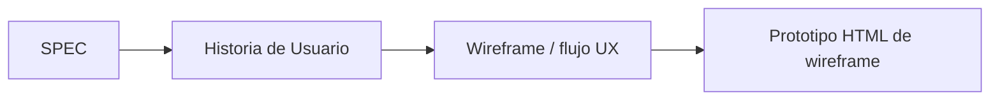
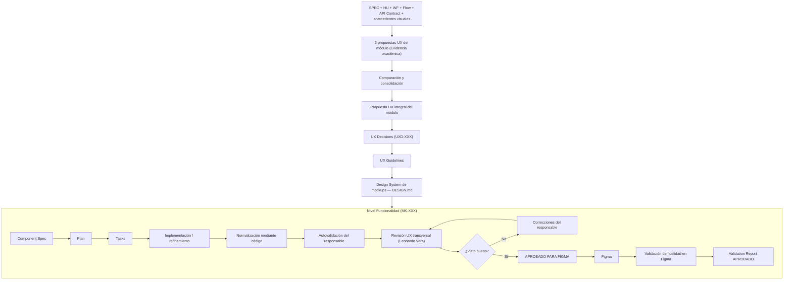
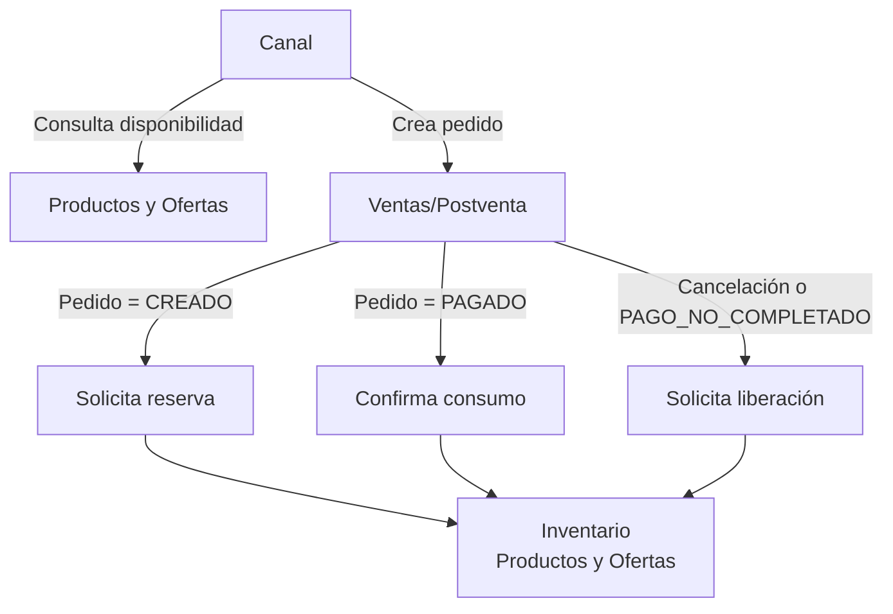
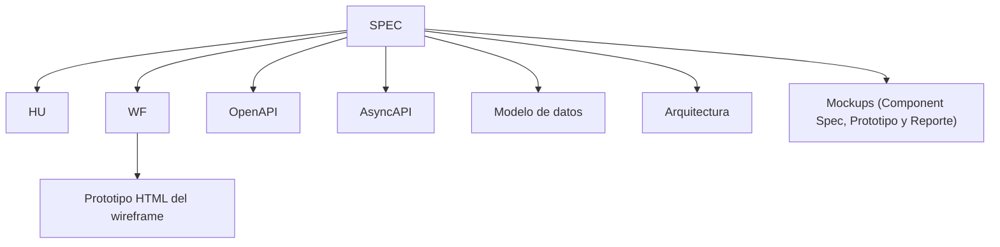
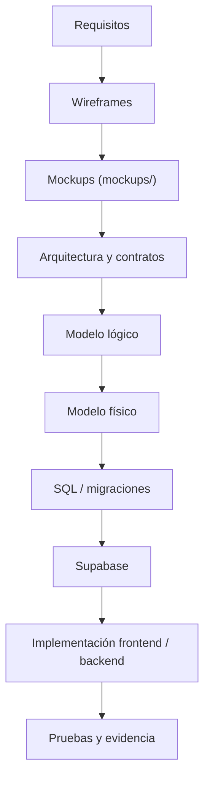

# Productos y Ofertas

Repositorio de documentación del módulo **Productos y Ofertas** del proyecto de Taller de Construcción de Software Web.

El módulo concentra las capacidades compartidas de catálogo, taxonomía, precios, promociones, combos, inventario y operaciones masivas que son consumidas por otros módulos del sistema, entre ellos Marketplace, Chatbot, Retail, Ventas/Postventa y Despacho.

La documentación sigue un enfoque **contract-first**: las reglas funcionales, contratos HTTP, eventos y responsabilidades de cada módulo se mantienen explícitamente separados para evitar duplicación de ownership y acoplamiento entre módulos.

---

## 1. Alcance del módulo

Productos y Ofertas cubre 16 funcionalidades principales:

| ID | Funcionalidad |
|---|---|
| 001 | Carga y exportación masiva de productos |
| 002 | Gestión de combos de productos |
| 003 | Gestión de productos |
| 004 | Gestión de variantes y SKU |
| 005 | Gestión de cupones de descuento |
| 006 | Gestión de ofertas y promociones |
| 007 | Reglas de venta cruzada y upselling |
| 008 | Gestión de categorías y subcategorías |
| 009 | Gestión de características y valores |
| 010 | Asociación entre tipos de producto y características |
| 011 | Gestión de marcas |
| 012 | Gestión de SEO y metadatos |
| 013 | Gestión de precios individuales y masivos |
| 014 | Historial y auditoría de precios |
| 015 | Control de stock y disponibilidad |
| 016 | Dashboard analítico y alertas de stock |

### 1.1. Cadenas de evolución documental

Cada funcionalidad se mantiene mediante dos cadenas coordinadas: una funcional/UX (con etapas de baja y alta fidelidad) y otra contractual/técnica.

#### Baja fidelidad (Wireframes):

El prototipo HTML valida el comportamiento y la representación estructural del wireframe; **no es la fuente del contrato API**.

#### Alta fidelidad (Mockups definitivos):


El inventario detallado de funcionalidades, responsables y artefactos canónicos se encuentra en [`wireframes/INDEX.md`](wireframes/INDEX.md) y en [`mockups/README.md`](mockups/README.md).

---

## 2. Cómo navegar este repositorio

| Artefacto | Ubicación | Propósito |
|---|---|---|
| Especificaciones funcionales | [`specs/`](specs/) | Reglas de negocio y comportamiento esperado |
| Historias de usuario | [`hu/`](hu/) | Necesidades del usuario y criterios funcionales |
| Flujos funcionales complementarios | [`flujos/`](flujos/) | Flujos detallados de procesos relevantes |
| Wireframes (Baja fidelidad) | [`wireframes/flows/`](wireframes/flows/) | Definición funcional y estructural de interfaces |
| Prototipos HTML de wireframe | [`wireframes/prototipos/`](wireframes/prototipos/) | Representaciones navegables de los wireframes |
| Guía visual de wireframes | [`wireframes/DESIGN.md`](wireframes/DESIGN.md) | Lineamientos visuales aplicables exclusivamente a wireframes |
| Índice funcional canónico | [`wireframes/INDEX.md`](wireframes/INDEX.md) | Mapeo de las 16 funcionalidades y responsables |
| Visor de prototipos | [`wireframes/Visor_Prototipos_PO.html`](wireframes/Visor_Prototipos_PO.html) | Acceso unificado a prototipos de wireframes |
| Pipeline de Mockups (Alta fidelidad) | [`mockups/`](mockups/) | UX transversal, decisiones, plantillas y código de prototipado |
| Arquitectura | [`Arquitectura.md`](Arquitectura.md) | Diseño técnico y decisiones arquitectónicas |
| Modelo conceptual | [`Modelo_Conceptual.md`](Modelo_Conceptual.md) | Ownership y relaciones conceptuales de datos |
| Contrato de integración | [`Contrato_Api.md`](Contrato_Api.md) | Responsabilidades e integración con otros módulos |
| OpenAPI | [`api/openapi.yaml`](api/openapi.yaml) | Contrato HTTP ejecutable |
| AsyncAPI | [`asyncapi/asyncapi.yaml`](asyncapi/asyncapi.yaml) | Contrato de mensajería asíncrona |
| Catálogo de errores | [`api/catalogo-errores.md`](api/catalogo-errores.md) | Semántica estable de errores del módulo |
| Catálogo de eventos | [`api/catalogo-eventos.md`](api/catalogo-eventos.md) | Eventos publicados y consumidos |
| Topología RabbitMQ | [`api/rabbitmq-topologia.md`](api/rabbitmq-topologia.md) | Definición física de exchanges, colas y retries |
| Kit de integración | [`api/kit-integracion.md`](api/kit-integracion.md) | Guía práctica de integración para otros módulos |
| Matriz de pruebas de contrato | [`api/pruebas-contrato.md`](api/pruebas-contrato.md) | Casos estáticos, provider, consumer/provider, seguridad e integración |
| Acuerdos de integración | [`integraciones/`](integraciones/) | Acuerdos homologados con Marketplace, Retail, Chatbot y Ventas; las integraciones restantes se documentan en sus artefactos canónicos |
| Equipo y responsabilidades | [`EQUIPO_Y_RESPONSABILIDADES.md`](EQUIPO_Y_RESPONSABILIDADES.md) | Roles transversales, ownership funcional y mecanismos de revisión del equipo |

---

## 3. Fuentes de verdad

No todos los documentos tienen la misma autoridad.

| Tema | Fuente de verdad |
|---|---|
| Reglas funcionales | `specs/SPEC-XXX-*.md` |
| Necesidad y comportamiento desde usuario | `hu/HU-XXX-*.md` |
| Comportamiento de interfaz (Baja fidelidad) | `wireframes/flows/WF-XXX-*.md` |
| Representación visual de wireframes | `wireframes/DESIGN.md` |
| UX transversal y decisiones de mockups | `mockups/ux/propuesta-ux.md` y `mockups/ux/ux-decisions.md` |
| Reglas operativas de mockups | `mockups/ux/ux-guidelines.md` |
| Contrato HTTP | `api/openapi.yaml` |
| Mensajería asíncrona | `asyncapi/asyncapi.yaml` |
| Topología física RabbitMQ | `api/rabbitmq-topologia.md` |
| Códigos de error | `api/catalogo-errores.md` |
| Eventos | `api/catalogo-eventos.md` |
| Ownership e integración entre módulos | `Contrato_Api.md` |
| Arquitectura interna | `Arquitectura.md` |
| Ownership conceptual de datos | `Modelo_Conceptual.md` |

Ante una diferencia entre documentación narrativa y un contrato ejecutable, se debe revisar primero la fuente de verdad correspondiente y posteriormente propagar la corrección a los documentos derivados.

> **Nota sobre diseño:** `wireframes/DESIGN.md` gobierna únicamente la representación visual de baja fidelidad de los wireframes históricos. Los mockups de alta fidelidad se rigen exclusivamente por la Propuesta UX Integral del módulo, las UX Decisions, las UX Guidelines y el Design System correspondiente bajo [`mockups/`](mockups/).

---

## 4. Arquitectura

El módulo se divide en ocho bounded contexts de negocio.

| Servicio | Responsabilidad |
|---|---|
| `taxonomy-svc` | Categorías, marcas, características, valores, tipos de producto y asociaciones |
| `catalog-svc` | Productos, variantes, SKU, imágenes, atributos y perfil físico |
| `pricing-svc` | Precios, vigencias, canales y programación |
| `price-audit-svc` | Historial y auditoría de cambios de precio |
| `promotions-svc` | Promociones, cupones, cross-sell y upselling |
| `combos-svc` | Definición y composición de combos |
| `inventory-svc` | Saldos, reservas, consumo, liberación, expiración, ajustes, incidencias y cuarentenas, reintegros, conciliación offline, traslados y recepciones, Kardex, disponibilidad y dashboard |
| `bulk-svc` | Importación, exportación y procesamiento masivo |

Adicionalmente existe un `api-gateway` / BFF como punto de acceso, pero no constituye un bounded context de negocio.

La descripción completa, reglas de dependencias, persistencia, mensajería, resiliencia, seguridad, observabilidad y diagramas C4 se encuentran en [`Arquitectura.md`](Arquitectura.md).

---

## 5. Ownership de negocio

El sistema evita compartir directamente bases de datos o entidades entre módulos.

| Información / proceso | Módulo propietario |
|---|---|
| Producto, variante y SKU | Productos y Ofertas |
| Categoría, marca y características | Productos y Ofertas |
| Precio | Productos y Ofertas |
| Promoción y cupón | Productos y Ofertas |
| Combo | Productos y Ofertas |
| Stock y reservas | Productos y Ofertas |
| Usuario, identidad, roles y autenticación | Seguridad y Usuarios |
| Pedido, pago y estado comercial | Ventas y Postventa |
| Devolución comercial y reembolso | Ventas y Postventa |
| Despacho, empaque y entrega | Despacho y Entrega |

No se permiten foreign keys ni consultas SQL directas entre bases de datos pertenecientes a módulos diferentes.

La integración se realiza mediante contratos HTTP y mensajería asíncrona publicada.

---

## 6. Integración con Ventas/Postventa

El flujo homologado de inventario es:



Marketplace y Chatbot consultan disponibilidad. Retail también puede reportar y resolver incidencias físicas mediante sus capacidades autorizadas, pero no realiza directamente las mutaciones comerciales de reserva, consumo, liberación, reintegro o conciliación de una venta.

Ventas/Postventa coordina el ciclo asociado al pedido y Productos y Ofertas mantiene el estado autoritativo del inventario.

Las reservas pueden expirar mediante un TTL configurable.

---

## 7. Integración con Despacho

Productos y Ofertas es propietario de las propiedades físicas intrínsecas de cada SKU, como peso y dimensiones.

Despacho y Entrega es propietario de las decisiones logísticas derivadas de esos datos, entre ellas:

- Tipo de empaque.
- Agrupación de unidades.
- Cantidad de paquetes.
- Volumen logístico final.
- Capacidad de transporte.

El módulo de Productos y Ofertas no incorpora reglas propias de empaquetado.

---

## 8. Contratos de API

La API HTTP utiliza como prefijo:

```text
/api/v1
```

Los recursos se organizan por dominio y se publican en español.

Ejemplos:

```text
/api/v1/productos
/api/v1/categorias
/api/v1/marcas
/api/v1/precios
/api/v1/promociones
/api/v1/cupones
/api/v1/combos
/api/v1/inventario
```

El contrato HTTP completo se encuentra en:

[`api/openapi.yaml`](api/openapi.yaml)

La mensajería asíncrona se encuentra en:

[`asyncapi/asyncapi.yaml`](asyncapi/asyncapi.yaml)

La explicación humana de responsabilidades e integración se mantiene en:

[`Contrato_Api.md`](Contrato_Api.md)

### Versiones contractuales actuales

| Artefacto | Versión |
|---|---|
| OpenAPI | `0.4.0` |
| AsyncAPI | `0.4.0` |
| Catálogo de errores | `0.4.0` |
| Catálogo de eventos | `0.4.0` |
| Topología RabbitMQ | `0.4.0` |
| Kit de integración | `0.4.0` |

---

## 9. Diseño y experiencia de usuario

El módulo cuenta con dos niveles de diseño formalmente articulados:

### 9.1. Baja fidelidad (Wireframes)
Las 16 funcionalidades disponen de definición de wireframe funcional y prototipo HTML navegable gobernados por:

[`wireframes/DESIGN.md`](wireframes/DESIGN.md)

Este documento define exclusivamente los lineamientos de los **wireframes de baja fidelidad**. Los prototipos HTML correspondientes son artefactos estáticos de documentación y validación estructural; no constituyen el frontend productivo.

Para recorrer los wireframes desde un único punto puede utilizarse:
[`wireframes/Visor_Prototipos_PO.html`](wireframes/Visor_Prototipos_PO.html)

### 9.2. Alta fidelidad (Pipeline de Mockups)
La evolución hacia mockups de alta fidelidad se rige de forma estricta por la gobernanza transversal del módulo documentada en:

[`mockups/`](mockups/)

Este pipeline no mezcla las reglas visuales de los wireframes con las decisiones de alta fidelidad. Se fundamenta en:
- [`mockups/ux/propuesta-ux.md`](mockups/ux/propuesta-ux.md): Las 3 propuestas UX finales de #59, matriz de las 16 funcionalidades, evaluación de los borradores y Propuesta UX Integral Adoptada para el Gestor Comercial.
- [`mockups/ux/ux-decisions.md`](mockups/ux/ux-decisions.md): Decisiones transversales justificadas (`UXD-001` a `UXD-012`).
- [`mockups/ux/ux-guidelines.md`](mockups/ux/ux-guidelines.md): Reglas normativas operativas y accesibilidad en PC Desktop (viewport canónico de 1440 px).
- [`mockups/DESIGN.md`](mockups/DESIGN.md): Design System vigente de mockups, con foundations, layout desktop, componentes y estados visuales alineados con la UX transversal.
- [`mockups/prototipo/`](mockups/prototipo/): Código interactivo normalizado de prototipado (bajo `src/pantallas/MKXXX`).

La cadena completa de diseño de alta fidelidad es:


---

## 10. Ownership funcional

| Rama | Responsable | Área principal |
|---|---|---|
| `castilla` | Marco Renato Castilla Huanca | Carga/exportación masiva y combos |
| `poma` | Gabriel Poma Gutierrez | Productos y variantes SKU |
| `cueva` | Axel Andree Cueva Alcalá | Cupones, promociones y venta cruzada |
| `lopez` | Leonardo Lopez | Taxonomía, características, marcas y SEO |
| `vera` | Leonardo Vera Rodríguez | Precios y auditoría de precios |
| `taco` | Miguel Ángel Taco Zavala | Inventario, analítica y alertas |

La asignación detallada de cada una de las 16 funcionalidades se mantiene en [`wireframes/INDEX.md`](wireframes/INDEX.md) y [`mockups/README.md`](mockups/README.md).

Los roles transversales, los límites de responsabilidad y los mecanismos de revisión del equipo se documentan en [`EQUIPO_Y_RESPONSABILIDADES.md`](EQUIPO_Y_RESPONSABILIDADES.md).

---

## 11. Estado documental

| Área | Estado |
|---|---|
| 16 especificaciones funcionales | Consolidado |
| 16 historias de usuario | Consolidado |
| 16 wireframes funcionales | Consolidado |
| 16 prototipos HTML de wireframes | Consolidado |
| Guía visual de wireframes (`wireframes/DESIGN.md`) | Consolidado |
| Pipeline de mockups y gobernanza UX transversal (`mockups/`) | Aprobado y en ejecución |
| Arquitectura | Consolidado |
| Modelo conceptual | Consolidado |
| Contrato de integración | Consolidado |
| OpenAPI | Disponible |
| AsyncAPI | Disponible |
| Catálogo de errores | Disponible |
| Catálogo de eventos | Disponible |
| Modelo lógico/físico de BD | En evolución para Hito 2 |
| Implementación de BD / Supabase | En evolución para Hito 2 |
| Matriz de trazabilidad integral | Pendiente de consolidación |

---

## 12. Regla de mantenimiento documental

Cuando una funcionalidad cambie, la modificación no debe limitarse a un único archivo.

Debe revisarse la cadena completa:



Solo deben modificarse los artefactos afectados por el cambio, pero todos deben ser revisados para verificar consistencia.

Los contratos ejecutables no deben duplicarse manualmente dentro de otros documentos.

---

## 13. Principios del repositorio

Este repositorio busca mantener:

- Una única fuente de verdad para cada tipo de información.
- Trazabilidad entre requisitos, experiencia de usuario, arquitectura y contratos.
- Separación de ownership entre módulos.
- Contratos independientes de la implementación.
- Documentación navegable y auditable.
- Evidencia clara de responsabilidad por funcionalidad.
- Compatibilidad entre especificaciones, APIs, eventos y modelos de datos.
- Evolución controlada de los contratos.

---

## 14. Próxima evolución documental

Los siguientes artefactos ampliarán la trazabilidad hacia el Hito 2:

- Implementación incremental y validación de los 16 mockups (`mockups/MK-001` a `MK-016`).
- Modelo lógico de base de datos.
- Modelo físico de base de datos.
- Scripts SQL y migraciones.
- Evidencia de implementación en Supabase.
- Matriz integral de trazabilidad.
- Evidencia de pruebas y validación funcional.

La evolución esperada de la documentación será:



El objetivo es mantener una cadena verificable desde la necesidad funcional hasta la implementación técnica.

---

<!-- HOMOLOGACION-HTTP-0.5.0:START -->
## Homologación HTTP 0.5.0

El contrato HTTP vigente se publica como OpenAPI 0.5.0.

Nuevos acuerdos locales:

```text
integraciones/ALINEACION_MARKETPLACE.md
integraciones/ALINEACION_RETAIL.md
```

Chatbot consume la proyección de disponibilidad comercial. La matriz de pruebas inter-módulo se encuentra en `api/pruebas-contrato.md`.

Las capacidades que dependen de `D-INV-01` o `D-REC-01/02` permanecen explícitamente provisionales; esta documentación no inventa esas decisiones.
<!-- HOMOLOGACION-HTTP-0.5.0:END -->
