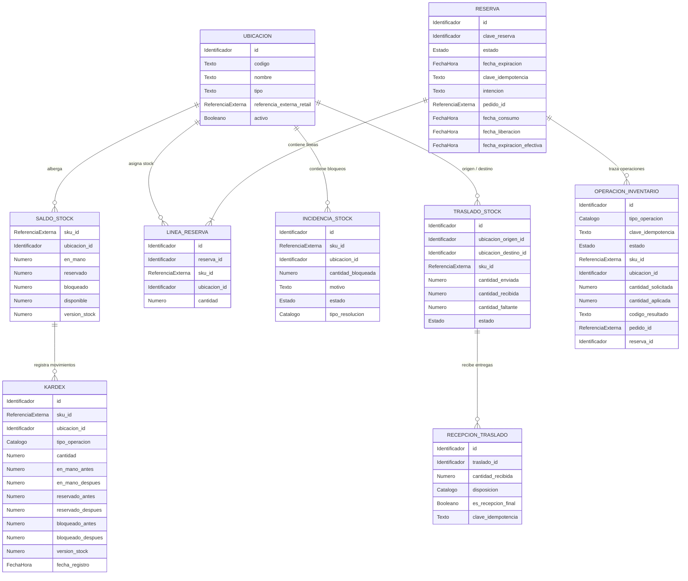

# Modelo lógico — `inventory` (`inventory-svc`)

> **Ubicación oficial del documento:**
> `bd/inventory-svc/logical-model.md` (ubicación asignada en el árbol de persistencia del servicio).

- **Issue:** #54 — Persistencia y modelo de datos de inventory-svc
- **Responsable:** Miguel Ángel Taco Zavala
- **Bounded context:** Inventario y Disponibilidad
- **Microservicio:** `inventory-svc`
- **Schema objetivo:** `inventory`
- **Última actualización:** 2026-10-03
- **Estado:** APROBADO

---

## Flujo de derivación y precedencia

```text
fuentes funcionales y contractuales
        ↓
Modelo_Conceptual.md
        ↓
logical-model.md
        ↓
physical-model.md
        ↓
migrations/
        ↓
validation.sql
```

## Fuentes de verdad

Este modelo lógico deriva estrictamente de las fuentes funcionales, arquitectónicas y contractuales vigentes:

- `Modelo_Conceptual.md` (§8 y §9 Inventario y Disponibilidad, §14–18)
- `Arquitectura.md` (§7 Persistencia, §8 Migraciones, §13 Inventario, §15 Concurrencia)
- `Contrato_Api.md` (§2.1 Ownership de Stock, Reservas, Kardex y Ubicación)
- `api/openapi.yaml` (0.5.0: esquemas de Disponibilidad, Reservas, Saldos, Operaciones, Incidencias, Traslados, Dashboard)
- `asyncapi/asyncapi.yaml` (0.4.0: eventos `inventory.stock.*`, `inventory.reservation.*`)
- `specs/SPEC-015-control-stock-disponibilidad.md`
- `specs/SPEC-016-dashboard-alertas-stock.md`
- `hu/HU-015-control-stock-disponibilidad.md`
- `hu/HU-016-dashboard-alertas-stock.md`
- `flujos/FLOW-015-control-stock-disponibilidad.md`
- `flujos/FLOW-016-dashboard-alertas-stock.md`
- `wireframes/flows/WF-015-control-stock-disponibilidad.md`
- `wireframes/flows/WF-016-dashboard-alertas-stock.md`
- `bd/CONVENCIONES_BD.md` (§3, §10, §18)

Precedencia ante discrepancias: `SPEC` → `Contrato OpenAPI/AsyncAPI` → `Modelo_Conceptual.md` → **este documento**.

---

# 1. Propósito

Describir la estructura lógica pura de información propiedad exclusiva de **`inventory-svc`** para las funcionalidades:
- **015 — Control de stock, saldos autoritativos, gestión de ubicaciones, reservas de pedidos, consumos, liberaciones, expiración de reservas, libro de movimientos (kardex), incidencias de bloqueo físico y traslados.**
- **016 — Dashboard, alertas y proyecciones de umbrales de stock.**

Este documento define entidades lógicas, reglas de disponibilidad, ciclo de vida de reservas, invariantes de saldo, aislamiento interdominio y requerimientos conceptuales de persistencia técnica.

---

# 2. Responsabilidad del bounded context

## 2.1. Datos propios (Authority / Ownership)

`inventory-svc` es autoridad única y fuente de verdad sobre:

1. **Ubicaciones (`UBICACION`):** Catálogo de almacenes, tiendas y puntos de stock donde se custodia inventario físico.
2. **Saldo de Stock Autoritativo (`SALDO_STOCK`):** Cantidades físicas poseídas (`en_mano`), reservadas (`reservado`), bloqueadas por incidencias (`bloqueado`) y cálculo derivado de disponible (`disponible = max(en_mano - reservado - bloqueado, 0)`), por SKU y ubicación.
3. **Agregados y Líneas de Reserva (`RESERVA`, `LINEA_RESERVA`):** Compromiso temporal de stock, consumo definitivo por pago, liberación, expiración por temporizador y estado terminal único.
4. **Libro de Movimientos (`KARDEX`):** Asientos inmutables append-only de cada movimiento físico o contable de inventario con balance antes/después.
5. **Operaciones e Idempotencia de Inventario (`OPERACION_INVENTARIO`):** Registro de comandos mutadores, admisión asíncrona, trazabilidad de intención y prevención de duplicación.
6. **Incidencias y Bloqueos (`INCIDENCIA_STOCK`):** Cuarentena y retención física por mermas, averías o faltantes por SKU y ubicación.
7. **Traslados de Inventario (`TRASLADO_STOCK`, `RECEPCION_TRASLADO`):** Movimiento de stock entre ubicaciones de origen y destino.
8. **Umbrales y Proyecciones de Dashboard (`UMBRAL_STOCK_OVERRIDE`, `PROYECCION_DASHBOARD`):** Umbrales de alerta de stock bajo/agotado y vistas agregadas de disponibilidad.

## 2.2. Datos que NO posee (Referencias externas / Non-goals)

`inventory-svc` no es autoridad sobre:

- **Catálogo de productos, variantes y SKUs:** Propiedad de `catalog-svc`.
- **Precios y ofertas:** Propiedad de `pricing-svc`.
- **Pedidos, pagos y ventas:** Propiedad de Ventas/Postventa.
- **Rutas de despacho y transporte físico:** Propiedad de Despacho y Entrega.
- **Tiendas físicas comerciales de Retail:** Se relacionan opcionalmente mediante identificador escalar externo (`referencia_externa_retail`), sin dependencia de base de datos ni transferencia de ownership.

---

# 3. Entidades lógicas

## 3.1. `UBICACION`

**Propósito:** Representa un punto físico de almacenamiento, almacén central, tienda o centro de distribución donde se almacena y gestiona stock.

**Identificador lógico:** Identificador propio (`id`) y clave natural (`codigo`).

### Atributos

| Atributo | Naturaleza lógica | Obligatorio | Descripción |
|---|---|---:|---|
| `id` | Identificador | Sí | Identificador único de la ubicación |
| `codigo` | Texto | Sí | Código natural único de la ubicación (e.g. `ALM-CENTRAL-01`) |
| `nombre` | Texto | Sí | Nombre descriptivo de la ubicación |
| `tipo` | Texto / Clasificación | Sí | Tipo de ubicación (e.g. `ALMACEN_CENTRAL`, `TIENDA`, `CENTRO_DISTRIBUCION`) |
| `referencia_externa_retail` | Referencia externa | No | Identificador opcional del punto de venta en el subsistema Retail |
| `activo` | Booleano | Sí | Indica si la ubicación está operativa para movimientos |
| `fecha_registro` | Fecha-hora | Sí | Momento de registro |
| `fecha_modificacion` | Fecha-hora | Sí | Momento de última actualización |

### Reglas e invariantes

- `codigo` es unívoco en el sistema.
- `referencia_externa_retail` es una referencia escalar desacoplada; no genera dependencias de integridad ni foreign keys hacia Retail.

---

## 3.2. `SALDO_STOCK`

**Propósito:** Mantiene el saldo autoritativo de inventario físico para un SKU específico en una ubicación determinada.

**Identificador lógico:** Clave compuesta (`sku_id`, `ubicacion_id`).

### Atributos

| Atributo | Naturaleza lógica | Obligatorio | Descripción |
|---|---|---:|---|
| `sku_id` | Referencia externa | Sí | Identificador de SKU vendible (Owner: `catalog-svc`) |
| `ubicacion_id` | Identificador | Sí | Identificador de la ubicación custodia del stock |
| `en_mano` | Número entero | Sí | Stock físico total presente en la ubicación |
| `reservado` | Número entero | Sí | Stock comprometido en reservas de pedidos activos |
| `bloqueado` | Número entero | Sí | Stock inmovilizado por incidencias o cuarentena |
| `disponible` | Número entero | Sí | Valor derivado: `max(en_mano - reservado - bloqueado, 0)` |
| `version_stock` | Número entero | Sí | Versión para control de concurrencia optimista |
| `fecha_registro` | Fecha-hora | Sí | Momento de inicialización del saldo |
| `fecha_modificacion` | Fecha-hora | Sí | Momento de última actualización |

### Reglas e invariantes

- No negatividad: `en_mano >= 0`, `reservado >= 0`, `bloqueado >= 0`.
- Invariante de capacidad: `reservado + bloqueado <= en_mano`.
- El valor disponible es estrictamente derivado por regla de negocio: no admite asignación manual independiente.
- Los ajustes absolutos exigen coincidencia de `version_stock` para prevenir sobreescrituras concurrentes.

---

## 3.3. `RESERVA`

**Propósito:** Agregado a nivel de pedido que agrupa el compromiso temporal de stock para una orden de compra.

**Identificador lógico:** Identificador propio (`id`) / `clave_reserva`.

### Atributos

| Atributo | Naturaleza lógica | Obligatorio | Descripción |
|---|---|---:|---|
| `id` | Identificador | Sí | Identificador interno de la reserva |
| `clave_reserva` | Identificador | Sí | Identificador de negocio de la reserva |
| `estado` | Estado | Sí | `ACTIVA`, `CONSUMIDA`, `LIBERADA`, `EXPIRADA` |
| `fecha_expiracion` | Fecha-hora | Sí | Instante límite de validez de la reserva (TTL configurable) |
| `clave_idempotencia` | Texto | Sí | Clave lógica de idempotencia del comando de reserva |
| `intencion` | Texto | Sí | Intención original de la operación (`reservar`) |
| `pedido_id` | Referencia externa | Sí | Identificador del pedido asociado (Owner: Ventas) |
| `correlacion_id` | Identificador | No | Identificador de correlación asíncrona |
| `operacion_id` | Identificador | No | Identificador de la operación que originó la reserva |
| `fecha_consumo` | Fecha-hora | No | Momento en que se confirmó el pago y consumo |
| `fecha_liberacion` | Fecha-hora | No | Momento en que se canceló o liberó la reserva |
| `fecha_expiracion_efectiva` | Fecha-hora | No | Momento en que expiró por vencimiento de TTL |
| `fecha_registro` | Fecha-hora | Sí | Momento de creación de la reserva |
| `fecha_modificacion` | Fecha-hora | Sí | Momento de última actualización |

### Reglas e invariantes

- `clave_reserva` es unívoca en el dominio.
- `clave_idempotencia` es unívoca lógicamente.
- **Transición terminal única:** Una reserva en estado terminal (`CONSUMIDA`, `LIBERADA`, `EXPIRADA`) es irreversible: no puede reactivarse ni mutar a otro estado terminal.
- El encabezado de reserva no fija un único SKU ni una única ubicación; el desglose físico reside en sus líneas para soportar entregas divididas (split fulfillment).

---

## 3.4. `LINEA_RESERVA`

**Propósito:** Detalle de los SKUs, cantidades y ubicaciones comprometidas en una reserva específica.

**Identificador lógico:** Identificador propio (`id`).

### Atributos

| Atributo | Naturaleza lógica | Obligatorio | Descripción |
|---|---|---:|---|
| `id` | Identificador | Sí | Identificador de la línea de reserva |
| `reserva_id` | Identificador | Sí | Reserva padre a la que pertenece |
| `sku_id` | Referencia externa | Sí | SKU vendible reservado |
| `ubicacion_id` | Identificador | Sí | Ubicación desde la cual se compromete el stock |
| `cantidad` | Número entero | Sí | Unidades reservadas |

### Reglas e invariantes

- `cantidad > 0`.
- Unicidad lógica de la combinación `(reserva_id, sku_id, ubicacion_id)`.

---

## 3.5. `OPERACION_INVENTARIO`

**Propósito:** Registro y control de idempotencia de todas las operaciones mutadoras de inventario.

**Identificador lógico:** Identificador propio (`id`).

### Atributos

| Atributo | Naturaleza lógica | Obligatorio | Descripción |
|---|---|---:|---|
| `id` | Identificador | Sí | Identificador de la operación |
| `tipo_operacion` | Estado / Catálogo | Sí | Naturaleza de la acción de stock |
| `clave_idempotencia` | Texto | Sí | Clave lógica de idempotencia del comando |
| `intencion` | Texto | Sí | Intención enviada en la solicitud |
| `estado` | Estado | Sí | `RECIBIDO`, `APLICADO`, `RECHAZADO`, `REQUIRES_REVIEW` |
| `sku_id` | Referencia externa | No | SKU afectado por la operación |
| `ubicacion_id` | Identificador | No | Ubicación afectada |
| `cantidad_solicitada` | Número entero | No | Unidades solicitadas en el comando |
| `cantidad_aplicada` | Número entero | No | Unidades efectivamente aplicadas |
| `codigo_resultado` | Texto | No | Código funcional de resultado o rechazo |
| `correlacion_id` | Identificador | No | Trazabilidad asíncrona |
| `pedido_id` | Referencia externa | No | Pedido relacionado |
| `reserva_id` | Identificador | No | Reserva relacionada |
| `version_stock` | Número entero | No | Versión de stock usada para validación |
| `fecha_admision` | Fecha-hora | Sí | Momento de recepción del comando |
| `fecha_aplicacion` | Fecha-hora | No | Momento de ejecución efectiva |

### Reglas e invariantes

- `clave_idempotencia` es unívoca. Misma clave con misma intención devuelve el resultado original sin reejecutar; misma clave con distinta intención genera conflicto de idempotencia.

---

## 3.6. `KARDEX` (Libro de movimientos de inventario)

**Propósito:** Bitácora inmutable append-only de cada alteración física o contable del inventario.

**Identificador lógico:** Identificador propio (`id`).

### Atributos

| Atributo | Naturaleza lógica | Obligatorio | Descripción |
|---|---|---:|---|
| `id` | Identificador | Sí | Identificador correlativo del movimiento |
| `sku_id` | Referencia externa | Sí | SKU afectado por el movimiento |
| `ubicacion_id` | Identificador | Sí | Ubicación donde ocurre el movimiento |
| `tipo_operacion` | Estado / Catálogo | Sí | Tipo de acción que originó el cambio |
| `cantidad` | Número entero | Sí | Variación de unidades (positiva o negativa, distinta de 0) |
| `en_mano_antes` / `en_mano_despues` | Número entero | Sí | Saldo físico antes y después del movimiento |
| `reservado_antes` / `reservado_despues` | Número entero | Sí | Saldo reservado antes y después |
| `bloqueado_antes` / `bloqueado_despues` | Número entero | Sí | Saldo bloqueado antes y después |
| `version_stock` | Número entero | Sí | Versión de stock generada |
| `operacion_id` | Identificador | No | Operación que generó el movimiento |
| `reserva_id` | Identificador | No | Reserva asociada si aplica |
| `correlacion_id` | Identificador | No | Correlación asíncrona |
| `fecha_registro` | Fecha-hora | Sí | Timestamp inmutable del asiento |

### Reglas e invariantes

- **Inmutabilidad absoluta (Append-Only):** Los movimientos en Kardex no pueden modificarse ni eliminarse.
- Toda corrección de saldo se realiza exclusivamente registrando un **nuevo movimiento compensatorio**, nunca alterando asientos pasados.
- `cantidad != 0`.

---

## 3.7. `INCIDENCIA_STOCK`

**Propósito:** Gestión de unidades retenidas o bloqueadas por avería, merma o discrepancia física en una ubicación.

**Identificador lógico:** Identificador propio (`id`).

### Atributos

| Atributo | Naturaleza lógica | Obligatorio | Descripción |
|---|---|---:|---|
| `id` | Identificador | Sí | Identificador de la incidencia |
| `sku_id` | Referencia externa | Sí | SKU afectado |
| `ubicacion_id` | Identificador | Sí | Ubicación donde se encuentra el stock bloqueado |
| `cantidad_bloqueada` | Número entero | Sí | Cantidad de unidades inmovilizadas (> 0) |
| `motivo` | Texto | Sí | Causa justificada de la incidencia |
| `estado` | Estado | Sí | `ABIERTA`, `RESUELTA`, `TRASLADO_PENDIENTE` |
| `tipo_resolucion` | Estado / Catálogo | No | `REHABILITADO`, `MERMA`, `FALTANTE_CONFIRMADO`, `TRASLADO_ALMACEN_CENTRAL` |
| `usuario_id` | Referencia externa | No | Usuario responsable del reporte o resolución |
| `fecha_registro` | Fecha-hora | Sí | Momento de apertura de la incidencia |
| `fecha_resolucion` | Fecha-hora | No | Momento de resolución y desbloqueo o merma |

---

## 3.8. `TRASLADO_STOCK` y `RECEPCION_TRASLADO`

**Propósito:** Seguimiento del traslado físico de stock entre dos ubicaciones (origen y destino) y registro de recepciones parciales o totales.

**Identificador lógico:** Identificador propio (`id`).

### Atributos de Traslado

| Atributo | Naturaleza lógica | Obligatorio | Descripción |
|---|---|---:|---|
| `id` | Identificador | Sí | Identificador del traslado |
| `ubicacion_origen_id` | Identificador | Sí | Ubicación emisora del inventario |
| `ubicacion_destino_id` | Identificador | Sí | Ubicación receptora del inventario |
| `sku_id` | Referencia externa | Sí | SKU trasladado |
| `cantidad_enviada` | Número entero | Sí | Unidades despachadas (> 0) |
| `cantidad_recibida` | Número entero | Sí | Unidades recepcionadas acumuladas (>= 0) |
| `cantidad_faltante` | Número entero | No | Discrepancia reportada al cierre |
| `estado` | Estado | Sí | `EN_TRANSITO`, `RECIBIDO_PARCIAL`, `COMPLETADO`, `COMPLETADO_CON_DISCREPANCIA` |
| `fecha_despacho` | Fecha-hora | Sí | Momento de salida |
| `fecha_cierre` | Fecha-hora | No | Momento de finalización de recepciones |

### Atributos de Recepción de Traslado

| Atributo | Naturaleza lógica | Obligatorio | Descripción |
|---|---|---:|---|
| `id` | Identificador | Sí | Identificador de la recepción |
| `traslado_id` | Identificador | Sí | Traslado al que corresponde |
| `cantidad_recibida` | Número entero | Sí | Unidades recibidas en el lote (> 0) |
| `disposicion` | Estado / Catálogo | Sí | `REINGRESAR_DISPONIBLE`, `REINGRESAR_BLOQUEADO`, `CONFIRMAR_MERMA` |
| `es_recepcion_final` | Booleano | Sí | Indica si concluye el traslado |
| `clave_idempotencia` | Texto | Sí | Clave lógica de idempotencia de la recepción |
| `fecha_recepcion` | Fecha-hora | Sí | Momento de ingreso físico |

---

## 3.9. `UMBRAL_STOCK_OVERRIDE`

**Propósito:** Configuración de umbrales personalizados de stock mínimo/bajo a nivel global o por SKU.

**Identificador lógico:** Identificador propio (`id`).

### Atributos

| Atributo | Naturaleza lógica | Obligatorio | Descripción |
|---|---|---:|---|
| `id` | Identificador | Sí | Identificador del umbral |
| `sku_id` | Referencia externa | No | SKU específico (nulo indica umbral global por defecto) |
| `umbral_efectivo` | Número entero | Sí | Cantidad límite para disparo de alertas (>= 0) |
| `fecha_modificacion` | Fecha-hora | Sí | Momento de actualización |

---

# 4. Catálogos de estados y valores controlados

## 4.1. Estado de Reserva (`reservation_status`)

- `ACTIVA`: Reserva vigente y comprometiendo stock disponible.
- `CONSUMIDA`: Reserva confirmada definitivamente por pago del pedido.
- `LIBERADA`: Reserva cancelada voluntariamente, devolviendo el stock a disponible.
- `EXPIRADA`: Reserva vencida automáticamente por expiración del TTL.

## 4.2. Tipos de Operación de Inventario (`operation_type`)

Valores: `RESERVA`, `CONSUMO`, `LIBERACION`, `EXPIRACION`, `AJUSTE_ABSOLUTO`, `INCIDENCIA_BLOQUEO`, `INCIDENCIA_RESOLUCION`, `REINTEGRO`, `CONCILIACION_OFFLINE`, `RECEPCION_TRASLADO`, `INICIALIZACION_SKU`.

## 4.3. Estado de Operación (`operation_status`)

Valores: `RECIBIDO`, `APLICADO`, `RECHAZADO`, `REQUIRES_REVIEW`.

## 4.4. Estado de Incidencia (`incidencia_estado`)

Valores: `ABIERTA`, `RESUELTA`, `TRASLADO_PENDIENTE`.

## 4.5. Estado de Traslado (`traslado_estado`)

Valores: `EN_TRANSITO`, `RECIBIDO_PARCIAL`, `COMPLETADO`, `COMPLETADO_CON_DISCREPANCIA`.

---

# 5. Relaciones y cardinalidades

| Origen | Relación | Destino | Cardinalidad | Propiedad |
|---|---|---|---:|---|
| `UBICACION` | contiene saldos de | `SALDO_STOCK` | `1:0..N` | Interna |
| `UBICACION` | origen de | `TRASLADO_STOCK` | `1:0..N` | Interna |
| `UBICACION` | destino de | `TRASLADO_STOCK` | `1:0..N` | Interna |
| `UBICACION` | custodia | `INCIDENCIA_STOCK` | `1:0..N` | Interna |
| `RESERVA` | compone | `LINEA_RESERVA` | `1:1..N` | Interna |
| `UBICACION` | asignada en | `LINEA_RESERVA` | `1:0..N` | Interna |
| `SALDO_STOCK` | registra | `KARDEX` | `1:0..N` | Interna |
| `SALDO_STOCK` | referencia | `SKU` (Catálogo) | `N:1` | Externa (sin FK) |
| `RESERVA` | referencia | `PEDIDO` (Ventas) | `N:1` | Externa (sin FK) |

---

# 6. Referencias interdominio

| Referencia | Owner | Uso local | ¿FK cross-context? |
|---|---|---|---:|
| `sku_id` | `catalog-svc` | Identidad vendible sobre la cual se calculan saldos y reservas | No |
| `order_id` | Ventas / Postventa | Identificador de pedido para vinculación de reservas | No |
| `user_id` | Seguridad | Identidad de usuario en operaciones e incidencias | No |
| `referencia_externa_retail` | Retail | Código opcional de tienda en Retail asociado a una ubicación | No |

---

# 7. Reglas de integridad lógica

1. **Invariante de no negatividad:** `en_mano >= 0`, `reservado >= 0`, `bloqueado >= 0`.
2. **Invariante de capacidad:** `reservado + bloqueado <= en_mano`.
3. **Disponibilidad efectiva:** `disponible = max(en_mano - reservado - bloqueado, 0)`.
4. **Reserva atómica:** Una reserva solo se crea si todas sus líneas disponen de saldo disponible suficiente (`disponible >= cantidad_solicitada`) en sus respectivas ubicaciones en el instante de la transacción.
5. **Transición terminal única:** Una reserva solo puede experimentar una única transición terminal definitiva (`ACTIVA` → `CONSUMIDA` | `LIBERADA` | `EXPIRADA`).
6. **Inmutabilidad del Kardex:** Los movimientos en Kardex son estrictamente append-only. Toda corrección se efectúa registrando un nuevo asiento compensatorio.
7. **Expiración de reservas (TTL):** Toda reserva activa cuenta con un instante de expiración configurable. Al alcanzarse dicho instante sin confirmación de consumo, la reserva pasa al estado terminal `EXPIRADA` y el stock reservado retorna a disponible.

---

# 8. Normalización y duplicación controlada

## 8.1. Datos autoritativos

Son autoritativos dentro de `inventory-svc`:
- Ubicaciones físicas y puntos de custodia de stock.
- Saldos de stock (`en_mano`, `reservado`, `bloqueado`, `disponible`).
- Reservas de stock y su ciclo de vida.
- Kardex de movimientos de inventario.
- Incidencias y traslados físicos entre ubicaciones.

## 8.2. Datos duplicados o proyectados

| Dato | Owner original | Motivo de duplicación | Reconstruible |
|---|---|---|---:|
| `PROYECCION_DASHBOARD` | `inventory-svc` | Proyección agregada para tableros de control y consultas masivas de disponibilidad sin sobrecargar la entidad transaccional de saldos | Sí |

---

# 9. Persistencia técnica necesaria

| Necesidad | Requerida | Justificación conceptual |
|---|---:|---|
| **Outbox** | Sí | Publicación transaccional garantizada de eventos `inventory.stock.*` y `inventory.reservation.*`. |
| **Inbox** | Sí | Deduplicación de eventos y comandos de integración asíncrona. |
| **Idempotencia de comandos** | Sí | Unicidad lógica de clave de idempotencia en reservas, operaciones y recepciones para evitar dobles afectaciones de saldo. |
| **Temporizador de expiración (TTL)** | Sí | Monitoreo y ejecución de expiración de reservas activas al cumplirse su fecha límite. |

---

# 10. Diagrama entidad-relación lógico



---

# 11. Trazabilidad

| Fuente | Decisión / Entidad / Regla derivada |
|---|---|
| `SPEC-015` | Entidades `SALDO_STOCK`, `RESERVA`, `LINEA_RESERVA`, `KARDEX`, `INCIDENCIA_STOCK`, `TRASLADO_STOCK`, fórmulas de disponible e invariantes |
| `SPEC-016` | Entidad `UMBRAL_STOCK_OVERRIDE` y proyecciones de stock |
| `HU-015` / `HU-016` | Criterios de aceptación funcionales de saldos, reservas y alertas |
| `FLOW-015` / `FLOW-016` | Flujos de reserva, confirmación de pago, liberación, expiración y bloqueo |
| `Contrato OpenAPI 0.5.0` | Esquemas de reserva, saldos y operaciones |
| `AsyncAPI 0.4.0` | Eventos de stock y reservas |
| `Contrato_Api.md §2.1` | Ownership de inventario y ubicación (`UBICACION`) |
| `Modelo_Conceptual.md §8–9` | Regla de reserva order-level por líneas y Kardex inmutable |
| `bd/CONVENCIONES_BD.md §18` | Definición conceptual de `UBICACION` (`inventory.locations`) |

---

# 12. Decisiones del modelo lógico

| ID | Decisión | Justificación | Impacto |
|---|---|---|---|
| `D-LOG-INV-01` | Ownership de `UBICACION` asignado a `inventory-svc` | Conforme a `Contrato_Api.md` §2.1 y `CONVENCIONES_BD.md` §18, Inventario es la autoridad de custodia física y almacenes | `UBICACION` es entidad local de Inventario |
| `D-LOG-INV-02` | Reserva desacoplada de ubicación única a nivel de cabecera | Permite pedidos con cumplimiento dividido entre múltiples almacenes o tiendas (split fulfillment) | Ubicación reside en `LINEA_RESERVA` |
| `D-LOG-INV-03` | Transición terminal única irreversible | Previene condiciones de carrera entre confirmación de pago, cancelación y expiración por temporizador | Estados `CONSUMIDA`, `LIBERADA`, `EXPIRADA` son terminales |
| `D-LOG-INV-04` | Kardex append-only inmutable | Proporciona trazabilidad auditable y reconstrucción fidedigna de saldos; las correcciones son nuevos asientos | Entidad `KARDEX` inmutable |

---

# 13. Decisiones pendientes

| ID | Pregunta / Aspecto abierto | Fuente afectada | Bloquea modelo físico |
|---|---|---|---:|
| `P-LOG-INV-01` | Parámetro exacto de configuración de minutos para el TTL de reservas | `SPEC-015` §6 | No (se define operativamente por canal/entorno) |

---

# 14. Derivación esperada hacia el modelo físico

El `physical-model.md` materializará este modelo preservando las siguientes invariantes conceptuales:
- Integridad referencial interna entre reservas y sus líneas.
- No negatividad de saldos (`en_mano >= 0`, `reservado >= 0`, `bloqueado >= 0`) y restricción de capacidad (`reservado + bloqueado <= en_mano`).
- Cálculo garantizado y consistente de disponibilidad efectiva.
- Unicidad de claves de idempotencia en reservas, operaciones y recepciones.
- Protección estricta de una sola transición terminal para reservas y traslados completados.
- Inmutabilidad de los registros históricos de Kardex y deduplicación de Inbox.
- Aislamiento absoluto respecto a schemas externos (referencias escalares sin FK hacia Catálogo o Ventas).

---

# 15. Checklist de aprobación

## Ownership
- [x] El bounded context conserva ownership exclusivamente sobre ubicaciones, saldos, reservas, kardex, incidencias y traslados.
- [x] No se modelan pedidos ni productos como propios.
- [x] Las referencias externas están identificadas.

## Modelo lógico
- [x] Todas las entidades necesarias están representadas.
- [x] Los identificadores lógicos están definidos.
- [x] Las relaciones y cardinalidades son coherentes.
- [x] Las invariantes funcionales están documentadas.
- [x] Los estados coinciden con contratos y especificaciones vigentes.

## Aislamiento
- [x] No se proponen FK entre bounded contexts.
- [x] Las proyecciones locales se identifican como reconstruibles.
- [x] No se confunde una referencia externa con ownership.

## Nivel de abstracción
- [x] No contiene SQL.
- [x] No contiene tipos PostgreSQL.
- [x] No contiene índices físicos.
- [x] No contiene triggers ni funciones de BD.
- [x] No contiene decisiones de infraestructura física.

## Trazabilidad
- [x] Las decisiones principales son trazables a SPEC/HU/WF/FLOW/contratos.
- [x] No quedan contradicciones funcionales ocultas.
- [x] Las decisiones locales están registradas.

**Resultado:** `APROBADO`
