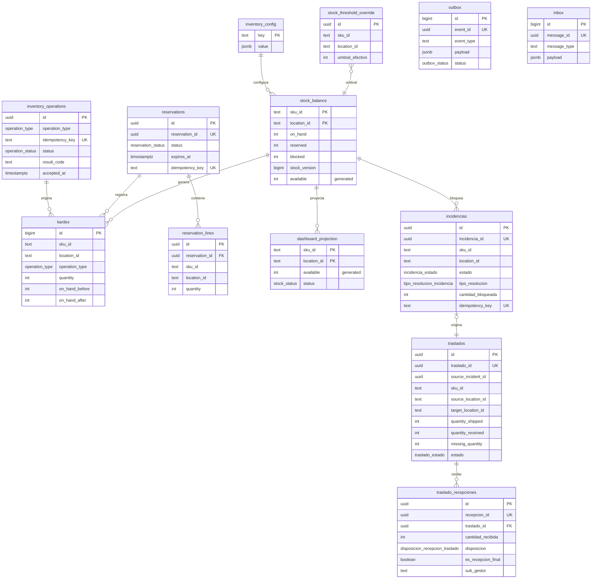

# Modelo físico — `inventory` (inventory-svc)

- **Issue:** #54 — [Hito 2][BD] Implementar persistencia de inventory-svc
- **Responsable:** Miguel Ángel Taco Zavala
- **Schema:** `inventory` (único propietario: inventory-svc, según `Arquitectura.md` §7 y `Modelo_Conceptual.md` §14)
- **Última actualización:** 2026-10-02
- **Fuentes normativas:** `Arquitectura.md` §7 (Persistencia), §8 (Migraciones), §13 (Inventario), §15 (Concurrencia); `Modelo_Conceptual.md` §14-15; `README.md` §11/§14; trazable contra `FLOW-015` y `FLOW-016`.
- **Implementación:** `migration.sql`. **Validación:** `validation.sql` + evidencia local.

## 1. Principios de diseño

1. **Aislamiento de bounded context:** todo el contexto vive en el schema `inventory`. **No existen FK hacia Catálogo, Ventas ni otros bounded contexts**; los identificadores externos (`sku_id`, `location_id`, `order_id`, `correlation_id`) se almacenan como `text`/`uuid` sin referencias cruzadas. Las integraciones externas usan contratos/identificadores, nunca acceso SQL directo.
2. **Modelo autoritativo:** `stock_balance` es la única fuente de verdad del saldo por `(sku_id, location_id)`. La proyección de dashboard (`dashboard_projection`) es un *read model* de solo lectura que **no** contiene reglas de negocio.
3. **Invariantes en BD:** no-negatividad (`on_hand/reserved/blocked >= 0`), `reserved + blocked <= on_hand` y la fórmula contractual `available = max(on_hand - reserved - blocked, 0)` (columna generada).
4. **Idempotencia:** la clave de comando (`idempotency_key`) es `UNIQUE`; la clave de reserva (`reservation_id`) es `UNIQUE`. Repetir con distinta intención produce conflicto detectable para `409 IDEMPOTENCY_CONFLICT`.
5. **Concurrencia:** `stock_version` para conflicto optimista (`VERSION_CONFLICT` en ajustes absolutos); la carrera confirmar/liberar/expirar se protege con un trigger de única transición terminal.
6. **Outbox/Inbox:** los eventos se persisten en `outbox` en la misma transacción local y se publican después del commit; los mensajes entrantes se deduplican en `inbox`.
7. **TTL:** `expires_at` en `reservations` + índice parcial `(status='ACTIVA', expires_at)` para el worker de expiración.
8. **Ubicación y reserva por líneas:** la ubicación es un identificador externo escalar (`location_id`) que no se materializa en tabla propia en el alcance del issue #54; la reserva se modela como agregado order-level y las líneas (`reservation_lines`) conservan `location_id` por línea (SPEC-015 §8.1). No existe restricción que fuerce una única ubicación por reserva; el mapeo tienda Retail ↔ ubicación de Inventario es conceptual y no se modela como FK ni como constraint de formato.

## 2. Enumeraciones

| Tipo | Valores |
|---|---|
| `reservation_status` | `ACTIVA`, `CONSUMIDA`, `LIBERADA`, `EXPIRADA` |
| `operation_type` | `RESERVA`, `CONSUMO`, `LIBERACION`, `EXPIRACION`, `AJUSTE_ABSOLUTO`, `INCIDENCIA_BLOQUEO`, `INCIDENCIA_RESOLUCION`, `REINTEGRO`, `CONCILIACION_OFFLINE`, `RECEPCION_TRASLADO`, `INICIALIZACION_SKU` |
| `operation_status` | `RECIBIDO`, `APLICADO`, `RECHAZADO`, `REQUIRES_REVIEW` |
| `stock_status` | `AGOTADO`, `STOCK_BAJO`, `DISPONIBLE` |
| `outbox_status` | `PENDING`, `PUBLISHED` |
| `inbox_status` | `RECEIVED`, `PROCESSED` |
| `incidencia_estado` | `ABIERTA`, `RESUELTA`, `TRASLADO_PENDIENTE` |
| `tipo_resolucion_incidencia` | `REHABILITADO`, `MERMA`, `FALTANTE_CONFIRMADO`, `TRASLADO_ALMACEN_CENTRAL` |
| `traslado_estado` | `EN_TRANSITO`, `RECIBIDO_PARCIAL`, `COMPLETADO`, `COMPLETADO_CON_DISCREPANCIA` |
| `disposicion_recepcion_traslado` | `REINGRESAR_DISPONIBLE`, `REINGRESAR_BLOQUEADO`, `CONFIRMAR_MERMA` |

## 3. Tablas

### 3.1 `stock_balance` — saldo autoritativo

| Columna | Tipo | Restricción |
|---|---|---|
| `sku_id` | `text` | PK (junto con `location_id`) · externo, sin FK |
| `location_id` | `text` | PK (junto con `sku_id`) · externo, sin FK |
| `on_hand` | `integer` | `CHECK (>= 0)` |
| `reserved` | `integer` | `CHECK (>= 0)` |
| `blocked` | `integer` | `CHECK (>= 0)` |
| `stock_version` | `bigint` | optimista, `DEFAULT 0` |
| `available` | `integer` | **generada**: `max(on_hand - reserved - blocked, 0)` |
| `created_at` / `updated_at` | `timestamptz` | `DEFAULT now()`; trigger de actualización |

Invariantes: `reserved + blocked <= on_hand`; `available >= 0` (implícito por columna generada).

### 3.2 `reservations` — agregado order-level de la reserva

| Columna | Tipo | Restricción |
|---|---|---|
| `id` | `uuid` | PK (PK física para líneas/relaciones) |
| `reservation_id` | `uuid` | `UNIQUE` (identidad de negocio) |
| `status` | `reservation_status` | `ACTIVA` por defecto |
| `expires_at` | `timestamptz` | TTL de expiración |
| `idempotency_key` | `text` | `UNIQUE` — idempotencia del comando de reserva |
| `intention` | `text` | intención original (`reservar`) |
| `correlation_id` / `order_id` / `operation_id` | `uuid` | correlación asíncrona |
| `consumed_at` / `released_at` / `expired_at` | `timestamptz` | marcas terminales |

El header **no** lleva `sku_id`, `location_id` ni cantidades: es el agregado del pedido (`order_id`, `operation_id`) y la ubicación/líneas viven en `reservation_lines`, alineado al contrato `CrearReservaRequest.lines[]` y SPEC-015 §8.1. Así no se impone una única ubicación ni un único SKU por reserva (soporta split/split-fulfillment futuro).

Carrera: trigger `trg_no_double_terminal` impide salir de un estado terminal (`CONSUMIDA`, `LIBERADA`, `EXPIRADA`) → **una sola transición terminal**.

### 3.3 `reservation_lines` — líneas de reserva

| Columna | Tipo | Restricción |
|---|---|---|
| `id` | `uuid` | PK |
| `reservation_id` | `uuid` | FK interna → `reservations(id)` `ON DELETE CASCADE` |
| `sku_id` / `location_id` | `text` | externos |
| `quantity` | `integer` | `CHECK (> 0)` |

`UNIQUE (reservation_id, sku_id, location_id)`.

### 3.4 `inventory_operations` — operaciones mutadoras e idempotencia

| Columna | Tipo | Restricción |
|---|---|---|
| `id` | `uuid` | PK |
| `operation_type` | `operation_type` | — |
| `idempotency_key` | `text` | `UNIQUE` |
| `intention` | `text` | intención del comando |
| `status` | `operation_status` | `RECIBIDO` por defecto |
| `sku_id` / `location_id` | `text` | externos, nullable |
| `quantity_requested` / `quantity_applied` | `integer` | `CHECK (>= 0)` |
| `result_code` | `text` | `STOCK_INSUFICIENTE`, `VERSION_CONFLICT`, `IDEMPOTENCY_CONFLICT`, `RESERVA_NO_ACTIVA`, `RESERVA_EXPIRADA`, `REINTEGRO_NO_APLICABLE`, … |
| `correlation_id` / `order_id` / `reservation_id` | `uuid` | correlación |
| `stock_version` | `bigint` | versión usada en ajustes absolutos |
| `accepted_at` | `timestamptz` | **202 Accepted** (admisión, no resultado) |
| `applied_at` | `timestamptz` | resultado aplicado |

### 3.5 `kardex` — movimientos autoritativos

`GENERATED ALWAYS AS IDENTITY` PK `id`; `sku_id`, `location_id`, `operation_type`; `quantity` (`CHECK <> 0`); `on_hand_before/after`, `reserved_before/after`, `blocked_before/after`; `stock_version`; `operation_id`, `reservation_id`, `correlation_id` (sin FK); `created_at`.

Cada mutación autoritativa del saldo persiste **Kardex + Outbox en la misma transacción** y la publicación de eventos ocurre después del commit (FLOW-015, SPEC-015 §27).

### 3.6 `stock_threshold_override` — umbral efectivo

`location_id` **siempre `NULL`**. `sku_id` **nulo = override global** (índice único parcial: solo una fila global) o **definido = override por SKU** (SPEC-015 §6: el umbral no se define por ubicación en el alcance actual; OpenAPI `UmbralGlobalRequest`/`UmbralSkuRequest` exponen global y por SKU). `umbral_efectivo` `CHECK (>= 0)`.

### 3.7 `inventory_config` — configuración del contexto

`key` PK (`text`), `value` `jsonb`, `description`, `updated_at`. Aloja, por ejemplo, TTL por defecto de reservas y la política multiubicación `D-INV-01` (decisión abierta, `Arquitectura.md §55`).

### 3.8 `dashboard_projection` — read model de solo lectura

Mismos campos de saldo que `stock_balance` (con `available` generada) + `status` (`stock_status`) + `umbral_efectivo` + `updated_at`. Lo actualiza el consumidor técnico (api-gateway/bff) **sin trasladar reglas de negocio de saldo**; el Dashboard UI consulta y se refresca (FLOW-016 §4.3).

### 3.9 `outbox` — publicación posterior al commit

`event_id` `uuid` `UNIQUE`; `event_type` (`inventory.stock.changed`, `inventory.stock.adjusted`, `inventory.reservation.*`, `inventory.consumption.*`, `inventory.bulk.stock.adjust.*`, `inventory.sku.initialization.*`); `aggregate_type`, `aggregate_id`, `correlation_id`, `payload` `jsonb`, `status` (`PENDING`/`PUBLISHED`), `published_at`, `created_at`. Índice `(status, created_at)` para el dispatcher.

### 3.10 `inbox` — deduplicación de mensajes entrantes

`message_id` `uuid` `UNIQUE`; `message_type`, `source`, `payload` `jsonb`, `status` (`RECEIVED`/`PROCESSED`), `processed_at`, `created_at`.

### 3.11 `incidencias` — cuarentenas físicas reportadas por Retail

| Columna | Tipo | Restricción |
|---|---|---|
| `id` | `uuid` | PK |
| `incidencia_id` | `uuid` | `UNIQUE` (identidad de negocio) |
| `sku_id` / `location_id` | `text` | externos, sin FK |
| `external_incident_id` | `text` | referencia operativa externa de Retail |
| `act_ref` | `text` | acta de resolución |
| `estado` | `incidencia_estado` | `ABIERTA` por defecto |
| `tipo_resolucion` | `tipo_resolucion_incidencia` | `REHABILITADO`, `MERMA`, `FALTANTE_CONFIRMADO`, `TRASLADO_ALMACEN_CENTRAL` |
| `cantidad_bloqueada` | `integer` | `CHECK (> 0)` |
| `idempotency_key` | `text` | `UNIQUE` — identidad del reporte (sincronización Retail) |
| `correlation_id` | `uuid` | correlación |
| `created_at` / `updated_at` / `resolved_at` | `timestamptz` | `resolved_at` al cerrar |

Ciclo (FLOW-015 4.6, Modelo_Conceptual §9.8): reporte crea `ABIERTA` y suma a `blocked`; resolver aplica la disposición y pasa a `RESUELTA` (`TRASLADO_ALMACEN_CENTRAL` la deja en `TRASLADO_PENDIENTE` y origina un traslado).

### 3.12 `traslados` — unidades en tránsito a almacén central

| Columna | Tipo | Restricción |
|---|---|---|
| `id` | `uuid` | PK |
| `traslado_id` | `uuid` | `UNIQUE` (identidad de negocio) |
| `source_incident_id` | `uuid` | ref conceptual a incidencia; único parcial por incidencia (sin FK) |
| `sku_id` / `source_location_id` / `target_location_id` | `text` | externos, sin FK |
| `quantity_shipped` | `integer` | `CHECK (> 0)` |
| `quantity_received` | `integer` | `DEFAULT 0`, `CHECK (>= 0)` |
| `missing_quantity` | `integer` | faltante solo al cerrar con discrepancia |
| `estado` | `traslado_estado` | `EN_TRANSITO` por defecto |
| `created_at` / `updated_at` | `timestamptz` | trigger de actualización |

Estados alineados a OpenAPI `EstadoTrasladoInventario` (FLOW-015 4.9, Modelo_Conceptual §9.9). Los estados terminales `COMPLETADO` / `COMPLETADO_CON_DISCREPANCIA` son irreversibles vía trigger `trg_traslado_terminal` (una recepción final no se revierte ni sobrescribe).

### 3.13 `traslado_recepciones` — recepción idempotente por traslado

| Columna | Tipo | Restricción |
|---|---|---|
| `id` | `uuid` | PK |
| `recepcion_id` | `uuid` | `UNIQUE` (identidad de negocio) |
| `traslado_id` | `uuid` | FK interna → `traslados(id)` `ON DELETE CASCADE` |
| `cantidad_recibida` | `integer` | `CHECK (> 0)` |
| `disposicion` | `disposicion_recepcion_traslado` | `REINGRESAR_DISPONIBLE`, `REINGRESAR_BLOQUEADO`, `CONFIRMAR_MERMA` |
| `es_recepcion_final` | `boolean` | cierre de la recepción |
| `sub_gestor` | `text` | `sub` del gestor autorizado (capacidad `INVENTARIO_TRASLADOS_RECIBIR`) |
| `idempotency_key` | `text` | `UNIQUE` — identidad de la recepción (header `Idempotency-Key`) |
| `received_at` | `timestamptz` | momento de la recepción |

El cierre con `es_recepcion_final = true` y faltante deriva `missing_quantity` y el estado `COMPLETADO_CON_DISCREPANCIA` (Modelo_Conceptual §9.9).

## 4. Diagrama entidad-relación

> Nota ERD: las relaciones con `stock_balance`/`kardex` y las referencias entre incidencias y traslados son lógicas (los IDs externos se almacenan sin FK); solo `reservation_lines → reservations` y `traslado_recepciones → traslados` son FK físicas dentro del schema.

## 5. Índices

| Índice | Tipo / dónde | Razón |
|---|---|---|
| `ix_reservations_ttl` | parcial `(status='ACTIVA', expires_at)` | barrido del worker de expiración TTL |
| `ix_reservation_lines_sku` | `(sku_id, location_id)` | líneas por producto/ubicación |
| `ix_operations_sku` | `(sku_id, location_id)` | historial por producto |
| `ix_operations_type_status` | `(operation_type, status)` | monitoreo de operaciones |
| `ix_kardex_saldo` | `(sku_id, location_id, created_at DESC)` | kardex cronológico |
| `ix_kardex_operation` | `(operation_id)` | trazabilidad operación→movimiento |
| `ix_dashboard_ubicacion_estado` | `(location_id, status)` | tablero por ubicación |
| `ix_dashboard_estado` | `(status)` | alertas por estado |
| `ix_outbox_dispatcher` | `(status, created_at)` | publicación secuencial |
| `ix_inbox_processing` | `(status, created_at)` | procesamiento entrante |
| `ux_threshold_global` | único parcial `((1)) WHERE ambos nulos` | un solo umbral global |
| `ix_incidencias_estado` | `(estado)` | cola de cuarentenas abiertas |
| `ix_incidencias_sku` | `(sku_id, location_id)` | incidencias por saldo |
| `ix_traslados_estado` | `(estado)` | KPIs de traslados y monitoreo |
| `ix_traslados_source` | `(source_location_id, estado)` | traslados por origen |
| `ix_recepciones_traslado` | `(traslado_id)` | recepciones por traslado |
| `ux_traslado_por_incidencia` | único parcial `(source_incident_id) WHERE NOT NULL` | un traslado por incidencia |

## 6. Trazabilidad FLOW → Tablas

| Subflujo (FLOW-015/016) | Tablas |
|---|---|
| 4.1 Consulta y estado | `stock_balance`, `dashboard_projection` |
| 4.2 Reserva | `reservations`, `reservation_lines`, `inventory_operations`, `kardex`, `outbox` |
| 4.3 Consumo / liberación | `reservations`, `inventory_operations`, `kardex`, `outbox` |
| 4.4 Expiración TTL / carrera | `reservations` (+ trigger), `stock_balance`, `kardex`, `outbox` |
| 4.5 Ajuste absoluto (Bulk) | `inventory_operations` (`VERSION_CONFLICT`), `stock_balance` (`stock_version`), `kardex`, `outbox` |
| 4.6 Incidencia | `incidencias` (estado/resolución), `stock_balance` (`blocked`), `inventory_operations`, `kardex`, `outbox` |
| 4.7 Reintegro | `stock_balance`, `inventory_operations` (idempotencia), `kardex`, `outbox` |
| 4.8 Venta offline | `inventory_operations` (`REQUIRES_REVIEW`), `stock_balance`, `kardex`, `outbox` |
| 4.9 Traslado / recepción | `traslados`, `traslado_recepciones` (disposición y `missing_quantity`), `stock_balance` (origen/destino), `inventory_operations`, `kardex`, `outbox` |
| 4.10 Inicialización SKU | `stock_balance` (`stock_version=0`, opcional sin `default_location_id`), `inventory_operations` (idempotente), `outbox` |
| FLOW-016 4.3/4.4 (reactividad) | `dashboard_projection`, `outbox` (consumido por bff), `inbox` (dedupe) |
| Umbrales / configuración | `stock_threshold_override`, `inventory_config` |

## 7. Notas de despliegue (Supabase)

1. **Aplicar `migration.sql`** desde cero en una BD vacía (SQL Editor de Supabase o `psql`).
2. **Migración reproducible desde cero** (Art. §8); no editar migraciones ya aplicadas; extender con `expand/contract` si evoluciona.
3. **Permisos:** el aislamiento del schema se mantiene por ownership/permisos (comentario `GRANT` en la migración); las integraciones externas nunca acceden por SQL directo.
4. **Evidencia:** `validation.sql` debe finalizar satisfactoriamente contra el mismo schema desplegado (coincide con el código versionado).
5. **Revisión transversal:** BD/Testing (Leonardo Lopez), Arquitectura/DevOps (Axel Cueva), QA (Marco Castilla).

## 8. Criterios de aceptación (Issue #54)

- [x] Modelo representa estados y operaciones de inventario (sección 3/6).
- [x] SQL coincide con el modelo físico (sección 3 = `migration.sql`).
- [x] Migración ejecutable desde cero (validado localmente).
- [x] Invariantes de cantidades protegidas (CHECKs).
- [x] Reservas y operaciones mantienen integridad interna.
- [x] No existen FK hacia otros bounded contexts (validado en `validation.sql` §13).
- [x] Integraciones externas usan identificadores/contratos (diseño, sección 1).
- [x] `validation.sql` finaliza satisfactoriamente.
- [ ] Schema desplegado coincide con código versionado (paso de despliegue Supabase).
- [ ] Pull Request asociado al issue.