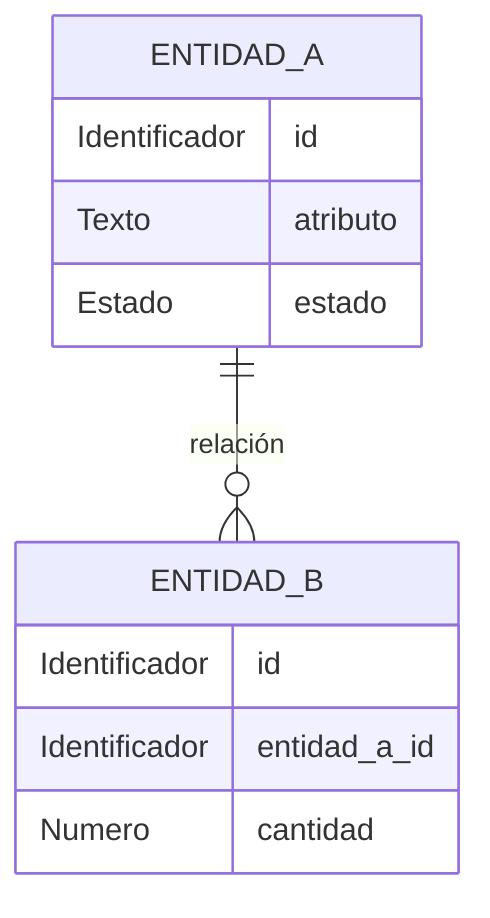

# Modelo lógico — `<schema>` (`<microservicio>`)

- **Issue:** #`<N>` — `<título del issue>`
- **Responsable:** `<nombre del responsable>`
- **Bounded context:** `<nombre>`
- **Microservicio:** `<microservicio>`
- **Schema objetivo:** `<schema>`
- **Última actualización:** `<AAAA-MM-DD>`
- **Estado:** `<BORRADOR | EN REVISIÓN | APROBADO>`

## Fuentes

Este modelo deriva de las fuentes funcionales, arquitectónicas y contractuales vigentes.

Revisar como mínimo, según corresponda:

- `Modelo_Conceptual.md`
- `Arquitectura.md`
- `Contrato_Api.md`
- OpenAPI vigente
- AsyncAPI vigente
- SPEC asociadas
- HU asociadas
- WF asociados
- FLOW asociados
- convenciones comunes de base de datos
- decisiones inter-módulo aplicables

Si existe contradicción entre fuentes, debe resolverse antes de incorporarla como decisión del modelo.

---

# 1. Propósito

Describir la estructura lógica de información propiedad del bounded context `<nombre>`.

Este documento define:

- entidades lógicas;
- atributos relevantes;
- identificadores;
- relaciones;
- cardinalidades;
- reglas de integridad;
- referencias a otros bounded contexts;
- datos derivados o proyectados;
- necesidades de persistencia técnica cuando correspondan.

Este documento **no define todavía la implementación PostgreSQL**.

Por lo tanto, no debe decidir:

- `uuid`, `text`, `varchar`, `integer`, `bigint`, `numeric`, `jsonb`, `timestamptz` u otros tipos PostgreSQL;
- nombres de índices;
- `CREATE TABLE`;
- `CREATE TYPE`;
- `CHECK`;
- `DEFAULT`;
- triggers;
- funciones PL/pgSQL;
- detalles propios de Supabase;
- optimizaciones físicas prematuras.

Estas decisiones pertenecen a `physical-model.md`.

---

# 2. Responsabilidad del bounded context

## 2.1. Datos propios

El bounded context es autoridad sobre:

- `<dato / concepto propio 1>`
- `<dato / concepto propio 2>`
- `<dato / concepto propio 3>`

## 2.2. Datos que NO posee

No es autoridad sobre:

- `<dato externo 1>` — owner: `<bounded context>`
- `<dato externo 2>` — owner: `<bounded context>`

Los datos externos se mantienen únicamente como referencias contractuales o proyecciones locales cuando exista una razón funcional documentada.

---

# 3. Entidades lógicas

## 3.1. `<ENTIDAD 1>`

**Propósito:**  
`<qué representa dentro del dominio>`

**Identificador lógico:**  
`<atributo o combinación que identifica la entidad>`

### Atributos

| Atributo | Naturaleza lógica | Obligatorio | Descripción |
|---|---|---:|---|
| `<atributo>` | Identificador | Sí | `<descripción>` |
| `<atributo>` | Texto | Sí/No | `<descripción>` |
| `<atributo>` | Número entero | Sí/No | `<descripción>` |
| `<atributo>` | Importe monetario | Sí/No | `<descripción>` |
| `<atributo>` | Fecha/hora | Sí/No | `<descripción>` |
| `<atributo>` | Estado | Sí/No | `<descripción>` |
| `<atributo>` | Referencia externa | Sí/No | `<owner del dato>` |

### Reglas

- `<regla lógica>`
- `<invariante>`
- `<restricción funcional>`

---

## 3.2. `<ENTIDAD 2>`

**Propósito:**  
`<descripción>`

**Identificador lógico:**  
`<identificador>`

### Atributos

| Atributo | Naturaleza lógica | Obligatorio | Descripción |
|---|---|---:|---|
| `<atributo>` | `<naturaleza>` | Sí/No | `<descripción>` |

### Reglas

- `<regla>`

---

> Repetir esta sección por cada entidad lógica.

---

# 4. Catálogos de estados y valores controlados

Registrar únicamente valores que estén respaldados por fuentes vigentes.

## 4.1. `<concepto de estado>`

Valores:

```text
<VALOR_1>
<VALOR_2>
<VALOR_3>
```

Semántica:

| Valor | Significado |
|---|---|
| `<VALOR_1>` | `<descripción>` |
| `<VALOR_2>` | `<descripción>` |

No incorporar estados de conveniencia técnica que no existan en los contratos o reglas funcionales.

---

# 5. Relaciones y cardinalidades

| Origen | Relación | Destino | Cardinalidad | Propiedad |
|---|---|---|---:|---|
| `<Entidad A>` | `<contiene>` | `<Entidad B>` | `1:N` | Interna |
| `<Entidad A>` | `<referencia>` | `<Concepto externo>` | `N:1` | Externa, sin ownership |

Describir relaciones únicamente cuando tengan significado funcional.

---

# 6. Referencias interdominio

Las referencias hacia otros bounded contexts **no transfieren ownership**.

| Referencia | Owner | Uso local | ¿FK cross-context? |
|---|---|---|---:|
| `<product_id>` | `catalog-svc` | `<motivo>` | No |
| `<sku>` | `catalog-svc` | `<motivo>` | No |
| `<location_id>` | `inventory-svc` | `<motivo>` | No |
| `<customer_ref>` | Seguridad | `<motivo>` | No |

Regla:

```text
referencia externa != entidad local autoritativa
```

No modelar relaciones SQL entre bounded contexts.

---

# 7. Reglas de integridad lógica

Documentar invariantes que deben conservarse independientemente de la tecnología utilizada.

Ejemplos de forma:

```text
cantidad > 0
```

```text
fecha_inicio <= fecha_fin
```

```text
un elemento aplicado debe formar parte de los elementos requeridos
```

```text
una entidad terminal no puede volver a un estado activo
```

Reglas del contexto:

1. `<regla>`
2. `<regla>`
3. `<regla>`

No decidir en esta sección si la regla se implementará mediante `CHECK`, trigger o lógica de aplicación. Esa decisión pertenece al modelo físico.

---

# 8. Normalización y duplicación controlada

## 8.1. Datos autoritativos

Son autoritativos dentro de este bounded context:

- `<dato>`
- `<dato>`

## 8.2. Datos duplicados o proyectados

| Dato | Owner original | Motivo de duplicación | Reconstruible |
|---|---|---|---:|
| `<dato>` | `<servicio>` | `<consulta/rendimiento/workflow>` | Sí/No |

Regla:

```text
duplicar para leer != compartir ownership
```

Cuando una copia sea reconstruible debe declararse explícitamente como proyección o snapshot.

---

# 9. Persistencia técnica necesaria

Esta sección identifica **necesidades**, no implementaciones físicas.

Según el comportamiento del contexto puede requerirse conceptualmente:

- registro de mensajes pendientes de publicación;
- registro de mensajes ya procesados;
- historial de operaciones;
- información de idempotencia;
- estado durable de procesos;
- trabajos asíncronos;
- proyecciones reconstruibles;
- manifiestos de archivos;
- auditoría.

Aplicables al contexto:

| Necesidad | Requerida | Justificación |
|---|---:|---|
| Outbox | Sí/No | `<motivo>` |
| Inbox | Sí/No | `<motivo>` |
| Idempotencia | Sí/No | `<motivo>` |
| Jobs asíncronos | Sí/No | `<motivo>` |
| Proyección local | Sí/No | `<motivo>` |

No definir aquí columnas técnicas o tipos PostgreSQL.

---

# 10. Diagrama entidad-relación lógico



El diagrama expresa entidades y cardinalidades lógicas.

No debe depender de particularidades de PostgreSQL.

---

# 11. Trazabilidad

| Fuente | Decisión / entidad derivada |
|---|---|
| `SPEC-XXX` | `<entidad/regla>` |
| `HU-XXX` | `<entidad/regla>` |
| `WF-XXX` | `<dato/estado>` |
| `FLOW-XXX` | `<relación/transición>` |
| OpenAPI | `<identidad/estado/estructura>` |
| AsyncAPI | `<mensajería/idempotencia>` |
| `Modelo_Conceptual.md` | `<entidad/ownership>` |
| `Arquitectura.md` | `<límite de contexto>` |

---

# 12. Decisiones del modelo lógico

Registrar decisiones que no estaban determinadas directamente por las fuentes pero son necesarias para convertir el modelo conceptual en lógico.

| ID | Decisión | Justificación | Impacto |
|---|---|---|---|
| `D-LOG-01` | `<decisión>` | `<razón>` | `<entidades afectadas>` |

Una decisión lógica:

- no puede contradecir las fuentes de verdad;
- no puede inventar comportamiento funcional;
- debe mantenerse independiente de PostgreSQL.

---

# 13. Decisiones pendientes

| ID | Pregunta | Fuente afectada | Bloquea modelo físico |
|---|---|---|---:|
| `P-LOG-01` | `<pregunta>` | `<fuente>` | Sí/No |

No resolver silenciosamente una contradicción funcional mediante una decisión de base de datos.

---

# 14. Derivación esperada hacia el modelo físico

El `physical-model.md` deberá materializar este modelo especificando:

- tablas;
- columnas;
- tipos PostgreSQL;
- PK;
- FK internas;
- `UNIQUE`;
- `CHECK`;
- valores por defecto;
- índices;
- enums cuando correspondan;
- funciones y triggers estrictamente necesarios;
- Outbox/Inbox físicos cuando correspondan;
- estrategia de timestamps;
- detalles de PostgreSQL/Supabase.

Toda tabla física debe poder trazarse hacia:

1. una entidad lógica;
2. una relación lógica;
3. una necesidad técnica documentada.

---

# 15. Checklist de aprobación

## Ownership

- [ ] El bounded context conserva ownership exclusivamente sobre sus datos.
- [ ] No se modelan entidades pertenecientes a otros bounded contexts como propias.
- [ ] Las referencias externas están identificadas.

## Modelo

- [ ] Todas las entidades necesarias están representadas.
- [ ] Los identificadores lógicos están definidos.
- [ ] Las relaciones tienen cardinalidades.
- [ ] Las invariantes funcionales están documentadas.
- [ ] Los estados coinciden con contratos y documentación vigente.

## Aislamiento

- [ ] No se proponen FK entre bounded contexts.
- [ ] Las proyecciones locales se identifican como reconstruibles cuando corresponde.
- [ ] No se confunde una referencia externa con ownership.

## Nivel de abstracción

- [ ] No contiene SQL.
- [ ] No contiene tipos PostgreSQL.
- [ ] No contiene índices físicos.
- [ ] No contiene triggers ni funciones de BD.
- [ ] No contiene decisiones de optimización física.

## Trazabilidad

- [ ] Las decisiones principales son trazables a SPEC/HU/WF/FLOW/contratos.
- [ ] No quedan contradicciones funcionales ocultas.
- [ ] Las decisiones locales están registradas.

**Resultado:** `<APROBADO | REQUIERE CAMBIOS>`
