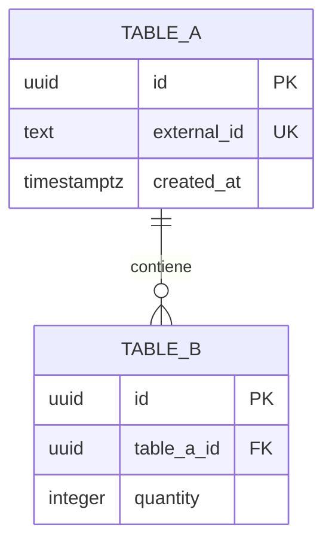

# Modelo físico — `<schema>` (`<microservicio>`)

- **Issue:** #`<N>` — `<título>`
- **Responsable:** `<nombre>`
- **Bounded context:** `<nombre>`
- **Microservicio:** `<microservicio>`
- **Schema:** `<schema>`
- **Owner exclusivo:** `<microservicio>`
- **Última actualización:** `<AAAA-MM-DD>`
- **Estado:** `<BORRADOR | EN REVISIÓN | APROBADO>`
- **Modelo lógico de origen:** `logical-model.md`
- **Implementación:** `migration.sql`
- **Validación:** `validation.sql`
- **Motor objetivo:** PostgreSQL / Supabase

---

# 1. Propósito

Materializar el `logical-model.md` del bounded context `<nombre>` como un diseño implementable en PostgreSQL/Supabase.

Este documento define:

- tablas;
- columnas;
- tipos PostgreSQL;
- claves primarias;
- claves foráneas internas;
- restricciones;
- valores por defecto;
- enumeraciones;
- índices;
- funciones/triggers estrictamente necesarios;
- persistencia técnica;
- estrategia de despliegue.

El modelo físico **no puede introducir reglas funcionales nuevas**.

Toda decisión física debe derivar de:

```text
fuentes funcionales
        ↓
modelo conceptual
        ↓
logical-model.md
        ↓
physical-model.md
```

---

# 2. Principios de diseño físico

## 2.1. Aislamiento

Todo el bounded context vive dentro del schema:

```text
<schema>
```

Owner:

```text
<microservicio>
```

No existen FK hacia schemas pertenecientes a otros bounded contexts.

---

## 2.2. Convenciones

Aplicar las convenciones comunes de BD vigentes.

Registrar aquí únicamente excepciones justificadas:

| Convención | Aplicación / excepción |
|---|---|
| Nombres de tablas | `<convención>` |
| Nombres de columnas | `<convención>` |
| PK | `<convención>` |
| FK | `<convención>` |
| Timestamps | `<convención>` |
| Identificadores | `<convención>` |
| Índices | `<convención>` |

No duplicar innecesariamente el documento transversal de convenciones.

---

# 3. Enumeraciones y tipos propios

## 3.1. `<enum_name>`

```text
<VALOR_1>
<VALOR_2>
<VALOR_3>
```

Origen lógico:

```text
logical-model.md §<N>
```

Uso:

- `<tabla.columna>`
- `<tabla.columna>`

> Crear enums únicamente cuando el conjunto de valores sea contractual y suficientemente estable.

---

# 4. Tablas

## 4.1. `<table_name>`

**Origen lógico:** `<ENTIDAD / necesidad técnica>`  
**Propósito:** `<descripción>`

| Columna | Tipo PostgreSQL | Nulo | Restricción / default | Origen lógico |
|---|---|---:|---|---|
| `id` | `uuid` | No | PK, `DEFAULT gen_random_uuid()` | Identificador |
| `<columna>` | `text` | No | `UNIQUE` | `<atributo>` |
| `<columna>` | `integer` | No | `CHECK (...)` | `<regla>` |
| `created_at` | `timestamptz` | No | `DEFAULT now()` | Técnico |
| `updated_at` | `timestamptz` | No | `DEFAULT now()` | Técnico |

### Clave primaria

```text
<definición>
```

### Claves únicas

```text
<definición>
```

### Foreign keys internas

```text
<tabla.columna>
    -> <tabla_destino.columna>
```

### Constraints

```text
<regla>
```

### Notas

- `<nota de implementación>`
- `<decisión física relevante>`

---

> Repetir por cada tabla.

---

# 5. Referencias externas

Los siguientes identificadores pertenecen a otros bounded contexts y se almacenan **sin FK física**.

| Columna | Tabla | Owner | Tipo físico | Razón |
|---|---|---|---|---|
| `<sku>` | `<tabla>` | `catalog-svc` | `<tipo>` | `<uso>` |
| `<location_id>` | `<tabla>` | `inventory-svc` | `<tipo>` | `<uso>` |
| `<order_id>` | `<tabla>` | Ventas | `<tipo>` | `<uso>` |

Está prohibido crear:

```text
FOREIGN KEY
    -> schema_de_otro_microservicio.tabla
```

Incluso cuando todos los schemas se encuentren en la misma instancia PostgreSQL/Supabase.

---

# 6. Constraints e invariantes

Mapear cada invariante lógica hacia su mecanismo físico.

| Regla lógica | Implementación física |
|---|---|
| `<cantidad >= 0>` | `CHECK (...)` |
| `<identidad única>` | `UNIQUE (...)` |
| `<relación obligatoria>` | `NOT NULL` + FK interna |
| `<regla que no puede expresarse declarativamente>` | `<trigger/aplicación>` |

Preferencia:

```text
constraint declarativa
    >
trigger
    >
lógica exclusiva de aplicación
```

cuando la regla pueda protegerse correctamente en la base de datos.

No utilizar triggers para reglas que puedan expresarse de forma segura mediante constraints simples.

---

# 7. Foreign keys

## 7.1. Permitidas

Solo dentro del mismo bounded context.

| Origen | Destino | Acción |
|---|---|---|
| `<tabla.columna>` | `<tabla.columna>` | `<ON DELETE ...>` |

---

## 7.2. Prohibidas

No crear FK hacia:

```text
<otros schemas>
```

Las relaciones interdominio son referencias lógicas mediante contratos.

---

# 8. Índices

Crear únicamente índices asociados a consultas, constraints o procesos concretos.

| Índice | Tabla / columnas | Tipo | Justificación |
|---|---|---|---|
| `<ix_nombre>` | `<columnas>` | normal | `<consulta>` |
| `<ux_nombre>` | `<columnas>` | único | `<regla>` |
| `<ix_nombre>` | `<columnas WHERE condición>` | parcial | `<worker/consulta>` |

No crear índices "por si acaso".

---

# 9. Funciones y triggers

## 9.1. `<función / trigger>`

**Objetivo:** `<qué protege>`  
**Origen lógico:** `<regla>`  
**Justificación:** `<por qué no basta un constraint declarativo>`

```text
<trigger o función a alto nivel>
```

Si no son necesarios:

```text
No se requieren funciones o triggers específicos para este bounded context.
```

---

# 10. Outbox / Inbox

> Mantener esta sección solo cuando corresponda.

## 10.1. `outbox`

Propósito:

```text
persistir mensaje y cambio de negocio dentro de la misma transacción local
```

Columnas mínimas esperadas:

| Columna | Tipo |
|---|---|
| `id` | `<tipo>` |
| `message_id` / `event_id` | `<tipo>` |
| `message_type` | `<tipo>` |
| `aggregate_type` | `<tipo>` |
| `aggregate_id` | `<tipo>` |
| `operation_id` | `<tipo>` |
| `correlation_id` | `<tipo>` |
| `payload` | `<tipo>` |
| `status` | `<tipo>` |
| `published_at` | `<tipo>` |
| `created_at` | `<tipo>` |

Flujo:

```text
BEGIN
    mutación local
    INSERT outbox
COMMIT

publisher
    -> publica
    -> confirmación
    -> marca PUBLISHED
```

---

## 10.2. `inbox`

Propósito:

```text
deduplicar mensajes por message_id antes de ejecutar efectos
```

Columnas mínimas:

| Columna | Tipo |
|---|---|
| `id` | `<tipo>` |
| `message_id` | `<tipo>` |
| `operation_id` | `<tipo>` |
| `message_type` | `<tipo>` |
| `source` | `<tipo>` |
| `payload` | `<tipo>` |
| `status` | `<tipo>` |
| `processed_at` | `<tipo>` |
| `created_at` | `<tipo>` |

`message_id` debe ser único.

La idempotencia técnica por mensaje no sustituye la idempotencia funcional por `operation_id` cuando esta exista.

---

# 11. Diagrama entidad-relación físico



El diagrama debe representar:

- PK físicas;
- FK internas reales;
- principales claves únicas;
- columnas necesarias para entender las relaciones.

No dibujar FK cross-context inexistentes.

---

# 12. Trazabilidad lógico → físico

| Elemento lógico | Materialización física |
|---|---|
| `<ENTIDAD A>` | `<table_a>` |
| `<ENTIDAD B>` | `<table_b>` |
| `<relación A-B>` | `<FK / tabla asociativa>` |
| `<invariante>` | `<CHECK / UNIQUE / trigger>` |
| `<referencia externa>` | `<columna sin FK>` |
| `<necesidad Outbox>` | `outbox` |
| `<necesidad Inbox>` | `inbox` |

Toda tabla física debe aparecer en esta matriz.

Una tabla sin origen lógico o técnico documentado requiere justificación explícita.

---

# 13. Trazabilidad funcional

| Fuente | Elemento físico afectado |
|---|---|
| `SPEC-XXX` | `<tabla / constraint>` |
| `HU-XXX` | `<tabla / constraint>` |
| `FLOW-XXX` | `<estado / relación>` |
| OpenAPI | `<campo / identidad / enum>` |
| AsyncAPI | `<outbox / inbox / correlation>` |
| `logical-model.md` | `<tabla>` |

---

# 14. Decisiones físicas

| ID | Decisión | Alternativas consideradas | Justificación |
|---|---|---|---|
| `D-PHY-01` | `<decisión>` | `<alternativas>` | `<motivo>` |

Ejemplos válidos:

- usar PK física separada del identificador contractual;
- materializar un enum PostgreSQL;
- utilizar una columna generada;
- crear un índice parcial;
- usar `jsonb` para un snapshot no autoritativo.

No utilizar esta sección para introducir reglas de negocio nuevas.

---

# 15. Migración

La implementación correspondiente vive en:

```text
migration.sql
```

Debe cumplir:

- ejecutable desde una base limpia;
- creación explícita del schema;
- creación reproducible de tipos, tablas, constraints e índices;
- independencia de otros bounded contexts;
- ausencia de secretos;
- ausencia de creación automática dependiente del ORM;
- coincidencia exacta con este modelo físico.

---

# 16. Validación

La validación correspondiente vive en:

```text
validation.sql
```

Debe comprobar como mínimo:

1. existencia del schema;
2. existencia de las tablas;
3. PK;
4. FK internas;
5. ausencia de FK cross-context;
6. `UNIQUE`;
7. `CHECK`;
8. invariantes principales;
9. índices críticos;
10. idempotencia cuando corresponda;
11. Outbox/Inbox cuando corresponda;
12. operaciones representativas del dominio.

Resultado esperado:

```text
VALIDACION_FINALIZADA_SATISFACTORIAMENTE
```

---

# 17. Despliegue en Supabase

El schema desplegado debe coincidir con el código versionado.

Registrar:

- entorno;
- migración aplicada;
- fecha;
- resultado;
- evidencia de `validation.sql`;
- PR asociado.

No incluir:

- contraseñas;
- API keys;
- tokens;
- connection strings con secretos.

---

# 18. Checklist de aprobación

## Correspondencia con el modelo lógico

- [ ] Cada entidad lógica requerida tiene materialización física.
- [ ] Cada tabla tiene origen lógico o técnico documentado.
- [ ] No aparecen reglas funcionales nuevas.
- [ ] Las cardinalidades se mantienen correctamente.

## Integridad

- [ ] PK definidas.
- [ ] FK internas definidas donde corresponden.
- [ ] `NOT NULL` utilizados correctamente.
- [ ] `UNIQUE` utilizados correctamente.
- [ ] `CHECK` protegen invariantes aplicables.
- [ ] No existen FK entre bounded contexts.

## Rendimiento

- [ ] Índices asociados a casos de acceso concretos.
- [ ] No existen índices redundantes evidentes.
- [ ] Workers/procesos asíncronos poseen índices adecuados cuando corresponda.

## Mensajería

- [ ] Outbox implementado cuando corresponde.
- [ ] Inbox implementado cuando corresponde.
- [ ] `message_id` permite deduplicación.
- [ ] `operation_id` mantiene idempotencia funcional cuando corresponde.

## Implementación

- [ ] `migration.sql` coincide con este documento.
- [ ] La migración puede ejecutarse desde cero.
- [ ] `validation.sql` valida las invariantes principales.
- [ ] El schema puede desplegarse aisladamente.
- [ ] No contiene secretos.

## Evidencia

- [ ] Validación local satisfactoria.
- [ ] Despliegue Supabase validado.
- [ ] Evidencia conservada.
- [ ] Pull Request asociado.

**Resultado:** `<APROBADO | REQUIERE CAMBIOS>`
