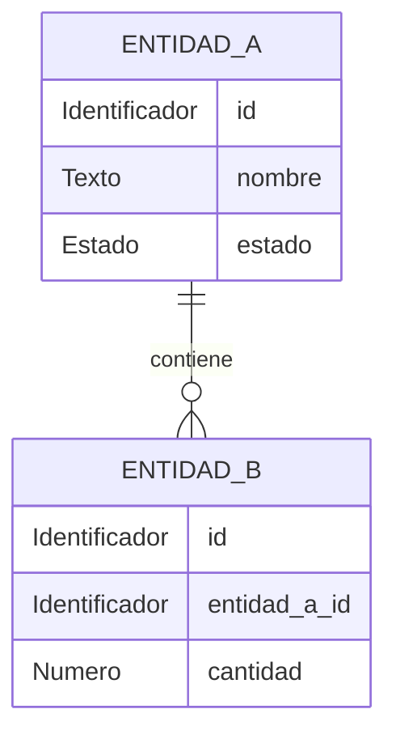

# Modelo lógico — `<schema>` (`<microservicio>`)

> **Ubicación oficial del documento:**
> Guardar una copia completada en `bd/<schema>/logical-model.md` (o en la carpeta asignada al servicio dentro de `bd/`).

- **Issue:** #`<N>` — `<título del issue>`
- **Responsable:** `<nombre del responsable>`
- **Bounded context:** `<nombre>`
- **Microservicio:** `<microservicio>`
- **Schema objetivo:** `<schema>`
- **Última actualización:** `<AAAA-MM-DD>`
- **Estado:** `<BORRADOR | EN REVISIÓN | APROBADO>`

---

## Flujo de derivación y precedencia

```text
fuentes funcionales y contractuales
        ↓
Modelo_Conceptual.md
        ↓
logical-model.md
        ↓
physical-model.md
        ↓
migrations/
        ↓
validation.sql
```

## Fuentes de verdad

Este modelo deriva estrictamente de las fuentes funcionales, arquitectónicas y contractuales vigentes:

- `Modelo_Conceptual.md`
- `Arquitectura.md`
- `Contrato_Api.md`
- `api/openapi.yaml`
- `asyncapi/asyncapi.yaml`
- `specs/SPEC-XXX-*.md`
- `hu/HU-XXX-*.md`
- `flujos/FLOW-XXX-*.md`
- `wireframes/flows/WF-XXX-*.md`
- `bd/CONVENCIONES_BD.md`

Si existe contradicción entre fuentes, debe resolverse antes de incorporarla como decisión del modelo. Las fuentes funcionales y contractuales tienen precedencia sobre las decisiones de persistencia.

---

# 1. Propósito

Describir la estructura lógica de información propiedad del bounded context `<nombre>`.

Este documento define:

- entidades lógicas de dominio;
- atributos relevantes y su naturaleza lógica;
- identificadores lógicos y claves naturales;
- relaciones y cardinalidades;
- reglas de integridad e invariantes de negocio;
- referencias a otros bounded contexts (aislamiento interdominio);
- datos derivados o proyecciones locales;
- necesidades conceptuales de persistencia técnica (Outbox, Inbox, Idempotencia).

Este documento **representa exclusivamente el nivel lógico y no define la implementación física**.

Por lo tanto, **NO debe contener**:

- tipos PostgreSQL (`uuid`, `text`, `varchar`, `integer`, `bigint`, `numeric`, `jsonb`, `timestamptz`);
- sentencias SQL (`CREATE TABLE`, `CREATE TYPE`, `CHECK`, `DEFAULT`, `ALTER TABLE`);
- nombres o definiciones de índices físicos;
- triggers ni funciones PL/pgSQL;
- decisiones o extensiones propias de Supabase / PostgREST;
- optimizaciones físicas prematuras.

Estas decisiones pertenecen exclusivamente a `physical-model.md`.

---

# 2. Responsabilidad del bounded context

## 2.1. Datos propios (Authority / Ownership)

El bounded context es autoridad y fuente de verdad exclusiva sobre:

- `<concepto propio 1>`
- `<concepto propio 2>`
- `<concepto propio 3>`

## 2.2. Datos que NO posee (Referencias externas / Non-goals)

No es autoridad sobre:

- `<dato externo 1>` — Owner: `<bounded context / microservicio>`
- `<dato externo 2>` — Owner: `<bounded context / microservicio>`

Los datos externos se mantienen únicamente como referencias contractuales escalares o proyecciones locales cuando exista una justificación funcional documentada.

---

# 3. Entidades lógicas

## 3.1. `<NOMBRE_ENTIDAD_1>`

**Propósito:**
`<Qué representa dentro del dominio>`

**Identificador lógico:**
`<Atributo o combinación de atributos que identifica unívocamente la entidad>`

### Atributos

| Atributo | Naturaleza lógica | Obligatorio | Descripción |
|---|---|---:|---|
| `<identificador>` | Identificador | Sí | Identificador lógico de la entidad |
| `<atributo_texto>` | Texto | Sí/No | Descripción del atributo |
| `<atributo_entero>` | Número entero | Sí/No | Cantidad o conteo |
| `<atributo_decimal>` | Número decimal / Importe | Sí/No | Valor numérico o importe monetario con moneda asociada |
| `<atributo_fecha>` | Fecha / Fecha-hora | Sí/No | Instante o fecha de negocio |
| `<atributo_estado>` | Estado | Sí | Estado del ciclo de vida |
| `<referencia_externa>` | Referencia externa | Sí/No | Identificador de entidad foránea (Owner: `<bounded context>`) |

### Reglas e invariantes

- `<regla lógica 1>`
- `<invariante funcional 2>`

---

## 3.2. `<NOMBRE_ENTIDAD_2>`

**Propósito:**
`<Descripción>`

**Identificador lógico:**
`<Identificador>`

### Atributos

| Atributo | Naturaleza lógica | Obligatorio | Descripción |
|---|---|---:|---|
| `<atributo>` | `<naturaleza>` | Sí/No | `<descripción>` |

### Reglas e invariantes

- `<regla>`

---

> Repetir esta sección por cada entidad lógica del bounded context.

---

# 4. Catálogos de estados y valores controlados

Registrar únicamente valores que estén respaldados por fuentes funcionales y contratos vigentes.

## 4.1. `<Concepto de estado / Ciclo de vida>`

Valores permitidos:

- `<ESTADO_A>`
- `<ESTADO_B>`
- `<ESTADO_C>`

Semántica de transiciones:

| Estado | Significado | Transiciones permitidas |
|---|---|---|
| `<ESTADO_A>` | `<descripción>` | `<ESTADO_B>` |
| `<ESTADO_B>` | `<descripción>` | `<ESTADO_C>` |

No incorporar estados técnicos o ficticios no contemplados en contratos o reglas de negocio.

---

# 5. Relaciones y cardinalidades

| Origen | Relación | Destino | Cardinalidad | Propiedad |
|---|---|---|---:|---|
| `<Entidad A>` | `<contiene / compone>` | `<Entidad B>` | `1:N` | Interna |
| `<Entidad A>` | `<asocia>` | `<Entidad C>` | `N:M` | Interna |
| `<Entidad A>` | `<referencia>` | `<Entidad Externa>` | `N:1` | Externa (sin ownership) |

---

# 6. Referencias interdominio

Las referencias hacia otros bounded contexts **no transfieren ownership**.

| Referencia | Owner | Uso local | ¿FK cross-context? |
|---|---|---|---:|
| `<referencia_id>` | `<bounded context>` | `<motivo funcional>` | No |

Regla fundamental de aislamiento:

```text
referencia externa != entidad local autoritativa
```

No se modelan relaciones de integridad referencial física ni constraints entre bounded contexts distintos.

---

# 7. Reglas de integridad lógica

Invariantes que deben conservarse independientemente del motor de persistencia:

1. `<Invariante 1>` (ej. `cantidad > 0`)
2. `<Invariante 2>` (ej. `fecha_inicio <= fecha_fin`)
3. `<Invariante 3>` (ej. `un elemento aplicado debe pertenecer al catálogo activo`)
4. `<Invariante 4>` (ej. `un estado terminal no puede reactivarse`)

No decidir en esta sección si se implementará mediante CHECK, disparador o lógica de aplicación.

---

# 8. Normalización y duplicación controlada

## 8.1. Datos autoritativos

Son autoritativos dentro de este bounded context:

- `<concepto autoritativo 1>`
- `<concepto autoritativo 2>`

## 8.2. Datos duplicados o proyectados

| Dato | Owner original | Motivo de duplicación | Reconstruible |
|---|---|---|---:|
| `<dato>` | `<bounded context>` | `<consulta / rendimiento / validación local>` | Sí/No |

Regla:
```text
duplicar para leer != compartir ownership
```

Cuando una copia sea reconstruible, debe declararse explícitamente como proyección local.

---

# 9. Persistencia técnica necesaria

Esta sección identifica **necesidades conceptuales**, no implementaciones físicas.

| Necesidad | Requerida | Justificación conceptual |
|---|---:|---|
| Outbox | Sí/No | `<Publica eventos de dominio para integración asíncrona>` |
| Inbox | Sí/No | `<Consume eventos de otros dominios de forma idempotente>` |
| Idempotencia | Sí/No | `<Garantiza que operaciones repetidas con misma clave no dupliquen efectos>` |
| Registro de operaciones / Auditoría | Sí/No | `<Trazabilidad histórica de modificaciones>` |
| Proyección local | Sí/No | `<Almacenamiento de solo lectura para soporte a operaciones locales>` |

---

# 10. Diagrama entidad-relación lógico



---

# 11. Trazabilidad

| Fuente | Decisión / Entidad / Regla derivada |
|---|---|
| `SPEC-XXX` | `<Entidad / Regla>` |
| `HU-XXX` | `<Criterio funcional>` |
| `FLOW-XXX` | `<Transición de estado / Flujo>` |
| `Contrato OpenAPI` | `<Modelos DTO / Atributos>` |
| `AsyncAPI` | `<Eventos / Publicación / Consumo>` |
| `Modelo_Conceptual.md` | `<Ownership / Alcance>` |
| `Arquitectura.md` | `<Límite del contexto>` |

---

# 12. Decisiones del modelo lógico

| ID | Decisión | Justificación | Impacto |
|---|---|---|---|
| `D-LOG-01` | `<Decisión tomada>` | `<Motivo fundamentado en el dominio>` | `<Entidades afectadas>` |

---

# 13. Decisiones pendientes

| ID | Pregunta / Aspecto abierto | Fuente afectada | Bloquea modelo físico |
|---|---|---|---:|
| `P-LOG-01` | `<Pregunta pendiente>` | `<Fuente>` | Sí/No |

---

# 14. Derivación esperada hacia el modelo físico

El archivo `physical-model.md` materializará este modelo preservando las invariantes lógicas:

- Representación tabular de las entidades lógicas y sus relaciones internas;
- Claves primarias y foráneas exclusivamente internas al schema;
- Integridad declarativa (no negatividad, rangos, orden cronológico y unicidades de negocio);
- Tipos de datos apropiados para la naturaleza lógica de cada atributo (importes, cantidades, instantes);
- Aislamiento total sin claves foráneas entre bounded contexts;
- Mecanismos de persistencia técnica para publicación y recepción fiable de eventos (Outbox / Inbox) e idempotencia de comandos.

---

# 15. Checklist de aprobación

## Ownership
- [ ] El bounded context conserva ownership exclusivamente sobre sus datos autoritativos.
- [ ] No se modelan entidades de otros bounded contexts como propias.
- [ ] Las referencias externas están identificadas.

## Modelo lógico
- [ ] Todas las entidades necesarias están representadas.
- [ ] Los identificadores lógicos están definidos.
- [ ] Las relaciones y cardinalidades son coherentes.
- [ ] Las invariantes funcionales están documentadas.
- [ ] Los estados coinciden con contratos y especificaciones vigentes.

## Aislamiento
- [ ] No se proponen FK entre bounded contexts.
- [ ] Las proyecciones locales se identifican como reconstruibles.
- [ ] No se confunde una referencia externa con ownership.

## Nivel de abstracción
- [ ] No contiene SQL.
- [ ] No contiene tipos PostgreSQL.
- [ ] No contiene índices físicos.
- [ ] No contiene triggers ni funciones de BD.
- [ ] No contiene decisiones de infraestructura física.

## Trazabilidad
- [ ] Las decisiones principales son trazables a SPEC/HU/WF/FLOW/contratos.
- [ ] No quedan contradicciones funcionales ocultas.
- [ ] Las decisiones locales están registradas.

**Resultado:** `<APROBADO | REQUIERE CAMBIOS>`
