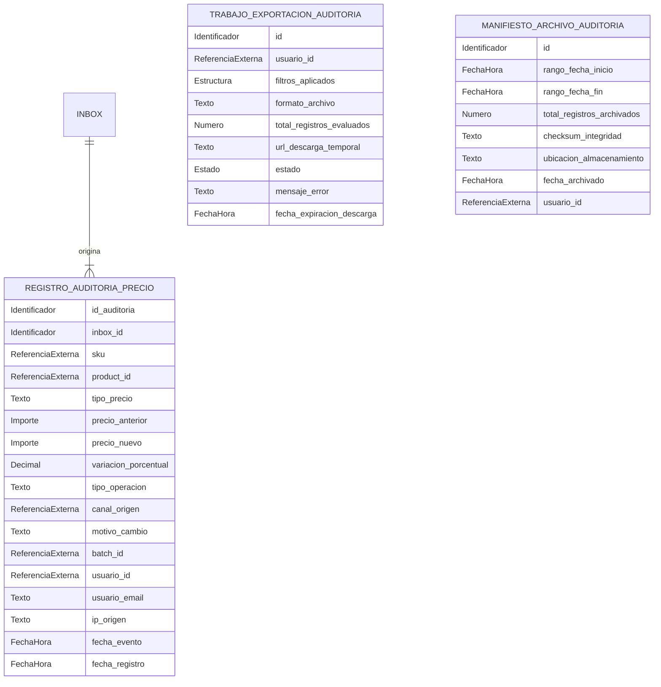

# Modelo lógico — `price_audit` (`price-audit-svc`)

> **Ubicación oficial del documento:**
> `bd/price_audit/logical-model.md` (ubicación asignada en el árbol de persistencia del servicio).

- **Issue:** #56 — Persistencia y modelo de datos de price-audit-svc
- **Responsable:** Leonardo Vera Rodríguez
- **Bounded context:** Auditoría de Precios
- **Microservicio:** `price-audit-svc`
- **Schema objetivo:** `price_audit`
- **Última actualización:** 2026-10-03
- **Estado:** EN REVISIÓN

---

## Flujo de derivación y precedencia

```text
fuentes funcionales y contractuales
        ↓
Modelo_Conceptual.md
        ↓
logical-model.md
        ↓
physical-model.md
        ↓
migrations/
        ↓
validation.sql
```

## Fuentes de verdad

Este modelo lógico deriva de las fuentes funcionales, arquitectónicas y contractuales vigentes:

- `Modelo_Conceptual.md` (§6 Auditoría de Precios, §14–18)
- `Arquitectura.md` (§7 Persistencia, §8 Migraciones, §20 Auditoría de Precios)
- `Contrato_Api.md` (Integración asíncrona y consumo de eventos)
- `api/openapi.yaml` (0.5.0: esquemas `RegistroAuditoriaPrecio`, `TrabajoExportacion`, `ExportJobCreateRequest`)
- `asyncapi/asyncapi.yaml` (0.4.0: suscripción al evento `pricing.price.changed`)
- `specs/SPEC-014-historial-auditoria-precios.md`
- `hu/HU-014-historial-auditoria-precios.md`
- `flujos/FLOW-014-historial-auditoria-precios.md`
- `wireframes/flows/WF-014-historial-auditoria-precios.md`
- `bd/CONVENCIONES_BD.md`

Precedencia ante discrepancias: `SPEC` → `Contrato OpenAPI/AsyncAPI` → `Modelo_Conceptual.md` → **este documento**.

---

# 1. Propósito

Describir la estructura lógica pura de información propiedad de **`price-audit-svc`** para la funcionalidad:
- **014 — Historial y auditoría de precios (registro inmutable append-only de modificaciones de precios, trabajos asíncronos de exportación y manifiestos de archivado histórico).**

Este documento define la estructura de auditoría inmutable, entidades de exportación, manifiestos y requerimientos de deduplicación de consumo asíncrono.

---

# 2. Responsabilidad del bounded context

## 2.1. Datos propios (Authority / Ownership)

`price-audit-svc` es autoridad única y fuente de verdad sobre:

1. **Bitácora Inmutable de Precios (`price_audit_log`):** Asientos históricos append-only que registran cada cambio de precio (regular u oferta), su variación porcentual, autor, motivo, IP y timestamp exacto.
2. **Trabajos de Exportación de Auditoría:** Gestión de peticiones asíncronas para generar reportes en formatos descargables (CSV, JSON) a partir de filtros de auditoría.
3. **Manifiestos de Archivado Histórico:** Registro de empaquetado, checksums y traslado seguro de datos antiguos hacia almacenamiento frío / de largo plazo.
4. **Deduplicación de Mensajes Consumidos (Inbox):** Registro de eventos `pricing.price.changed` procesados para garantizar que ningún cambio se registre por duplicado.

## 2.2. Datos que NO posee (Referencias externas / Non-goals)

`price-audit-svc` no es autoridad sobre:

- **Precios vigentes y reglas de pricing:** Propiedad de `pricing-svc`.
- **Catálogo de productos, variantes y SKUs:** Propiedad de `catalog-svc`.
- **Autenticación y usuarios:** Propiedad de Seguridad.
- **Almacenamiento físico de archivos exportados o archivados:** Propiedad del adaptador de almacenamiento / Object Storage.

---

# 3. Entidades lógicas

## 3.1. `REGISTRO_AUDITORIA_PRECIO`

**Propósito:** Representa un asiento inmutable en la bitácora de auditoría de precios derivado de un hecho de negocio confirmado.

**Identificador lógico:** Identificador propio (`id_auditoria`).

### Atributos

| Atributo | Naturaleza lógica | Obligatorio | Descripción |
|---|---|---:|---|
| `id_auditoria` | Identificador | Sí | Identificador único del asiento de auditoría |
| `inbox_id` | Identificador | Sí | Referencia al mensaje consumido que originó el registro |
| `sku` | Referencia externa | Sí | SKU afectado por el cambio de precio (Owner: `catalog-svc`) |
| `product_id` | Referencia externa | Sí | Producto padre asociado (Owner: `catalog-svc`) |
| `tipo_precio` | Texto | Sí | Tipo de precio evaluado (`REGULAR`, `OFERTA`) |
| `precio_anterior` | Importe monetario | No | Valor numérico previo (nulo en altas iniciales) |
| `precio_nuevo` | Importe monetario | No | Nuevo valor numérico (nulo en eliminaciones) |
| `variacion_porcentual` | Número decimal | No | Variación porcentual calculada entre anterior y nuevo |
| `tipo_operacion` | Texto | Sí | Naturaleza de la acción (`ALTA`, `MODIFICACION`, `ELIMINACION`, `PROGRAMACION`) |
| `canal_origen` | Referencia externa | Sí | Canal de venta en el que rige el cambio |
| `motivo_cambio` | Texto | Sí | Justificación informada del cambio de precio |
| `batch_id` | Referencia externa | No | Identificador del lote si provino de una carga masiva |
| `usuario_id` | Referencia externa | No | Identificador del usuario que ejecutó la acción |
| `usuario_email` | Texto | No | Correo electrónico de auditoría del operador |
| `ip_origen` | Texto | No | Dirección IP desde donde se emitió la operación |
| `fecha_evento` | Fecha-hora | Sí | Timestamp en que ocurrió el hecho en el origen |
| `fecha_registro` | Fecha-hora | Sí | Timestamp de persistencia local del asiento |

### Reglas e invariantes

- **Inmutabilidad absoluta (Append-Only):** Los registros de auditoría no pueden ser modificados ni borrados en caliente. No poseen atributos de actualización (`fecha_actualizacion`) ni de borrado lógico (`deleted_at`).
- Al menos uno entre `precio_anterior` y `precio_nuevo` debe estar informado.
- Si ambos precios están presentes, `variacion_porcentual = ((precio_nuevo - precio_anterior) / precio_anterior) * 100`.

---

## 3.2. `TRABAJO_EXPORTACION_AUDITORIA`

**Propósito:** Gestiona el ciclo de vida de un trabajo asíncrono para generar un archivo descargable de auditoría según filtros específicos.

**Identificador lógico:** Identificador propio (`id`).

### Atributos

| Atributo | Naturaleza lógica | Obligatorio | Descripción |
|---|---|---:|---|
| `id` | Identificador | Sí | Identificador único del trabajo |
| `usuario_id` | Referencia externa | Sí | Usuario que solicitó la exportación |
| `filtros_aplicados` | Estructura de datos | Sí | Parámetros de consulta (fechas, SKUs, canales, operaciones) |
| `formato_archivo` | Texto | Sí | Formato de salida (`CSV`, `JSON`) |
| `total_registros_evaluados` | Número entero | No | Cantidad de filas consolidadas en el reporte |
| `url_descarga_temporal` | Texto / URI | No | Enlace firmado temporal para descargar el archivo generado |
| `estado` | Estado | Sí | `QUEUED`, `PROCESSING`, `COMPLETED`, `FAILED_GENERAL` |
| `mensaje_error` | Texto | No | Detalle del error si falló la exportación |
| `fecha_expiracion_descarga` | Fecha-hora | No | Momento en que expira la validez del enlace de descarga |
| `fecha_creacion` | Fecha-hora | Sí | Momento de solicitud |
| `fecha_actualizacion` | Fecha-hora | Sí | Momento de última actualización de estado |

### Reglas e invariantes

- Al completarse el trabajo (`COMPLETED`), debe registrarse `total_registros_evaluados >= 0` y la URL temporal de descarga.

---

## 3.3. `MANIFIESTO_ARCHIVO_AUDITORIA`

**Propósito:** Registra el empaquetado y resguardo a largo plazo de bloques históricos de auditoría que son trasladados fuera de la base transaccional.

**Identificador lógico:** Identificador propio (`id`).

### Atributos

| Atributo | Naturaleza lógica | Obligatorio | Descripción |
|---|---|---:|---|
| `id` | Identificador | Sí | Identificador del manifiesto de archivado |
| `rango_fecha_inicio` | Fecha-hora | Sí | Límite temporal inferior de los registros archivados |
| `rango_fecha_fin` | Fecha-hora | Sí | Límite temporal superior de los registros archivados |
| `total_registros_archivados` | Número entero | Sí | Conteo verificado de asientos contenidos en el archivo |
| `checksum_integridad` | Texto | Sí | Hash criptográfico (SHA-256) que garantiza la inmutabilidad del archivo |
| `ubicacion_almacenamiento` | Texto / URI | Sí | Identificador de objeto en el almacenamiento frío |
| `fecha_archivado` | Fecha-hora | Sí | Momento en que se ejecutó el proceso de archivado |
| `usuario_id` | Referencia externa | No | Operador responsable del procedimiento |

### Reglas e invariantes

- `rango_fecha_fin > rango_fecha_inicio`.
- `total_registros_archivados > 0`.
- El checksum de integridad es inmutable una vez completado el archivado.

---

# 4. Catálogos de estados y valores controlados

## 4.1. Estado de Trabajo de Exportación (`export_job_status`)

Valores:
- `QUEUED`: Solicitud recibida y en cola para generación.
- `PROCESSING`: Generando el archivo a partir de los filtros.
- `COMPLETED`: Archivo generado exitosamente y disponible para descarga temporal.
- `FAILED_GENERAL`: Error en la generación del reporte.

---

# 5. Relaciones y cardinalidades

| Origen | Relación | Destino | Cardinalidad | Propiedad |
|---|---|---|---:|---|
| `REGISTRO_AUDITORIA_PRECIO` | referencia | `INBOX` | `N:1` | Interna |
| `REGISTRO_AUDITORIA_PRECIO` | referencia | `PRODUCTO / SKU` (Catálogo) | `N:1` | Externa (sin FK) |
| `TRABAJO_EXPORTACION_AUDITORIA` | generado por | `USUARIO` (Seguridad) | `N:1` | Externa (sin FK) |

---

# 6. Referencias interdominio

| Referencia | Owner | Uso local | ¿FK cross-context? |
|---|---|---|---:|
| `sku` | `catalog-svc` | Identificador de variante auditada | No |
| `product_id` | `catalog-svc` | Identificador de producto padre auditado | No |
| `canal_origen` | Comercial / Canales | Canal en el cual rigió el cambio | No |
| `batch_id` | `bulk-svc` / `pricing-svc` | Identificador de lote de origen | No |
| `usuario_id` | Seguridad | Identidad de usuario auditor/operador | No |

---

# 7. Reglas de integridad lógica

1. **Inmutabilidad de asientos:** Los registros de `REGISTRO_AUDITORIA_PRECIO` son estrictamente append-only. Ninguna operación de negocio puede alterar un asiento ya emitido.
2. **Procesamiento idempotente de eventos:** Cada mensaje recibido en Inbox por `(message_id, handler)` se procesa exactamente una vez. Si produce N asientos de auditoría (e.g. regular y oferta), todos se insertan en la misma transacción junto al Inbox.
3. **Coherencia temporal:** `fecha_evento <= fecha_registro`.

---

# 8. Normalización y duplicación controlada

## 8.1. Datos autoritativos

Son autoritativos dentro de `price-audit-svc`:
- El historial fidedigno e inmutable de variaciones de precios de todo el módulo.
- Metadatos de trabajos de exportación y manifiestos de archivado.

## 8.2. Datos duplicados o proyectados

Price Audit captura snapshots de datos en el momento del evento (`usuario_email`, `ip_origen`, `motivo_cambio`, `precios`) para preservar la evidencia forense exacta del hecho aun si los catálogos externos cambian en el futuro.

---

# 9. Persistencia técnica necesaria

| Necesidad | Requerida | Justificación conceptual |
|---|---:|---|
| **Outbox** | **No** | `price-audit-svc` es un consumidor puro de auditoría; no emite hechos de dominio hacia otros contextos (`CONVENCIONES_BD.md` §10.1). |
| **Inbox** | **Sí** | Deduplicación de eventos `pricing.price.changed` por `(message_id, handler)`. |
| **Idempotencia de consumo** | **Sí** | Garantía de no duplicación de asientos ante retransmisiones del broker de mensajería. |

---

# 10. Diagrama entidad-relación lógico



---

# 11. Trazabilidad

| Fuente | Decisión / Entidad / Regla derivada |
|---|---|
| `SPEC-014` | Entidades `REGISTRO_AUDITORIA_PRECIO`, `TRABAJO_EXPORTACION_AUDITORIA`, `MANIFIESTO_ARCHIVO_AUDITORIA`, reglas de append-only |
| `HU-014` | Criterios funcionales de consulta, auditoría y exportación |
| `FLOW-014` | Flujos de captura de eventos, consulta y exportación asíncrona |
| `Contrato OpenAPI 0.5.0` | Esquemas de `RegistroAuditoriaPrecio`, `TrabajoExportacion` |
| `AsyncAPI 0.4.0` | Suscripción a eventos `pricing.price.changed` |
| `Modelo_Conceptual.md §6` | Ownership de auditoría de precios y aislamiento |
| `bd/CONVENCIONES_BD.md` | Aislamiento interdominio, tablas append-only exentas de `updated_at`/`deleted_at`, no Outbox para este contexto |

---

# 12. Decisiones del modelo lógico

| ID | Decisión | Justificación | Impacto |
|---|---|---|---|
| `D-LOG-AUD-01` | Estructura estrictamente append-only sin `updated_at` ni `deleted_at` | La auditoría exige inmutabilidad forense; registrar modificaciones a posteriori destruiría la integridad de la prueba | `REGISTRO_AUDITORIA_PRECIO` no admite mutaciones |
| `D-LOG-AUD-02` | Sin tabla `outbox` | El servicio es un sink de auditoría y no publica eventos hacia otros microservicios | Simplificación de persistencia conforme a `CONVENCIONES_BD.md` §10.1 |
| `D-LOG-AUD-03` | Snapshot forense de usuario e IP en cada asiento | Los usuarios pueden cambiar de email o darse de baja en Seguridad; la auditoría debe conservar la foto inalterable del hecho | Atributos `usuario_email` e `ip_origen` en el asiento |

---

# 13. Decisiones pendientes

| ID | Pregunta / Aspecto abierto | Fuente afectada | Bloquea modelo físico |
|---|---|---|---:|
| `P-LOG-AUD-01` | Política de retención en caliente antes del archivado a frío (meses / años) | `SPEC-014` §4 | No (se gestiona operativamente mediante manifiestos) |

---

# 14. Derivación esperada hacia el modelo físico

El archivo `physical-model.md` materializará este modelo preservando las invariantes conceptuales:
- Representación inmutable append-only de los asientos de auditoría en el schema `price_audit`;
- Claves primarias únicas surrogate para los asientos y trabajos de exportación;
- Ausencia de operaciones de modificación o borrado lógico sobre los asientos históricos;
- Deduplicación técnica en Inbox para procesar cada cambio de precio exactamente una vez;
- Aislamiento absoluto sin claves foráneas hacia otros bounded contexts ni tablas de usuario;
- Ausencia justificada de Outbox al ser un consumidor puro de auditoría.

---

# 15. Checklist de aprobación

## Ownership
- [x] El bounded context conserva ownership exclusivamente sobre la bitácora de auditoría, exportaciones y manifiestos.
- [x] No se modelan precios ni catálogos como propios.
- [x] Las referencias externas están identificadas.

## Modelo lógico
- [x] Todas las entidades necesarias están representadas.
- [x] Los identificadores lógicos están definidos.
- [x] Las relaciones y cardinalidades son coherentes.
- [x] Las invariantes funcionales están documentadas.
- [x] Los estados coinciden con contratos y especificaciones vigentes.

## Aislamiento
- [x] No se proponen FK entre bounded contexts.
- [x] Las proyecciones locales se identifican como reconstruibles.
- [x] No se confunde una referencia externa con ownership.

## Nivel de abstracción
- [x] No contiene SQL.
- [x] No contiene tipos PostgreSQL.
- [x] No contiene índices físicos.
- [x] No contiene triggers ni funciones de BD.
- [x] No contiene decisiones de infraestructura física.

## Trazabilidad
- [x] Las decisiones principales son trazables a SPEC/HU/WF/FLOW/contratos.
- [x] No quedan contradicciones funcionales ocultas.
- [x] Las decisiones locales están registradas.

**Resultado:** `EN REVISIÓN`
