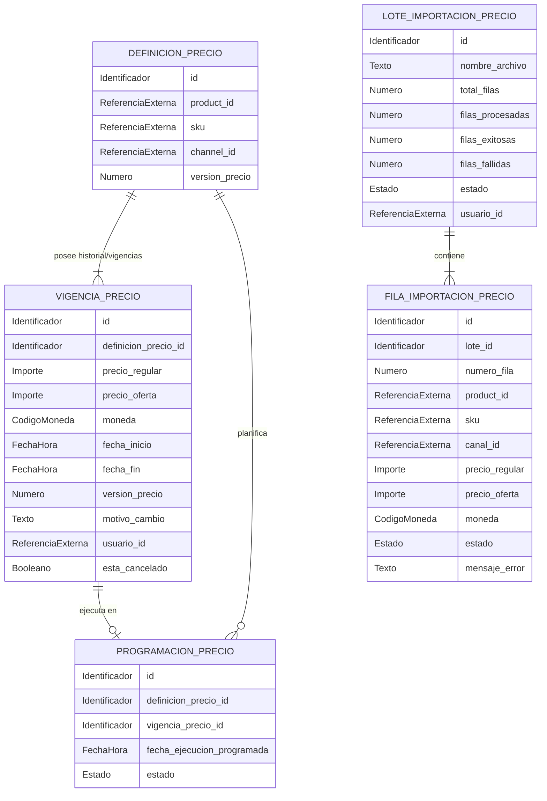

# Modelo lógico — `pricing` (`pricing-svc`)

> **Ubicación oficial del documento:**
> `bd/pricing/logical-model.md` (ubicación asignada en el árbol de persistencia del servicio).

- **Issue:** #55 — Persistencia y modelo de datos de pricing-svc
- **Responsable:** Leonardo Vera Rodríguez
- **Bounded context:** Precios
- **Microservicio:** `pricing-svc`
- **Schema objetivo:** `pricing`
- **Última actualización:** 2026-10-03
- **Estado:** EN REVISIÓN

---

## Flujo de derivación y precedencia

```text
fuentes funcionales y contractuales
        ↓
Modelo_Conceptual.md
        ↓
logical-model.md
        ↓
physical-model.md
        ↓
migrations/
        ↓
validation.sql
```

## Fuentes de verdad

Este modelo lógico deriva de las fuentes funcionales, arquitectónicas y contractuales vigentes:

- `Modelo_Conceptual.md` (§5 Precios y Ofertas, §14–18)
- `Arquitectura.md` (§7 Persistencia, §8 Migraciones, §16 Precios, §39 Transaccionalidad)
- `Contrato_Api.md` (Ownership e interfaces de integración de precios)
- `api/openapi.yaml` (0.5.0: esquemas `Precio`, `PrecioUpdateRequest`, `ProgramacionPrecio`, `EstadoImportacionPrecio`, `FilaImportacionPrecio`)
- `asyncapi/asyncapi.yaml` (0.4.0: eventos `pricing.price.changed`, `pricing.schedule.*`)
- `specs/SPEC-013-gestion-precios-individuales-masivos.md`
- `hu/HU-013-gestion-precios-individuales-masivos.md`
- `flujos/FLOW-013-gestion-precios-individuales-masivos.md`
- `wireframes/flows/WF-013-gestion-precios-individuales-masivos.md`
- `bd/CONVENCIONES_BD.md`

Precedencia ante discrepancias: `SPEC` → `Contrato OpenAPI/AsyncAPI` → `Modelo_Conceptual.md` → **este documento**.

---

# 1. Propósito

Describir la estructura lógica de información propiedad exclusiva de **`pricing-svc`** para la funcionalidad:
- **013 — Gestión de precios individuales y masivos (precios regulares, precios de oferta, vigencias, overrides por canal/SKU, programaciones futuras y lotes locales de importación).**

Este documento define las entidades lógicas de pricing, atributos, invariantes monetarias y temporales, referencias externas y necesidades conceptuales de persistencia técnica.

---

# 2. Responsabilidad del bounded context

## 2.1. Datos propios (Authority / Ownership)

`pricing-svc` es autoridad única y fuente de verdad sobre:

1. **Definiciones de Precio:** Regla de anclaje de precio a nivel de producto base o variante específica (SKU), y a nivel global o por canal de venta.
2. **Vigencias e Intervalos de Precio:** Historial y vigencias activas/futuras de precios regulares y de oferta, moneda, justificación de cambio y versión.
3. **Programaciones de Precios:** Registro de cambios de precio planificados a futuro con fecha/hora de entrada en vigor y ciclo de vida de ejecución.
4. **Lotes de Importación de Precios:** Admisión y procesamiento local de archivos de carga masiva de precios, con seguimiento fila por fila.
5. **Eventos de Dominio de Precios:** Publicación transaccional (`outbox`) de cambios de precio efectivos para consumo por Catálogo, Auditoría, Promociones y Read Model.

## 2.2. Datos que NO posee (Referencias externas / Non-goals)

`pricing-svc` no es autoridad sobre:

- **Productos, Variantes y SKUs:** Propiedad de `catalog-svc`.
- **Bitácora histórica append-only de auditoría:** Propiedad de `price-audit-svc`.
- **Descuentos comerciales, cupones y promociones automáticas:** Propiedad de `promotions-svc`.
- **Saldos y disponibilidad de stock:** Propiedad de `inventory-svc`.
- **Coordinación global de cargas masivas multidominio:** Propiedad de `bulk-svc`.
- **Impuestos y tributación (IGV, tasas fiscales):** No modelados en esta fase.

---

# 3. Entidades lógicas

## 3.1. `DEFINICION_PRECIO`

**Propósito:** Representa el anclaje unívoco de un precio hacia un producto base o un SKU particular, aplicable a nivel global o a un canal específico.

**Identificador lógico:** Identificador propio (`id`).

### Atributos

| Atributo | Naturaleza lógica | Obligatorio | Descripción |
|---|---|---:|---|
| `id` | Identificador | Sí | Identificador único de la definición de precio |
| `producto_id` | Referencia externa | No | Identificador del producto base (Owner: `catalog-svc`) |
| `sku` | Referencia externa | No | SKU vendible de variante (Owner: `catalog-svc`) |
| `canal_id` | Referencia externa | No | Identificador de canal (nulo representa precio global/todos los canales) |
| `version_precio` | Número entero | Sí | Versión secuencial de precio para concurrencia optimista |
| `fecha_creacion` | Fecha-hora | Sí | Momento de registro |
| `fecha_actualizacion` | Fecha-hora | Sí | Momento de última modificación |

### Reglas e invariantes

- **Exclusividad de objetivo:** Debe definirse exactamente para `producto_id` O para `sku`, nunca para ambos simultáneamente ni para ninguno (`(producto_id IS NOT NULL) != (sku IS NOT NULL)`).
- **Unicidad de definición:** Existe a lo sumo una definición de precio por cada combinación de `(producto_id, sku, canal_id)` considerando nulos.
- `version_precio` inicia en 1 y se incrementa de forma monótona con cada nuevo intervalo de precio activo.

---

## 3.2. `VIGENCIA_PRECIO`

**Propósito:** Representa el estado monetario y el intervalo temporal de validez de un precio regular y opcionalmente de oferta.

**Identificador lógico:** Identificador propio (`id`).

### Atributos

| Atributo | Naturaleza lógica | Obligatorio | Descripción |
|---|---|---:|---|
| `id` | Identificador | Sí | Identificador del intervalo de vigencia |
| `definicion_precio_id` | Identificador | Sí | Definición de precio asociada |
| `precio_regular` | Importe monetario | Sí | Precio regular o de lista |
| `precio_oferta` | Importe monetario | No | Precio de oferta promocional directo |
| `moneda` | Código de moneda | Sí | Código de moneda (ej. `PEN`, `USD` conforme al estándar ISO 4217) |
| `fecha_inicio` | Fecha-hora | Sí | Inicio del intervalo de validez |
| `fecha_fin` | Fecha-hora | No | Fin del intervalo de validez (nulo representa vigencia abierta) |
| `version_precio` | Número entero | Sí | Versión de precio asignada al intervalo |
| `motivo_cambio` | Texto | Sí | Justificación comercial del valor o cambio |
| `usuario_id` | Referencia externa | No | Identificador del usuario que configuró el precio |
| `esta_cancelado` | Booleano | Sí | Indicador de invalidación/cancelación de la vigencia |
| `fecha_creacion` | Fecha-hora | Sí | Momento de registro |
| `fecha_actualizacion` | Fecha-hora | Sí | Momento de última modificación |

### Reglas e invariantes

- `precio_regular > 0`.
- Si `precio_oferta` está presente, debe cumplir `precio_oferta > 0` y `precio_oferta < precio_regular`.
- Si `fecha_fin` está presente, debe cumplir `fecha_fin > fecha_inicio`.
- No pueden existir dos vigencias activas (`esta_cancelado = false`) con intervalos superpuestos para una misma `definicion_precio_id`.

---

## 3.3. `PROGRAMACION_PRECIO`

**Propósito:** Permite planificar con antelación la entrada en vigencia futura de un cambio de precio.

**Identificador lógico:** Identificador propio (`id`).

### Atributos

| Atributo | Naturaleza lógica | Obligatorio | Descripción |
|---|---|---:|---|
| `id` | Identificador | Sí | Identificador de la programación |
| `definicion_precio_id` | Identificador | Sí | Definición de precio a modificar |
| `vigencia_precio_id` | Identificador | Sí | Vigencia futura preparada para su activación |
| `fecha_ejecucion_programada` | Fecha-hora | Sí | Momento planificado para la activación |
| `estado` | Estado | Sí | `SCHEDULED`, `ACTIVE`, `HISTORICAL`, `CANCELLED` |
| `fecha_creacion` | Fecha-hora | Sí | Momento de registro |
| `fecha_actualizacion` | Fecha-hora | Sí | Momento de última modificación |

### Reglas e invariantes

- La fecha de ejecución programada debe ser futura respecto al momento de creación.
- La cancelación de una programación inhabilita la activación de la vigencia futura asociada.

---

## 3.4. `LOTE_IMPORTACION_PRECIO`

**Propósito:** Gestiona la ejecución local de cargas masivas de actualización de precios.

**Identificador lógico:** Identificador propio (`id`).

### Atributos

| Atributo | Naturaleza lógica | Obligatorio | Descripción |
|---|---|---:|---|
| `id` | Identificador | Sí | Identificador del lote |
| `nombre_archivo` | Texto | Sí | Nombre del archivo procesado |
| `total_filas` | Número entero | Sí | Cantidad total de filas del lote |
| `filas_procesadas` | Número entero | Sí | Cantidad de filas evaluadas |
| `filas_exitosas` | Número entero | Sí | Cantidad de filas aplicadas exitosamente |
| `filas_fallidas` | Número entero | Sí | Cantidad de filas con error |
| `estado` | Estado | Sí | `QUEUED`, `PROCESSING`, `COMPLETED`, `PARTIAL`, `FAILED` |
| `usuario_id` | Referencia externa | No | Usuario responsable de la importación |
| `fecha_creacion` | Fecha-hora | Sí | Momento de carga |
| `fecha_actualizacion` | Fecha-hora | Sí | Momento de última modificación |

### Reglas e invariantes

- `total_filas >= 0`, `filas_procesadas >= 0`, `filas_exitosas >= 0`, `filas_fallidas >= 0`.
- `filas_procesadas = filas_exitosas + filas_fallidas`.

---

## 3.5. `FILA_IMPORTACION_PRECIO`

**Propósito:** Detalle del procesamiento individual de cada registro dentro de un lote masivo.

**Identificador lógico:** Identificador propio (`id`).

### Atributos

| Atributo | Naturaleza lógica | Obligatorio | Descripción |
|---|---|---:|---|
| `id` | Identificador | Sí | Identificador de la fila |
| `lote_id` | Identificador | Sí | Lote al que pertenece |
| `numero_fila` | Número entero | Sí | Posición ordinal en el archivo de entrada |
| `product_id` | Referencia externa | No | Identificador de producto de la fila |
| `sku` | Referencia externa | No | SKU de la fila |
| `canal_id` | Referencia externa | No | Canal especificado |
| `precio_regular` | Importe monetario | No | Precio regular indicado |
| `precio_oferta` | Importe monetario | No | Precio de oferta indicado |
| `moneda` | Código de moneda | No | Moneda indicada |
| `estado` | Estado | Sí | `PENDING`, `PROCESSING`, `COMPLETED`, `FAILED` |
| `mensaje_error` | Texto | No | Detalle del fallo en caso de validación o aplicación fallida |
| `fecha_creacion` | Fecha-hora | Sí | Momento de inserción |
| `fecha_actualizacion` | Fecha-hora | Sí | Momento de última modificación |

---

# 4. Catálogos de estados y valores controlados

## 4.1. Estado de Programación de Precio (`scheduled_price_status`)

Valores:
- `SCHEDULED`: Programación pendiente de entrada en vigor.
- `ACTIVE`: Programación ejecutada y precio actualmente vigente.
- `HISTORICAL`: Programación superada por una vigencia más reciente.
- `CANCELLED`: Programación cancelada antes de su ejecución.

## 4.2. Estado de Lote de Precios (`bulk_price_job_status`)

Valores:
- `QUEUED`: Lote en cola para procesamiento.
- `PROCESSING`: Lote en proceso de validación y aplicación de filas.
- `COMPLETED`: Todas las filas aplicadas exitosamente.
- `PARTIAL`: Lote procesado con algunas filas exitosas y otras fallidas.
- `FAILED`: Lote cancelado o con error general que impidió el procesamiento.

## 4.3. Estado de Fila de Lote (`bulk_price_row_status`)

Valores:
- `PENDING`: Fila en espera.
- `PROCESSING`: Fila en validación/aplicación.
- `COMPLETED`: Fila aplicada correctamente.
- `FAILED`: Fila rechazada por validación o conflicto.

---

# 5. Relaciones y cardinalidades

| Origen | Relación | Destino | Cardinalidad | Propiedad |
|---|---|---|---:|---|
| `DEFINICION_PRECIO` | posee | `VIGENCIA_PRECIO` | `1:1..N` | Interna |
| `DEFINICION_PRECIO` | programa | `PROGRAMACION_PRECIO` | `1:0..N` | Interna |
| `VIGENCIA_PRECIO` | respalda | `PROGRAMACION_PRECIO` | `1:0..1` | Interna |
| `LOTE_IMPORTACION_PRECIO` | contiene | `FILA_IMPORTACION_PRECIO` | `1:1..N` | Interna |
| `DEFINICION_PRECIO` | referencia | `PRODUCTO` (Catálogo) | `N:1` | Externa (sin FK) |
| `DEFINICION_PRECIO` | referencia | `VARIANTE / SKU` (Catálogo) | `N:1` | Externa (sin FK) |

---

# 6. Referencias interdominio

| Referencia | Owner | Uso local | ¿FK cross-context? |
|---|---|---|---:|
| `product_id` | `catalog-svc` | Identificador de producto base para precio regular | No |
| `sku` | `catalog-svc` | Identificador de variante vendible para override de precio | No |
| `channel_id` | Comercial / Canales | Diferenciación de precios por canal de venta | No |
| `usuario_id` | Seguridad | Identidad de usuario responsable del cambio de precio | No |

---

# 7. Reglas de integridad lógica

1. **Objetivo exclusivo:** Toda definición de precio debe especificar `product_id` o `sku`, pero nunca ambos simultáneamente ni ninguno.
2. **Positividad de importes:** Los precios regulares y de oferta deben ser estrictamente positivos (> 0).
3. **Jerarquía regular/oferta:** `precio_oferta < precio_regular`.
4. **Consistencia cronológica:** `fecha_fin > fecha_inicio`.
5. **Cierre de vigencias previas:** Al activarse un nuevo precio para una definición, la vigencia anterior abierta se cierra estableciendo `fecha_fin` igual al `fecha_inicio` de la nueva vigencia.
6. **Concurrencia optimista:** Todo cambio de precio exige coincidencia en `version_precio` para evitar condiciones de carrera.

---

# 8. Normalización y duplicación controlada

## 8.1. Datos autoritativos

Son autoritativos dentro de `pricing-svc`:
- Precios regulares y de oferta vigentes, futuros e históricos.
- Monedas asignadas a los precios.
- Intervalos de vigencia y programaciones de precio.
- Lotes locales de importación de precios.

## 8.2. Datos duplicados o proyectados

Pricing no mantiene proyecciones pesadas de otros dominios; se basa en referencias escalares (`product_id`, `sku`, `channel_id`).

---

# 9. Persistencia técnica necesaria

| Necesidad | Requerida | Justificación conceptual |
|---|---:|---|
| **Outbox** | Sí | Publicación transaccional garantizada de eventos `pricing.price.changed` y `pricing.schedule.*`. |
| **Inbox** | Sí | Deduplicación de solicitudes asíncronas de inicialización de precios provenientes de Catálogo o Bulk. |
| **Idempotencia de operaciones** | Sí | Prevención de duplicidad en comandos de cambio de precio y ejecución de programaciones. |

---

# 10. Diagrama entidad-relación lógico



---

# 11. Trazabilidad

| Fuente | Decisión / Entidad / Regla derivada |
|---|---|
| `SPEC-013` | Entidades `DEFINICION_PRECIO`, `VIGENCIA_PRECIO`, reglas de validación monetaria y temporal |
| `HU-013` | Criterios de aceptación funcionales de pricing individual y masivo |
| `FLOW-013` | Flujos de actualización, programaciones y lotes masivos |
| `Contrato OpenAPI 0.5.0` | Esquemas de `Precio`, `ProgramacionPrecio`, `EstadoImportacionPrecio` |
| `AsyncAPI 0.4.0` | Eventos `pricing.price.changed`, `pricing.schedule.*` |
| `Modelo_Conceptual.md §5` | Ownership de precios y reglas de precedencia de canal/SKU |
| `bd/CONVENCIONES_BD.md` | Aislamiento interdominio, tipos monetarios y de tiempo |

---

# 12. Decisiones del modelo lógico

| ID | Decisión | Justificación | Impacto |
|---|---|---|---|
| `D-LOG-PRC-01` | Separación entre `DEFINICION_PRECIO` y `VIGENCIA_PRECIO` | Permite mantener una identidad estable por objetivo/canal mientras se registra el histórico completo de cambios y vigencias futuras | Desacopla la identidad del precio de sus valores temporales |
| `D-LOG-PRC-02` | `channel_id` nullable como precio global | Evita crear registros redundantes por canal cuando rige un precio base común | Simplifica la resolución de precios en cascada |
| `D-LOG-PRC-03` | Lote de importación local en Pricing | Permite procesar cargas masivas específicas de precios de forma autónoma sin acoplamiento a flujos globales | Entidades `LOTE_IMPORTACION_PRECIO` y `FILA_IMPORTACION_PRECIO` |

---

# 13. Decisiones pendientes

| ID | Pregunta / Aspecto abierto | Fuente afectada | Bloquea modelo físico |
|---|---|---|---:|
| `P-LOG-PRC-01` | Definición de desglose tributario (IGV, impuestos) | `CONVENCIONES_BD.md` §8.2 | No (postergado hasta homologación con Ventas) |

---

# 14. Derivación esperada hacia el modelo físico

El archivo `physical-model.md` materializará este modelo preservando las invariantes conceptuales:
- Separación entre definición de precio (anclada a producto o SKU, por canal o global) e intervalos temporales de vigencia;
- Exclusividad de objetivo (`producto_id` o `sku`);
- Positividad estricta de importes y jerarquía `precio_oferta < precio_regular`;
- Consistencia cronológica (`fecha_fin > fecha_inicio`) y no superposición de vigencias activas;
- Control de concurrencia optimista y gestión de lotes locales;
- Publicación transaccional de cambios de precio en Outbox y deduplicación en Inbox.

---

# 15. Checklist de aprobación

## Ownership
- [x] El bounded context conserva ownership exclusivamente sobre definiciones de precio, vigencias, programaciones y lotes locales.
- [x] No se modelan productos ni SKUs como entidades propias de persistencia.
- [x] Las referencias externas están identificadas.

## Modelo lógico
- [x] Todas las entidades necesarias están representadas.
- [x] Los identificadores lógicos están definidos.
- [x] Las relaciones y cardinalidades son coherentes.
- [x] Las invariantes funcionales están documentadas.
- [x] Los estados coinciden con contratos y especificaciones vigentes.

## Aislamiento
- [x] No se proponen FK entre bounded contexts.
- [x] Las proyecciones locales se identifican como reconstruibles.
- [x] No se confunde una referencia externa con ownership.

## Nivel de abstracción
- [x] No contiene SQL.
- [x] No contiene tipos PostgreSQL.
- [x] No contiene índices físicos.
- [x] No contiene triggers ni funciones de BD.
- [x] No contiene decisiones de infraestructura física.

## Trazabilidad
- [x] Las decisiones principales son trazables a SPEC/HU/WF/FLOW/contratos.
- [x] No quedan contradicciones funcionales ocultas.
- [x] Las decisiones locales están registradas.

**Resultado:** `EN REVISIÓN`
