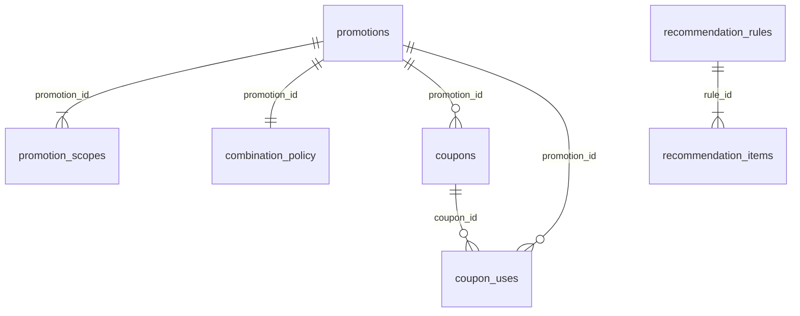

# Modelo físico — `promotions` (`promotions-svc`)

Issue [#53](https://github.com/Taller-SW-Web/Productos-y-Ofertas-docs/issues/53). Responsable: Axel Cueva. Owner exclusivo: Promociones. Actualizado: 2026-10-03. Estado: **EN REVISIÓN**. Origen: [modelo lógico](logical-model.md). Implementación: [0001](migrations/0001_promotions_persistence.sql) y [0002](migrations/0002_promotions_global_price_projection.sql). Validación: [validation.sql](validation.sql). Motor: PostgreSQL/Supabase; evidencia local PostgreSQL 17.11.

## 1. Propósito

Materializar las doce entidades de Arquitectura §7.2. El diccionario de §4, los constraints y los índices se cotejaron con el catálogo del servidor después de aplicar la migración desde cero. La tabla adicional `schema_migrations` pertenece al ejecutor común.

## 2. Principios de diseño físico

### 2.1. Aislamiento

Todo objeto reside en `promotions`, propiedad de `po_promotions_owner` NOLOGIN. Runtime separado `po_promotions_runtime` NOLOGIN, sin membresías privilegiadas. Un administrador crea los roles; un deployer independiente usa SET ROLE del owner; el servicio usa otro login con membresía únicamente del runtime. No hay FK, permisos ni lecturas hacia schemas de otros owners.

Schema privado, fuera de Exposed schemas/Data API. PUBLIC sin USAGE ni EXECUTE; sin grants a anon/authenticated. No se aplica una política basada en auth.uid(): customer_ref es una referencia externa utilizada por un servicio autorizado. Una futura exposición requiere una migración de RLS y grants revisada, antes de exponer datos. [Roles de Supabase](https://supabase.com/docs/guides/database/postgres/roles).

### 2.2. Convenciones y precedencia

| Tema | Aplicación / excepción justificada |
|---|---|
| Tablas | Nombres exactos de Arquitectura §7.2, aunque una convención general sugiera singular. |
| Objetos | snake_case; constraints pk_/uq_/fk_/ck_ e índices ix_; nombres explícitos excepto el ledger generado por el mecanismo común. |
| IDs propios | UUID nativo gen_random_uuid(), sin extensión ni FK externa. |
| customer_ref | UUID por SPEC-005/OpenAPI/AsyncAPI; prevalece sobre la sugerencia general de text en las nuevas convenciones. |
| Pedido/mensaje/correlación | text no vacío: AsyncAPI dice string sin formato UUID; no imponer uno. operation_id sí es UUID según MessageEnvelope. |
| Cantidades comerciales | numeric exacto, sin typmod que redondee. OpenAPI no fija escala: 100.001 debe rechazarse como porcentaje, no convertirse silenciosamente en 100; mínimo 0.001 es positivo. NaN/Infinity rechazados. Se desvía de numeric(12,2) genérico por precisión contractual. No se inventa currency para estos campos. |
| Fechas | timestamptz finito; vigencia [inicio, fin); reloj técnico del servidor para creación/modificación/primera activación. |
| Migraciones | Numeración 0001 y transacción del ejecutor database/migrate.py; no copiar BEGIN/COMMIT ni numeración 001 de la plantilla transversal. CLI Supabase 2.119.0 generó el archivo original; se adoptó la historia común y no se guarda una historia paralela. |
| Canal global de precio | channel_id nullable; UNIQUE NULLS NOT DISTINCT(SKU, canal) representa un global por SKU y un override por canal, conforme al contrato de Pricing. |
| Catálogos propios | CHECK en lugar de enums nativos sugeridos por convenciones: mismos valores publicados, migración autocontenida y sin tipos extra; excepción a revisar con el owner de BD. |
| Data API | Se aplica el procedimiento database/README.md de schemas privados; la sugerencia general de exponer nueve schemas en convenciones contradice ese procedimiento. Resolver en revisión transversal antes de cualquier exposición; esta entrega conserva el acceso por backend y no concede acceso anónimo. |
| Roles | Bootstrap existente po_<schema>_owner y runtime con permisos concretos; no GRANT ALL a un rol compartido. |
| Estado de recomendación | ACTIVO/INACTIVO del contrato HTTP; SPEC-007 actualizado para quitar la discrepancia ACTIVA/INACTIVA. |

## 3. Enumeraciones y tipos propios

Los conjuntos se implementan mediante text + CHECK, sin enums PostgreSQL adicionales. Valores y fuentes están en [modelo lógico §4](logical-model.md#4-catálogos-de-estados-y-valores-controlados). El canal del comando de consumo admite MARKETPLACE/CHATBOT/RETAIL; la configuración administrativa conserva también VENTAS. Los criterios UPSELL, tipo de origen, disponibilidad y política de cancelación usan los catálogos contractuales. No se agregan estados de pedido/pago.

## 4. Tablas

Tipos, nulabilidad, defaults y constraints siguientes son los del catálogo validado. `id` identifica entidades propias; columnas *_id de entidades internas tienen únicamente las FK indicadas. Los atributos externos y snapshots se describen en el modelo lógico §3 y §6.

### 4.1. `promotions`

Promoción, modelo lógico §3.1. El trigger conserva primera activación y protege cambios de modalidad.

| Columna | Tipo | Nulo | Default |
|---|---|---|---|
| `id` | `uuid` | No | `gen_random_uuid()` |
| `name` | `text` | No | — |
| `discount_type` | `text` | No | — |
| `discount_value` | `numeric` | No | — |
| `modality` | `text` | No | — |
| `state` | `text` | No | — |
| `valid_from` | `timestamp with time zone` | No | — |
| `valid_until` | `timestamp with time zone` | No | — |
| `priority` | `integer` | No | — |
| `enabled_channels` | `text[]` | No | — |
| `first_activated_at` | `timestamp with time zone` | Sí | — |
| `created_at` | `timestamp with time zone` | No | `now()` |
| `updated_at` | `timestamp with time zone` | No | `now()` |

Restricciones (incluye PK/UNIQUE/FK/CHECK):

- `ck_promotions_activation`: `CHECK (((state <> 'ACTIVO'::text) OR (first_activated_at IS NOT NULL)))`.
- `ck_promotions_channels`: `CHECK (promotions.fn_valid_channels(enabled_channels))`.
- `ck_promotions_discount`: `CHECK (((discount_value > (0)::numeric) AND (discount_value <> ALL (ARRAY['NaN'::numeric, 'Infinity'::numeric, '-Infinity'::numeric])) AND ((discount_type <> 'PORCENTAJE'::text) OR (discount_value <= (100)::numeric))))`.
- `ck_promotions_discount_type`: `CHECK ((discount_type = ANY (ARRAY['PORCENTAJE'::text, 'MONTO_FIJO'::text])))`.
- `ck_promotions_modality`: `CHECK ((modality = ANY (ARRAY['AUTOMATICA'::text, 'CUPON'::text])))`.
- `ck_promotions_name`: `CHECK ((length(btrim(name)) > 0))`.
- `ck_promotions_period`: `CHECK ((isfinite(valid_from) AND isfinite(valid_until) AND (valid_from < valid_until)))`.
- `ck_promotions_priority`: `CHECK ((priority > 0))`.
- `ck_promotions_state`: `CHECK ((state = ANY (ARRAY['ACTIVO'::text, 'INACTIVO'::text])))`.
- `ct_promotions_complete`: `TRIGGER DEFERRABLE INITIALLY DEFERRED`.
- `pk_promotions`: `PRIMARY KEY (id)`.

### 4.2. `promotion_scopes`

Alcance, §3.2. Producto y SKU son referencias externas XOR, no FK a Catálogo.

| Columna | Tipo | Nulo | Default |
|---|---|---|---|
| `id` | `uuid` | No | `gen_random_uuid()` |
| `promotion_id` | `uuid` | No | — |
| `product_id` | `text` | Sí | — |
| `sku` | `text` | Sí | — |
| `created_at` | `timestamp with time zone` | No | `now()` |

Restricciones (incluye PK/UNIQUE/FK/CHECK):

- `ck_promotion_scopes_reference`: `CHECK ((((product_id IS NOT NULL) AND (length(btrim(product_id)) > 0) AND (sku IS NULL)) OR ((sku IS NOT NULL) AND (length(btrim(sku)) > 0) AND (product_id IS NULL))))`.
- `ct_promotion_scopes_complete`: `TRIGGER DEFERRABLE INITIALLY DEFERRED`.
- `fk_promotion_scopes_promotion`: `FOREIGN KEY (promotion_id) REFERENCES promotions.promotions(id)`.
- `pk_promotion_scopes`: `PRIMARY KEY (id)`.

### 4.3. `combination_policy`

Política de combinación, §3.3. PK y FK promotion_id representan exactamente una política por promoción.

| Columna | Tipo | Nulo | Default |
|---|---|---|---|
| `promotion_id` | `uuid` | No | — |
| `pricing_offer` | `boolean` | No | — |
| `automatic_promotion` | `boolean` | No | — |
| `coupon` | `boolean` | No | — |
| `updated_at` | `timestamp with time zone` | No | `now()` |

Restricciones (incluye PK/UNIQUE/FK/CHECK):

- `ct_combination_policy_complete`: `TRIGGER DEFERRABLE INITIALLY DEFERRED`.
- `fk_combination_policy_promotion`: `FOREIGN KEY (promotion_id) REFERENCES promotions.promotions(id)`.
- `pk_combination_policy`: `PRIMARY KEY (promotion_id)`.

### 4.4. `coupons`

Cupón, §3.4. El código se normaliza antes de verificar unicidad. Null en monto/límite significa ausencia de esa restricción.

| Columna | Tipo | Nulo | Default |
|---|---|---|---|
| `id` | `uuid` | No | `gen_random_uuid()` |
| `promotion_id` | `uuid` | No | — |
| `code` | `text` | No | — |
| `state` | `text` | No | — |
| `minimum_amount` | `numeric` | Sí | — |
| `max_global_uses` | `integer` | Sí | — |
| `max_customer_uses` | `integer` | Sí | — |
| `cancellation_policy` | `text` | No | — |
| `created_at` | `timestamp with time zone` | No | `now()` |
| `updated_at` | `timestamp with time zone` | No | `now()` |

Restricciones (incluye PK/UNIQUE/FK/CHECK):

- `ck_coupons_code`: `CHECK (((code = promotions.fn_normalize_code(code)) AND ((code COLLATE "C") ~ '^[A-Z0-9_-]+$'::text)))`.
- `ck_coupons_customer`: `CHECK ((max_customer_uses > 0))`.
- `ck_coupons_global`: `CHECK ((max_global_uses > 0))`.
- `ck_coupons_minimum`: `CHECK (((minimum_amount > (0)::numeric) AND (minimum_amount <> ALL (ARRAY['NaN'::numeric, 'Infinity'::numeric, '-Infinity'::numeric]))))`.
- `ck_coupons_policy`: `CHECK ((cancellation_policy = ANY (ARRAY['RESTAURAR_EN_CANCELACION'::text, 'NO_RESTAURAR'::text])))`.
- `ck_coupons_state`: `CHECK ((state = ANY (ARRAY['ACTIVO'::text, 'INACTIVO'::text])))`.
- `fk_coupons_promotion`: `FOREIGN KEY (promotion_id) REFERENCES promotions.promotions(id)`.
- `pk_coupons`: `PRIMARY KEY (id)`.
- `uq_coupons_code`: `UNIQUE (code)`.

### 4.5. `coupon_uses`

Uso, §3.5. Captura promoción y política al consumir. Datos de identidad inmutables; únicamente se admite la primera restitución válida.

| Columna | Tipo | Nulo | Default |
|---|---|---|---|
| `id` | `uuid` | No | `gen_random_uuid()` |
| `coupon_id` | `uuid` | No | — |
| `promotion_id` | `uuid` | No | — |
| `order_id` | `text` | No | — |
| `customer_ref` | `uuid` | Sí | — |
| `channel_id` | `text` | No | — |
| `consumed_at` | `timestamp with time zone` | No | — |
| `cancellation_policy` | `text` | No | — |
| `restored_at` | `timestamp with time zone` | Sí | — |

Restricciones (incluye PK/UNIQUE/FK/CHECK):

- `ck_coupon_uses_channel`: `CHECK ((channel_id = ANY (ARRAY['MARKETPLACE'::text, 'CHATBOT'::text, 'RETAIL'::text])))`.
- `ck_coupon_uses_consumed`: `CHECK (isfinite(consumed_at))`.
- `ck_coupon_uses_order`: `CHECK ((length(btrim(order_id)) > 0))`.
- `ck_coupon_uses_policy`: `CHECK ((cancellation_policy = ANY (ARRAY['RESTAURAR_EN_CANCELACION'::text, 'NO_RESTAURAR'::text])))`.
- `ck_coupon_uses_restored`: `CHECK (((restored_at IS NULL) OR (isfinite(restored_at) AND (restored_at >= consumed_at) AND (cancellation_policy = 'RESTAURAR_EN_CANCELACION'::text))))`.
- `fk_coupon_uses_coupon`: `FOREIGN KEY (coupon_id) REFERENCES promotions.coupons(id)`.
- `fk_coupon_uses_promotion`: `FOREIGN KEY (promotion_id) REFERENCES promotions.promotions(id)`.
- `pk_coupon_uses`: `PRIMARY KEY (id)`.
- `uq_coupon_uses_order_coupon`: `UNIQUE (order_id, coupon_id)`.

### 4.6. `recommendation_rules`

Regla, §3.6. Un único par origin_type/origin_id identifica el origen; no hay FK externa.

| Columna | Tipo | Nulo | Default |
|---|---|---|---|
| `id` | `uuid` | No | `gen_random_uuid()` |
| `name` | `text` | No | — |
| `recommendation_type` | `text` | No | — |
| `origin_type` | `text` | No | — |
| `origin_id` | `text` | No | — |
| `priority` | `integer` | No | — |
| `state` | `text` | No | — |
| `valid_from` | `timestamp with time zone` | No | — |
| `valid_until` | `timestamp with time zone` | No | — |
| `created_at` | `timestamp with time zone` | No | `now()` |
| `updated_at` | `timestamp with time zone` | No | `now()` |

Restricciones (incluye PK/UNIQUE/FK/CHECK):

- `ck_recommendation_rules_name`: `CHECK ((length(btrim(name)) > 0))`.
- `ck_recommendation_rules_origin`: `CHECK ((length(btrim(origin_id)) > 0))`.
- `ck_recommendation_rules_origin_type`: `CHECK ((origin_type = ANY (ARRAY['PRODUCTO'::text, 'CATEGORIA'::text])))`.
- `ck_recommendation_rules_period`: `CHECK ((isfinite(valid_from) AND isfinite(valid_until) AND (valid_from < valid_until)))`.
- `ck_recommendation_rules_priority`: `CHECK ((priority > 0))`.
- `ck_recommendation_rules_state`: `CHECK ((state = ANY (ARRAY['ACTIVO'::text, 'INACTIVO'::text])))`.
- `ck_recommendation_rules_type`: `CHECK ((recommendation_type = ANY (ARRAY['CROSS_SELL'::text, 'UPSELL'::text])))`.
- `ct_recommendation_rules_complete`: `TRIGGER DEFERRABLE INITIALLY DEFERRED`.
- `pk_recommendation_rules`: `PRIMARY KEY (id)`.

### 4.7. `recommendation_items`

Recomendado, §3.7. Criterio obligatorio para UPSELL por constraint trigger; orden no exige unicidad contractual.

| Columna | Tipo | Nulo | Default |
|---|---|---|---|
| `id` | `uuid` | No | `gen_random_uuid()` |
| `rule_id` | `uuid` | No | — |
| `product_id` | `text` | No | — |
| `item_order` | `integer` | No | — |
| `superiority_criterion` | `text` | Sí | — |
| `commercial_justification` | `text` | Sí | — |
| `created_at` | `timestamp with time zone` | No | `now()` |
| `updated_at` | `timestamp with time zone` | No | `now()` |

Restricciones (incluye PK/UNIQUE/FK/CHECK):

- `ck_recommendation_items_criterion`: `CHECK ((superiority_criterion = ANY (ARRAY['MAYOR_RENDIMIENTO'::text, 'MEJOR_MATERIAL'::text, 'MAYOR_CAPACIDAD'::text, 'FUNCIONALIDAD_ADICIONAL'::text])))`.
- `ck_recommendation_items_justification`: `CHECK ((length(commercial_justification) <= 500))`.
- `ck_recommendation_items_order`: `CHECK ((item_order > 0))`.
- `ck_recommendation_items_product`: `CHECK ((length(btrim(product_id)) > 0))`.
- `ct_recommendation_items_complete`: `TRIGGER DEFERRABLE INITIALLY DEFERRED`.
- `fk_recommendation_items_rule`: `FOREIGN KEY (rule_id) REFERENCES promotions.recommendation_rules(id)`.
- `pk_recommendation_items`: `PRIMARY KEY (id)`.
- `uq_recommendation_items_product`: `UNIQUE (rule_id, product_id)`.

### 4.8. `catalog_projection`

Proyección de Catálogo, §3.8. reference_type/reference_id distinguen producto de SKU; product_id conserva asociación local.

| Columna | Tipo | Nulo | Default |
|---|---|---|---|
| `reference_type` | `text` | No | — |
| `reference_id` | `text` | No | — |
| `product_id` | `text` | No | — |
| `active` | `boolean` | No | — |
| `snapshot` | `jsonb` | No | — |
| `source_version` | `bigint` | Sí | — |
| `source_occurred_at` | `timestamp with time zone` | No | — |
| `source_message_id` | `text` | No | — |
| `updated_at` | `timestamp with time zone` | No | `now()` |

Restricciones (incluye PK/UNIQUE/FK/CHECK):

- `ck_catalog_projection_message`: `CHECK ((length(btrim(source_message_id)) > 0))`.
- `ck_catalog_projection_product`: `CHECK ((length(btrim(product_id)) > 0))`.
- `ck_catalog_projection_product_identity`: `CHECK (((reference_type <> 'PRODUCTO'::text) OR (reference_id = product_id)))`.
- `ck_catalog_projection_reference`: `CHECK ((length(btrim(reference_id)) > 0))`.
- `ck_catalog_projection_snapshot`: `CHECK ((jsonb_typeof(snapshot) = 'object'::text))`.
- `ck_catalog_projection_time`: `CHECK (isfinite(source_occurred_at))`.
- `ck_catalog_projection_type`: `CHECK ((reference_type = ANY (ARRAY['PRODUCTO'::text, 'SKU'::text])))`.
- `ck_catalog_projection_version`: `CHECK ((source_version > 0))`.
- `pk_catalog_projection`: `PRIMARY KEY (reference_type, reference_id)`.

### 4.9. `price_projection`

Proyección de Pricing, lógico §3.9. Clave natural SKU/canal: NULL representa precio global, canales concretos representan overrides. ID técnico añadido en 0002 permite canal nullable sin perder unicidad global. Snapshot y procedencia preservados al actualizar la versión.

| Columna | Tipo | Nulo | Default |
|---|---|---|---|
| `sku` | `text` | No | — |
| `channel_id` | `text` | Sí | — |
| `snapshot` | `jsonb` | No | — |
| `source_version` | `bigint` | Sí | — |
| `source_occurred_at` | `timestamp with time zone` | No | — |
| `source_message_id` | `text` | No | — |
| `updated_at` | `timestamp with time zone` | No | `now()` |
| `id` | `uuid` | No | `gen_random_uuid()` |

Restricciones (incluye PK/UNIQUE/CHECK):

- `ck_price_projection_channel`: `CHECK ((channel_id = ANY (ARRAY['MARKETPLACE'::text, 'CHATBOT'::text, 'RETAIL'::text, 'VENTAS'::text])))`.
- `ck_price_projection_message`: `CHECK ((length(btrim(source_message_id)) > 0))`.
- `ck_price_projection_sku`: `CHECK ((length(btrim(sku)) > 0))`.
- `ck_price_projection_snapshot`: `CHECK ((jsonb_typeof(snapshot) = 'object'::text))`.
- `ck_price_projection_time`: `CHECK (isfinite(source_occurred_at))`.
- `ck_price_projection_version`: `CHECK ((source_version > 0))`.
- `uq_price_projection_sku_channel`: `UNIQUE NULLS NOT DISTINCT (sku, channel_id)`.

### 4.10. `stock_projection`

Proyección de Inventario, §3.10. Solo disponibilidad comercial por SKU, sin saldo físico ni agregación product-level.

| Columna | Tipo | Nulo | Default |
|---|---|---|---|
| `sku` | `text` | No | — |
| `availability` | `text` | No | — |
| `snapshot` | `jsonb` | No | — |
| `source_version` | `bigint` | Sí | — |
| `source_occurred_at` | `timestamp with time zone` | No | — |
| `source_message_id` | `text` | No | — |
| `updated_at` | `timestamp with time zone` | No | `now()` |

Restricciones (incluye PK/UNIQUE/FK/CHECK):

- `ck_stock_projection_availability`: `CHECK ((availability = ANY (ARRAY['DISPONIBLE'::text, 'STOCK_BAJO'::text, 'AGOTADO'::text])))`.
- `ck_stock_projection_message`: `CHECK ((length(btrim(source_message_id)) > 0))`.
- `ck_stock_projection_sku`: `CHECK ((length(btrim(sku)) > 0))`.
- `ck_stock_projection_snapshot`: `CHECK ((jsonb_typeof(snapshot) = 'object'::text))`.
- `ck_stock_projection_time`: `CHECK (isfinite(source_occurred_at))`.
- `ck_stock_projection_version`: `CHECK ((source_version > 0))`.
- `pk_stock_projection`: `PRIMARY KEY (sku)`.

### 4.11. `outbox`

Mensaje saliente, §3.11. Envelope descompuesto conforme a AsyncAPI; seguimiento de publicación separado del envelope inmutable.

| Columna | Tipo | Nulo | Default |
|---|---|---|---|
| `message_id` | `text` | No | — |
| `schema_version` | `integer` | No | — |
| `occurred_at` | `timestamp with time zone` | No | — |
| `correlation_id` | `text` | No | — |
| `causation_id` | `text` | Sí | — |
| `operation_id` | `uuid` | Sí | — |
| `producer` | `text` | No | — |
| `kind` | `text` | No | — |
| `name` | `text` | No | — |
| `data` | `jsonb` | No | — |
| `created_at` | `timestamp with time zone` | No | `now()` |
| `published_at` | `timestamp with time zone` | Sí | — |
| `attempts` | `integer` | No | `0` |
| `last_error` | `text` | Sí | — |

Restricciones (incluye PK/UNIQUE/FK/CHECK):

- `ck_outbox_attempts`: `CHECK ((attempts >= 0))`.
- `ck_outbox_correlation`: `CHECK ((length(btrim(correlation_id)) > 0))`.
- `ck_outbox_data`: `CHECK ((jsonb_typeof(data) = 'object'::text))`.
- `ck_outbox_kind`: `CHECK ((kind = ANY (ARRAY['event'::text, 'command'::text, 'result'::text])))`.
- `ck_outbox_message`: `CHECK ((length(btrim(message_id)) > 0))`.
- `ck_outbox_name`: `CHECK ((length(btrim(name)) > 0))`.
- `ck_outbox_producer`: `CHECK ((producer = 'promotions-svc'::text))`.
- `ck_outbox_published`: `CHECK (((published_at IS NULL) OR (isfinite(published_at) AND (published_at >= created_at))))`.
- `ck_outbox_time`: `CHECK (isfinite(occurred_at))`.
- `ck_outbox_version`: `CHECK ((schema_version > 0))`.
- `pk_outbox`: `PRIMARY KEY (message_id)`.

### 4.12. `inbox`

Mensaje recibido, §3.12. Deduplicación por message_id/handler y envelope original; resultado final inmutable.

| Columna | Tipo | Nulo | Default |
|---|---|---|---|
| `message_id` | `text` | No | — |
| `handler` | `text` | No | — |
| `envelope` | `jsonb` | No | — |
| `received_at` | `timestamp with time zone` | No | `now()` |
| `completed_at` | `timestamp with time zone` | Sí | — |
| `result` | `jsonb` | Sí | — |

Restricciones (incluye PK/UNIQUE/FK/CHECK):

- `ck_inbox_envelope`: `CHECK ((promotions.fn_valid_envelope(envelope) AND ((envelope ->> 'message_id'::text) = message_id)))`.
- `ck_inbox_handler`: `CHECK ((length(btrim(handler)) > 0))`.
- `ck_inbox_message`: `CHECK ((length(btrim(message_id)) > 0))`.
- `ck_inbox_result`: `CHECK ((((completed_at IS NULL) AND (result IS NULL)) OR ((completed_at IS NOT NULL) AND isfinite(completed_at) AND (completed_at >= received_at) AND (result IS NOT NULL) AND (jsonb_typeof(result) = 'object'::text))))`.
- `pk_inbox`: `PRIMARY KEY (message_id, handler)`.

### 4.13. `schema_migrations`

Registro técnico creado por database/migrate.py. No es una entidad de Promociones y runtime no tiene permisos sobre esta tabla.

| Columna | Tipo | Nulo | Default |
|---|---|---|---|
| `version` | `text` | No | — |
| `checksum` | `text` | No | — |
| `applied_at` | `timestamp with time zone` | No | `now()` |

Restricciones (incluye PK/UNIQUE/FK/CHECK):

- `schema_migrations_pkey`: `PRIMARY KEY (version)`.

## 5. Referencias externas

product_id/SKU/category_id en origin_id, order_id, customer_ref y referencias de mensajes son datos de otros owners. No se almacenan credenciales ni se vincula customer_ref a auth.users. Validar existencia/actividad mediante el adaptador del servicio. Proyecciones privadas no crean autoridad sobre Catálogo/Pricing/Inventario.

## 6. Constraints e invariantes

CHECK protege tipos controlados, números positivos finitos, fechas, canales no vacíos/únicos y referencias XOR. UNIQUE protege código normalizado, productos por regla, alcances y pedido/cupón. Constraint triggers diferidos permiten insertar padre, política y alcance/candidatos dentro de una transacción, pero rechazan un agregado incompleto al commit. UPDATE del padre de recomendación también revalida todos sus candidatos: cambiar a UPSELL no permite dejar criterios ausentes.

Primera activación es monotónica y no puede borrarse al desactivar. Cambiar modalidad requiere estado previo y resultante INACTIVO, sin activación ni cupón/uso. Política capturada en uso no cambia al editar cupón. No se borran usos, ni se cambian pedido/cliente/canal/fecha/política de un uso.

La API y sus adaptadores validan antes de SQL: autenticación/autorización, referencias existentes/activas, monto y alcance del snapshot comercial del pedido, semántica completa de payloads y formato date-time del envelope JSON de inbox. El CHECK de inbox valida estructura, campos obligatorios y coherencia de message_id; no sustituye un validador AsyncAPI. Las excepciones SQL son internas: traducirlas a los códigos/contratos publicados; no crear endpoints RPC ni exponer nombres internos como nueva API.

## 7. Foreign keys

Las seis FK del diccionario permanecen dentro de promotions; todas tienen índice con la FK como prefijo. ON DELETE/UPDATE es NO ACTION, sin cascadas de historia. Para eliminar una configuración sin historia, retirar hijos y padre explícitamente en una transacción; usar estado INACTIVO cuando exista historia que deba conservarse. No hay FK a productos, SKU, categorías, usuarios, pedidos ni otros schemas.

## 8. Índices

Los índices se apoyan en los accesos de evaluación por estado/prioridad/origen, expansión de alcance por producto/SKU, lectura de candidatos ordenados, cupos activos por cupón/cliente, restitución por pedido, lookup de código, procedencia por producto y polling de outbox pendiente. Las PK/UNIQUE aportan sus propios índices. No se duplican los conteos en otra tabla.

Catálogo completo de índices después de migrar:

- `ix_catalog_projection_product`: `CREATE INDEX ix_catalog_projection_product ON promotions.catalog_projection USING btree (product_id)`.
- `pk_catalog_projection`: `CREATE UNIQUE INDEX pk_catalog_projection ON promotions.catalog_projection USING btree (reference_type, reference_id)`.
- `pk_combination_policy`: `CREATE UNIQUE INDEX pk_combination_policy ON promotions.combination_policy USING btree (promotion_id)`.
- `ix_coupon_uses_capacity`: `CREATE INDEX ix_coupon_uses_capacity ON promotions.coupon_uses USING btree (coupon_id, customer_ref) WHERE (restored_at IS NULL)`.
- `ix_coupon_uses_coupon`: `CREATE INDEX ix_coupon_uses_coupon ON promotions.coupon_uses USING btree (coupon_id)`.
- `ix_coupon_uses_promotion`: `CREATE INDEX ix_coupon_uses_promotion ON promotions.coupon_uses USING btree (promotion_id)`.
- `pk_coupon_uses`: `CREATE UNIQUE INDEX pk_coupon_uses ON promotions.coupon_uses USING btree (id)`.
- `uq_coupon_uses_order_coupon`: `CREATE UNIQUE INDEX uq_coupon_uses_order_coupon ON promotions.coupon_uses USING btree (order_id, coupon_id)`.
- `ix_coupons_promotion`: `CREATE INDEX ix_coupons_promotion ON promotions.coupons USING btree (promotion_id)`.
- `pk_coupons`: `CREATE UNIQUE INDEX pk_coupons ON promotions.coupons USING btree (id)`.
- `uq_coupons_code`: `CREATE UNIQUE INDEX uq_coupons_code ON promotions.coupons USING btree (code)`.
- `pk_inbox`: `CREATE UNIQUE INDEX pk_inbox ON promotions.inbox USING btree (message_id, handler)`.
- `ix_outbox_pending`: `CREATE INDEX ix_outbox_pending ON promotions.outbox USING btree (created_at, message_id) WHERE (published_at IS NULL)`.
- `pk_outbox`: `CREATE UNIQUE INDEX pk_outbox ON promotions.outbox USING btree (message_id)`.
- `ix_promotion_scopes_product`: `CREATE INDEX ix_promotion_scopes_product ON promotions.promotion_scopes USING btree (product_id, promotion_id) WHERE (product_id IS NOT NULL)`.
- `ix_promotion_scopes_promotion`: `CREATE INDEX ix_promotion_scopes_promotion ON promotions.promotion_scopes USING btree (promotion_id)`.
- `ix_promotion_scopes_sku`: `CREATE INDEX ix_promotion_scopes_sku ON promotions.promotion_scopes USING btree (sku, promotion_id) WHERE (sku IS NOT NULL)`.
- `pk_promotion_scopes`: `CREATE UNIQUE INDEX pk_promotion_scopes ON promotions.promotion_scopes USING btree (id)`.
- `uq_promotion_scopes_product`: `CREATE UNIQUE INDEX uq_promotion_scopes_product ON promotions.promotion_scopes USING btree (promotion_id, product_id) WHERE (product_id IS NOT NULL)`.
- `uq_promotion_scopes_sku`: `CREATE UNIQUE INDEX uq_promotion_scopes_sku ON promotions.promotion_scopes USING btree (promotion_id, sku) WHERE (sku IS NOT NULL)`.
- `ix_promotions_evaluation`: `CREATE INDEX ix_promotions_evaluation ON promotions.promotions USING btree (priority, valid_from, valid_until, id) WHERE (state = 'ACTIVO'::text)`.
- `pk_promotions`: `CREATE UNIQUE INDEX pk_promotions ON promotions.promotions USING btree (id)`.
- `ix_recommendation_items_order`: `CREATE INDEX ix_recommendation_items_order ON promotions.recommendation_items USING btree (rule_id, item_order, id)`.
- `pk_recommendation_items`: `CREATE UNIQUE INDEX pk_recommendation_items ON promotions.recommendation_items USING btree (id)`.
- `uq_recommendation_items_product`: `CREATE UNIQUE INDEX uq_recommendation_items_product ON promotions.recommendation_items USING btree (rule_id, product_id)`.
- `ix_recommendation_rules_origin`: `CREATE INDEX ix_recommendation_rules_origin ON promotions.recommendation_rules USING btree (origin_type, origin_id, priority, id) WHERE (state = 'ACTIVO'::text)`.
- `pk_recommendation_rules`: `CREATE UNIQUE INDEX pk_recommendation_rules ON promotions.recommendation_rules USING btree (id)`.
- `schema_migrations_pkey`: `CREATE UNIQUE INDEX schema_migrations_pkey ON promotions.schema_migrations USING btree (version)`.
- `pk_stock_projection`: `CREATE UNIQUE INDEX pk_stock_projection ON promotions.stock_projection USING btree (sku)`.

- `pk_price_projection`: `CREATE UNIQUE INDEX pk_price_projection ON promotions.price_projection USING btree (id)`.
- `uq_price_projection_sku_channel`: `CREATE UNIQUE INDEX uq_price_projection_sku_channel ON promotions.price_projection USING btree (sku, channel_id) NULLS NOT DISTINCT`.

## 9. Funciones y triggers

Todas las funciones son SECURITY INVOKER y fijan search_path. No usan SQL externo ni conexiones de red. Solo helpers de CHECK/normalización y funciones de aplicación reciben EXECUTE para runtime; triggers se ejecutan por la operación de tabla.

| Función | Responsabilidad |
|---|---|
| fn_normalize_code | Trim equivalente a espacios ECMAScript y mayúsculas ASCII, sin depender del locale. |
| fn_valid_channels | Conjunto unidimensional, no vacío, sin null/duplicados y con valores contractuales. |
| fn_valid_envelope | Estructura mínima MessageEnvelope y tipos, versión entera positiva, operación UUID opcional. |
| fn_touch_updated_at | Reloj del servidor para modificaciones de tablas mutables. |
| fn_guard_promotion | Identidad y primera activación inmutables; transición de modalidad protegida. |
| fn_guard_coupon | Normalización y asociación exclusiva a promoción CUPON; lock de promociones asociadas. |
| fn_lock_parent | Serializa cambios de alcance/política/candidato sobre el padre. |
| fn_check_promotion_complete | Al menos un alcance y exactamente una política al finalizar transacción. |
| fn_check_recommendation_complete | Al menos un candidato, no autorrecomendación, criterio en cada UPSELL. |
| fn_guard_coupon_use | Bloquea cupón/promoción; estado/canal/vigencia/identidad/cupos; captura política; protege historia. |
| fn_consume_coupon | Idempotencia pedido/cupón y coherencia de identidad; devuelve ID del único uso. |
| fn_restore_coupon | Serializa por pedido, captura resultado RESTORED/POLICY_KEEPS_CONSUMPTION/NO_CONSUMPTION; no duplica restitución. |
| fn_guard_projection | Ignora actualización anterior; rechaza conflicto/orden ambiguo e identidad alterada. |
| fn_guard_message_history | Envelope saliente, origen entrante y resultado final inmutables. |
| fn_begin_inbox | Primera entrega true, duplicado idéntico false, ID con otro contenido rechazado. |

### 9.1. Bloqueos y concurrencia

Usar READ COMMITTED. Consume/restore usan advisory lock transaccional por pedido; después bloquean cupón (FOR UPDATE), y consumo bloquea promoción. El recuento de usos no restituidos ocurre **después** del lock de cupón. Dos pedidos no pueden superar el mismo último cupo. Restore de varios cupones los bloquea por ID ascendente antes de bloquear usos. No mantener locks durante HTTP/RabbitMQ ni pagos. Deadlocks/serialization failures requieren retry de la transacción completa. [Bloqueos PostgreSQL 17](https://www.postgresql.org/docs/17/explicit-locking.html).

Para editar agregados, bloquear padres antes de hijos. Editar cupón requiere lock del cupón antes de promociones, igual que consumo. El guard de hijos toma el lock del padre y evita escritura sesgada en eliminación de últimos hijos. Consultar disponibilidad de usos no crea un lock ni una reserva permanente.

### 9.2. Proyecciones

Versión de entidad del owner cuando esté disponible, distinta de schema_version del envelope (que es versión de formato). Versión antigua se ignora; versión igual con mensaje diferente es ambigua; no se puede quitar una versión existente. Sin versión de entidad, occurred_at anterior se ignora; empate exige reconciliación con owner. Un mismo message_id no puede cambiar contenido. Tras reconciliar, el adaptador registra la procedencia del snapshot autorizado; no selecciona arbitrariamente el ID lexicográficamente mayor.

Los eventos publicados son GenericData: esta entrega almacena lecturas normalizadas/raw y protege su procedencia; no afirma que exista aún un consumidor con campos/versiones acordados. Ni D-REC-01 ni D-REC-02 se resuelven por estos triggers.

## 10. Outbox / Inbox

Cambio de negocio, inbox finalizado y outbox se confirman en una transacción. fn_begin_inbox + procesar + UPDATE inbox result/completed_at + INSERT outbox + COMMIT; después ACK. Excepción revierte todo. Duplicado idéntico devuelve resultado previo, contenido diferente genera conflicto. La PK por message_id/handler permite handlers distintos y evita deduplicar solo por correlation_id.

Publicador reclama lotes con SELECT FOR UPDATE SKIP LOCKED en transacciones cortas; el índice parcial acelera pendientes. Publicación después del commit de negocio, marca published_at tras confirmación de broker. Caída entre publicación y marca puede reentregar: no prometer exactly-once del broker. attempts/last_error permiten registrar retry sin cambiar envelope. No hay una política de purga inventada.

## 11. Diagrama entidad-relación físico

## 12. Trazabilidad lógico → físico

Correspondencia uno a uno entre entidades de lógico §3.1–3.12 y tablas §4.1–4.12. schema_migrations (§4.13) corresponde solo al mecanismo de versiones de lógico §9. Campos derivados puedeCambiarModalidad/usosGlobalesConsumidos/usosDisponibles no se duplican como columnas: la aplicación consulta hechos e historia. Proyecciones no se unen mediante FK al dominio externo.

## 13. Trazabilidad funcional

| Fuente | Objetos / protección |
|---|---|
| SPEC/HU/WF/FLOW-005, OpenAPI Cupon*, AsyncAPI consumo/restitución | coupons, coupon_uses, inbox/outbox; código/cupos/identidad/idempotencia/restitución. |
| SPEC/HU/WF/FLOW-006, OpenAPI Promocion*, AlcancePromocionInput/PoliticaCombinacion | promotions, promotion_scopes, combination_policy; valores/canales/alcance/completitud/modalidad/historia. |
| SPEC/HU/WF/FLOW-007, OpenAPI Regla*/RecomendadoRegla | recommendation_rules/items; origen/candidatos/criterios/orden/periodo. |
| Arquitectura §7.2 / AsyncAPI GenericData y MessageEnvelope | Tres proyecciones privadas, inbox/outbox y aislamiento. |

## 14. Decisiones físicas

UUID propios con función nativa, numeric exacto y CHECK de finitud, valores controlados mediante CHECK; sin extensiones. Fechas finales exclusivas. Política de restitución se captura al consumir; conteos se derivan de historia no restituida. Desempate por ID estable después de prioridad/orden sin imponer unicidad de esos campos. Constraint triggers diferidos soportan creación/edición de agregados completos. Runtime no tiene DDL, ledger, borrado de historia/mensajes ni edición de identidad de usos/envelopes. No se incorpora un worker/backend adicional bajo la apariencia de una migración.

## 15. Migración

Administrador: bootstrap.sql + provision-runtime.sql. Deployer: python database/migrate.py promotions. Versiones 0001_promotions_persistence.sql y 0002_promotions_global_price_projection.sql; SHA-256 de ambas y evidencia en validation-report.md. La segunda cambia la clave física de price_projection, habilita canal global NULL y conserva datos existentes. Runner envuelve DDL y ledger en la misma transacción, toma advisory lock por schema y detiene checksum alterado/huecos/error SQL. Reaplicar el mismo archivo conserva ledger/fecha/objetos. Se corrigió encoding UTF-8 explícito en el runner para PostgreSQL en Windows. Una vez aplicado en un entorno compartido, corregir mediante una versión nueva; no modificar 0001.

## 16. Validación

validation.sql contiene assertions que fallan ante incumplimiento y revierte fixtures. tests/verify.py verifica aplicación limpia, repetición/checksum, migración inválida con rollback de DDL/ledger, permisos reales y sesiones concurrentes. La concurrencia usa otra base efímera dentro del mismo contenedor local; se elimina solo esa base creada por el test, conservando la base principal sin fixtures.

Resultados verificables en [validation-report.md](validation-report.md) y [validation-result.json](validation-result.json). Incluyen regresiones de trim, precisión del porcentaje y números no finitos. Revisión local de seguridad por catálogo; el contenedor independiente no es un proyecto Supabase y no permite afirmar ejecución de advisors remotos.

## 17. Despliegue en Supabase

**Pendiente expresamente**: Axel tiene acceso, pero indicó reunir primero el SQL de todo el sistema. No se ha ligado la CLI a un proyecto ni ejecutado SQL remoto. Antes de desplegar, revisión BD/QA, verificar versión y destino, preparar deployer/runtime sin secretos versionados, ejecutar bootstrap/provisión/migración/validation por el procedimiento común, verificar schema no expuesto, revisar advisors de Supabase y registrar ledger/commit/resultado del proyecto objetivo. No cerrar #53 hasta cumplir ese despliegue y evidencia.

## 18. Checklist de aprobación

- [x] Diccionario/constraints/índices coinciden con SQL aplicado en limpio.
- [x] Doce tablas previstas y ledger técnico identificado.
- [x] FK internas indexadas; sin ownership/FK/grants externos.
- [x] Reglas persistibles y concurrencia comprobadas.
- [x] Outbox/inbox almacenables en la misma unidad atómica.
- [x] Repetición e historia de migración verificadas; fixtures revertidos/aislados.
- [x] Seguridad invoker, revocación PUBLIC, runtime limitado comprobados.
- [ ] Revisión de Leonardo Lopez y Marco Castilla.
- [ ] Despliegue compartido y evidencia real de Supabase.

