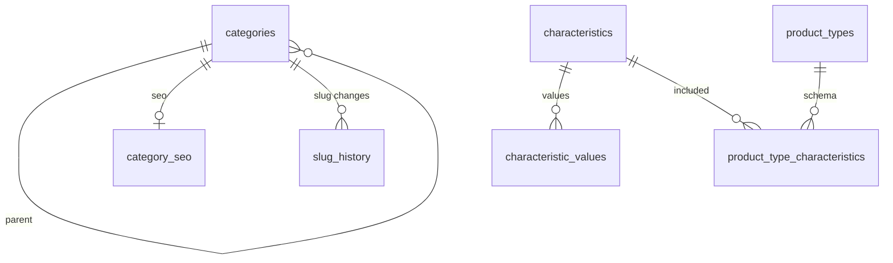

# Taxonomia - Modelo Fisico de Base de Datos

---

## 1. Identificacion

- Issue: #52 - Persistencia de Taxonomia.
- Responsable: Leonardo Lopez.
- Bounded context: Taxonomia y Atributos.
- Microservicio: taxonomy-svc.
- Schema: taxonomy.
- Owner exclusivo: taxonomy-svc.
- Ultima actualizacion: 2026-10-03.
- Estado: EN REVISION.
- Modelo logico de origen: logical-model.md.
- Migraciones: migrations/.
- Validacion: validation.sql.
- Motor objetivo: PostgreSQL 15+ / Supabase.

---

## 2. Fuentes y precedencia

Este modelo deriva de Modelo_Conceptual.md, Arquitectura.md, Contrato_Api.md, api/openapi.yaml, asyncapi/asyncapi.yaml, SPEC-008 a SPEC-012, HU-008 a HU-012, WF-008 a WF-012, FLOW-008 a FLOW-012, logical-model.md y bd/CONVENCIONES_BD.md.

Precedencia:

```text
fuentes funcionales y contractuales
        -> modelo conceptual
        -> logical-model.md
        -> physical-model.md
        -> migrations/
        -> validation.sql
```

El modelo fisico no introduce reglas funcionales nuevas. Cuando una regla no se puede expresar declarativamente, se usa trigger local y se documenta su motivo.

---

## 3. Proposito

Materializar el modelo logico de taxonomy-svc como un diseno implementable, reproducible desde cero y aislado en PostgreSQL/Supabase.

Define tablas, columnas, tipos, PK, FK internas, constraints, indices, triggers, runtime settings, Outbox/Inbox, idempotencia, concurrencia, seguridad, despliegue y trazabilidad.

---

## 4. Alcance del bounded context

### 4.1. Datos que posee

- Categorias y jerarquia de navegacion.
- Marcas.
- Caracteristicas y valores de caracteristicas.
- Tipos de producto y asociacion de caracteristicas por tipo.
- SEO de categoria y slug canonico.
- Historial append-only de slugs.
- Operaciones de baja maestra.
- Outbox e Inbox tecnicos del contexto.
- Configuracion runtime propia del contexto.

### 4.2. Datos que NO posee

- Productos, variantes y SKU -> catalog-svc.
- Precios -> pricing-svc.
- Stock -> inventory-svc.
- Usuarios/clientes -> proveedor de identidad.

Toda referencia externa se transporta por contrato HTTP o eventos; no se modela como FK cross-service.

---

## 5. Principios de diseno fisico

### 5.1. Aislamiento

Todo vive en el schema `taxonomy`, cuyo owner de migracion es `po_taxonomy_owner`. Esta prohibido crear FK, joins operativos, vistas, dblink, postgres_fdw o dependencias fisicas hacia otros bounded contexts o `auth.users`.

### 5.2. Convenciones aplicadas

Sin apartamientos. Este modelo aplica bd/CONVENCIONES_BD.md:

- PK `uuid DEFAULT gen_random_uuid()`.
- Fechas de instante como `timestamptz`.
- FK solo internas.
- Outbox/Inbox con envelope vigente.
- RLS no habilitado en schemas de escritura.
- `taxonomy_app` como rol runtime sin privilegios owner.

---

## 6. Inventario de tablas

| Tabla | Proposito | Origen | PK | Estabilidad |
|---|---|---|---|---|
| `runtime_settings` | Configuracion operativa versionada por dato | Necesidad tecnica SPEC-010 | `id` | Mutable |
| `categories` | Categorias y subcategorias | CATEGORIA | `id` | Mutable |
| `brands` | Marcas comerciales | MARCA | `id` | Mutable |
| `characteristics` | Caracteristicas maestras | CARACTERISTICA | `id` | Mutable |
| `characteristic_values` | Valores de caracteristica LISTA | VALOR_CARACTERISTICA | `id` | Mutable |
| `product_types` | Tipos de producto | TIPO_PRODUCTO | `id` | Mutable |
| `product_type_characteristics` | Asociacion tipo-caracteristica | ASOCIACION_TIPO_CARACTERISTICA | `id` | Mutable |
| `category_seo` | SEO y slug canonico de categoria | SEO_CATEGORIA | `id` | Mutable |
| `slug_history` | Historial de slugs para 301 | HISTORIAL_SLUG_CATEGORIA | `id` | Append-only |
| `master_deactivation_operations` | Operaciones de baja segura | OPERACION_BAJA_MAESTRA | `id` | Mutable |
| `outbox` | Publicacion transaccional | Outbox | `id` | Ledger |
| `inbox` | Deduplicacion de consumo | Inbox | `id` | Ledger |

---

## 7. Enumeraciones y tipos propios

### 7.1. `taxonomy.estado_entidad`

Valores: `ACTIVO`, `INACTIVO`, `PENDING_DEACTIVATION`.

Usado por categorias, marcas, caracteristicas, valores, tipos y asociaciones. Se usa ENUM porque el ciclo de vida es propio del bounded context y esta publicado por SPEC-008.

### 7.2. `taxonomy.tipo_caracteristica`

Valores: `TEXTO`, `NUMERO`, `LISTA`.

Usado por `characteristics.tipo`. Es ENUM porque SPEC-009 fija un conjunto cerrado e inmutable.

### 7.3. `taxonomy.tipo_entidad_maestra`

Valores: `CATEGORY`, `BRAND`, `CHARACTERISTIC`, `CHARACTERISTIC_VALUE`, `PRODUCT_TYPE`, `PRODUCT_TYPE_CHARACTERISTIC`.

Usado por `master_deactivation_operations.entity_type`.

### 7.4. `taxonomy.estado_operacion_baja`

Valores: `REQUESTED`, `IN_PROGRESS`, `COMPLETED`, `REJECTED`, `FAILED`.

Usado por `master_deactivation_operations.status`.

---

## 8. Modelo por tabla

### 8.1. `runtime_settings`

Origen logico: necesidad tecnica de configuracion.

Columnas: `id uuid`, `clave text`, `valor_integer integer`, `descripcion text`, `created_at timestamptz`, `updated_at timestamptz`.

Claves: `pk_runtime_settings`, `uq_runtime_settings_clave`.

Constraints: clave no vacia y valor positivo.

Dato inicial: `MAX_PRODUCT_TYPE_ATTRIBUTES = 20`, valor inicial configurable definido por SPEC-010.

### 8.2. `categories`

Columnas principales: `nombre`, `descripcion`, `categoria_padre_id`, `nivel`, `orden`, `imagen_url`, `estado`, `taxonomy_version`, timestamps.

FK interna: `fk_categories_categoria_padre` hacia `categories(id)` con `ON DELETE RESTRICT`.

Constraints: nombre no vacio, `nivel IN (1,2)`, orden no negativo, version no negativa, relacion padre/nivel coherente.

Trigger: `trg_categories_parent_rules` valida padre activo, padre nivel 1, ausencia de ciclos reales y evita desactivar padres con hijos activos.

### 8.3. `brands`

Columnas principales: `nombre`, `nombre_normalizado`, `descripcion`, `logo_url`, `pais_origen_iso`, `estado`, `taxonomy_version`, timestamps.

`nombre_normalizado` es generado como `lower(regexp_replace(btrim(nombre), '[[:space:]]+', ' ', 'g'))`.

Claves: `pk_brands`, `uq_brands_nombre_normalizado`.

Constraints: nombre y nombre normalizado no vacios; `pais_origen_iso` alpha-2 en mayusculas.

### 8.4. `characteristics`

Columnas principales: `nombre`, `tipo`, `unidad_medida`, `estado`, `taxonomy_version`, timestamps.

Claves: `pk_characteristics`, `uq_characteristics_nombre`.

Triggers: `trg_characteristics_prevent_type_change` impide cambiar `tipo`.

### 8.5. `characteristic_values`

Columnas principales: `caracteristica_id`, `nombre`, `estado`, `taxonomy_version`, timestamps.

FK interna: `fk_characteristic_values_caracteristica`.

Claves: `pk_characteristic_values`, `uq_characteristic_values_nombre(caracteristica_id, nombre)`.

Trigger: `trg_characteristic_values_rules` bloquea valores sobre caracteristicas no LISTA y serializa por caracteristica con `FOR UPDATE` antes de contar los 50 activos.

### 8.6. `product_types`

Columnas principales: `nombre`, `estado`, `schema_version`, `taxonomy_version`, timestamps.

Claves: `pk_product_types`, `uq_product_types_nombre`.

`schema_version` inicia en 1 e incrementa solo con cambios confirmados del esquema de asociaciones.

### 8.7. `product_type_characteristics`

Columnas principales: `tipo_producto_id`, `caracteristica_id`, `obligatoria`, `estado`, timestamps.

FK internas: `fk_ptc_tipo_producto`, `fk_ptc_caracteristica`.

Claves: `pk_product_type_characteristics`, `uq_ptc_tipo_caracteristica`.

Triggers:

- `trg_ptc_attribute_limit`: aplica `MAX_PRODUCT_TYPE_ATTRIBUTES` con bloqueo de la fila de configuracion.
- `trg_ptc_bump_schema_version`: incrementa `schema_version` solo en `INSERT`, `DELETE` o cambios de `obligatoria`/`estado`.

### 8.8. `category_seo`

Columnas principales: `categoria_id`, `slug`, `meta_titulo`, `meta_descripcion`, `taxonomy_version`, timestamps.

FK interna: `fk_category_seo_categoria`.

Claves: `uq_category_seo_categoria`, `uq_category_seo_slug`.

Trigger: `trg_category_seo_track_slug` inserta en `slug_history` cuando cambia el slug.

### 8.9. `slug_history`

Columnas principales: `categoria_id`, `old_slug`, `new_slug`, `changed_at`, `created_at`.

FK interna: `fk_slug_history_categoria`.

Estabilidad: append-only, sin `updated_at`.

Protecciones: `trg_slug_history_append_only` rechaza `UPDATE`/`DELETE` y `taxonomy_app` no recibe esos permisos.

### 8.10. `master_deactivation_operations`

Columnas principales: `operation_id uuid`, `entity_type`, `entity_id`, `status`, `reason`, `correlation_id uuid`, timestamps.

Claves: `pk_master_deactivation_operations`, `uq_mdo_operation_id`.

`operation_id` y `correlation_id` son UUID, alineados con CONVENCIONES_BD.md.

### 8.11. `outbox`

Envelope vigente: `message_id uuid`, `event_name`, `kind`, `schema_version`, `correlation_id uuid`, `causation_id uuid`, `operation_id uuid`, `occurred_at`, `payload`, `published_at`, `attempts`, `last_error`, `created_at`.

Claves/constraints: `uq_outbox_message_id`, `ck_outbox_kind`, `ck_outbox_schema_version`, `ck_outbox_attempts`.

### 8.12. `inbox`

Columnas: `message_id uuid`, `handler`, `event_name`, `correlation_id uuid`, `payload`, `processed_at`, `result`, `created_at`.

Deduplicacion: `uq_inbox_message_handler(message_id, handler)`.

---

## 9. Referencias externas

No hay FK hacia otros bounded contexts. Los eventos consumidos desde Catalogo se registran en `inbox.event_name`, payload y correlation id, sin referenciar tablas externas.

---

## 10. Constraints e invariantes

| Regla logica | Implementacion fisica |
|---|---|
| Marca unica incluso inactiva | `uq_brands_nombre_normalizado` |
| Padre activo, padre nivel 1 y sin ciclos | `trg_categories_parent_rules` |
| Caracteristica LISTA con maximo 50 valores activos | `trg_characteristic_values_rules` con lock por caracteristica |
| Maximo configurable de atributos por tipo | `runtime_settings` + `trg_ptc_attribute_limit` |
| `schema_version` solo cambia con esquema confirmado | trigger especifico sobre INSERT/DELETE/UPDATE OF `obligatoria`, `estado` |
| Slug history append-only | trigger + permisos runtime |
| Inbox idempotente por handler | `uq_inbox_message_handler` |

---

## 11. Foreign keys

Permitidas solo dentro de `taxonomy`: categorias padre, valores -> caracteristicas, PTC -> product_types/characteristics, category_seo -> categories, slug_history -> categories.

Prohibidas: cualquier FK hacia `catalog`, `pricing`, `inventory`, `promotions`, `auth.users` u otro schema.

---

## 12. Indices

Indices de FK: `ix_categories_padre_id`, `ix_characteristic_values_caracteristica_id`, `ix_ptc_tipo_producto_id`, `ix_ptc_caracteristica_id`, `ix_category_seo_categoria_id`, `ix_slug_history_categoria_id`.

Workers y consultas: `ix_slug_history_old_slug`, `ix_outbox_pending`, `ix_inbox_message_handler`, `ix_mdo_entity`.

---

## 13. Funciones y triggers

Funciones: `fn_set_updated_at`, `fn_prevent_characteristic_type_change`, `fn_enforce_category_parent_rules`, `fn_enforce_characteristic_value_rules`, `fn_track_slug_history`, `fn_prevent_slug_history_mutation`, `fn_bump_product_type_schema_version`, `fn_enforce_product_type_attribute_limit`.

Los triggers se usan solo donde una constraint declarativa no puede proteger concurrencia, jerarquia recursiva, append-only o versionado condicionado.

---

## 14. Outbox e Inbox

| Tabla | Aplica | Motivo |
|---|---|---|
| `outbox` | Si | taxonomy-svc publica eventos `taxonomy.*` |
| `inbox` | Si | consume `catalog.master.deactivation.checked` |

Eventos publicados vigentes: `taxonomy.category.updated`, `taxonomy.product-type-schema.changed`, `taxonomy.characteristic-value.updated`, `taxonomy.master.deactivation.check.requested`, `taxonomy.master.deactivated`, `taxonomy.master.deactivation.rejected`.

---

## 15. Idempotencia y concurrencia

| Operacion / tabla | Identificador | Restriccion / estrategia |
|---|---|---|
| Operacion de baja | `operation_id uuid` | `uq_mdo_operation_id` |
| Publicacion | `message_id uuid` | `uq_outbox_message_id` |
| Consumo | `(message_id, handler)` | `uq_inbox_message_handler` |
| Valores LISTA | `caracteristica_id` | lock por fila de `characteristics` antes del conteo |
| Atributos por tipo | `MAX_PRODUCT_TYPE_ATTRIBUTES` | lock de configuracion runtime |

---

## 16. Proyecciones locales

No se materializan proyecciones de otros owners. `inbox.payload` conserva el mensaje consumido, pero no transforma ownership.

---

## 17. Reglas de escritura

Las escrituras de dominio deben registrar eventos en `outbox` dentro de la misma transaccion. La publicacion ocurre despues del commit. Las bajas seguras usan `master_deactivation_operations` y eventos de comprobacion con Catalogo.

---

## 18. Excepciones de timestamps y borrado

| Tabla | Excepcion | Motivo |
|---|---|---|
| `slug_history` | sin `updated_at`; runtime sin UPDATE/DELETE | append-only |
| `outbox` | sin `updated_at` | ledger tecnico de publicacion |
| `inbox` | sin `updated_at` | ledger de deduplicacion |

---

## 19. Diagrama entidad-relacion fisico



---

## 20. Trazabilidad logico-fisico

| Elemento logico | Materializacion fisica |
|---|---|
| CATEGORIA | `categories` |
| MARCA | `brands` |
| CARACTERISTICA | `characteristics` |
| VALOR_CARACTERISTICA | `characteristic_values` |
| TIPO_PRODUCTO | `product_types` |
| ASOCIACION_TIPO_CARACTERISTICA | `product_type_characteristics` |
| SEO_CATEGORIA | `category_seo` |
| HISTORIAL_SLUG_CATEGORIA | `slug_history` |
| OPERACION_BAJA_MAESTRA | `master_deactivation_operations` |
| Outbox | `outbox` |
| Inbox | `inbox` |
| Configuracion de limite SPEC-010 | `runtime_settings` |

---

## 21. Trazabilidad funcional

| Fuente | Elemento fisico derivado |
|---|---|
| SPEC-008 | `categories`, jerarquia y `PENDING_DEACTIVATION` |
| SPEC-009 | `characteristics`, `characteristic_values`, limite 50 |
| SPEC-010 | `product_types`, PTC, `schema_version`, limite inicial 20 configurable |
| SPEC-011 | `brands.nombre_normalizado` |
| SPEC-012 | `category_seo`, `slug_history` |
| AsyncAPI / catalogo eventos | `outbox`, `inbox`, nombres de eventos vigentes |
| CONVENCIONES_BD.md | UUID, aislamiento, roles, Outbox/Inbox |

---

## 22. Decisiones fisicas

| ID | Decision | Alternativas | Justificacion | Impacto |
|---|---|---|---|---|
| D-PHY-01 | `nombre_normalizado` generado | Normalizar solo en app | La BD protege unicidad ante carreras | `brands` |
| D-PHY-02 | Lock de `characteristics` para limite 50 | COUNT sin lock | Evita carrera concurrente 50 -> 51 | `characteristic_values` |
| D-PHY-03 | Runtime setting para limite de atributos | Hardcode 20 | SPEC-010 exige configurable con valor inicial 20 | `runtime_settings`, PTC |
| D-PHY-04 | `slug_history` append-only con trigger y permisos | Solo convencion documental | Protege contra UPDATE/DELETE accidentales | `slug_history` |

---

## 23. Decisiones pendientes

No hay decisiones pendientes que bloqueen la migracion inicial.

---

## 24. Migraciones

La implementacion vive en `database/taxonomy/migrations/0001_create_taxonomy.sql`.

La migracion es reproducible desde una base limpia, modifica solo `taxonomy`, evita secretos y es compatible con `database/migrate.py taxonomy`.

---

## 25. Validacion

La validacion vive en `database/taxonomy/validation.sql` y cubre schema, tablas, tipos, PK, FK internas, ausencia de FK cross-context, UNIQUE, CHECK, indices, enums, idempotencia, reglas principales, Outbox/Inbox, aislamiento, limite 50, jerarquia/ciclos, marca normalizada y append-only.

---

## 26. Despliegue en Supabase

Secuencia esperada:

1. Ejecutar `database/bootstrap.sql` con administrador autorizado.
2. Ejecutar `python database/migrate.py taxonomy`.
3. Ejecutar `psql -X -v ON_ERROR_STOP=1 -f database/taxonomy/validation.sql`.
4. Registrar evidencia sin secretos: commit, version de migracion, checksums, fecha, version PostgreSQL, resultado y PR asociado a #52.

`bootstrap.sql` crea `taxonomy_app` sin password. La credencial real se inyecta por DevOps fuera del repositorio.

---

## 27. Checklist de aprobacion

- [x] Cada entidad logica requerida tiene materializacion fisica.
- [x] No existen FK cross-service.
- [x] Las PK son UUID.
- [x] No se usa `serial`, `bigserial`, `float`, `money` ni `timestamp` sin zona horaria.
- [x] Toda FK interna tiene indice.
- [x] Las constraints tienen nombre explicito.
- [x] Outbox/Inbox usan envelope vigente.
- [x] Inbox deduplica por `(message_id, handler)`.
- [x] `operation_id`, `message_id` y `correlation_id` son UUID donde aplica.
- [x] Marcas usan `nombre_normalizado`.
- [x] Jerarquia de categorias valida padre activo, nivel 1 y ciclos.
- [x] Limite 50 de LISTA esta serializado.
- [x] `schema_version` no aumenta con cualquier UPDATE.
- [x] `slug_history` es append-only.
- [x] Migracion y validacion estan bajo `database/taxonomy/`.

---

## 28. Resultado de revision

Resultado: REQUIERE VALIDACION LOCAL.

Observaciones: ejecutar migracion desde cero, reejecutar runner para comprobar idempotencia y adjuntar evidencia al PR asociado a #52.

Revisor: pendiente.

Fecha: 2026-10-03.
