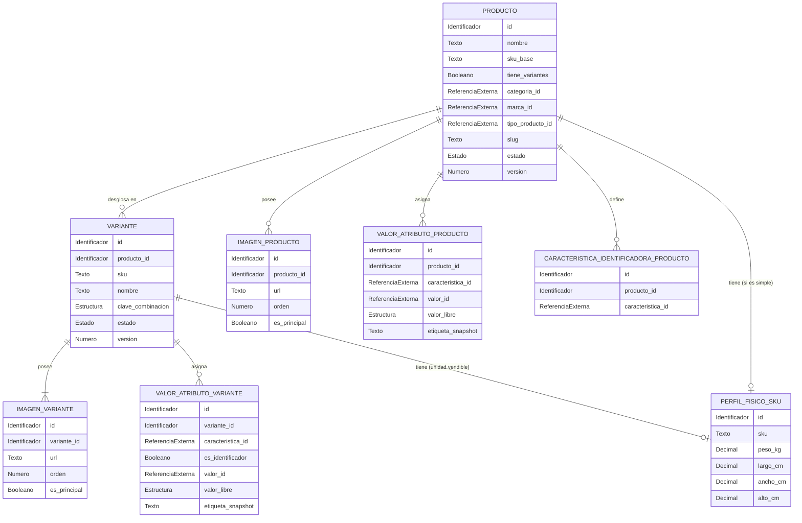

# Modelo lógico — `catalog` (`catalog-svc`)

> **Ubicación oficial del documento:**
> `datos/catalog-svc/logical-model.md` (ubicación asignada en el árbol de persistencia del servicio).

- **Issue:** #51 — Persistencia y modelo de datos de catalog-svc
- **Responsable:** Gabriel Poma Gutierrez
- **Bounded context:** Catálogo
- **Microservicio:** `catalog-svc`
- **Schema objetivo:** `catalog`
- **Última actualización:** 2026-10-03
- **Estado:** EN REVISIÓN

---

## Flujo de derivación y precedencia

```text
fuentes funcionales y contractuales
        ↓
Modelo_Conceptual.md
        ↓
logical-model.md
        ↓
physical-model.md
        ↓
migrations/
        ↓
validation.sql
```

## Fuentes de verdad

Este modelo lógico deriva de las fuentes funcionales, arquitectónicas y contractuales vigentes:

- `Modelo_Conceptual.md` (§4 Catálogo y Productos, §14–18)
- `Arquitectura.md` (§7 Persistencia, §8 Migraciones, §32 Catálogo, §39 Transaccionalidad)
- `Contrato_Api.md` (Ownership e interfaces de integración)
- `api/openapi.yaml` (0.5.0: esquemas de Producto, Variante, Atributo, Imagen, PerfilFisico)
- `asyncapi/asyncapi.yaml` (0.4.0: eventos `catalog.product.*`, `catalog.variant.*`)
- `specs/SPEC-003-gestion-productos-crud.md`
- `specs/SPEC-004-gestion-variantes-skus.md`
- `specs/SPEC-010-asociacion-tipo-producto-caracteristica.md`
- `hu/HU-003-gestion-productos-crud.md`
- `hu/HU-004-gestion-variantes-skus.md`
- `flujos/FLOW-003-gestion-productos-crud.md`
- `flujos/FLOW-004-gestion-variantes-skus.md`
- `wireframes/flows/WF-003-gestion-productos-crud.md`
- `wireframes/flows/WF-004-gestion-variantes-skus.md`
- `bd/CONVENCIONES_BD.md`

Precedencia ante discrepancias: `SPEC` → `Contrato OpenAPI/AsyncAPI` → `Modelo_Conceptual.md` → **este documento**. No se introducen entidades ni atributos sin respaldo en fuentes oficiales.

---

# 1. Propósito

Describir la estructura lógica pura de información propiedad del bounded context **`catalog-svc`** para las funcionalidades:
- **003 — Gestión de productos (CRUD, ciclo de vida, perfil físico y clasificación).**
- **004 — Gestión de variantes, SKUs, combinaciones de atributos identificadores y medios.**

Este documento define entidades, atributos lógicos, relaciones, invariantes de negocio, referencias interdominio y necesidades conceptuales de persistencia técnica.

Este documento **no contiene decisiones físicas PostgreSQL**: no define tipos nativos SQL, sentencias DDL, índices, triggers ni extensiones.

---

# 2. Responsabilidad del bounded context

## 2.1. Datos propios (Authority / Ownership)

`catalog-svc` es autoridad única y fuente de verdad sobre:

1. **Producto:** Identidad del producto, denominación comercial, descripción, SKU base, indicador de variantes (`tiene_variantes`), slug canónico, estado del ciclo de vida y versión.
2. **Variante:** Identidad de variante, pertenencia al producto, SKU vendible, clave canónica de combinación identificadora, nombre comercial específico, estado del ciclo de vida y versión.
3. **Imágenes de Catálogo:** Referencias URI a recursos multimedia asociados a productos y a variantes, con orden de presentación y marca de imagen principal.
4. **Valores de Atributos:** Asignación de valores (referencia a lista o valor libre) a las características de un producto o variante conforme al esquema del tipo de producto.
5. **Características Identificadoras:** Definición de qué características definen el eje de variación de un producto con variantes.
6. **Perfil Físico de SKU:** Dimensiones (largo, ancho, alto) y peso volumétrico/bruto de cada unidad vendible (producto simple o variante).
7. **Comprobaciones de Activación:** Registro de preparación asíncrona de dependencias (Pricing e Inventario) requeridas antes de activar comercialmente un producto o variante.
8. **Barreras Maestras:** Registro local de barreras ante protocolos de desactivación asíncrona provenientes de Taxonomía.

## 2.2. Datos que NO posee (Referencias externas / Non-goals)

`catalog-svc` no es autoridad sobre:

- **Categorías, Marcas, Tipos de Producto y Definición de Características:** Propiedad de `taxonomy-svc`.
- **Precios, Ofertas y Vigencias:** Propiedad de `pricing-svc`. El precio base inicial recibido en el alta se transporta como intención en el evento outbox hacia Pricing, no se almacena como tabla maestra de precios local.
- **Saldos, Reservas, Ubicaciones e Incidentes de Stock:** Propiedad de `inventory-svc`.
- **Promociones, Cupones y Reglas de Recomendación:** Propiedad de `promotions-svc`.
- **Combos y Empaques:** Propiedad de `combos-svc`.
- **Usuarios y Seguridad:** Propiedad del subsistema de Seguridad.

---

# 3. Entidades lógicas

## 3.1. `PRODUCTO`

**Propósito:** Representa la entidad comercial y conceptual del catálogo de productos.

**Identificador lógico:** Identificador propio (`id`).

### Atributos

| Atributo | Naturaleza lógica | Obligatorio | Descripción |
|---|---|---:|---|
| `id` | Identificador | Sí | Identificador único del producto |
| `nombre` | Texto | Sí | Denominación comercial del producto |
| `descripcion` | Texto | No | Descripción detallada del producto |
| `sku_base` | Texto | Sí | Código de referencia base / natural |
| `tiene_variantes` | Booleano | Sí | Indica si el producto se desglosa en variantes |
| `categoria_id` | Referencia externa | Sí | Categoría asignada (Owner: `taxonomy-svc`) |
| `marca_id` | Referencia externa | No | Marca asignada (Owner: `taxonomy-svc`) |
| `tipo_producto_id` | Referencia externa | Sí | Tipo de producto y esquema de atributos (Owner: `taxonomy-svc`) |
| `slug` | Texto | No | Identificador amigable para URL |
| `estado` | Estado | Sí | `BORRADOR`, `ACTIVO`, `INACTIVO` |
| `version` | Número entero | Sí | Contador de versión para concurrencia optimista |
| `fecha_creacion` | Fecha-hora | Sí | Momento de registro |
| `fecha_actualizacion` | Fecha-hora | Sí | Momento de última modificación |

### Reglas e invariantes

- `sku_base` es único globalmente y no puede duplicarse con ningún otro SKU base ni SKU de variante.
- Si `tiene_variantes = false` (producto simple), el `sku_base` es la unidad vendible directa.
- Si `tiene_variantes = true`, el producto actúa como contenedor; no posee inventario directo ni perfil físico propio; sus variantes son las unidades vendibles.
- No se puede cambiar `tiene_variantes` una vez creadas variantes hijas.
- Para pasar a estado `ACTIVO`, un producto requiere:
  - Al menos una imagen asociada en `IMAGEN_PRODUCTO`.
  - Validación de maestros externos existentes en Taxonomía.
  - Comprobación completada de precio (`PRICING COMPLETED`).
  - Si es producto simple: perfil físico completo y preparación de inventario completada (`INVENTORY COMPLETED`).
  - Si es producto con variantes: al menos una variante hija en estado `ACTIVA`.

---

## 3.2. `VARIANTE`

**Propósito:** Representa una opción vendible específica de un producto con variantes (e.g. talla, color).

**Identificador lógico:** Identificador propio (`id`).

### Atributos

| Atributo | Naturaleza lógica | Obligatorio | Descripción |
|---|---|---:|---|
| `id` | Identificador | Sí | Identificador único de la variante |
| `producto_id` | Identificador | Sí | Referencia al producto padre |
| `sku` | Texto | Sí | SKU vendible único |
| `nombre` | Texto | No | Nombre descriptivo de la variante (snapshot opcional) |
| `clave_combinacion` | Estructura de datos | Sí | Combinación canónica de características y valores identificadores |
| `estado` | Estado | Sí | `BORRADOR`, `ACTIVA`, `INACTIVA` |
| `version` | Número entero | Sí | Contador de versión para concurrencia optimista |
| `fecha_creacion` | Fecha-hora | Sí | Momento de registro |
| `fecha_actualizacion` | Fecha-hora | Sí | Momento de última modificación |

### Reglas e invariantes

- `sku` es único en todo el catálogo (entre variantes y productos simples).
- La tupla `(producto_id, clave_combinacion)` es estrictamente única dentro del producto, incluyendo variantes inactivas.
- Solo existe para productos con `tiene_variantes = true`.
- Para pasar a estado `ACTIVA`, una variante requiere:
  - Al menos una imagen en `IMAGEN_VARIANTE`.
  - Atributos identificadores válidos según las características identificadoras del padre.
  - Perfil físico registrado y completo en `PERFIL_FISICO_SKU`.
  - Comprobación completada de inventario (`INVENTORY COMPLETED`).
- La desactivación de la última variante activa de un producto activo provoca la desactivación del producto padre.

---

## 3.3. `IMAGEN_PRODUCTO`

**Propósito:** Almacena los recursos multimedia de presentación asociados a un producto.

**Identificador lógico:** Identificador propio (`id`).

### Atributos

| Atributo | Naturaleza lógica | Obligatorio | Descripción |
|---|---|---:|---|
| `id` | Identificador | Sí | Identificador de la imagen |
| `producto_id` | Identificador | Sí | Producto al que pertenece |
| `url` | Texto / URI | Sí | Enlace al recurso de imagen |
| `orden` | Número entero | Sí | Posición ordinal de visualización |
| `es_principal` | Booleano | Sí | Indica si es la portada principal del producto |
| `fecha_creacion` | Fecha-hora | Sí | Momento de registro |
| `fecha_actualizacion` | Fecha-hora | Sí | Momento de última modificación |

### Reglas e invariantes

- Solo puede existir una imagen con `es_principal = true` por producto.
- `orden` es un entero no negativo (>= 0).

---

## 3.4. `IMAGEN_VARIANTE`

**Propósito:** Almacena los recursos multimedia asociados a una variante específica.

**Identificador lógico:** Identificador propio (`id`).

### Atributos

| Atributo | Naturaleza lógica | Obligatorio | Descripción |
|---|---|---:|---|
| `id` | Identificador | Sí | Identificador de la imagen |
| `variante_id` | Identificador | Sí | Variante a la que pertenece |
| `url` | Texto / URI | Sí | Enlace al recurso de imagen |
| `orden` | Número entero | Sí | Posición ordinal de visualización |
| `es_principal` | Booleano | Sí | Indica si es la imagen principal de la variante |
| `fecha_creacion` | Fecha-hora | Sí | Momento de registro |
| `fecha_actualizacion` | Fecha-hora | Sí | Momento de última modificación |

### Reglas e invariantes

- Toda variante exige al menos una imagen desde su creación.
- Solo una imagen puede tener `es_principal = true` por variante.

---

## 3.5. `VALOR_ATRIBUTO_PRODUCTO`

**Propósito:** Asigna valores a características taxonómicas a nivel de producto.

**Identificador lógico:** Identificador propio (`id`).

### Atributos

| Atributo | Naturaleza lógica | Obligatorio | Descripción |
|---|---|---:|---|
| `id` | Identificador | Sí | Identificador del registro |
| `producto_id` | Identificador | Sí | Producto al que pertenece |
| `caracteristica_id` | Referencia externa | Sí | Característica asignada (Owner: `taxonomy-svc`) |
| `valor_id` | Referencia externa | No | Opción seleccionada si la característica es tipo LISTA |
| `valor_libre` | Estructura / Texto | No | Valor asignado si es tipo TEXTO o NUMERO |
| `etiqueta_snapshot` | Texto | No | Texto descriptivo para visualización |
| `fecha_creacion` | Fecha-hora | Sí | Momento de asignación |
| `fecha_actualizacion` | Fecha-hora | Sí | Momento de modificación |

### Reglas e invariantes

- La tupla `(producto_id, caracteristica_id)` es única.
- Debe contener `valor_id` o `valor_libre`, de acuerdo con el tipo de característica definido en Taxonomía.

---

## 3.6. `VALOR_ATRIBUTO_VARIANTE`

**Propósito:** Asigna valores de características identificadoras o no identificadoras a nivel de variante.

**Identificador lógico:** Identificador propio (`id`).

### Atributos

| Atributo | Naturaleza lógica | Obligatorio | Descripción |
|---|---|---:|---|
| `id` | Identificador | Sí | Identificador del registro |
| `variante_id` | Identificador | Sí | Variante a la que pertenece |
| `caracteristica_id` | Referencia externa | Sí | Característica asignada (Owner: `taxonomy-svc`) |
| `es_identificador` | Booleano | Sí | Indica si forma parte del eje de variación (clave de combinación) |
| `valor_id` | Referencia externa | No | Opción seleccionada si es tipo LISTA |
| `valor_libre` | Estructura / Texto | No | Valor asignado si es tipo TEXTO o NUMERO |
| `etiqueta_snapshot` | Texto | No | Snapshot descriptivo |
| `fecha_creacion` | Fecha-hora | Sí | Momento de asignación |
| `fecha_actualizacion` | Fecha-hora | Sí | Momento de modificación |

### Reglas e invariantes

- La tupla `(variante_id, caracteristica_id)` es única.
- Los atributos con `es_identificador = true` deben corresponder a las características identificadoras del producto padre y conformar la `clave_combinacion`.

---

## 3.7. `CARACTERISTICA_IDENTIFICADORA_PRODUCTO`

**Propósito:** Especifica qué características taxonómicas constituyen el criterio de diferenciación de variantes para un producto.

**Identificador lógico:** Identificador propio (`id`).

### Atributos

| Atributo | Naturaleza lógica | Obligatorio | Descripción |
|---|---|---:|---|
| `id` | Identificador | Sí | Identificador de la regla |
| `producto_id` | Identificador | Sí | Producto configurable |
| `caracteristica_id` | Referencia externa | Sí | Característica que forma parte del eje de variantes |
| `fecha_creacion` | Fecha-hora | Sí | Momento de registro |

### Reglas e invariantes

- La tupla `(producto_id, caracteristica_id)` es única.
- Solo aplica a productos con `tiene_variantes = true`.

---

## 3.8. `PERFIL_FISICO_SKU`

**Propósito:** Almacena los pesos y dimensiones logísticas obligatorios para el empaque y despacho de cada unidad vendible (SKU).

**Identificador lógico:** Identificador propio (`id`).

### Atributos

| Atributo | Naturaleza lógica | Obligatorio | Descripción |
|---|---|---:|---|
| `id` | Identificador | Sí | Identificador del perfil |
| `sku` | Texto | Sí | SKU vendible al que pertenece el perfil |
| `peso_kg` | Número decimal | Sí | Peso del producto en kilogramos |
| `largo_cm` | Número decimal | Sí | Longitud en centímetros |
| `ancho_cm` | Número decimal | Sí | Ancho en centímetros |
| `alto_cm` | Número decimal | Sí | Altura en centímetros |
| `fecha_creacion` | Fecha-hora | Sí | Momento de registro |
| `fecha_actualizacion` | Fecha-hora | Sí | Momento de modificación |

### Reglas e invariantes

- `sku` es estrictamente único en esta entidad (`1:1` con la unidad vendible).
- `peso_kg > 0`, `largo_cm > 0`, `ancho_cm > 0`, `alto_cm > 0`.
- El volumen no se almacena como atributo independiente; se calcula como `largo_cm * ancho_cm * alto_cm`.

---

# 4. Catálogos de estados y valores controlados

## 4.1. Estado de Producto

Valores:
- `BORRADOR`: Producto en configuración inicial; admite incompletitud de perfil o comprobaciones.
- `ACTIVO`: Producto listo para publicación comercial; cumple todos los requisitos de catálogo, pricing e inventario.
- `INACTIVO`: Producto dado de baja de negocio; no es visible para la venta pero conserva su identidad histórica.

Transiciones permitidas:
- `BORRADOR` → `ACTIVO` (al completar requisitos de activación).
- `ACTIVO` → `INACTIVO` (desactivación administrativa o por protocolo de baja maestra).
- `INACTIVO` → `ACTIVO` (reactivación, revalidando dependencias activas).

## 4.2. Estado de Variante

Valores:
- `BORRADOR`: Variante en configuración inicial.
- `ACTIVA`: Variante disponible comercialmente; cumple perfil físico, imágenes e inventario completado.
- `INACTIVA`: Variante dada de baja; conserva combinación identificadora y SKU.

Transiciones permitidas:
- `BORRADOR` → `ACTIVA` (cumple requisitos de variante vendible).
- `ACTIVA` → `INACTIVA` (desactivación).
- `INACTIVA` → `ACTIVA` (reactivación).

## 4.3. Estado de Comprobación de Activación

Valores:
- `PENDING`: Esperando confirmación del servicio dependiente (`pricing-svc` o `inventory-svc`).
- `COMPLETED`: Confirmación exitosa recibida.
- `FAILED`: Error o rechazo en la inicialización del dominio dependiente.

---

# 5. Relaciones y cardinalidades

| Origen | Relación | Destino | Cardinalidad | Propiedad |
|---|---|---|---:|---|
| `PRODUCTO` | contiene | `VARIANTE` | `1:0..N` | Interna (solo si `tiene_variantes = true`) |
| `PRODUCTO` | posee | `IMAGEN_PRODUCTO` | `1:0..N` | Interna (mínimo 1 para `ACTIVO`) |
| `VARIANTE` | posee | `IMAGEN_VARIANTE` | `1:1..N` | Interna |
| `PRODUCTO` | tiene | `VALOR_ATRIBUTO_PRODUCTO` | `1:0..N` | Interna |
| `VARIANTE` | tiene | `VALOR_ATRIBUTO_VARIANTE` | `1:0..N` | Interna |
| `PRODUCTO` | asocia | `CARACTERISTICA_IDENTIFICADORA_PRODUCTO` | `1:0..N` | Interna |
| `PRODUCTO` (simple) | posee | `PERFIL_FISICO_SKU` | `1:0..1` | Interna (1:1 por SKU) |
| `VARIANTE` | posee | `PERFIL_FISICO_SKU` | `1:0..1` | Interna (1:1 por SKU) |
| `PRODUCTO` | referencia | `CATEGORIA` (Taxonomía) | `N:1` | Externa (sin FK) |
| `PRODUCTO` | referencia | `MARCA` (Taxonomía) | `N:1` | Externa (sin FK) |
| `PRODUCTO` | referencia | `TIPO_PRODUCTO` (Taxonomía) | `N:1` | Externa (sin FK) |
| `VALOR_ATRIBUTO_*` | referencia | `CARACTERISTICA` (Taxonomía) | `N:1` | Externa (sin FK) |

---

# 6. Referencias interdominio

| Referencia | Owner | Uso local | ¿FK cross-context? |
|---|---|---|---:|
| `categoria_id` | `taxonomy-svc` | Clasificación taxonómica y navegación | No |
| `marca_id` | `taxonomy-svc` | Identidad comercial de marca | No |
| `tipo_producto_id` | `taxonomy-svc` | Esquema de atributos obligatorios/opcionales | No |
| `caracteristica_id` | `taxonomy-svc` | Identificador de atributo maestro | No |
| `valor_id` | `taxonomy-svc` | Identificador de valor de lista maestro | No |
| `user_id` | Seguridad | Identidad de usuario auditor | No |

---

# 7. Reglas de integridad lógica

1. **Unicidad de SKU global:** Todo SKU asignado a un producto simple (`sku_base`) o a una variante (`sku`) es universalmente único en el sistema.
2. **Invarianza de combinación:** Dos variantes del mismo producto no pueden poseer la misma combinación canónica de atributos identificadores.
3. **Integridad de medidas físicas:** Si un perfil físico está registrado, `peso_kg`, `largo_cm`, `ancho_cm` y `alto_cm` deben ser estrictamente positivos (> 0).
4. **Activación de producto simple:** Exige imagen principal, maestros válidos, preparación de precio completada (`PRICING COMPLETED`), perfil físico completo y preparación de stock completada (`INVENTORY COMPLETED`).
5. **Activación de producto con variantes:** Exige imagen principal, maestros válidos, preparación de precio completada (`PRICING COMPLETED`) y al menos una variante hija en estado `ACTIVA`.
6. **Baja en cascada lógica de producto:** Si se inactiva el producto padre, todas las variantes se consideran comercialmente no elegibles para venta sin perder sus estados internos. Si se desactiva la última variante activa de un producto activo, el producto padre pasa automáticamente a `INACTIVO`.

---

# 8. Normalización y duplicación controlada

## 8.1. Datos autoritativos

Son autoritativos dentro de `catalog-svc`:
- Productos y Variantes (ciclo de vida, catálogo y SKUs).
- Perfiles físicos (peso y dimensiones) de los SKUs.
- Valores asignados de atributos a productos y variantes.
- Medios/imágenes asociadas al catálogo.

## 8.2. Datos duplicados o proyectados

| Dato | Owner original | Motivo de duplicación | Reconstruible |
|---|---|---|---:|
| `etiqueta_snapshot` | `taxonomy-svc` | Rendimiento de lectura y visualización sin consultas sincrónicas cross-service | Sí |
| `estado_preparacion` | `pricing-svc` / `inventory-svc` | Seguimiento de barreras de activación en el flujo de alta | Sí |

---

# 9. Persistencia técnica necesaria

| Necesidad | Requerida | Justificación conceptual |
|---|---:|---|
| **Outbox** | Sí | Publicación transaccional y garantizada de eventos de dominio (`catalog.product.*`, `catalog.variant.*`). |
| **Inbox** | Sí | Deduplicación técnica de eventos consumidos (`taxonomy.*`, `pricing.*`, `inventory.*`). |
| **Idempotencia de altas** | Sí | Control de peticiones duplicadas para creación y actualización de productos y variantes. |
| **Comprobaciones de activación** | Sí | Coordinación del estado de preparación de Pricing e Inventario para la barrera de activación. |
| **Barreras maestras** | Sí | Registro de respuesta al protocolo de desactivación segura de Taxonomía. |

---

# 10. Diagrama entidad-relación lógico



---

# 11. Trazabilidad

| Fuente | Decisión / Entidad / Regla derivada |
|---|---|
| `SPEC-003` | Entidad `PRODUCTO`, ciclo de vida (`BORRADOR`, `ACTIVO`, `INACTIVO`), reglas de activación |
| `SPEC-004` | Entidad `VARIANTE`, unicidad de SKU, combinación identificadora, entidad `PERFIL_FISICO_SKU` |
| `SPEC-010` | Entidades `VALOR_ATRIBUTO_*`, asociación a tipo de producto |
| `HU-003` / `HU-004` | Criterios de aceptación funcionales |
| `FLOW-003` / `FLOW-004` | Flujos de alta, edición, preparación asíncrona y barreras |
| `Contrato OpenAPI 0.5.0` | DTOs de Producto, Variante, ImagenRef, Atributo, PerfilFisicoInput |
| `AsyncAPI 0.4.0` | Eventos de dominio `catalog.product.*`, `catalog.variant.*` |
| `Modelo_Conceptual.md §4` | Ownership de catálogo y límites de dominio |
| `bd/CONVENCIONES_BD.md` | Aislamiento interdominio, no FK cross-service |

---

# 12. Decisiones del modelo lógico

| ID | Decisión | Justificación | Impacto |
|---|---|---|---|
| `D-LOG-CAT-01` | El perfil físico se ancla a nivel de SKU (`sku`) y no de producto abstracto | Un producto con variantes puede tener medidas y pesos distintos por cada variante (e.g. empaques distintos por talla) | `PERFIL_FISICO_SKU` se asocia 1:1 al SKU vendible |
| `D-LOG-CAT-02` | Clave de combinación canónica en la variante | Permite validar unicidad estricta e independiente del orden de las características identificadoras | `VARIANTE.clave_combinacion` |
| `D-LOG-CAT-03` | Las comprobaciones de activación de Pricing e Inventario se modelan como persistencia técnica local | El flujo de alta requiere orquestación asíncrona garantizada antes de permitir el estado `ACTIVO` | Entidad conceptual `COMPROBACION_ACTIVACION` |

---

# 13. Decisiones pendientes

| ID | Pregunta / Aspecto abierto | Fuente afectada | Bloquea modelo físico |
|---|---|---|---:|
| `P-LOG-CAT-01` | Definición de formato y obligatoriedad definitiva de código de barras (`barcode`) | `CONVENCIONES_BD.md` §8.2 | No (se mantiene como extensión opcional nullable) |

---

# 14. Derivación esperada hacia el modelo físico

El archivo `physical-model.md` materializará este modelo preservando las invariantes conceptuales:
- Representación de productos, variantes, imágenes, atributos y perfiles físicos en estructuras tabulares del schema `catalog`;
- Claves primarias y relaciones foráneas estrictamente internas al catálogo;
- Unicidad global de SKU y unicidad de combinación identificadora por producto;
- Positividad estricta de medidas físicas y pesos de los perfiles de SKU;
- Aislamiento absoluto sin claves foráneas hacia Taxonomía, Pricing o Inventario;
- Publicación transaccional en Outbox y deduplicación en Inbox.

---

# 15. Checklist de aprobación

## Ownership
- [x] El bounded context conserva ownership exclusivamente sobre productos, variantes, atributos asignados, medios y perfiles físicos.
- [x] No se modelan categorías, marcas, precios ni stock como entidades propias.
- [x] Las referencias externas están identificadas.

## Modelo lógico
- [x] Todas las entidades necesarias están representadas.
- [x] Los identificadores lógicos están definidos.
- [x] Las relaciones y cardinalidades son coherentes.
- [x] Las invariantes funcionales están documentadas.
- [x] Los estados coinciden con contratos y especificaciones vigentes.

## Aislamiento
- [x] No se proponen FK entre bounded contexts.
- [x] Las proyecciones locales se identifican como reconstruibles.
- [x] No se confunde una referencia externa con ownership.

## Nivel de abstracción
- [x] No contiene SQL.
- [x] No contiene tipos PostgreSQL.
- [x] No contiene índices físicos.
- [x] No contiene triggers ni funciones de BD.
- [x] No contiene decisiones de infraestructura física.

## Trazabilidad
- [x] Las decisiones principales son trazables a SPEC/HU/WF/FLOW/contratos.
- [x] No quedan contradicciones funcionales ocultas.
- [x] Las decisiones locales están registradas.

**Resultado:** `EN REVISIÓN`
