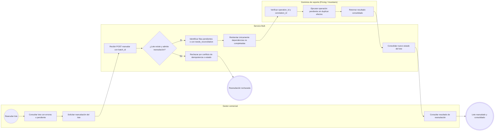

# FLOW-001 — Carga y exportación masiva de productos

## 1. Identificación

- **Código:** FLOW-001
- **Funcionalidad:** Carga y exportación masiva de productos
- **Relacionado con:** [HU-001](../hu/HU-001-carga-exportacion-masiva-productos.md) / [SPEC-001](../specs/SPEC-001-carga-exportacion-masiva-productos.md) / [WF-001](../wireframes/flows/WF-001-carga-exportacion-masiva-productos.md)
- **Responsable:** Marco Renato Castilla Huanca
- **Última actualización:** 2026-09-30

---

## 2. Objetivo del flujo

Representar el proceso integral de importación masiva multidominio (validación del archivo de entrada, persistencia de borradores en Catálogo Core, coordinación desacoplada de dependencias con Pricing e Inventario, inicialización de saldos en cero o registro de identidad sin saldo si no hay ubicación predeterminada, aplicación posterior del stock inicial mediante el contrato Bulk de Inventario cuando existe ubicación, consolidación por fila y por lote sin rollback distribuido, manejo de reintentos idempotentes y reporte detallado de errores) y la exportación masiva asíncrona de la totalidad del catálogo consolidado en formatos CSV y XLSX.

---

## 3. Actores participantes

- **Gestor comercial:** carga archivos, consulta el estado de lotes/trabajos, reanuda ejecuciones observadas y descarga reportes o archivos exportados.
- **Servicio Bulk (`bulk-svc`):** valida el archivo/plantilla, orquesta la importación y consolidación de filas, coordina reintentos idempotentes y genera trabajos de exportación.
- **Catálogo Core (`catalog-svc`):** valida estructura comercial, persiste productos/SKUs en borrador y coordina comandos iniciales de precios e inventario.
- **Pricing (`pricing-svc`):** valida y persiste precios base iniciales por producto bajo motivo `ALTA_PRODUCTO`.
- **Inventario (`inventory-svc`):** inicializa saldos base en cero si existe ubicación predeterminada o registra la identidad del SKU sin saldo si `default_location_id` es nulo, y procesa ajustes masivos de stock inicial cargado.

---

## 4. Diagramas de flujo

### 4.1 Importación masiva de productos y coordinación de dependencias

```mermaid
flowchart LR

    subgraph GESTOR["Gestor comercial"]
        direction TB
        INICIO((Cargar archivo))
        G1["Seleccionar archivo CSV o XLSX"]
        G2["Enviar solicitud de importación"]
        G3["Consultar avance del procesamiento"]
        G4["Visualizar resumen y descargar reporte"]
    end

    subgraph BULK["Servicio Bulk"]
        direction TB
        B1["Validar formato, tamaño y plantilla v2"]
        D1{"¿Archivo y columnas válidos?"}
        B2["Crear lote QUEUED y retornar 202"]
        B3["Rechazar solicitud con código de error"]
        B4["Publicar catalog.bulk.upsert.requested"]
        B5["Esperar respuestas de Pricing e Inventario"]
        D2{"¿Pricing e Inventario completaron?"}
        D3{"¿La fila incluye stock inicial > 0?"}
        D_STK_LOC{"¿Existe default_location_id para el stock?"}
        B6["Publicar inventory.bulk.stock.adjust.requested"]
        D4{"¿Ajuste de stock inicial completado?"}
        B7["Consolidar fila COMPLETADA"]
        B8["Consolidar fila FALLIDA con dominio de error"]
        B8_LOC["Marcar fila FALLIDA (sin ubicación para aplicar stock)"]
        B9["Consolidar estado final del lote y generar reporte"]
    end

    subgraph CATALOGO["Catálogo Core"]
        direction TB
        C1["Recibir solicitud de upsert masivo"]
        C2["Persistir productos y variantes en BORRADOR"]
        C3["Emitir pricing.product.initialization.requested por producto"]
        C4["Emitir inventory.sku.initialization.requested por cada SKU vendible"]
    end

    subgraph PRICING["Pricing"]
        direction TB
        P1["Validar precio base y moneda"]
        D5{"¿Precio base válido?"}
        P2["Persistir precio inicial ALTA_PRODUCTO"]
        P3["Publicar pricing.product.initialization.completed"]
        P4["Publicar pricing.product.initialization.rejected"]
    end

    subgraph INVENTARIO["Inventario"]
        direction TB
        I1["Validar formato e identidad del SKU"]
        D6{"¿SKU válido?"}
        D_LOC{"¿Existe default_location_id?"}
        I2["Inicializar saldo base en cero"]
        I2_NOLOC["Registrar identidad del SKU sin saldo"]
        I3["Publicar inventory.sku.initialization.completed"]
        I4["Publicar inventory.sku.initialization.rejected"]
        I5["Procesar ajuste de stock inicial"]
        D7{"¿Stock aplicado exitosamente?"}
        I6["Publicar inventory.bulk.stock.adjust.completed"]
        I7["Publicar inventory.bulk.stock.adjust.rejected"]
    end

    FIN_OK(((Lote completado)))
    FIN_ERRORES(((Lote completado con observaciones)))
    FIN_RECHAZADO(((Lote rechazado)))

    INICIO --> G1
    G1 --> G2
    G2 --> B1
    B1 --> D1
    D1 -->|"No"| B3
    B3 --> FIN_RECHAZADO
    D1 -->|"Sí"| B2
    B2 --> B4
    B4 --> C1
    C1 --> C2
    C2 --> C3
    C2 --> C4

    %% Pricing
    C3 --> P1
    P1 --> D5
    D5 -->|"Sí"| P2
    P2 --> P3
    D5 -->|"No"| P4
    P3 --> B5
    P4 --> B5

    %% Inventario - Inicialización y manejo de default_location_id
    C4 --> I1
    I1 --> D6
    D6 -->|"No"| I4
    I4 --> B5
    D6 -->|"Sí"| D_LOC
    D_LOC -->|"Sí"| I2
    I2 --> I3
    D_LOC -->|"No"| I2_NOLOC
    I2_NOLOC --> I3
    I3 --> B5

    %% Consolidación y Stock Inicial
    B5 --> D2
    D2 -->|"Fallo en Pricing o Inventario"| B8
    D2 -->|"Ambos completados"| D3
    D3 -->|"No"| B7
    D3 -->|"Sí"| D_STK_LOC
    D_STK_LOC -->|"No"| B8_LOC
    B8_LOC --> B9
    D_STK_LOC -->|"Sí"| B6
    B6 --> I5
    I5 --> D7
    D7 -->|"Sí"| I6
    D7 -->|"No"| I7
    I6 --> B7
    I7 --> B8

    B7 --> B9
    B8 --> B9
    B9 --> G3
    G3 --> G4
    G4 --> D8{"¿Existen filas con error?"}
    D8 -->|"No"| FIN_OK
    D8 -->|"Sí"| FIN_ERRORES
```

> **Sincronización, ubicación y ausencia de rollback distribuido:**
> 1. Una fila solo se consolida exitosamente cuando todas sus dependencias concluyen de forma satisfactoria. Si Pricing completa e Inventario falla (o viceversa), la fila se registra como `FAILED` con `needs_reconciliation: true` y se identifica el dominio causante; los datos persistidos en los dominios exitosos no se eliminan compensatoriamente.
> 2. Si `default_location_id` existe, Inventario inicializa el saldo en cero (`on_hand=0`). Si no existe ubicación predeterminada (`default_location_id = null`), Inventario registra la identidad del SKU sin saldo y responde `completed`, sin rechazar la inicialización.
> 3. Si la fila incluye existencias iniciales (`stock_inicial > 0`), estas se procesan mediante el comando Bulk de ajuste (`inventory.bulk.stock.adjust.requested`) solo si existe `default_location_id`; en caso contrario, no se inventa una ubicación y la fila se marca con error de ubicación sin intentar el ajuste.

---

### 4.2 Reintento idempotente de lote (`/reanudar`)

> **Idempotencia:** Reprocesar el mismo lote con su `batch_id` no genera duplicados en Catálogo, Pricing ni Inventario. Los dominios validan `operation_id` para garantizar ejecución única de cada comando.

---

### 4.3 Exportación masiva de catálogo

```mermaid
flowchart LR

    subgraph GESTOR["Gestor comercial"]
        direction TB
        INICIO_E((Solicitar exportación))
        GE1["Seleccionar formato CSV o XLSX"]
        GE2["Enviar solicitud de exportación"]
        GE3["Consultar estado del trabajo"]
        GE4["Descargar archivo exportado"]
    end

    subgraph BULK["Servicio Bulk"]
        direction TB
        BE1["Validar formato solicitado"]
        BE2["Crear trabajo QUEUED y retornar export_id"]
        BE3["Iniciar procesamiento asíncrono"]
        BE4["Recopilar datos consolidados de la totalidad del catálogo"]
        BE5["Generar archivo en formato final"]
        BE6["Almacenar archivo y marcar COMPLETED"]
        BE7["Entregar archivo binario/texto"]
    end

    subgraph DOMINIOS_EXP["Dominios (Catálogo / Pricing / Inventario)"]
        direction TB
        DE1["Consultar productos y variantes activos"]
        DE2["Consultar precios base vigentes"]
        DE3["Consultar stock disponible por SKU"]
    end

    FIN_EXPORTADO(((Archivo de catálogo descargado)))

    INICIO_E --> GE1
    GE1 --> GE2
    GE2 --> BE1
    BE1 --> BE2
    BE2 --> BE3
    BE3 --> BE4
    BE4 --> DE1
    DE1 --> DE2
    DE2 --> DE3
    DE3 --> BE5
    BE5 --> BE6
    BE6 --> GE3
    GE3 --> GE4
    GE4 --> BE7
    BE7 --> FIN_EXPORTADO
```

> **Generación asíncrona:** La exportación opera mediante un trabajo asíncrono desacoplado (`POST /carga-masiva/productos/exportaciones`) sobre la totalidad del catálogo activo para evitar bloqueos por volumen de datos. El gestor realiza polling del estado (`GET .../exportaciones/{exportId}`) y descarga el resultado consolidado (`GET .../exportaciones/{exportId}/archivo`).

---

## 5. Reglas de consistencia y negocio

1. **Ausencia de rollback distribuido:** Ante la falla de un dominio (ej. Inventario rechazado tras confirmación de Pricing), el sistema no revierte los registros ya aplicados. La fila se marca como fallida, señalando el dominio causante y activando la bandera `needs_reconciliation: true`.
2. **Inicialización vs. Stock inicial:** `inventory.sku.initialization.requested` registra el SKU; si existe `default_location_id`, inicializa sus existencias en cero (`on_hand=0`). Si `default_location_id` es nulo, registra la identidad sin saldo y responde `completed`. Si la fila incluye existencias iniciales mayores a cero, requiere una ubicación predeterminada válida para procesar el ajuste masivo (`inventory.bulk.stock.adjust.requested`); en ausencia de `default_location_id`, no se inventa una ubicación y la fila se marca con error de ubicación.
3. **Consolidación estricta:** Una fila solo pasa a estado `COMPLETED` cuando todas las dependencias requeridas (Catálogo, Precio, Inicialización de SKU y Ajuste de stock si aplica) han respondido con éxito.
4. **Reporte por fila y dominio:** El reporte descargable (`/reporte`) incluye el estado particular de cada fila y detalla `failed_domain`, `code` canónico y `detail` para facilitar la corrección manual o automática.
5. **Idempotencia de reintento:** La reanudación de un lote (`/reanudar`) utiliza el mismo `batch_id` y `correlation_id` para continuar exclusivamente con las operaciones no consolidadas, evitando duplicar registros de producto o saldos en inventario.
6. **Exportación no bloqueante:** La exportación general de productos se ejecuta en segundo plano bajo un trabajo identificable (`export_id`), consolidando la totalidad del catálogo en formato CSV o XLSX sin comprometer la disponibilidad transaccional.
