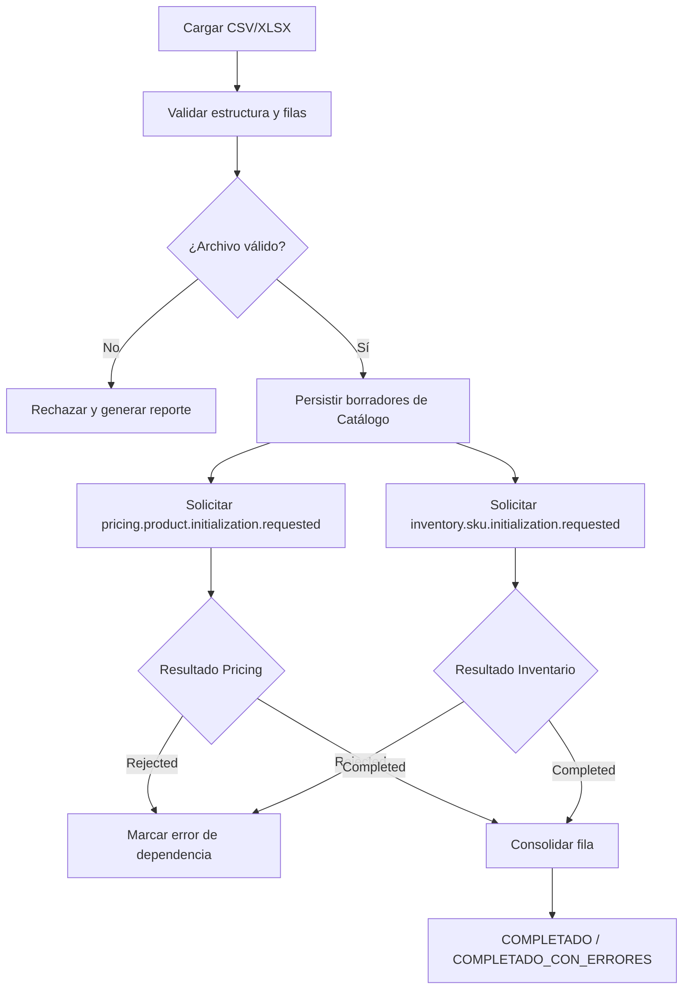

# FLOW-001 — Carga masiva de productos

## Reglas

- No existe rollback distribuido.
- Pricing se inicializa por producto.
- Inventario se inicializa por SKU vendible.
- Reintentos son idempotentes.
