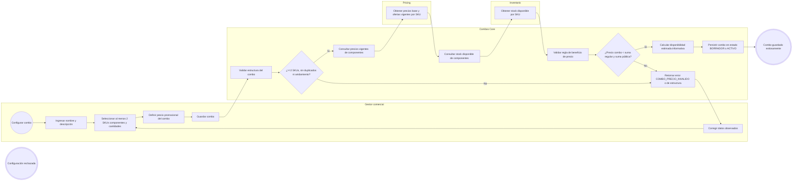
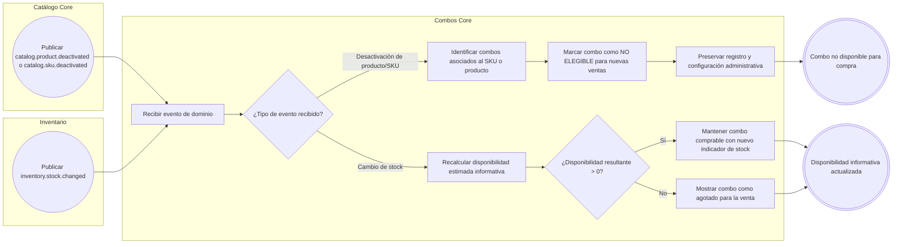

# FLOW-002 — Gestión de combos de productos

## 1. Identificación

- **Código:** FLOW-002
- **Funcionalidad:** Gestión de combos de productos
- **Relacionado con:** [HU-002](../hu/HU-002-gestion-combos-productos.md) / [SPEC-002](../specs/SPEC-002-gestion-combos-productos.md) / [WF-002](../wireframes/flows/WF-002-gestion-combos-productos.md)
- **Responsable:** Marco Renato Castilla Huanca
- **Última actualización:** 2026-09-30

---

## 2. Objetivo del flujo

Representar la administración y ciclo de vida de los combos como oferta comercial agrupada (validación de componentes directos, sin anidamiento ni duplicados, comprobación de beneficio económico en precio y cálculo de disponibilidad estimada informativa sin duplicar stock maestro), la reactividad asíncrona ante eventos de catálogo e inventario (desactivación de componentes provocando la no elegibilidad para nuevas compras), y la orquestación del flujo de compra y checkout conducido por el módulo Ventas/Postventa (reserva de existencias en Inventario, consumo de cupón en Promociones solo tras reserva exitosa, y compensaciones diferenciadas ante fallos de pago o cancelación).

---

## 3. Actores participantes

- **Gestor comercial:** crea, edita, consulta y desactiva combos desde el módulo de administración.
- **Combos Core (`combos-svc`):** valida la configuración estructural, calcula la disponibilidad estimada informativa, gestiona el estado comercial del combo y reacciona ante eventos de dominio.
- **Pricing (`pricing-svc`):** provee los precios regulares y públicos vigentes de los componentes para verificar la regla de ventaja económica.
- **Inventario (`inventory-svc`):** provee stock disponible de componentes para la estimación y procesa reservas y consumos solicitados por Ventas.
- **Promociones / Cupones (`promotions-svc`):** valida cupones sin consumirlos durante la evaluación previa y ejecuta el consumo o restitución asíncrona solicitado por Ventas.
- **Módulo de Ventas / Checkout (`modulo-ventas`):** orquesta el pedido de compra del combo, coordinando la reserva de stock de componentes, el consumo condicional de cupones y la liberación selectiva según el estado de cada recurso.

---

## 4. Diagramas de flujo

### 4.1 Creación y edición administrativa del combo

> **Regla de beneficio de precio y disponibilidad informativa:** Conforme a SPEC-002 y HU-002, el precio del combo debe garantizar una ventaja económica frente a la compra individual, siendo estrictamente menor que la suma de precios regulares y la suma de precios públicos vigentes (`COMBO_PRECIO_INVALIDO`). La disponibilidad estimada es puramente informativa (`min(floor(stock_i / qty_i))`); el combo no reserva stock ni crea saldos propios en inventario.

---

### 4.2 Reacción asíncrona ante desactivación de componentes o cambios de stock

> **Diferenciación entre administración y disponibilidad comercial:** Si un componente del combo es desactivado en Catálogo, el combo deja inmediatamente de ser elegible/comprable para nuevas ventas, pero no se elimina su definición administrativa histórica. Cuando el stock de un componente varía, se recalcula la disponibilidad informativa sin alterar los precios maestros ni las reglas de composición.

---

### 4.3 Compra de combo en Checkout (Orquestada por Ventas)

```mermaid
flowchart LR

    subgraph CANAL["Cliente / Canal de Venta"]
        direction TB
        INICIO_CHK((Iniciar checkout))
        CHK1["Seleccionar combo elegible y agregar al carrito"]
        CHK2["Ingresar cupón de descuento opcional"]
        CHK3["Confirmar intención de compra"]
        CHK4["Completar pago en pasarela"]
        CHK5["Visualizar confirmación de pedido"]
        CHK6["Visualizar error de checkout"]
    end

    subgraph VENTAS["Módulo Ventas / Postventa"]
        direction TB
        V1["Crear pedido en estado CREADO"]
        V2["Solicitar reserva de stock por cada SKU componente"]
        D_RES{"¿Reserva de existencias exitosa?"}
        D_CUP{"¿Pedido incluye cupón de descuento?"}
        V3["Publicar promotions.coupon.consumption.requested"]
        D_CONS{"¿Consumo de cupón aprobado?"}
        V4["Habilitar intento de cobro al cliente"]
        D_PAG{"¿Pago exitoso?"}
        V5["Cambiar pedido a PAGADO y confirmar consumo de reserva"]
        V_FAIL_RES["Cancelar pedido por falta de existencias"]
        V_FAIL_CUP["Cancelar pedido y solicitar liberación de reserva de stock"]
        D_CUP_PREV{"¿Pedido tenía cupón consumido?"}
        V_FAIL_PAG_SIN_CUP["Cancelar pedido y solicitar liberación de reserva"]
        V_FAIL_PAG_CON_CUP["Cancelar pedido, solicitar liberación y restitución de cupón"]
    end

    subgraph INVENTARIO["Inventario"]
        direction TB
        INV1["Verificar disponibilidad y crear reserva por SKU"]
        INV2["Consumir reserva definitivamente"]
        INV3["Liberar reserva de stock"]
    end

    subgraph PROMOCIONES["Promociones / Cupones"]
        direction TB
        PR1["Validar cupón (POST /cupones/validar sin consumir)"]
        PR2["Procesar consumo asíncrono con customer_ref"]
        PR3["Procesar promotions.coupon.restoration.requested"]
    end

    FIN_COMPRA_OK(((Pedido de combo pagado y confirmado)))
    FIN_COMPRA_FAIL(((Pedido cancelado y recursos gestionados)))

    INICIO_CHK --> CHK1
    CHK1 --> CHK2
    CHK2 --> PR1
    PR1 --> CHK3
    CHK3 --> V1
    V1 --> V2
    V2 --> INV1
    INV1 --> D_RES

    %% Fallo en reserva: no hay stock reservado ni cupón consumido
    D_RES -->|"No"| V_FAIL_RES
    V_FAIL_RES --> CHK6
    CHK6 --> FIN_COMPRA_FAIL

    %% Reserva exitosa -> evaluar cupón
    D_RES -->|"Sí"| D_CUP
    D_CUP -->|"No"| V4
    D_CUP -->|"Sí"| V3
    V3 --> PR2
    PR2 --> D_CONS

    %% Fallo en consumo de cupón: liberar reserva, pero no restituir cupón porque nunca se consumió
    D_CONS -->|"No (Rejected)"| V_FAIL_CUP
    V_FAIL_CUP --> INV3
    INV3 --> CHK6

    %% Cupón completado -> habilitar cobro
    D_CONS -->|"Sí (Completed)"| V4
    V4 --> CHK4
    CHK4 --> D_PAG

    %% Pago exitoso
    D_PAG -->|"Sí"| V5
    V5 --> INV2
    INV2 --> CHK5
    CHK5 --> FIN_COMPRA_OK

    %% Pago fallido: bifurcar según si se consumió cupón previamente
    D_PAG -->|"No"| D_CUP_PREV
    D_CUP_PREV -->|"No"| V_FAIL_PAG_SIN_CUP
    V_FAIL_PAG_SIN_CUP --> INV3

    D_CUP_PREV -->|"Sí"| V_FAIL_PAG_CON_CUP
    V_FAIL_PAG_CON_CUP --> INV3
    V_FAIL_PAG_CON_CUP --> PR3
    PR3 --> CHK6
```

> **Orquestación y compensaciones selectivas en checkout:**
> 1. Si la reserva de inventario falla, se cancela el pedido de forma directa: no existen reservas que liberar ni cupón que restaurar.
> 2. Si el consumo de cupón es rechazado por Promociones (`Rejected`), se libera la reserva de stock previamente confirmada; no se solicita restitución de cupón ya que este no llegó a consumirse.
> 3. Si el pago falla y el pedido **no** incluía cupón, únicamente se libera la reserva de existencias en Inventario.
> 4. Si el pago falla y el pedido **sí** consumió cupón (`Completed`), se libera la reserva en Inventario y simultáneamente se emite la solicitud asíncrona de restitución a Promociones (`promotions.coupon.restoration.requested`).

---

## 5. Reglas de consistencia y negocio

1. **Composición estructural del combo:** Todo combo debe contener como mínimo 2 componentes SKU vendibles directos, sin admitir combinaciones con otros combos (prohibición de anidamiento) ni SKUs duplicados dentro del mismo combo.
2. **Ventaja económica garantizada:** Conforme a SPEC-002 y HU-002, el precio promocional del combo debe ser estrictamente mayor a cero y estrictamente menor tanto a la suma de precios regulares como a la suma de precios públicos vigentes de los componentes individuales (`COMBO_PRECIO_INVALIDO`).
3. **Disponibilidad informativa:** El combo no crea registros de stock ni reserva saldos de manera autónoma. La disponibilidad mostrada en catálogo y backoffice es un indicador calculado derivado de los componentes disponibles.
4. **Desactivación de componentes:** La desactivación de un producto o SKU componente (`catalog.product.deactivated` / `catalog.sku.deactivated`) inhabilita la compra del combo en los canales de venta, conservando la configuración del combo en el sistema administrativo.
5. **Validación vs. Consumo de cupones:** La consulta previa de cupones (`POST /cupones/validar`) no genera mutación de estado. El consumo efectivo solo lo solicita Ventas tras asegurar la reserva de existencias mediante `promotions.coupon.consumption.requested`.
6. **Compensación estricta y desacoplada:** El módulo Ventas/Postventa coordina de forma selectiva las cancelaciones: no emite comandos de restitución de cupón si este no fue consumido previamente, ni intenta liberar existencias si la reserva nunca llegó a confirmarse.
