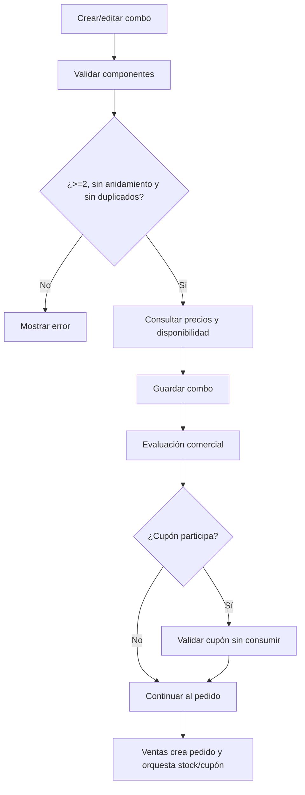

# FLOW-002 — Gestión de combos

```mermaid
flowchart TD
    A["Crear/editar combo"] --> B["Validar componentes"]
    B --> C{"¿>=2, sin anidamiento y sin duplicados?"}
    C -->|No| X["Mostrar error"]
    C -->|Sí| D["Consultar precios y disponibilidad"]
    D --> E["Guardar combo"]
    E --> F["Evaluación comercial"]
    F --> G{"¿Cupón participa?"}
    G -->|No| H["Continuar al pedido"]
    G -->|Sí| I["Validar cupón sin consumir"]
    I --> H
    H --> J["Ventas crea pedido y orquesta stock/cupón"]
```

El combo no reserva stock ni consume cupón directamente.
