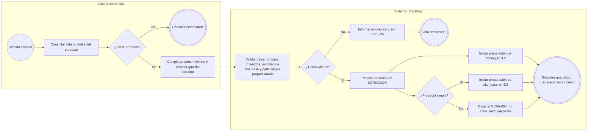
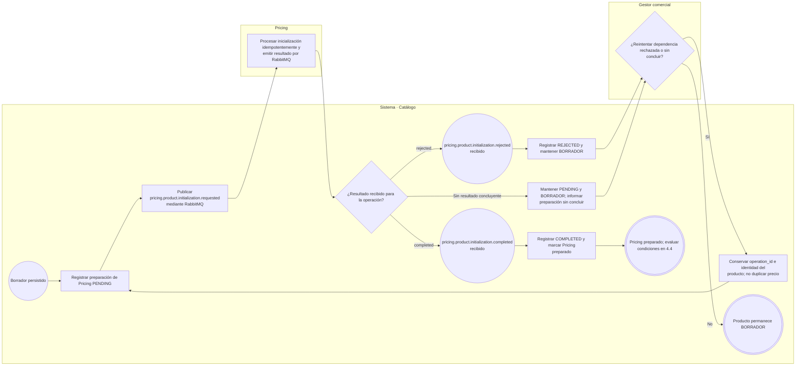
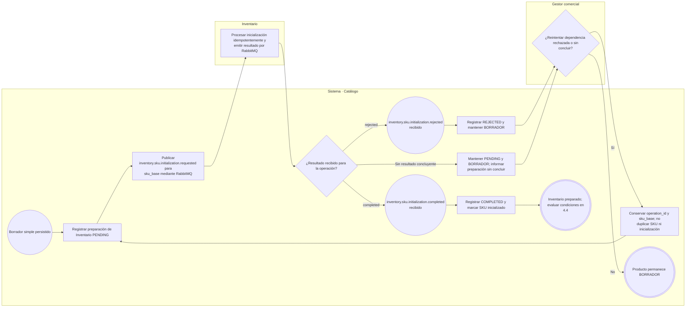
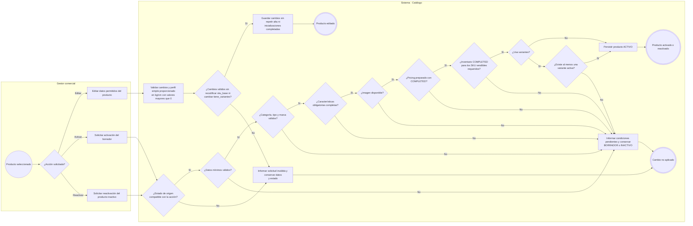
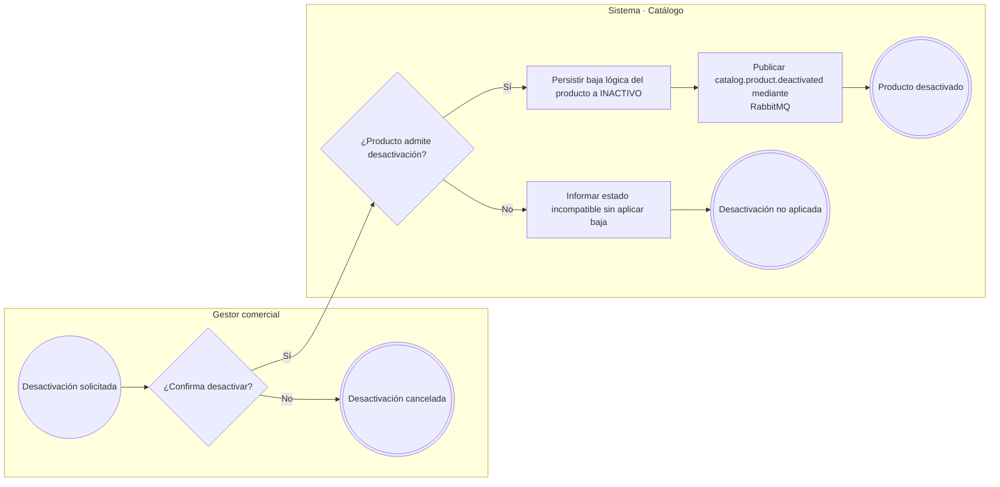

# FLOW-003 — Gestión de productos (CRUD principal)

## 1. Identificación

- **Código:** FLOW-003.
- **Funcionalidad:** Gestión de productos (CRUD principal).
- **Relacionado con:** [SPEC-003](../specs/SPEC-003-gestion-productos-crud.md) / [WF-003](../wireframes/flows/WF-003-gestion-productos-crud.md) / [índice WF-003](../wireframes/prototipos/WF-003-gestion-productos-crud/index.html) / [HU-003](../hu/HU-003-gestion-productos-crud.md).
- **Responsable:** Gabriel Poma Gutierrez.
- **Última actualización:** 2026-10-02.
- **Contratos consultados:** [OpenAPI vigente 0.5.0](../api/openapi.yaml) y [AsyncAPI 0.4.0](../asyncapi/asyncapi.yaml). Se conservan las extensiones vigentes de las fuentes.

## 2. Objetivo del flujo

Representar consulta, creación en `BORRADOR`, preparación asíncrona de precio e inventario, edición, activación, desactivación lógica y reactivación. Solo una confirmación de la dependencia permite considerarla preparada.

## 3. Actores participantes

- **Gestor comercial:** consulta y administra productos, solicita cambios de estado y reintenta preparaciones.
- **Sistema (Catálogo):** valida, persiste y coordina las dependencias mediante RabbitMQ.
- **Pricing e Inventario:** procesan las inicializaciones y emiten sus resultados.

## 4. Diagrama de flujo

### 4.1. Consulta y creación del borrador

Los datos mínimos son nombre, descripción, categoría, tipo de producto, marca, `sku_base`, `tiene_variantes` y precio base inicial. Guardar borrador no exige imagen, características completas ni datos físicos completos. Si se registra perfil físico simple, se valida `pesoKg > 0`, `largoCm > 0`, `anchoCm > 0`, `altoCm > 0`, usando kg y cm. El padre con variantes no tiene perfil físico ni saldo propios. Las preparaciones son independientes y se inician después de persistir el borrador.

### 4.2. Preparación de Pricing y reintento

El comando contiene `product_id`, `sku_base`, `precio_regular`, `moneda`, `channel_id=null` y `motivo_cambio=ALTA_PRODUCTO`. `COMPLETED` acredita el primer precio persistido; Pricing publica `pricing.price.changed` después de su commit. No se inicializa precio base por variante.

### 4.3. Preparación de Inventario del producto simple y reintento

Para producto simple, `sku=sku_base` y `variant_id=null`. El padre con variantes no ejecuta esta inicialización: cada SKU vendible se prepara desde FLOW-004. Un resultado exitoso de una dependencia no completa la otra; solo se reintenta la pendiente o rechazada, conservando su propia identidad de operación.

### 4.4. Edición, activación y reactivación

Reactivar usa las mismas comprobaciones de activación y conserva la identidad. `sku_base` no se recodifica por edición ordinaria; `tiene_variantes` no cambia tras publicar la identidad. Preparación completa no activa automáticamente el producto: el gestor solicita el cambio. Un rechazo de inicialización durante el alta mantiene `BORRADOR`, sin rollback distribuido ni deshacer lo que otra dependencia ya completó.

### 4.5. Desactivación lógica

RabbitMQ realiza el fan-out de `catalog.product.deactivated` a los consumidores declarados en AsyncAPI 0.4.0 (`promotions-svc`, `combos-svc`, `api-gateway/bff`); Catálogo no realiza llamadas directas a ellos. La baja conserva identidad y bloquea resolución comercial mientras el producto esté inactivo. Estar `ACTIVO` no garantiza visibilidad en todos los canales: también aplica la elegibilidad comercial de SPEC-003.

## 5. Reglas de preparación y trazabilidad

| Estado de preparación | Evidencia | Resultado funcional |
|---|---|---|
| `PENDING` | Se publicó `requested`, aún sin resultado concluyente. | Mantener borrador y bloquear activación. |
| `COMPLETED` | Se recibió `completed` de la operación correspondiente. | Marcar esa dependencia preparada y revalidar las demás condiciones. |
| `REJECTED` | Se recibió `rejected` de la operación correspondiente. | Mantener borrador, informar rechazo y permitir reintento idempotente. |

- Estos estados describen cada inicialización, no sustituyen el estado del producto.
- Los reintentos conservan `operation_id`; se deduplican mensajes por `message_id` conforme a AsyncAPI. No duplican producto, precio, SKU ni inicializaciones.
- Los nombres de mensajes y estados técnicos documentan la integración; la interfaz muestra mensajes operativos según WF-003.
- Se conserva la prioridad solicitada: SPEC → documentación WF → índice WF → HU; los nombres y transporte de mensajes se contrastan con AsyncAPI.
