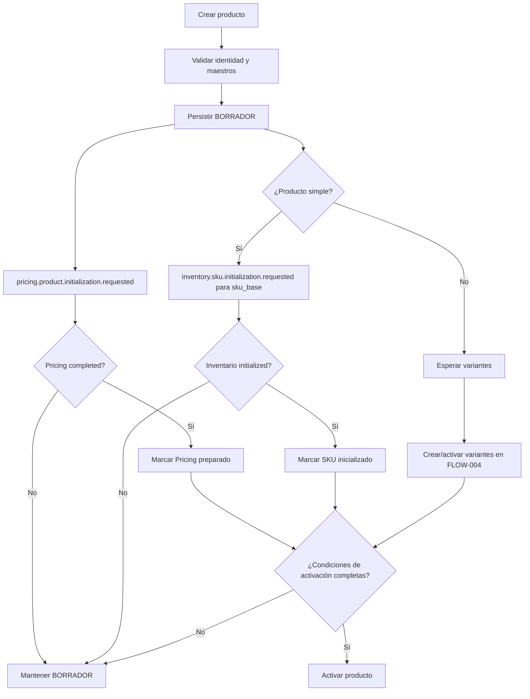

# FLOW-003 — Gestión de productos

```mermaid
flowchart TD
    A["Crear producto"] --> B["Validar identidad y maestros"]
    B --> C["Persistir BORRADOR"]
    C --> D["pricing.product.initialization.requested"]
    C --> E{"¿Producto simple?"}
    E -->|Sí| F["inventory.sku.initialization.requested para sku_base"]
    E -->|No| G["Esperar variantes"]
    D --> H{"Pricing completed?"}
    F --> I{"Inventario initialized?"}
    H -->|No| P["Mantener BORRADOR"]
    I -->|No| P
    H -->|Sí| J["Marcar Pricing preparado"]
    I -->|Sí| K["Marcar SKU inicializado"]
    G --> L["Crear/activar variantes en FLOW-004"]
    J --> M{"¿Condiciones de activación completas?"}
    K --> M
    L --> M
    M -->|No| P
    M -->|Sí| N["Activar producto"]
```

## Reglas

- El borrador se persiste antes de coordinar dependencias.
- `requested` no equivale a `completed`.
- No se inventa una transacción distribuida.
