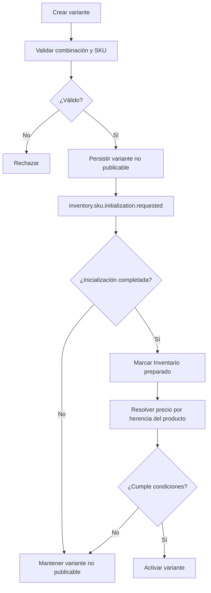

# FLOW-004 — Gestión de variantes y SKU

```mermaid
flowchart TD
    A["Crear variante"] --> B["Validar combinación y SKU"]
    B --> C{"¿Válido?"}
    C -->|No| X["Rechazar"]
    C -->|Sí| D["Persistir variante no publicable"]
    D --> E["inventory.sku.initialization.requested"]
    E --> F{"¿Inicialización completada?"}
    F -->|No| G["Mantener variante no publicable"]
    F -->|Sí| H["Marcar Inventario preparado"]
    H --> I["Resolver precio por herencia del producto"]
    I --> J{"¿Cumple condiciones?"}
    J -->|Sí| K["Activar variante"]
    J -->|No| G
```

Crear variante no dispara `pricing.product.initialization.requested`.
