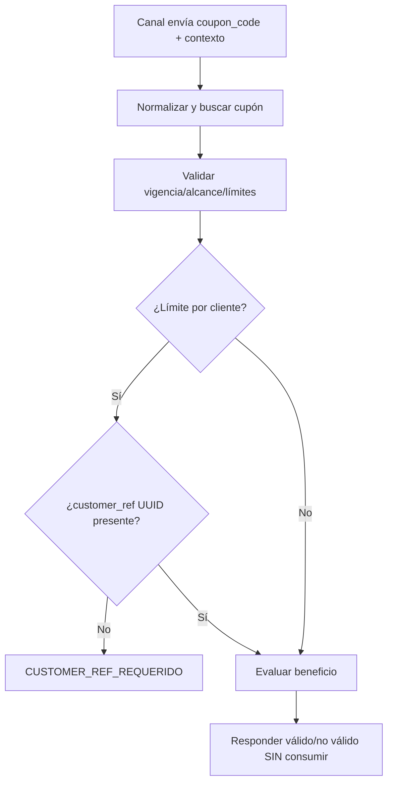
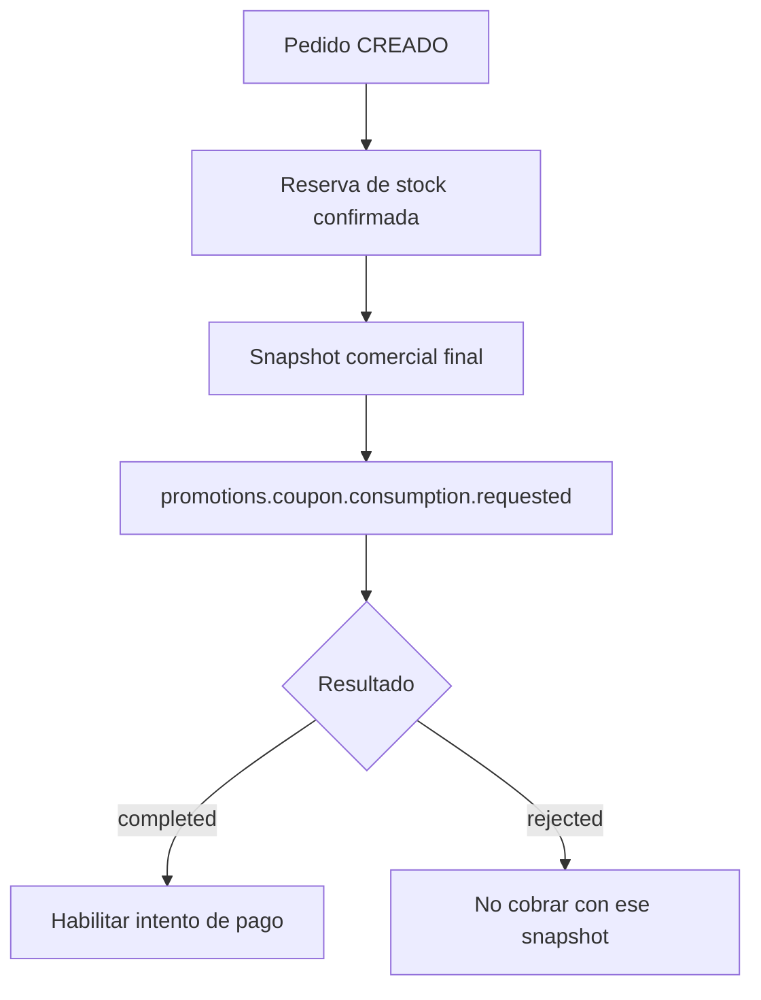
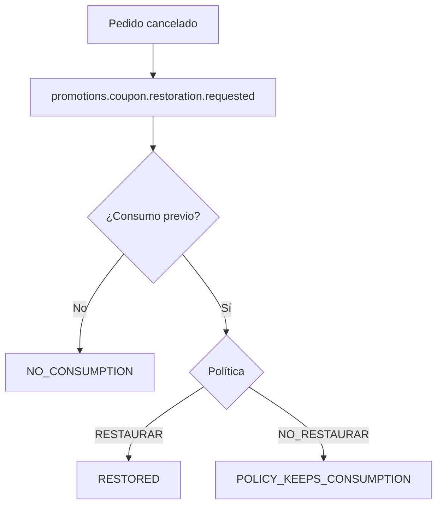

# FLOW-005 — Cupones de descuento

## Validación

```mermaid
flowchart TD
    A["Canal envía coupon_code + contexto"] --> B["Normalizar y buscar cupón"]
    B --> C["Validar vigencia/alcance/límites"]
    C --> D{"¿Límite por cliente?"}
    D -->|Sí| E{"¿customer_ref UUID presente?"}
    E -->|No| X["CUSTOMER_REF_REQUERIDO"]
    E -->|Sí| F["Evaluar beneficio"]
    D -->|No| F
    F --> G["Responder válido/no válido SIN consumir"]
```

## Consumo

```mermaid
flowchart TD
    A["Pedido CREADO"] --> B["Reserva de stock confirmada"]
    B --> C["Snapshot comercial final"]
    C --> D["promotions.coupon.consumption.requested"]
    D --> E{"Resultado"}
    E -->|completed| F["Habilitar intento de pago"]
    E -->|rejected| G["No cobrar con ese snapshot"]
```

## Restitución

```mermaid
flowchart TD
    A["Pedido cancelado"] --> B["promotions.coupon.restoration.requested"]
    B --> C{"¿Consumo previo?"}
    C -->|No| D["NO_CONSUMPTION"]
    C -->|Sí| E{"Política"}
    E -->|RESTAURAR| F["RESTORED"]
    E -->|NO_RESTAURAR| G["POLICY_KEEPS_CONSUMPTION"]
```
