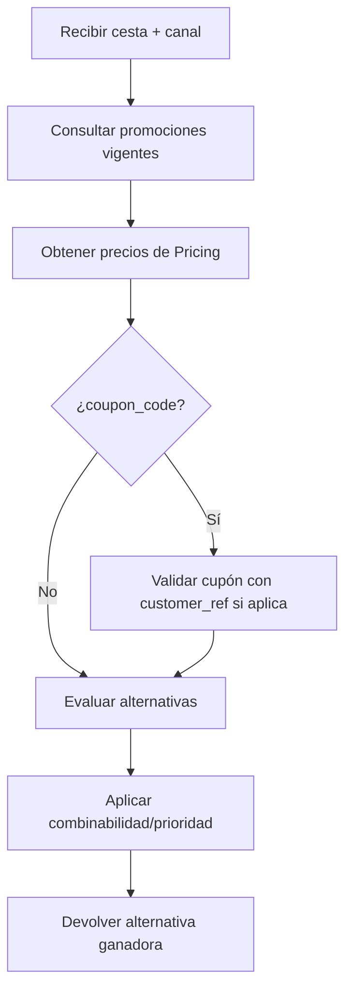

# FLOW-006 — Evaluación de promociones

```mermaid
flowchart TD
    A["Recibir cesta + canal"] --> B["Consultar promociones vigentes"]
    B --> C["Obtener precios de Pricing"]
    C --> D{"¿coupon_code?"}
    D -->|Sí| E["Validar cupón con customer_ref si aplica"]
    D -->|No| F["Evaluar alternativas"]
    E --> F
    F --> G["Aplicar combinabilidad/prioridad"]
    G --> H["Devolver alternativa ganadora"]
```

La evaluación no consume cupón, no crea pedido y no reserva inventario.
