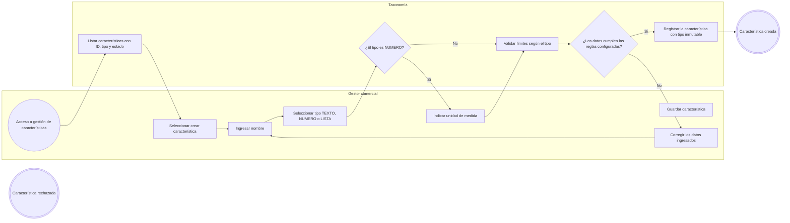
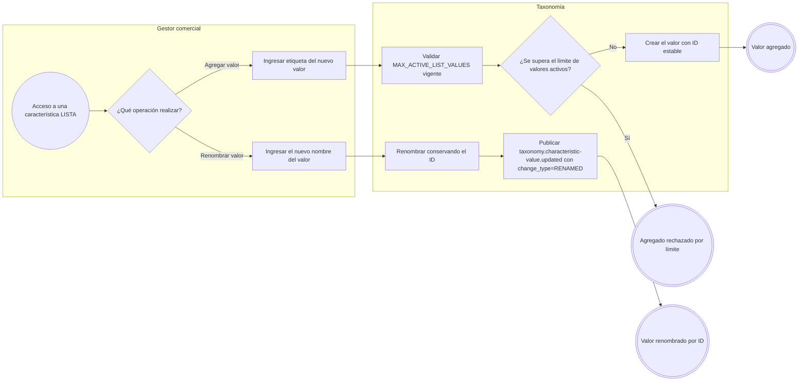
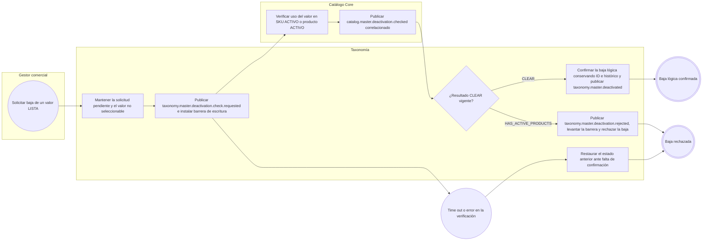
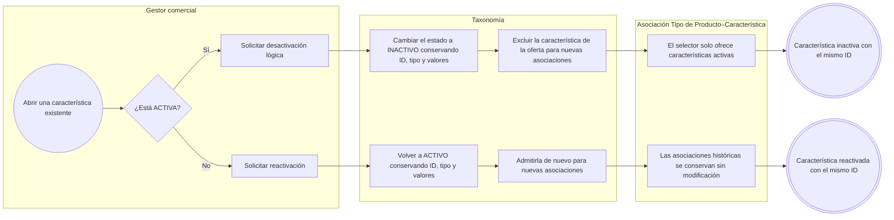

# FLOW-009 — Gestión de características y sus valores

## 1. Identificación

- **Código:** FLOW-009
- **Funcionalidad:** Gestión de características y sus valores
- **Relacionado con:** [HU-009](../hu/HU-009-gestion-caracteristicas.md) / [SPEC-009](../specs/SPEC-009-gestion-caracteristicas.md) / [WF-009](../wireframes/flows/WF-009-gestion-caracteristicas.md)
- **Responsable:** Leonardo Lopez
- **Última actualización:** 2026-10-01

---

## 2. Objetivo del flujo

Representar la creación de características tipadas (`TEXTO`, `NUMERO`, `LISTA`), la gestión de valores de tipo `LISTA` (agregar, renombrar por ID y baja lógica), la desactivación lógica y la reactivación de una característica completa conservando su ID, y la protección del tipo inmutable. El flujo contempla los límites operativos configurables (`MAX_TEXT_ATTRIBUTE_LENGTH = 100` y `MAX_ACTIVE_LIST_VALUES = 50`), la propagación del renombrado mediante `taxonomy.characteristic-value.updated` y la verificación asíncrona con Catálogo, mediante el protocolo transversal publicado, antes de dar de baja un valor en uso.

---

## 3. Actores participantes

- **Gestor comercial:** crea, consulta, renombra, desactiva y reactiva características y sus valores.
- **Taxonomía:** administra características tipadas, valores, sus límites operativos y su estado lógico.
- **Catálogo Core:** verifica el uso de un valor en SKUs o productos activos y confirma la baja segura.
- **Asociación Tipo de Producto–Característica (FLOW-010):** solo ofrece características activas para nuevas asociaciones.

---

## 4. Diagramas de flujo

### 4.1 Creación de una característica tipada

> El tipo de una característica es inmutable desde su creación; intentar cambiarlo se rechaza y se indica crear otra característica con un ID distinto.

### 4.2 Gestión de valores de tipo LISTA

> Renombrar un valor conserva su ID y la actualización de las vistas de Catálogo es por eventos. El renombrado confirmado de un valor `LISTA` publica explícitamente `taxonomy.characteristic-value.updated`; no se reescriben SKUs existentes ni snapshots de pedidos.

### 4.3 Baja segura de un valor LISTA

> La baja de un valor `LISTA` usa únicamente el protocolo transversal publicado para la entidad maestra `CHARACTERISTIC_VALUE`: `taxonomy.master.deactivation.check.requested` → `catalog.master.deactivation.checked` → `taxonomy.master.deactivated` o `taxonomy.master.deactivation.rejected`. El `202 Accepted` de `POST /api/v1/caracteristicas/{caracteristicaId}/valores/{valorId}/desactivar` es solo admisión de la solicitud, no una baja completada; el estado pendiente se consulta con `GET /api/v1/taxonomia/operaciones/{operationId}`. Durante la comprobación no se asigna el valor a nuevos productos o variantes. Un fallo o la ausencia de respuesta no autoriza la baja; los productos inactivos y pedidos históricos conservan sus referencias y snapshots.

### 4.4 Desactivación lógica y reactivación de una característica

> La desactivación de una característica completa es lógica: nunca se borra y su ID se conserva, por lo que la reactivación recupera exactamente la misma identidad junto con su tipo y sus valores. Una característica inactiva no se ofrece para nuevas asociaciones en FLOW-010, pero las asociaciones ya existentes y su histórico permanecen vigentes.
