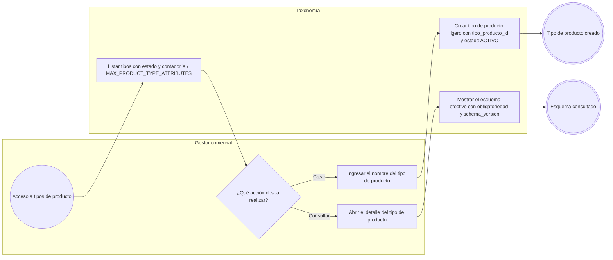
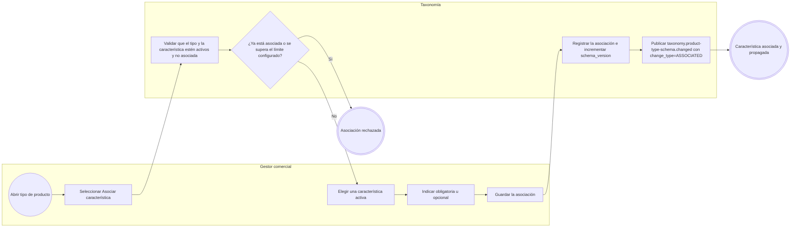
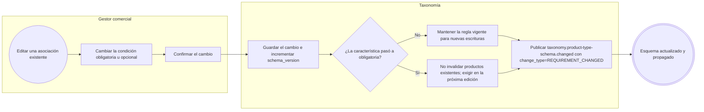
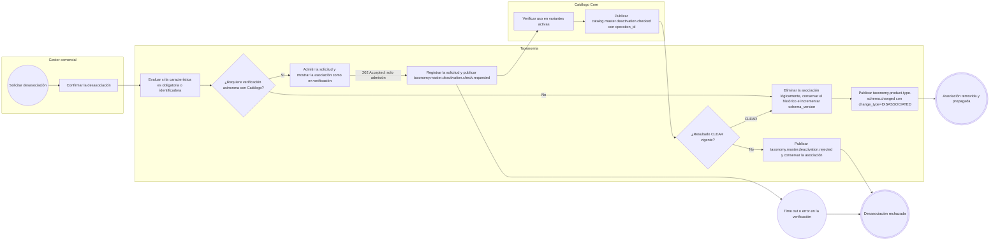
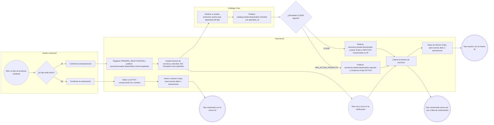
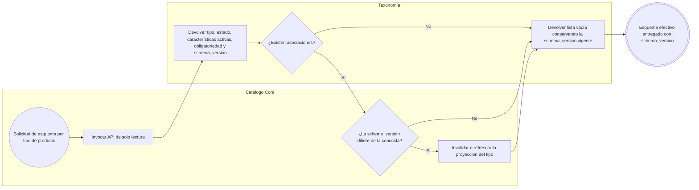
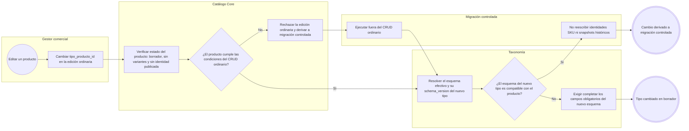

# FLOW-010 — Asociación entre tipos de producto y características

## 1. Identificación

- **Código:** FLOW-010
- **Funcionalidad:** Asociación entre tipos de producto y características
- **Relacionado con:** [HU-010](../hu/HU-010-asociacion-tipo-producto-caracteristica.md) / [SPEC-010](../specs/SPEC-010-asociacion-tipo-producto-caracteristica.md) / [WF-010](../wireframes/flows/WF-010-asociacion-tipo-producto-caracteristica.md)
- **Responsable:** Leonardo Lopez
- **Última actualización:** 2026-10-01

---

## 2. Objetivo del flujo

Representar la gestión de tipos de producto ligeros y su asociación con características activas, indicando obligatoriedad y respetando el límite configurable (`MAX_PRODUCT_TYPE_ATTRIBUTES = 20`). El flujo contempla la consulta del esquema efectivo con `schema_version`, el incremento de `schema_version` en **todo** cambio confirmado, la publicación de `taxonomy.product-type-schema.changed` en cada modificación confirmada —incluidos el cambio de obligatoriedad y la desasociación—, la desactivación y reactivación del tipo de producto con verificación segura cuando existen productos activos, la lectura del `202 Accepted` como simple admisión y la derivación del cambio de `tipo_producto_id` de productos publicados o con variantes a una migración controlada.

---

## 3. Actores participantes

- **Gestor comercial:** crea tipos de producto, administra asociaciones, obligatoriedad y estados.
- **Taxonomía:** mantiene el esquema de asociación, su `schema_version`, el límite configurable y publica los hechos del esquema.
- **Catálogo Core:** consulta el esquema efectivo, verifica el uso de un tipo de producto o de una característica antes de confirmar una baja y proyecta los cambios del esquema.

---

## 4. Diagramas de flujo

### 4.1 Creación y consulta de tipos de producto



### 4.2 Asociar una característica a un tipo de producto



> Las categorías de navegación no definen ni heredan características: el esquema de atributos se resuelve únicamente a través de `tipo_producto_id`. La asociación solo se publica cuando el cambio queda confirmado.

### 4.3 Cambio de obligatoriedad



> El cambio de obligatoriedad es un cambio de esquema confirmado: incrementa `schema_version` y se propaga a Catálogo mediante `taxonomy.product-type-schema.changed`.

### 4.4 Desasociación segura de una característica



> La desasociación de riesgo se solicita por `POST /api/v1/tipos-producto/{tipoProductoId}/caracteristicas/{caracteristicaId}/desasociar`, que responde `202 Accepted`: ese código es **solo admisión**. La asociación se retira únicamente al recibir un resultado `CLEAR` vigente, y solo entonces se incrementa `schema_version` y se publica `taxonomy.product-type-schema.changed`. El estado pendiente se consulta con `GET /api/v1/taxonomia/operaciones/{operationId}`.

### 4.5 Desactivación y reactivación de un tipo de producto



> La desactivación de `PRODUCT_TYPE` utiliza el protocolo transversal publicado. El `202 Accepted` de `POST /api/v1/tipos-producto/{tipoProductoId}/desactivar` es únicamente admisión: si existen productos activos la verificación responde uso incompatible y el tipo permanece activo; ante error o falta de respuesta tampoco se desactiva. `POST /api/v1/tipos-producto/{tipoProductoId}/reactivar` conserva el `tipo_producto_id` y vuelve a habilitar el tipo para nuevas operaciones.

### 4.6 Consulta del esquema por tipo de producto



> La `schema_version` forma parte del esquema efectivo en todas las respuestas, incluso cuando la lista de características está vacía. Catálogo la usa para detectar reglas obsoletas en una escritura concurrente y para refrescar su proyección.

### 4.7 Cambio de `tipo_producto_id` de un producto



> El cambio de `tipo_producto_id` solo pertenece al CRUD ordinario mientras el producto permanezca en borrador, sin variantes y sin identidad comercial publicada. En cuanto existen variantes o identidad publicada, el cambio se rechaza en la edición ordinaria y se deriva a una migración de modelo controlada.

## 5. Contratos publicados

Eventos del AsyncAPI 0.4.0 utilizados por esta capacidad:

```text
taxonomy.product-type-schema.changed
taxonomy.master.deactivation.check.requested
catalog.master.deactivation.checked
taxonomy.master.deactivated
taxonomy.master.deactivation.rejected
```

Rutas administrativas:

```text
GET   /api/v1/tipos-producto
POST  /api/v1/tipos-producto
GET   /api/v1/tipos-producto/{tipoProductoId}

POST  /api/v1/tipos-producto/{tipoProductoId}/desactivar
POST  /api/v1/tipos-producto/{tipoProductoId}/reactivar

GET   /api/v1/tipos-producto/{tipoProductoId}/caracteristicas
POST  /api/v1/tipos-producto/{tipoProductoId}/caracteristicas
PATCH /api/v1/tipos-producto/{tipoProductoId}/caracteristicas/{caracteristicaId}
POST  /api/v1/tipos-producto/{tipoProductoId}/caracteristicas/{caracteristicaId}/desasociar

GET   /api/v1/taxonomia/operaciones/{operationId}
```

`desactivar` y `desasociar` responden `202 Accepted` con `OperationAccepted`: es admisión de la solicitud, nunca el resultado final.
