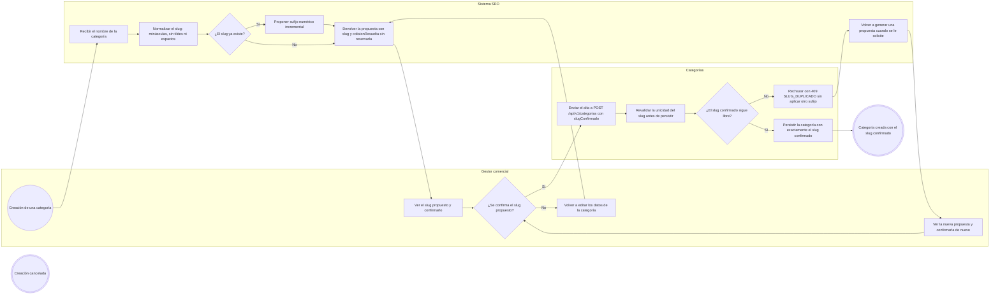
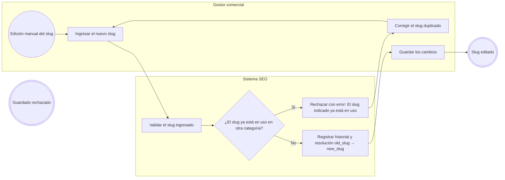
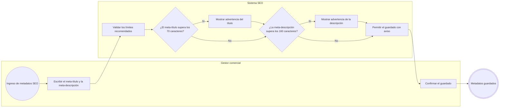
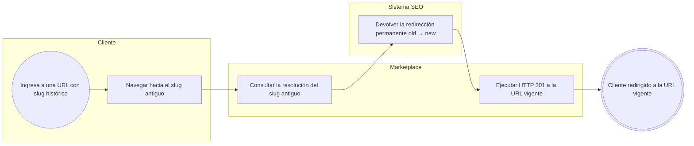
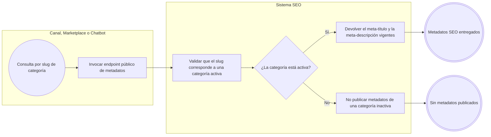

# FLOW-012 — Gestión de SEO y metadatos

## 1. Identificación

- **Código:** FLOW-012
- **Funcionalidad:** Gestión de SEO y metadatos
- **Relacionado con:** [HU-012](../hu/HU-012-seo-metadatos.md) / [SPEC-012](../specs/SPEC-012-seo-metadatos.md) / [WF-012](../wireframes/flows/WF-012-seo-metadatos.md)
- **Responsable:** Leonardo Lopez
- **Última actualización:** 2026-10-01

---

## 2. Objetivo del flujo

Representar la generación automática y la edición manual del slug de cada categoría, la política de duplicados (sufijo incremental en la creación y error explícito en la edición manual), las advertencias de longitud de metadatos y el historial de redirecciones. El flujo separa explícitamente SEO de Categorías: SEO solo resuelve y proporciona la propuesta de slug, el gestor la confirma y Categorías la persiste y revalida su unicidad. El flujo contempla la resolución `old_slug -> new_slug` que el Marketplace ejecuta como HTTP 301 y el endpoint público de metadatos por slug activo.

---

## 3. Actores participantes

- **Gestor comercial:** configura el slug y los metadatos SEO de cada categoría, y confirma la propuesta de slug durante la creación.
- **Sistema SEO:** normaliza slugs, resuelve colisiones, registra el historial y expone el endpoint público. No persiste el slug de la categoría.
- **Categorías:** crea la categoría con el `slugConfirmado` y revalida su unicidad.
- **Marketplace:** canal que sirve la URL pública y ejecuta el HTTP 301.
- **Consumidor externo:** canal que consulta los metadatos SEO por slug activo.

---

## 4. Diagramas de flujo

### 4.1 Resolución y confirmación del slug al crear una categoría



> En la creación, la colisión de slugs se resuelve con un sufijo incremental, pero el slug final siempre se muestra al gestor antes de publicar; no hay cambios silenciosos de URL.

> SEO **solo resuelve y proporciona la propuesta**: no persiste el slug de la categoría ni guarda silenciosamente otro valor. Quien crea y revalida la unicidad es Categorías, mediante `slugConfirmado` en `POST /api/v1/categorias`. La propuesta no reserva el slug, por lo que si otro proceso lo ocupa antes del commit la creación responde `409 SLUG_DUPLICADO` y el flujo vuelve a la resolución de SEO, muestra la nueva propuesta y exige una nueva confirmación antes de reintentar.

### 4.2 Edición manual de un slug



> En la edición manual no se autogeneran sufijos: el duplicado se rechaza con un error visible exigiendo un valor distinto.

### 4.3 Advertencias de longitud de metadatos



> Los límites de 70 y 160 caracteres son recomendados: se advierte al superarlos, pero no se bloquea el guardado.

### 4.4 Resolución de redirección de slug histórico



> Productos y Ofertas solo expone la resolución `old_slug -> new_slug`; la ejecución del HTTP 301 corresponde al capa web del Marketplace.

### 4.5 Endpoint público de metadatos por slug activo



## 5. Contratos publicados

```text
POST /api/v1/seo/categorias/slug/resolver
  { nombre }
  -> { slug, colisionResuelta }

POST /api/v1/categorias
  { .., slugConfirmado }
  -> 201 con el slug confirmado
  -> 409 SLUG_DUPLICADO si la propuesta dejó de estar disponible

GET  /api/v1/seo/{slug}
GET  /api/v1/seo/resoluciones/{slugAnterior}
GET  /api/v1/categorias/{categoriaId}/seo
GET  /api/v1/categorias/{categoriaId}/seo/historial
```

SEO no expone el alta de la categoría: esa operación pertenece a Categorías y exige `slugConfirmado`. El `301 Moved Permanently` sobre la URL pública no forma parte de estos contratos y lo ejecuta Marketplace.
