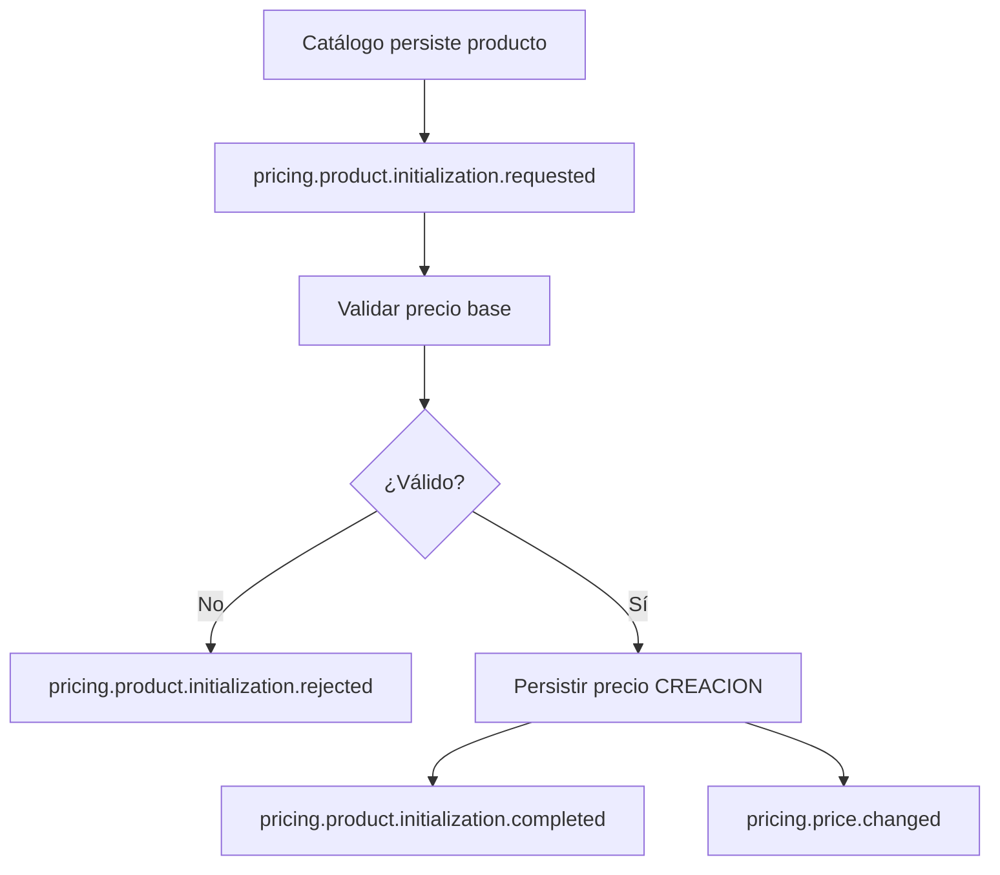
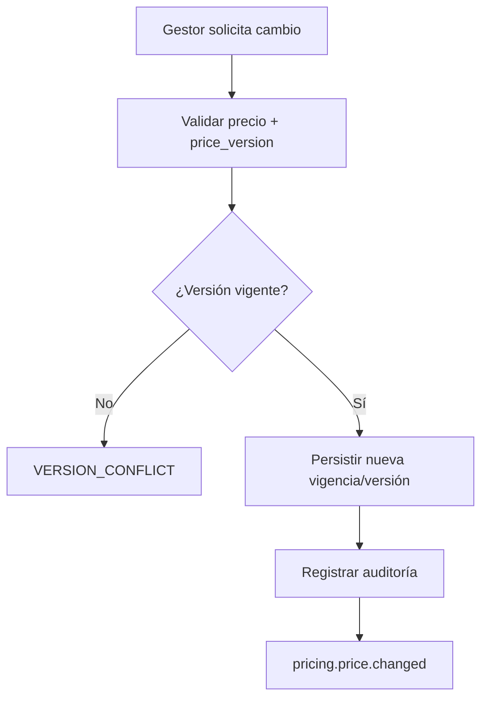

# FLOW-013 — Gestión de precios

## Alta inicial

```mermaid
flowchart TD
    A["Catálogo persiste producto"] --> B["pricing.product.initialization.requested"]
    B --> C["Validar precio base"]
    C --> D{"¿Válido?"}
    D -->|No| E["pricing.product.initialization.rejected"]
    D -->|Sí| F["Persistir precio CREACION"]
    F --> G["pricing.product.initialization.completed"]
    F --> H["pricing.price.changed"]
```

## Actualización normal

```mermaid
flowchart TD
    A["Gestor solicita cambio"] --> B["Validar precio + price_version"]
    B --> C{"¿Versión vigente?"}
    C -->|No| X["VERSION_CONFLICT"]
    C -->|Sí| D["Persistir nueva vigencia/versión"]
    D --> E["Registrar auditoría"]
    E --> F["pricing.price.changed"]
```

Una variante sin override hereda el precio del producto.
