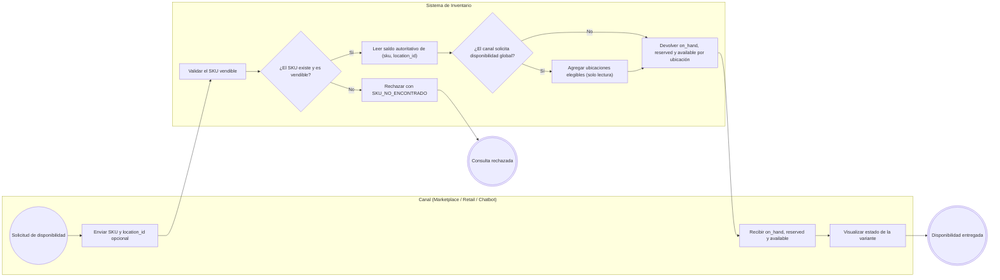
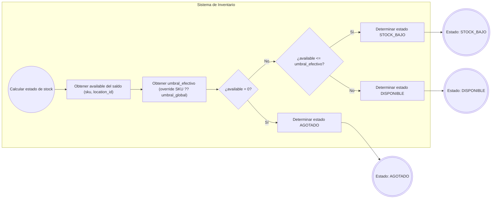
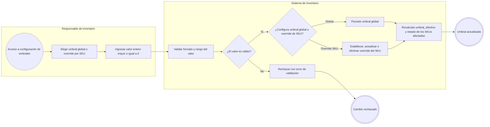
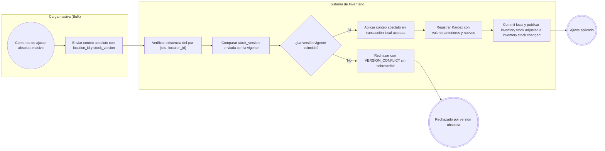
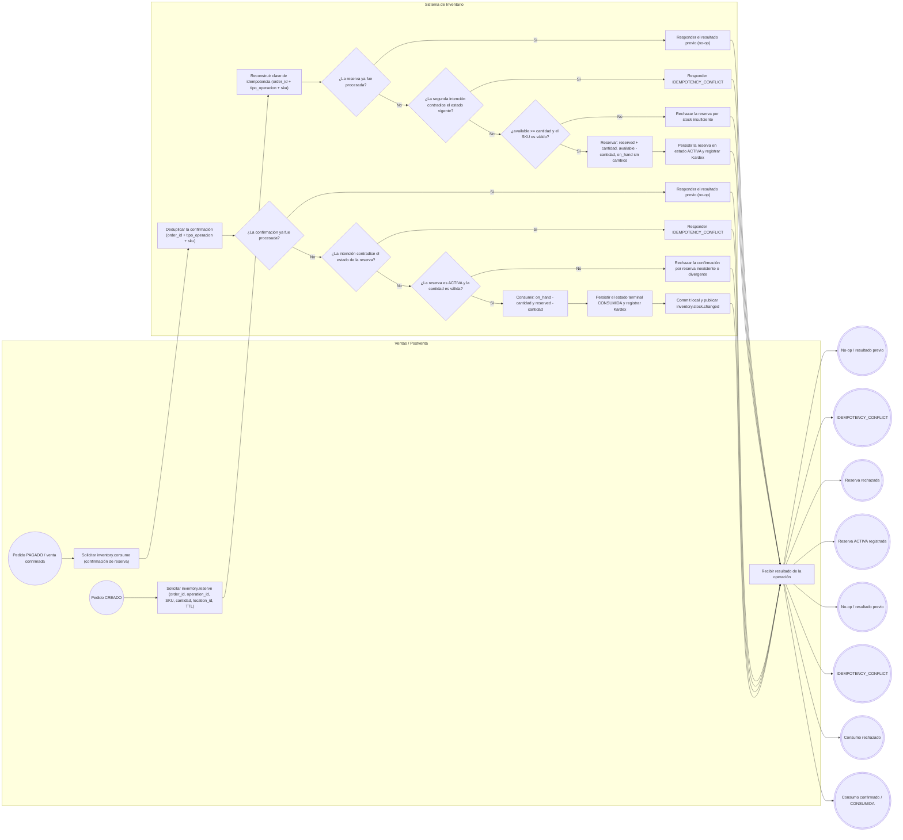
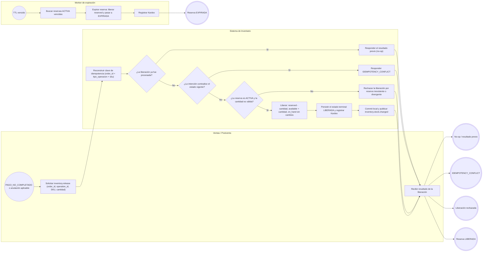
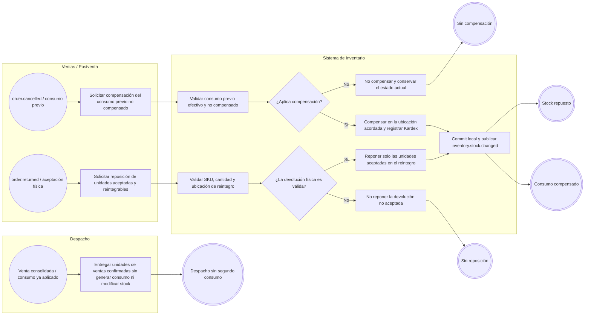

# FLOW-015 — Control de stock y disponibilidad

## 1. Identificación

- **Código:** FLOW-015
- **Funcionalidad:** Control de stock y disponibilidad
- **Relacionado con:** [HU-015](../hu/HU-015-control-stock-disponibilidad.md) / [SPEC-015](../specs/SPEC-015-control-stock-disponibilidad.md) / [WF-015](../wireframes/flows/WF-015-control-stock-disponibilidad.md)
- **Responsable:** Miguel Ángel Taco Zavala
- **Última actualización:** 2026-09-30

---

## 2. Objetivo del flujo

Representar el ciclo operativo del inventario: la consulta de disponibilidad por `(sku, location_id)`, la determinación determinista del estado de stock, la configuración de umbrales (global + override por SKU), el ciclo de reserva del pedido (`CREADO` → reserva, `PAGADO` → confirmación/consumo, liberación por pago no completado/anulación/TTL), las compensaciones y devoluciones provisionales, y el ajuste absoluto masivo con `stock_version`. El stock nunca puede quedar negativo, toda mutación autoritativa registra Kardex y se publica `inventory.stock.changed` solo después del commit.

---

## 3. Actores participantes

- **Canal (Marketplace / Retail / Chatbot):** consulta la disponibilidad; no resguarda ni muta stock.
- **Responsable de inventario:** configura umbrales y consulta saldos.
- **Ventas / Postventa:** solicita reserva, confirmación (consumo), liberación y compensaciones; decide el ciclo del pedido.
- **Despacho:** entrega unidades de ventas ya confirmadas sin generar consumo.
- **Worker de expiración:** libera reservas `ACTIVA` al vencer su TTL.
- **Carga masiva (Bulk):** solicita ajustes absolutos con `location_id` y `stock_version`.
- **Sistema de Inventario:** ejecuta las mutaciones idempotentes, registra Kardex y publica eventos.

---

## 4. Diagramas de flujo

### 4.1 Consulta de disponibilidad por SKU y ubicación

> La consulta devuelve el saldo autoritativo y no constituye reserva ni garantía de stock. Cuando solo existe `DEFAULT`, el canal puede omitir `location_id` sin ambigüedad.

---

### 4.2 Determinación del estado de stock

---

### 4.3 Configuración de umbrales (global y override por SKU)

> La jerarquía del umbral es `umbral_efectivo = override SKU ?? umbral_global`; el umbral aplica a nivel de SKU y no por ubicación. Al eliminar un override, el SKU vuelve a evaluar con el umbral global.

---

### 4.4 Ajuste absoluto masivo con control de concurrencia

---

### 4.5 Ciclo de reserva y confirmación de consumo

> La reserva modifica `reserved`/`available`, nunca `on_hand`. El consumo confirmado reduce `on_hand` y `reserved` simultáneamente. Si Ventas/Postventa no utiliza la fase de reserva, el consumo se valida directamente contra `available` con la confirmación acordada.

---

### 4.6 Liberación y expiración de reservas

> La liberación recupera `available` sin incrementar `on_hand`. Los estados `CONSUMIDA`, `LIBERADA` y `EXPIRADA` son terminales y no vuelven a `ACTIVA`. El reintento idéntico de una liberación ya aplicada es un no-op; una intención contradictoria responde `IDEMPOTENCY_CONFLICT`.

---

### 4.7 Compensaciones, devoluciones y delimitación de Despacho

> La política de devolución (total o parcial, incluidos combos) pertenece a Ventas/Postventa; Inventario solo repone unidades físicamente aceptadas y reintegrables. Una anulación administrativa posterior al despacho sin devolución física no repone stock.

---

## 5. Delimitaciones operativas del flujo

- Unidad operativa: `(sku, location_id)` con `available = max(on_hand - reserved, 0)`; el stock nunca queda negativo.
- Toda mutación autoritativa registra Kardex y el mensaje Outbox en la misma transacción local, y publica `inventory.stock.changed` solo después del commit local.
- Todos los hitos externos (`CREADO`, `PAGADO`, `PAGO_NO_COMPLETADO`, `order.cancelled`, `order.returned`) son contratos provisionales pendientes de homologación con Ventas/Postventa; un `202 Accepted` solo admite la solicitud, no confirma la operación de inventario.