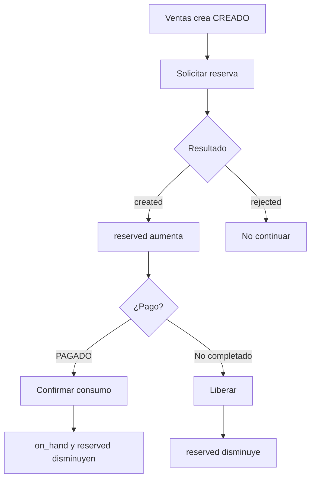
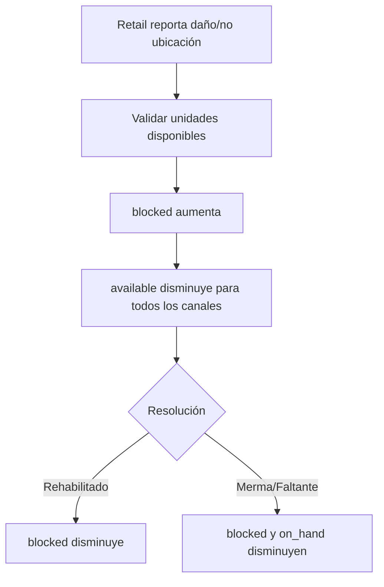
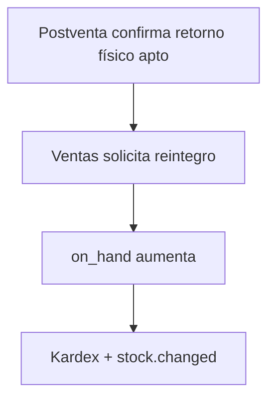
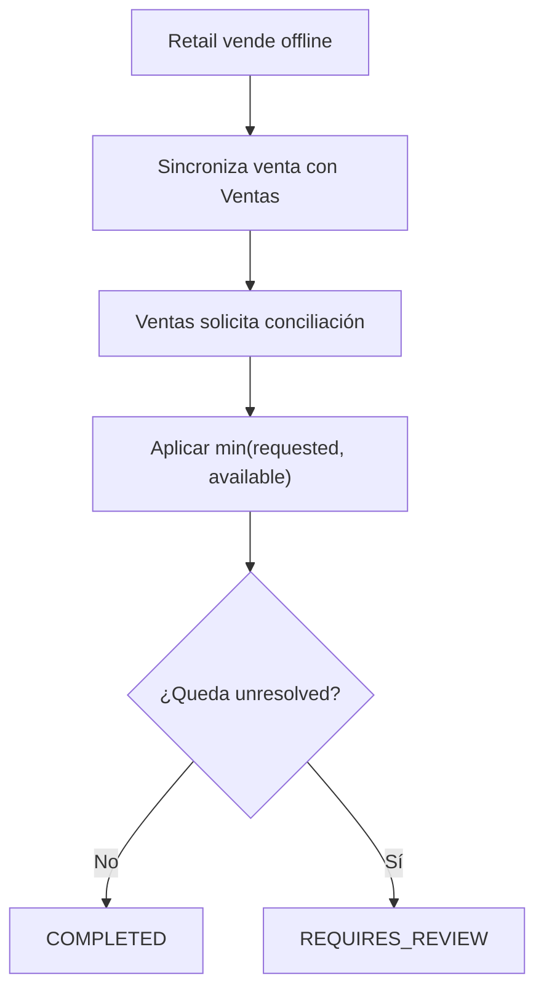
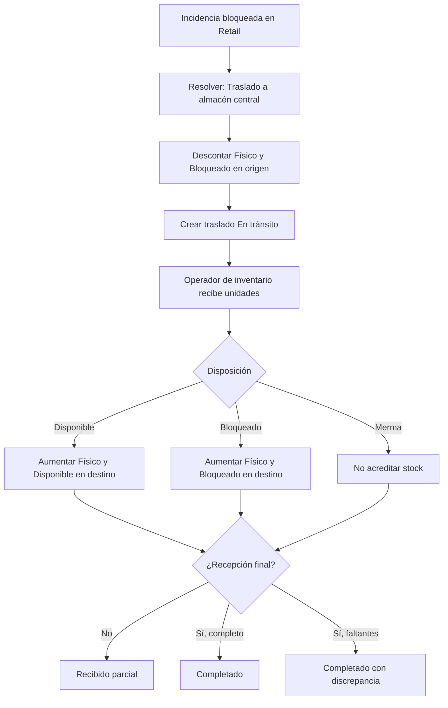

# FLOW-015 — Control de stock y disponibilidad


## Saldo

```text
available = max(on_hand - reserved - blocked, 0)
```

## Venta normal



## Incidencia física



## Reintegro



## Venta offline



## Inicialización de stock

```text
catalog-svc -> inventory.sku.initialization.requested
```

Solo aplica a SKU vendible.

## Traslado a almacén central


