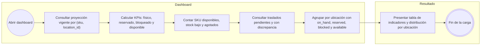
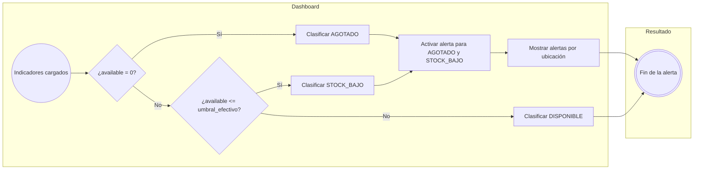
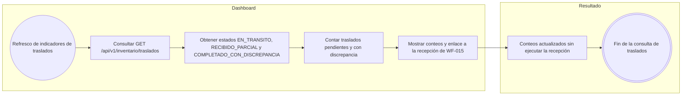
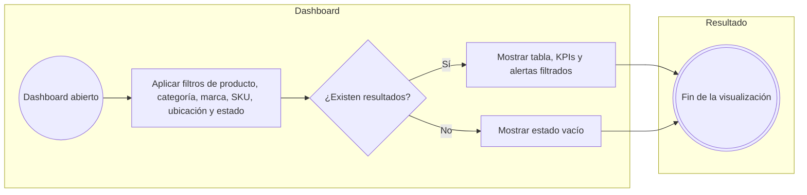

# FLOW-016 — Dashboard analítico y alertas de stock

---

## 1. Identificación

- **Código:** FLOW-016
- **Funcionalidad:** Dashboard analítico y alertas de stock
- **Relacionado con:** HU-016 / SPEC-016 / WF-016
- **Responsable:** Miguel Ángel Taco Zavala
- **Última actualización:** 2026-10-02

---

## 2. Objetivo del flujo

Representar la carga, agrupación y actualización de las proyecciones del dashboard de solo lectura: cálculo de indicadores por SKU y ubicación, determinación del estado de disponibilidad, generación de alertas y reactividad ante `inventory.stock.changed`, incluyendo la consulta de traslados sin emitir eventos ni modificar saldos.

---

## 3. Actores participantes

- Gestor comercial con capacidades de consulta de inventario
- Sistema de Inventario (inventory-svc): autoridad del saldo, productor de `inventory.stock.changed` y owner del dominio de Inventario y del dashboard operativo
- Broker RabbitMQ (transporte del evento según AsyncAPI/topología 0.4.0)
- api-gateway/bff: consumidor técnico de `inventory.stock.changed`
- Dashboard UI: interfaz de consulta/refresco sobre proyección de solo lectura

---

## 4. Diagramas de flujo

### 4.1 Carga y agrupación de indicadores

### 4.2 Determinación de estados y alertas

### 4.3 Reactividad ante inventory.stock.changed

```mermaid
flowchart LR
    subgraph INV["Sistema de Inventario (inventory-svc)"]
        direction TB
        A0["Mutación autoritativa de saldo confirmada tras el commit"]
        A1["Productor: publicar inventory.stock.changed"]
    end

    subgraph INTER["Broker RabbitMQ (transporte AsyncAPI 0.4.0)"]
        direction TB
        E1(("inventory.stock.changed"))
    end

    subgraph BFF["api-gateway/bff (consumidor técnico)"]
        direction TB
        A2["Consumir y validar contra el contrato AsyncAPI 0.4.0"]
        A3["Actualizar read model / proyección sin trasladar reglas de negocio de saldo"]
    end

    subgraph DASH["Dashboard UI (interfaz de consulta/refresco)"]
        direction TB
        A4["Consultar la proyección de los saldos afectados"]
        A5["Recalcular KPIs, estados y alertas"]
        D1{"¿La mutación fue una recepción de traslado?"}
        A6["Refrescar KPIs de traslados por consulta GET /api/v1/inventario/traslados"]
        A7["Refrescar vista sin republicar eventos ni mutar saldos"]
    end

    subgraph RES["Resultado"]
        direction TB
        FIN(((Fin de la actualización)))
    end

    A0 --> A1
    A1 --> E1
    E1 --> A2
    A2 --> A3
    A3 --> A4
    A4 --> A5
    A5 --> D1
    D1 -->|"Sí"| A6
    D1 -->|"No"| A7
    A6 --> A7
    A7 --> FIN
```

### 4.4 KPIs de traslados por consulta

### 4.5 Filtros y caso sin resultados

---

## 5. Notas generales

- **Solo lectura:** el dashboard no publica eventos de Inventario ni modifica saldos ni Kardex (HU-016 CA-10, SPEC-016 §4).
- **Reactividad:** `inventory.stock.changed` es el evento funcional de actualización (SPEC-016 §4, HU-016 CA-07). inventory-svc es su productor; api-gateway/bff es su consumidor técnico (AsyncAPI/topología 0.4.0) y actualiza la proyección sin trasladar reglas de negocio de saldo; el Dashboard UI consulta y se refresca sin consumir RabbitMQ directamente (HU-016 CA-10).
- **Triggers funcionales:** solo `inventory.stock.changed` acciona la actualización del dashboard; `inventory.stock.adjusted` no es trigger funcional de FLOW-016 aunque el BFF también lo consuma (SPEC-016/HU-016).
- **Traslados:** no existe evento contractual de traslados; los KPIs se obtienen por consulta `GET /api/v1/inventario/traslados` y la recepción la ejecuta un gestor comercial autorizado en WF-015, no desde el dashboard (SPEC-016 §6). Un traslado con discrepancia no altera por sí mismo las unidades disponibles (HU-016 CA-11).
- **Estados:** `available = max(on_hand - reserved - blocked, 0)`; `AGOTADO` cuando `available = 0`, `STOCK_BAJO` cuando `0 < available <= umbral_efectivo` y `DISPONIBLE` en el resto (SPEC-016 §3).
