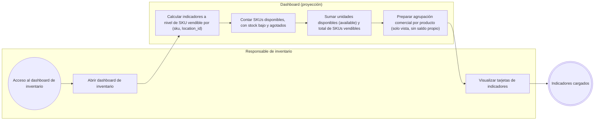
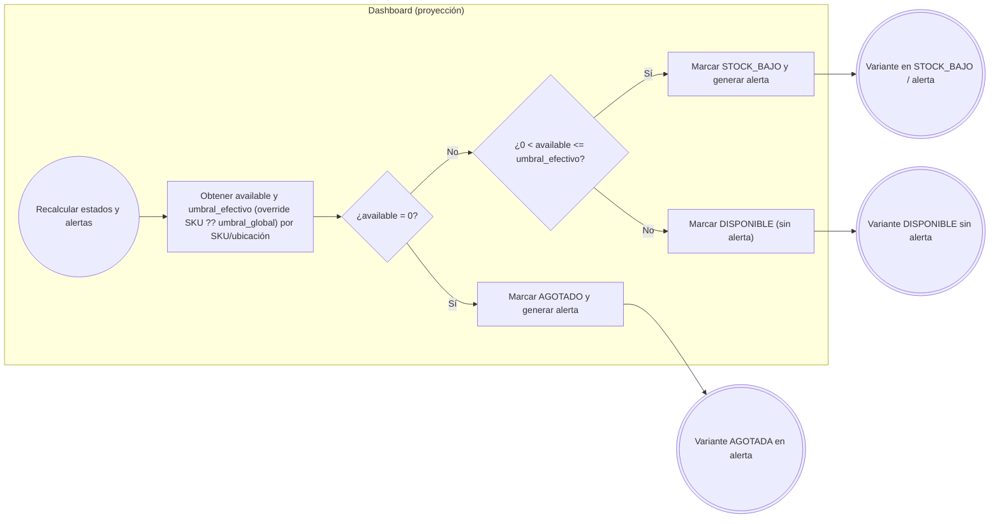
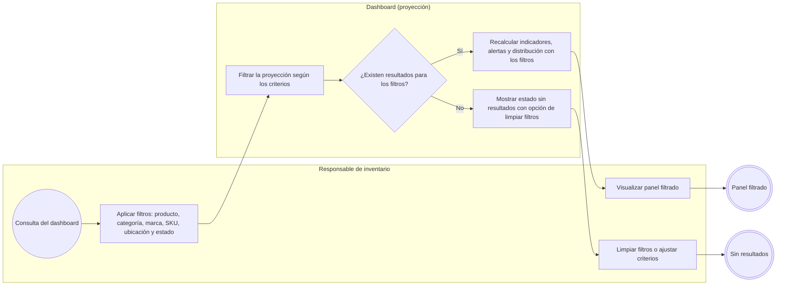
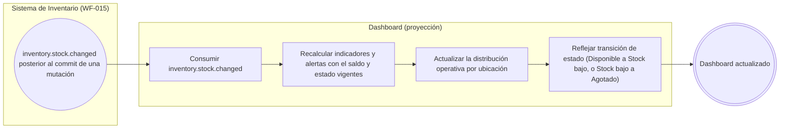
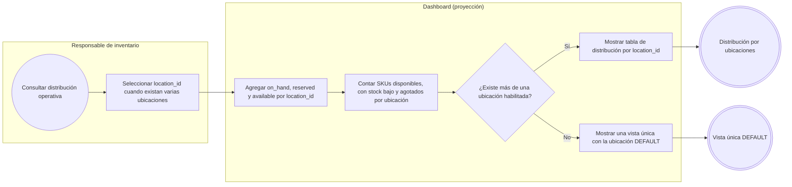

# FLOW-016 — Dashboard analítico y alertas de stock

## 1. Identificación

- **Código:** FLOW-016
- **Funcionalidad:** Dashboard analítico y alertas de stock
- **Relacionado con:** [HU-016](../hu/HU-016-dashboard-alertas-stock.md) / [SPEC-016](../specs/SPEC-016-dashboard-alertas-stock.md) / [WF-016](../wireframes/flows/WF-016-dashboard-alertas-stock.md)
- **Responsable:** Miguel Ángel Taco Zavala
- **Última actualización:** 2026-09-30

---

## 2. Objetivo del flujo

Representar el flujo 100 % de lectura del dashboard analítico y alertas de stock: la carga de indicadores a nivel de SKU vendible, la determinación determinista de estados y alertas con el umbral efectivo, la aplicación de filtros, la reactividad ante `inventory.stock.changed` y la distribución operativa por ubicación. El dashboard no ajusta, reserva ni consume stock, no publica `inventory.stock.changed` y no calcula métricas comerciales (ventas, rankings o Top de productos), cuyo dueño es Ventas/Postventa.

---

## 3. Actores participantes

- **Responsable de inventario:** consulta el dashboard, aplica filtros y visualiza indicadores/alertas.
- **Sistema de Inventario (WF-015):** provee los saldos y emite `inventory.stock.changed` tras cada mutación.
- **Dashboard (vista de proyección):** consume datos autoritativos/proyectados de Inventario; no genera mutaciones.

---

## 4. Diagramas de flujo

### 4.1 Carga de indicadores por SKU vendible

---

### 4.2 Determinación determinista de estados y alertas

> Los estados siguen las reglas deterministas de la gestión de inventario: `available = 0 → AGOTADO`; `0 < available <= umbral_efectivo → STOCK_BAJO`; de lo contrario `DISPONIBLE`.

---

### 4.3 Filtros y caso sin resultados

---

### 4.4 Reactividad ante inventory.stock.changed

> El dashboard es estrictamente de lectura: consume el evento y **no lo publica**, y tampoco ajusta, reserva ni consume stock. No aplica actualización optimista; refleja solo estados confirmados.

---

### 4.5 Distribución operativa del stock por ubicación

> Si el MVP opera con una única ubicación `DEFAULT`, la sección muestra un único resumen y no fuerza a seleccionar ubicaciones inexistentes. Este flujo no calcula Top de productos vendidos, ventas por canal ni otros indicadores comerciales de Ventas/Postventa.

---

## 5. Delimitaciones operativas del flujo

- Unidad primaria de inventario: **SKU vendible**; el producto es solo un agrupador comercial sin saldo propio.
- Indicadores mínimos: total de SKUs vendibles, total de unidades disponibles (`available`) y cantidad de SKUs por estado (Disponible, Stock bajo, Agotado).
- Filtros permitidos: producto, categoría, marca, SKU, ubicación (`location_id`) y estado.
- Sin rankings de ventas ni métricas comerciales; sin exportaciones de alertas en el alcance del MVP (WF-016 Q-02).