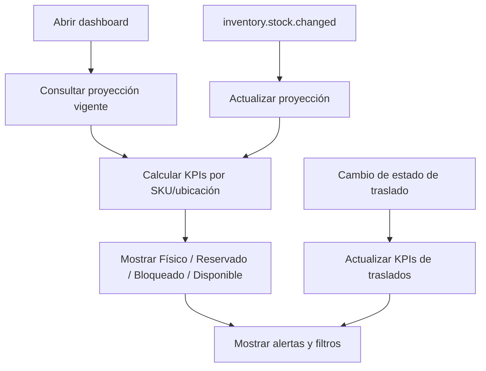

# FLOW-016 — Dashboard analítico y alertas de stock

```mermaid
flowchart TD
    A["Abrir dashboard"] --> B["Consultar proyección vigente"]
    B --> C["Calcular KPIs por SKU/ubicación"]
    C --> D["Mostrar Físico / Reservado / Bloqueado / Disponible"]
    D --> E["Mostrar alertas y filtros"]
    F["inventory.stock.changed"] --> G["Actualizar proyección"]
    G --> C
    H["Cambio de estado de traslado"] --> I["Actualizar KPIs de traslados"]
    I --> E
```

El dashboard es consumidor de hechos y consultas. Nunca ejecuta una mutación de Inventario.
