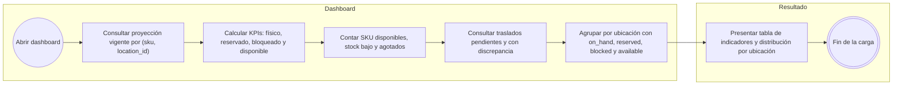
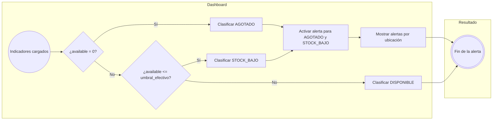
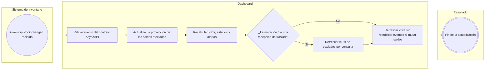
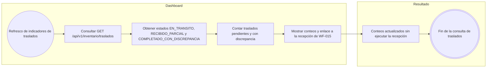
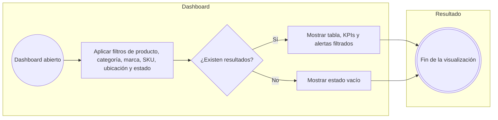

# FLOW-016 — Dashboard analítico y alertas de stock

---

## 1. Identificación

- **Código:** FLOW-016
- **Funcionalidad:** Dashboard analítico y alertas de stock
- **Relacionado con:** HU-016 / SPEC-016 / WF-016
- **Responsable:** Miguel Ángel Taco Zavala
- **Última actualización:** 2026-09-30

---

## 2. Objetivo del flujo

Representar la carga, agrupación y actualización de las proyecciones del dashboard de solo lectura: cálculo de indicadores por SKU y ubicación, determinación del estado de disponibilidad, generación de alertas y reactividad ante `inventory.stock.changed`, incluyendo la consulta de traslados sin emitir eventos ni modificar saldos.

---

## 3. Actores participantes

- Responsable de inventario
- Sistema de Inventario (autoridad del saldo y flujo WF-015)
- Dashboard (proyección de solo lectura)

---

## 4. Diagramas de flujo

### 4.1 Carga y agrupación de indicadores

### 4.2 Determinación de estados y alertas

### 4.3 Reactividad ante inventory.stock.changed

### 4.4 KPIs de traslados por consulta

### 4.5 Filtros y caso sin resultados

---

## 5. Notas generales

- **Solo lectura:** el dashboard no publica eventos de Inventario ni modifica saldos ni Kardex (HU-016 CA-10, SPEC-016 §4).
- **Traslados:** no existe evento contractual de traslados; los KPIs se obtienen por consulta del estado confirmado y la recepción la ejecuta un operador en WF-015, no desde el dashboard (SPEC-016 §6). Un traslado con discrepancia no altera por sí mismo las unidades disponibles (HU-016 CA-11).
- **Estados:** `available = max(on_hand - reserved - blocked, 0)`; `AGOTADO` cuando `available = 0`, `STOCK_BAJO` cuando `0 < available <= umbral_efectivo` y `DISPONIBLE` en el resto (SPEC-016 §3).
- **Actualización:** la proyección se recalcula ante mutaciones confirmadas de reserva, consumo, liberación, incidencia/bloqueo, rehabilitación, merma, reintegro, conciliación offline y recepción de traslados (SPEC-016 §4, HU-016 CA-07).