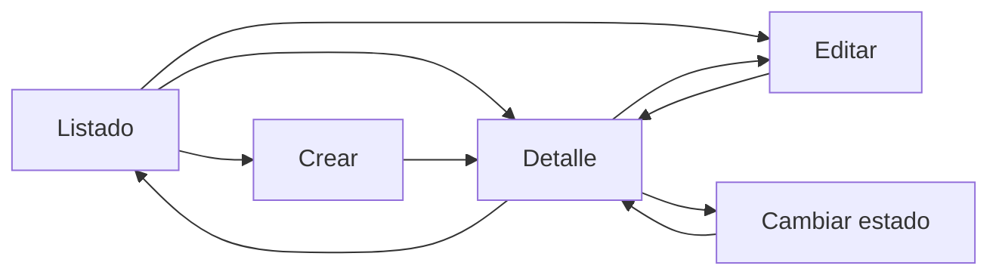

# Component Spec — MK-005

## 1. Identificación

Funcionalidad: Gestión de cupones de descuento. Owner: Axel Andree Cueva Alcalá. Versión 1.0. Estado: En revisión documental; construcción y revisión UX transversal pendientes. Fuentes transversales #59/#60 cerradas y en master dc8fc6d. Rama oficial cueva. La construcción seguirá el pipeline y sus gates; estos documentos todavía no acreditan pantallas implementadas.

## 2. Trazabilidad

| Fuente | Referencia | Alcance |
|---|---|---|
| SPEC | [SPEC-005](../../specs/SPEC-005-gestion-cupones-descuento.md) | Reglas completas |
| HU | [HU-005](../../hu/HU-005-gestion-cupones-descuento.md) | Criterios administrativos; reglas de canal explicadas sin ejecutarlas |
| WF | [WF-005](../../wireframes/flows/WF-005-gestion-cupones-descuento.md) | Pantallas/campos/microtexto |
| Flow | [FLOW-005](../../flujos/FLOW-005-gestion-cupones-descuento.md) | Navegación/estado, entrega #38 en cueva |
| Propuesta UX | [Versión 2.0](../ux/propuesta-ux.md) | §9–11, fuentes abiertas |
| UX Decisions | [UXD](../ux/ux-decisions.md) | 001–006, 009–012 según condición |
| UX Guidelines | [UXG](../ux/ux-guidelines.md) | 001–008, 011, 013, 017–018, 020–022 |
| API | [OpenAPI 0.5.0](../../api/openapi.yaml), [Contrato](../../Contrato_Api.md) | Administración provisional interna; no conexión backend |
| Índice/ownership | [INDEX](../../wireframes/INDEX.md), [Equipo](../../EQUIPO_Y_RESPONSABILIDADES.md) | Asignación canónica de Axel |
| Wireframe DS | [Guía de baja fidelidad](../../wireframes/DESIGN.md) | Estructura previa; colores/tipografía de mockup regidos por DESIGN1.0 |
| DS | [DESIGN 1.0.0](../DESIGN.md) | §4–13 y 15, componentes DS-C01–29 aplicables |

## 3. Objetivo funcional

Gestor comercial autorizado configura y consulta gestión de cupones de descuento para los canales. Resultado exitoso: configuración válida guardada y estado confirmado, sin ejecutar checkout desde administración.

## 4. Alcance

Incluye pantallas P0, lectura/creación/edición/estado, fixtures deterministas y mensajes contractuales. No integra backend, pagos, pedidos ni pantallas de prueba comercial. HU CA-01 código único; CA-02 validar no consume; CA-03/04 identidad y límite por cliente se explican sin pedir UUID al gestor; CA-05–11 consumo/restitución automáticos del pedido; CA-12 no pagos. Mostrar usos globales confirmados y usos disponibles solo con dato contractual; no inventar desglose por cliente.

## 5. Inventario de pantallas

| ID | Pantalla | Propósito | Entrada | Acción principal | Salida | Prioridad | Ruta |
|---|---|---|---|---|---|---|---|
| MK-005-S01 | Listado de cupones | list | Navegación/entrada directa | Consultar / elegir / confirmar | Retorno al contexto | P0 | `/MK005/S01` |
| MK-005-S02 | Crear cupón | create | Navegación/entrada directa | Guardar | Retorno al contexto | P0 | `/MK005/S02` |
| MK-005-S03 | Editar cupón | edit | Navegación/entrada directa | Guardar | Retorno al contexto | P0 | `/MK005/S03` |
| MK-005-S04 | Detalle de cupón | detail | Navegación/entrada directa | Consultar / elegir / confirmar | Retorno al contexto | P0 | `/MK005/S04` |
| MK-005-S05 | Límites y uso | usage | Navegación/entrada directa | Consultar / elegir / confirmar | Retorno al contexto | P0 | `/MK005/S05` |
| MK-005-S06 | Cambiar estado | state | Navegación/entrada directa | Consultar / elegir / confirmar | Retorno al contexto | P0 | `/MK005/S06` |

Cada ruta permite inspección directa. Estado controlado por `?estado=...`, no visible en la interfaz. Datos de muestra identificados en el entorno; no se presentan como integración real.

## 6. Relación entre pantallas

Selector vuelve al formulario con selección y borrador preservados. Uso vuelve al detalle. Upselling tiene entrada propia y criterio por item. Los alias del diagrama se resuelven a las rutas de §5; no representan pantallas adicionales.

## 7. Jerarquía de información

Primaria: tarea, entidad y estado; secundaria: configuración/alcance/vigencia; complementaria: explicación de impacto y auditoría solo cuando se dispone de ella. No usar un KPI sin fuente.

## 8. Componentes compartidos

| Componente | Uso / variante / tamaño | Estados |
|---|---|---|
| DS-C01 Button | primary filled y secondary outline, md 40 px | focus/disabled/loading, texto explícito |
| DS-C03/04/06/07 | Texto, número, select/múltiple; md 40 px; label visible | error/read-only; criterios sin default |
| DS-C08/09/11 | Combinación, elección excluyente, fecha-hora zona Lima | selected/focus/error |
| DS-C13/17/18 | Filtros padding16, tabla filas48, pagination32 | carga/vacío/sin coincidencias |
| DS-C14/19 | Estado textual semántico, cards padding24 radius12 sin sombra | informativo/read-only |
| DS-C21 | Modal 480 confirmación, padding24 radius16 | foco contenido/Escape/retorno |
| DS-C22/24/25/28 | Alert persistente, skeleton/loader, vacío y breadcrumbs | error/carga/info; retorno contextual |

## 9. Componentes específicos

### MK-005-C01 — Configuración comercial

Propósito: representar campos de MK-005 sin reglas nuevas. Pantallas crear/editar/detalle. Propiedades y restricciones: Código normalizado único por trim y mayúsculas ASCII (letras ASCII, números, guion y guion bajo; al editar se excluye el propio registro); promoción asociada; estado; monto mínimo >0 opcional; límite global y por cliente enteros >=1 opcionales; política de restitución. Vacío significa Sin límite / Sin monto mínimo, nunca cero. La vigencia se consulta en la promoción asociada, no se crea una vigencia propia del cupón.

Default refleja fixture; loading anuncia espera; error inline conserva valores; permiso denegado bloquea mutación sin inventar scopes. Guardar valida y enfoca primer error. Cancelar con cambios abre aviso. Cada campo tiene label visible; criterio/error asociado y foco visible. Operaciones: GET/POST /cupones; GET/PATCH /cupones/{cuponId}; POST /cupones/{cuponId}/activar y /desactivar. Filtro administrativo: estado, pagina, tamanio.

### MK-005-C02 — Colección/selección contextual

Tabla de entidades/selección con datos deterministas, estado y acciones explícitas por fila; sin acciones masivas. Colección vacía permite crear o regresar, sin coincidencias permite limpiar filtros. Consulta fallida permite reintentar lectura; tabla no sustituye ausencia con cero. Selección por botón etiquetado, teclado y retorno al formulario.

## 10. Especificación por pantalla

### MK-005-S01 — Listado de cupones

**Propósito:** listado de cupones respetando las fuentes y manteniendo contexto.

**Layout:** breadcrumbs → título/acción → contenido agrupado → acciones finales. Filtros admitidos de estado y tipo/modalidad cuando corresponda → tabla semántica (nombre/código, estado, vigencia o referencia pertinente) → paginación conocida. Crear/abrir detalle/editar, sin selección masiva.

**Componentes:** shell común, DS-C28 breadcrumbs, DS-C01 botones, DS-C19 card; tabla DS-C17 y filtros DS-C13 en consulta; DS-C03–09/11 para campos; DS-C21 para confirmación; DS-C22/24/25 para feedback.

**Acción primaria:** Crear.
**Secundarias:** Volver/Cancelar; ver detalle o editar según navegación. Retorno explícito conserva filtros y borrador si existe.

**Estados:** default, loading, error, permisos (403), sesion (401), empty, sin-resultados. Empty solo describe colección vacía, no ficha inexistente; error no presenta ceros. Carga sin progreso ficticio. Error de guardar confirmado permite corregir; resultado desconocido no reenvía automáticamente.

**Copy:** título «Listado de cupones»; «Guardar cambios», «Cancelar», «No pudimos cargar la información. Vuelve a intentarlo»; error de campo explica el requisito concreto. Fuente: WF/UXG-006/011/020/021.
### MK-005-S02 — Crear cupón

**Propósito:** crear cupón respetando las fuentes y manteniendo contexto.

**Layout:** breadcrumbs → título/acción → contenido agrupado → acciones finales. Código normalizado único por trim y mayúsculas ASCII (letras ASCII, números, guion y guion bajo; al editar se excluye el propio registro); promoción asociada; estado; monto mínimo >0 opcional; límite global y por cliente enteros >=1 opcionales; política de restitución. Vacío significa Sin límite / Sin monto mínimo, nunca cero. La vigencia se consulta en la promoción asociada, no se crea una vigencia propia del cupón.

**Componentes:** shell común, DS-C28 breadcrumbs, DS-C01 botones, DS-C19 card; tabla DS-C17 y filtros DS-C13 en consulta; DS-C03–09/11 para campos; DS-C21 para confirmación; DS-C22/24/25 para feedback.

**Acción primaria:** Guardar configuración.
**Secundarias:** Volver/Cancelar; ver detalle o editar según navegación. Retorno explícito conserva filtros y borrador si existe.

**Estados:** default, loading, error, permisos (403), sesion (401), validacion, guardar-error, salida con cambios. Empty solo describe colección vacía, no ficha inexistente; error no presenta ceros. Carga sin progreso ficticio. Error de guardar confirmado permite corregir; resultado desconocido no reenvía automáticamente.

**Copy:** título «Crear cupón»; «Guardar cambios», «Cancelar», «No pudimos cargar la información. Vuelve a intentarlo»; error de campo explica el requisito concreto. Fuente: WF/UXG-006/011/020/021.
### MK-005-S03 — Editar cupón

**Propósito:** editar cupón respetando las fuentes y manteniendo contexto.

**Layout:** breadcrumbs → título/acción → contenido agrupado → acciones finales. Código normalizado único por trim y mayúsculas ASCII (letras ASCII, números, guion y guion bajo; al editar se excluye el propio registro); promoción asociada; estado; monto mínimo >0 opcional; límite global y por cliente enteros >=1 opcionales; política de restitución. Vacío significa Sin límite / Sin monto mínimo, nunca cero. La vigencia se consulta en la promoción asociada, no se crea una vigencia propia del cupón. Ante fallo se conservan valores; salir con cambios requiere confirmar descarte.

**Componentes:** shell común, DS-C28 breadcrumbs, DS-C01 botones, DS-C19 card; tabla DS-C17 y filtros DS-C13 en consulta; DS-C03–09/11 para campos; DS-C21 para confirmación; DS-C22/24/25 para feedback.

**Acción primaria:** Guardar configuración.
**Secundarias:** Volver/Cancelar; ver detalle o editar según navegación. Retorno explícito conserva filtros y borrador si existe.

**Estados:** default, loading, error, permisos (403), sesion (401), validacion, guardar-error, salida con cambios. Empty solo describe colección vacía, no ficha inexistente; error no presenta ceros. Carga sin progreso ficticio. Error de guardar confirmado permite corregir; resultado desconocido no reenvía automáticamente.

**Copy:** título «Editar cupón»; «Guardar cambios», «Cancelar», «No pudimos cargar la información. Vuelve a intentarlo»; error de campo explica el requisito concreto. Fuente: WF/UXG-006/011/020/021.
### MK-005-S04 — Detalle de cupón

**Propósito:** detalle de cupón respetando las fuentes y manteniendo contexto.

**Layout:** breadcrumbs → título/acción → contenido agrupado → acciones finales. Código normalizado único por trim y mayúsculas ASCII (letras ASCII, números, guion y guion bajo; al editar se excluye el propio registro); promoción asociada; estado; monto mínimo >0 opcional; límite global y por cliente enteros >=1 opcionales; política de restitución. Vacío significa Sin límite / Sin monto mínimo, nunca cero. La vigencia se consulta en la promoción asociada, no se crea una vigencia propia del cupón. Valores de configuración en lectura, estado en texto y acciones Editar / Cambiar estado / Volver.

**Componentes:** shell común, DS-C28 breadcrumbs, DS-C01 botones, DS-C19 card; tabla DS-C17 y filtros DS-C13 en consulta; DS-C03–09/11 para campos; DS-C21 para confirmación; DS-C22/24/25 para feedback.

**Acción primaria:** Editar.
**Secundarias:** Volver/Cancelar; ver detalle o editar según navegación. Retorno explícito conserva filtros y borrador si existe.

**Estados:** default, loading, error, permisos (403), sesion (401). Empty solo describe colección vacía, no ficha inexistente; error no presenta ceros. Carga sin progreso ficticio. Error de guardar confirmado permite corregir; resultado desconocido no reenvía automáticamente.

**Copy:** título «Detalle de cupón»; «Guardar cambios», «Cancelar», «No pudimos cargar la información. Vuelve a intentarlo»; error de campo explica el requisito concreto. Fuente: WF/UXG-006/011/020/021.
### MK-005-S05 — Límites y uso

**Propósito:** límites y uso respetando las fuentes y manteniendo contexto.

**Layout:** breadcrumbs → título/acción → contenido agrupado → acciones finales. Uso global y límites del fixture contractual, disponibles conocidos o Sin límite; política y promoción/vigencia; sin botón Consumir/Restituir ni historial por cliente inventado.

**Componentes:** shell común, DS-C28 breadcrumbs, DS-C01 botones, DS-C19 card; tabla DS-C17 y filtros DS-C13 en consulta; DS-C03–09/11 para campos; DS-C21 para confirmación; DS-C22/24/25 para feedback.

**Acción primaria:** Editar.
**Secundarias:** Volver/Cancelar; ver detalle o editar según navegación. Retorno explícito conserva filtros y borrador si existe.

**Estados:** default, loading, error, permisos (403), sesion (401). Empty solo describe colección vacía, no ficha inexistente; error no presenta ceros. Carga sin progreso ficticio. Error de guardar confirmado permite corregir; resultado desconocido no reenvía automáticamente.

**Copy:** título «Límites y uso»; «Guardar cambios», «Cancelar», «No pudimos cargar la información. Vuelve a intentarlo»; error de campo explica el requisito concreto. Fuente: WF/UXG-006/011/020/021.
### MK-005-S06 — Cambiar estado

**Propósito:** cambiar estado respetando las fuentes y manteniendo contexto.

**Layout:** breadcrumbs → título/acción → contenido agrupado → acciones finales. Detalle contextual bajo diálogo de 480 px con entidad, estado actual, impacto y acción Activar/Desactivar. Confirmación no cambia estado antes del resultado; rechazo conserva estado. Escape/Cancelar vuelve al detalle y restituye foco.

**Componentes:** shell común, DS-C28 breadcrumbs, DS-C01 botones, DS-C19 card; tabla DS-C17 y filtros DS-C13 en consulta; DS-C03–09/11 para campos; DS-C21 para confirmación; DS-C22/24/25 para feedback.

**Acción primaria:** Confirmar estado.
**Secundarias:** Volver/Cancelar; ver detalle o editar según navegación. Retorno explícito conserva filtros y borrador si existe.

**Estados:** default, loading, error, permisos (403), sesion (401), rechazo. Empty solo describe colección vacía, no ficha inexistente; error no presenta ceros. Carga sin progreso ficticio. Error de guardar confirmado permite corregir; resultado desconocido no reenvía automáticamente.

**Copy:** título «Cambiar estado»; «Guardar cambios», «Cancelar», «No pudimos cargar la información. Vuelve a intentarlo»; error de campo explica el requisito concreto. Fuente: WF/UXG-006/011/020/021.

## 11. Decisiones UX locales

LUX-01: composición propia de esta configuración. Cupón en formulario completo de 640 px y uso en una pantalla de lectura separada (WF-005); evita esconder límites y preserva consulta directa. Alternativa: panel breve; descartado por el contenido pertinente del WF. Trade-off: una navegación más. Verificación: entrada directa y vuelta sin pérdida. No redefine patrón transversal UXD-001/002.

## 12. Reglas de layout PC

1440×900 canónico, scroll vertical; header64/sidebar240/padding32/contenido1136; formulario 640 px alineado izquierda; gap24 y secciones32. Inter 16/24 y Oswald 32/40 uppercase en H1; tonos/radios/foco desde tema único. Sin overflow horizontal involuntario ni variantes mobile/tablet. La responsividad mobile antigua de WF-007 se subordina al alcance desktop de #64/README, sin alterar negocio.

## 13. Fixtures

Datos exclusivamente ficticios: BIENVENIDA15, promoción Bienvenida (modalidad Cupón), máximo global 100, consumidos 28, disponibles 72; por cliente 1; restitución al cancelar. RUN10 sin límites.

| Fixture | Caso | Representación |
|---|---|---|
| default | Datos coherentes con schemas Admin | Entidades configuradas |
| loading | Lectura pendiente | Skeleton y texto accesible |
| empty | Colección sin registros | Vacío con acción permitida |
| sin-resultados | Filtros sin coincidencias | Limpiar filtros |
| error | Lectura fallida | Alert y reintento localizado |
| permisos / sesion | 403 / 401 contractuales | Bloqueo sin mutación; retorno |
| validacion / guardar-error | Envío inválido o rechazo confirmado | Campo/alert, entradas preservadas |
| rechazo | Cambio estado rechazado | Estado previo conservado |

Casos específicos: detalle-registro-seleccionado: código/límites/política propios; duplicado: código bienvenida15 con espacios extremos equivale a BIENVENIDA15; edición-propia: conserva código sin falso duplicado; código-vacio; monto-negativo; limite-cero/fraccionario; agotado: límite 100/uso 100; sin-limite: null; guardar-error: fallo confirmado sin efecto, entradas conservadas.

## 14. Preguntas y supuestos

No hay pregunta funcional bloqueante para las pantallas administrativas descritas. Las rutas internas de administración son provisionales según OpenAPI, por lo que se construye mockup, no integración productiva.

Supuestos: datos de fixtures no acreditan llamadas API; usuario autorizado salvo estado explícito 401/403; no se crean nuevos permisos. Supuestos se revisan al integrar backend. Visto bueno de Leonardo y fidelidad Figma permanecen pendientes.

## 15. Criterios de aceptación

- Pantallas P0 con rutas independientes y estados reproducibles de §5/10/13.
- Campos y validaciones trazables a §2/9; navegación sin checkout añadido.
- Valores conservados en fallo/cancelación; confirmación con impacto y foco restaurado.
- Tokens/componentes compartidos y PC1440 sin overflow; controles etiquetados y errores localizables.
- Autovalidación objetiva antes de revisión UX; no declarar APROBADO PARA FIGMA ni aprobación final sin revisor/evidencia.
