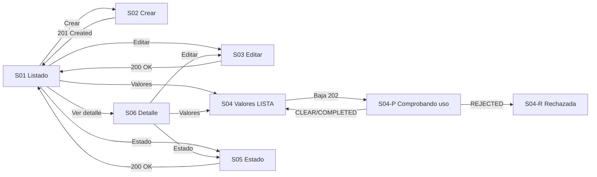

# Component Spec — MK-009

## 1. Identificación

- **Mockup:** MK-009 — Gestión de características de producto
- **Funcionalidad:** Taxonomía de atributos del catálogo (características TEXTO, NUMERO y LISTA con sus valores permitidos)
- **Responsable:** Leonardo Lopez (rama `lopez`)
- **Versión:** 1.1 — 2026-10-03
- **Estado:** **En revisión** — aprobación documental pendiente. No acredita implementación, autovalidación, revisión UX ni visto bueno para Figma.

Coordinación: ejecución general #61; entradas transversales #59 y #60. Alcance de la entrega: web desktop, viewport canónico 1440 × 900 px.

## 2. Trazabilidad

| Fuente | Referencia | Alcance |
|---|---|---|
| SPEC | [SPEC-009](../../specs/SPEC-009-gestion-caracteristicas.md) | Requisitos 1–9: tipos, límites, unicidad, renombrado por ID, consulta, fronteras con otras HUs, inmutabilidad de tipo, baja segura de valor y estado de característica |
| HU | [HU-009](../../hu/HU-009-gestion-caracteristicas.md) | CA-01 a CA-12 y escenarios 1–6 (sin redefinir ni reordenar) |
| WF | [WF-009](../../wireframes/flows/WF-009-gestion-caracteristicas.md) | Pantallas S-01, S-02, S-03, S-04, S-04-P, S-04-R, S-05, S-06; §4 baja de valor LISTA; §4.1 estado de la característica; §5 copy |
| Flow | [FLOW-009](../../flujos/FLOW-009-gestion-caracteristicas.md) | §4.1 consulta; §4.2 alta; §4.3 valores LISTA; §4.4 baja segura |
| Propuesta UX módulo | [propuesta-ux.md](../ux/propuesta-ux.md) | UX 2.0: jerarquía de tipos, control de límites, feedback situado |
| UX Decisions | [ux-decisions.md](../ux/ux-decisions.md) | UXD-002, UXD-004, UXD-006, UXD-009, UXD-012, UXD-013 |
| UX Guidelines | [ux-guidelines.md](../ux/ux-guidelines.md) | UXG-001 a UXG-004, UXG-007 a UXG-015, UXG-018, UXG-020 a UXG-022 |
| API Contract | [api/openapi.yaml](../../api/openapi.yaml) 0.5.0 · [Contrato_Api.md](../../Contrato_Api.md) · [asyncapi.yaml](../../asyncapi/asyncapi.yaml) 0.4.0 | Operaciones, DTO y errores de §9; verificación asíncrona de `CHARACTERISTIC_VALUE` y `taxonomy.characteristic-value.updated` |
| Design System | [DESIGN.md](../DESIGN.md) 1.0.0 | Foundations, layout desktop, componentes DS-C01…DS-C28 aplicados en §8 |

Las fuentes funcionales prevalecen sobre los artefactos visuales. Este documento no redefine CA ni reglas de negocio; las discrepancias se registran en §14.

### 2.1 Trazabilidad de criterios de aceptación de HU-009

Los 12 CA originales se conservan sin renumerar ni reinterpretar. `Tarea` remite a [tasks.md](tasks.md) y `Evidencia` a las secciones de `validation-report.md` (aún no emitido).

| CA | Criterio original (resumen fiel) | Pantalla / estado | Fixture | Tarea | Evidencia |
|---|---|---|---|---|---|
| CA-01 | `TEXTO` respeta límite configurable, inicial 100 | S02 / validación | `texto-limite` | MK-009-T14 | VR §3, §4 |
| CA-02 | `NUMERO` exige unidad y formato numérico | S02 / validación | `numero-sin-unidad`, `numero-formato` | MK-009-T14 | VR §3, §4 |
| CA-03 | `LISTA` respeta límite configurable, inicial 50 activos | S04 / default, límite | `lista-limite` | MK-009-T16 | VR §3, §4 |
| CA-04 | Renombrar valor conserva ID y propaga el nombre sin reescribir SKU/snapshots | S04 / renombrado | `valor-renombrado` | MK-009-T16 | VR §3, §4 |
| CA-05 | Consulta entrega ID, tipo, estado, unidad y valores permitidos con IDs estables | S06 / default; S01 / default | `detalle-caracteristica` | MK-009-T19, T11 | VR §3, §4 |
| CA-06 | El cambio confirmado de etiqueta publica `taxonomy.characteristic-value.updated` con IDs estables y etiqueta vigente | S04 / renombrado confirmado | `valor-renombrado` | MK-009-T16 | VR §3, §4 |
| CA-07 | Asociación/obligatoriedad pertenecen a HU-010; las categorías no heredan características; las marcas a HU-011 | §4 y §10 (S01) límites declarados | `sin-asociacion` | MK-009-T11, T60 | VR §4 |
| CA-08 | El tipo es inmutable | S03 / tipo inmutable | `tipo-inmutable` | MK-009-T15 | VR §3, §4 |
| CA-09 | Baja de valor LISTA usa solo la verificación asíncrona transversal de `CHARACTERISTIC_VALUE`; uso activo o falta de confirmación bloquea la baja | S04, S04-P, S04-R / pendiente, rechazo | `valor-baja-pendiente`, `valor-baja-rechazada` | MK-009-T16, T17, T18 | VR §3, §4 |
| CA-10 | Durante la verificación el valor no se asigna a nuevos productos/variantes y el `202` solo admite la solicitud | S04-P / pendiente | `valor-baja-pendiente` | MK-009-T17 | VR §3, §4 |
| CA-11 | Una característica se desactiva/reactiva lógicamente sin cambiar su ID; la reactivación restituye la misma identidad con su tipo y sus valores | S05 / default, confirmado | `caracteristica-inactiva`, `reactivacion-ok` | MK-009-T20 | VR §3, §4 |
| CA-12 | Una característica inactiva no se ofrece para nuevas asociaciones ni capturas de valor y no altera las asociaciones históricas | S05 / inactiva; S04 / no editable | `caracteristica-inactiva` | MK-009-T20 | VR §3, §4 |

## 3. Objetivo funcional

- **Usuario:** Gestor Comercial responsable de la taxonomía de atributos del catálogo.
- **Objetivo:** crear y mantener características de producto y sus valores permitidos, con límites explícitos y bajas seguras.
- **Contexto:** Catálogo necesita saber qué atributos admite cada producto y con qué valores, sin que una baja destruya información ya usada.
- **Resultado exitoso:** toda característica tiene tipo inmutable y límites visibles, y ningún valor LISTA se desactiva sin verificación segura vigente.

## 4. Alcance

### Incluido
- Listado de características con tipo, estado, unidad y cantidad de valores.
- Alta de características TEXTO y NUMERO con sus límites y unidad.
- Edición de características, incluido el renombrado de valores LISTA, preservando el identificador.
- Alta, renombrado y baja lógica de valores permitidos de características LISTA.
- Baja lógica segura de valor LISTA con admisión `202`, seguimiento por `operationId` y resultado confirmado o rechazado.
- Desactivación y reactivación lógica de la característica completa.
- Detalle de la característica con su tipo, estado, unidad y valores.
- Estados deterministas default, loading, empty, error y los casos negativos de §13.

### Fuera de alcance
- Asociación de características a tipos de producto y obligatoriedad (pertenece a MK-010 / HU-010).
- Atributos heredados de categorías o de marcas (HU-010 y HU-011 respectivamente).
- Capturas de valores en fichas de producto (interfaz de Productos y Ofertas).
- Eliminación física de características o valores.
- Cambios de tipo de una característica existente: el tipo es inmutable.

## 5. Inventario de pantallas

| ID | Pantalla | Propósito | Entrada | Acción principal | Salida | Prioridad | Ruta del prototipo |
|---|---|---|---|---|---|---|---|
| MK-009-S01 | Listado de características | Consultar características, su tipo y estado | Sidebar o ruta directa | Crear característica | S02; S03, S04, S05 o S06 del registro elegido | P0 | `/MK009/S01` |
| MK-009-S02 | Crear característica | Registrar tipo, nombre, unidad y límites | S01 / Crear característica | Crear característica | Confirmado: S01 con la nueva fila | P0 | `/MK009/S02` |
| MK-009-S03 | Editar característica | Modificar nombre, límites y unidad sin alterar el tipo | S01 o S06 / Editar | Guardar cambios | Confirmado: S01 | P0 | `/MK009/S03` |
| MK-009-S04 | Valores permitidos (LISTA) | Administrar los valores de una característica LISTA | S01 / Valores | Guardar valor o solicitar baja de valor | Confirmado: S04; baja: S04-P | P0 | `/MK009/S04` |
| MK-009-S04-P | Comprobando uso | Mostrar la admisión y el seguimiento de la verificación | S04 / solicitar baja | Consultar estado | Confirmado: S04; `REJECTED`: S04-R | P0 | `/MK009/S04-P` |
| MK-009-S04-R | Baja de valor rechazada | Explicar el uso activo y mantener el valor intacto | S04-P / resultado rechazado | Entendido | S04 con el valor conservado | P0 | `/MK009/S04-R` |
| MK-009-S05 | Estado de la característica | Desactivar o reactivar la característica completa | S01 o S06 / Estado | Desactivar o reactivar característica | Confirmado: S01 con la misma fila y nuevo estado | P0 | `/MK009/S05` |
| MK-009-S06 | Detalle de característica | Leer tipo, estado, unidad, límites y valores | S01 / Ver detalle | Editar o gestionar valores | S03, S04 o S05 | P0 | `/MK009/S06` |

**Reglas de acceso y enrutamiento:**
- Toda pantalla inventariada como `MK-009-SXX` dispone de ruta individual y estable; la ruta deriva exactamente del identificador, incluidos los sufijos de variante (`/MK009/S04-P`, `/MK009/S04-R`).
- La ruta permite inspección directa sin recorrer el flujo previo; un diálogo se reproduce con el contexto de fondo que lo originó.
- El parámetro de consulta de fixture controla la reproducción determinista de estados y no se muestra como control técnico.
- Cualquier alta, baja o renombrado de pantalla obliga a actualizar ruta en este inventario, en [plan.md](plan.md) §5, en [tasks.md](tasks.md) y en `mockups/README.md`.

## 6. Relación entre pantallas

No existen caminos huérfanos: toda pantalla tiene entrada desde S01 y retorno a S01 o S04. Ninguna transición depende de admitir solo el `202`.

## 7. Jerarquía de información

1. **Primaria:** listado de características con nombre, tipo, estado, unidad y número de valores; acción Crear característica.
2. **Secundaria:** formulario de alta y edición, administración de valores LISTA y estado del proceso de baja segura.
3. **Complementaria:** ayudas de límites (100 para TEXTO, 50 activos para LISTA), formatos numéricos aceptados y mensajes de rechazo.

El tipo se muestra siempre como dato de solo lectura porque es inmutable, y el estado nunca se comunica solo por color.

## 8. Componentes compartidos

| Componente | Pantallas | Uso | Variante | Estados |
|---|---|---|---|---|
| DS-C01 Button | S01–S06 | Crear, guardar, solicitar baja, desactivar, reactivar | filled primary / outline secondary md 40 px | default, hover, focus, disabled, loading |
| DS-C02 ActionIcon | S01, S04, S06 | Editar, ver detalle, gestionar valores | 32/40 px con nombre accesible | default, focus, disabled |
| DS-C03 TextInput | S01, S02, S03, S04 | Nombre, buscador, valor permitido | md 40 px, label arriba | default, error, disabled |
| DS-C05 Textarea | S02, S03 | Descripción o notas del valor | md, label visible | default, error |
| DS-C06 Select | S02, S03 | Tipo de característica | md 40 px | default, error, disabled (inmutable en edición) |
| DS-C12 Search | S01 | Filtro por nombre o tipo | md 40 px | default, sin resultados, loading |
| DS-C14 Badge | S01, S04, S05, S06 | Activo, inactivo, comprobando, tipo TEXTO/NUMERO/LISTA | sm 24 px con texto | default |
| DS-C17 Table | S01, S04 | Características y valores permitidos | header 40 px, fila 48 px | default, loading, empty, sin resultados, error |
| DS-C19 Card | S01, S02, S03, S06 | Datos, límites y valores | padding 24, radio 12 | default |
| DS-C21 Modal | S03, S04, S04-R, S05 | Confirmaciones y avisos de rechazo | 480 px, padding 24, radio 16 | default, focus trap, Escape |
| DS-C22 Alert | S02, S03, S04, S04-P, S04-R, S05 | Errores de validación, límites, verificación y bloqueo | padding 16, icono 20 | info, warning, error, success |
| DS-C24 Skeleton/Loader | S01, S04, S06 | Carga inicial y comprobación asíncrona | líneas 16/20/24 | loading |
| DS-C25 EmptyState | S01, S04 | Sin características o sin valores | padding 32 | empty, sin resultados |
| DS-C28 Breadcrumbs | S01–S06 | `Inicio > Taxonomía > Características` | 14/20 | default |

No se redefinen componentes del Design System; las particularidades viven en §9.

## 9. Componentes específicos

### MK-009-C01 — Listado de características por tipo

**Propósito** presentar cada característica con su tipo inmutable, estado, unidad y cantidad de valores, sin inducir a_edición del tipo.

**Pantallas:** S01.

**Propiedades conceptuales**

| Propiedad | Tipo | Obligatoria | Regla / Restricción |
|---|---|---:|---|
| `caracteristicas` | Lista de característica | Sí | Nombre, tipo, estado, unidad, cantidad de valores |
| `tipo` | TEXTO / NUMERO / LISTA | Sí | Solo lectura; nunca editable en S03 |
| `unidad` | Texto | No | Obligatoria solo para NUMERO |
| `cantidadValores` | Número | No | Significativa solo para LISTA |
| `seleccionadaId` | Texto | No | Estado de selección, no de edición |

**Estados**

| Estado | Disparador | Representación visual | Acción permitida |
|---|---|---|---|
| Default | Listado cargado | Filas con tipo, estado y acciones | Filtrar, crear, editar, ver valores, ver detalle |
| Loading | Consulta en curso | Skeleton de filas | Ninguna escritura |
| Empty | Sin características | EmptyState con acción Crear | Crear característica |
| Sin resultados | Filtro sin coincidencias | EmptyState con acción Limpiar filtro | Limpiar filtro |
| Error | Fallo de lectura | Alert con reintento | Reintentar consulta |

**Interacciones**

| Acción | Respuesta de interfaz | Resultado | Flow |
|---|---|---|---|
| Filtrar por texto o tipo | Resultado en la misma vista | Conserva la selección | FLOW-009 §4.1 |
| Abrir valores | Navega a S04 con la característica seleccionada | S04 | FLOW-009 §4.3 |
| Ver detalle | Navega a S06 | S06 | FLOW-009 §4.1 |

**Accesibilidad:** encabezados de tabla asociados, foco visible, tipo y estado expresados con texto y nombres accesibles en acciones de fila.

### MK-009-C02 — Selector de tipo y unidad

**Propósito** declarar el tipo en el alta y mostrarlo como inmutable en la edición.

**Pantallas:** S02 (editable), S03 (solo lectura).

**Propiedades conceptuales**

| Propiedad | Tipo | Obligatoria | Regla / Restricción |
|---|---|---:|---|
| `tipo` | TEXTO / NUMERO / LISTA | Sí | Inmutable después del alta |
| `unidad` | Texto | Condicional | Obligatoria si el tipo es NUMERO |
| `limite` | Número | Condicional | 100 para TEXTO y 50 valores activos para LISTA, configurables |
| `modo` | Alta / Edición | Sí | En edición el tipo no admite cambio |

**Estados**

| Estado | Disparador | Representación visual | Acción permitida |
|---|---|---|---|
| Alta TEXTO | Selección de TEXTO | Campo de límite con valor inicial | Definir límite |
| Alta NUMERO | Selección de NUMERO | Unidad obligatoria y límite | Definir unidad y límite |
| Alta LISTA | Selección de LISTA | Sin unidad; 안내 de límite de valores | Continuar a S04 para valores |
| Edición | Modo edición | Tipo deshabilitado con aviso de inmutabilidad | Solo nombre, unidad y límite |

**Interacciones**

| Acción | Respuesta | Resultado |
|---|---|---|
| Cambiar tipo en alta | Ajusta los campos visibles | Unidad aparece solo para NUMERO |
| Intentar cambiar tipo en edición | Control deshabilitado | Aviso «El tipo no puede cambiarse después de crearse.» |

**Accesibilidad:** grupo de campos con `fieldset` y `legend`, descripción del límite asociada al control y errores de unidad junto al campo.

### MK-009-C03 — Gestión de valores permitidos

**Propósito** permitir alta y renombrado de valores de una característica LISTA preservando el identificador, y solicitar su baja segura.

**Pantallas:** S04.

**Propiedades conceptuales**

| Propiedad | Tipo | Obligatoria | Regla / Restricción |
|---|---|---:|---|
| `caracteristicaId` | Texto | Sí | CaracterísticasListA de contexto |
| `valores` | Lista de valor | Sí | Identificador, etiqueta, estado |
| `limiteValoresActivos` | Número | Sí | 50 en MVP, configurable |
| `valorEnComprobacionId` | Texto | No | Valor no asignable mientras se verifica |
| `etiquetaEnEdicionId` | Texto | No | Renombrado conserva el identificador |

**Estados**

| Estado | Disparador | Representación visual | Acción permitida |
|---|---|---|---|
| Default | Valores cargados | Filas con etiqueta, estado y acciones | Añadir, renombrar, solicitar baja |
| Límite alcanzado | 50 valores activos | Contador con alerta y acción de alta deshabilitada | Renombrar o solicitar baja |
| Renombrando | Edición de etiqueta | Campo en línea con acción Guardar | Confirmar o cancelar |
| Comprobando uso | `202` admitido | Fila con estado «Comprobando uso» y sin acciones de asignación | Consultar estado |
| Característica inactiva | Estado de la característica | Fila informativa y sin altas ni bajas | Solo lectura |

**Interacciones**

| Acción | Respuesta | Resultado |
|---|---|---|
| Añadir valor | Alta por HTTP con la nueva etiqueta | Fila añadida con identificador estable |
| Renombrar valor | `PATCH` de la etiqueta; el identificador no cambia | Fila actualizada y evento `taxonomy.characteristic-value.updated` |
| Solicitar baja de valor | Confirmación previa a la solicitud | S04-P |

**Accesibilidad:** el contador de límite se anuncia como texto, el estado de cada valor es legible y la edición en línea conserva el foco al confirmar o cancelar.

### MK-009-C04 — Seguimiento de comprobación de uso de valor

**Propósito** representar la admisión `202` de la baja segura de un valor LISTA y su verificación posterior sin anticipar el resultado.

**Pantallas:** S04-P (resultado en S04-R).

**Propiedades conceptuales**

| Propiedad | Tipo | Obligatoria | Regla / Restricción |
|---|---|---:|---|
| `operacion` | Identificador de operación | Sí | Solo el identificador, sin eventos ni topics visibles |
| `entidadTipo` | Valor de característica LISTA | Sí | Texto operativo: «Valor de característica» |
| `estado` | Pendiente / Confirmada / Rechazada | Sí | Derivado de `PENDING_DEACTIVATION`, `CLEAR`/`COMPLETED`, `REJECTED` |
| `motivoRechazo` | Texto | No | Presente solo en rechazo |
| `consultable` | Booleano | Sí | Permite consultar el estado sin recargar |

**Estados**

| Estado | Disparador | Representación visual | Acción permitida |
|---|---|---|---|
| Pendiente | `202` admitido o `PENDING_DEACTIVATION` | Banner informativo con acción Consultar estado | Consultar, volver a S04 |
| Confirmada | `CLEAR` o `COMPLETED` | Banner de resultado y fila del valor inactiva | Volver a S04 |
| Rechazada | `REJECTED` o uso activo | S04-R con motivo | Entendido |
| No concluyente | Error de consulta o resultado ausente | Aviso genérico sin afirmar cambio | Entendido, consultar de nuevo |

**Interacciones**

| Acción | Respuesta | Resultado |
|---|---|---|
| Consultar estado | Consulta la operación y actualiza el banner | Estado vigente; nunca se reenvía la baja |
| Entendido | Cierra el aviso | S04 con el estado real del valor |

**Accesibilidad:** región `aria-live` para el resultado asíncrono, foco al mensaje de resultado y copy del WF-009 §5 para el caso no concluyente.

## 10. Especificación por pantalla

### MK-009-S01 — Listado de características

**Propósito y objetivo** consultar todas las características con su tipo, estado, unidad y cantidad de valores, y elegir una sobre la que actuar.
**Estructura y layout** 1. Cabecera con migas y título. 2. Barra con Crear característica y filtro. 3. Tabla con nombre, tipo, estado, unidad, valores y acciones.
**Componentes presentes** DS-C28, DS-C01, DS-C12, DS-C17, DS-C14, DS-C02, DS-C24, DS-C25; MK-009-C01.
**Acción primaria** Crear característica hacia S02.
**Acciones secundarias** Editar, Valores (solo LISTA), Estado y Ver detalle sobre la fila elegida.
**Estados requeridos** default, loading, empty, sin resultados, error, sesión y permisos.
**Contenido clave y microtexto**

| Elemento | Texto / Patrón | Fuente de procedencia |
|---|---|---|
| Título | Características | WF-009 §3 |
| Columna tipo | Solo lectura | HU-009 CA-08 |
| Límite de valores | «Máximo 50 valores activos.» | SPEC-009 R3 |

### MK-009-S02 — Crear característica

**Propósito y objetivo** registrar una característica con su tipo, nombre, unidad y límites antes de existir.
**Estructura y layout** 1. Migas y título. 2. Formulario en Card con tipo, nombre, unidad condicional y límite. 3. Barra con acción primaria y Cancelar.
**Componentes presentes** DS-C28, DS-C19, DS-C06, DS-C03, DS-C01, DS-C22; MK-009-C02.
**Acción primaria** Crear característica.
**Acciones secundarias** Cancelar hacia S01.
**Estados requeridos** default, validación (límite, unidad, formato), guardando, error, salida-con-cambios, sesión y permisos.
**Contenido clave y microtexto**

| Elemento | Texto / Patrón | Fuente de procedencia |
|---|---|---|
| Ayuda de límite TEXTO | «El límite inicial es de 100 caracteres.» | HU-009 CA-01 |
| Ayuda de NUMERO | «Indica la unidad y el formato numérico aceptado.» | HU-009 CA-02 |
| Aviso LISTA | «Los valores se configuran después de crear la característica.» | WF-009 §3 |

### MK-009-S03 — Editar característica

**Propósito y objetivo** modificar nombre, unidad y límites sin alterar el tipo, que es inmutable.
**Estructura y layout** 1. Migas y título con la característica. 2. Formulario con tipo deshabilitado y campos editables. 3. Barra con Guardar cambios y Cancelar.
**Componentes presentes** DS-C19, DS-C06, DS-C03, DS-C01, DS-C22; MK-009-C02.
**Acción primaria** Guardar cambios.
**Acciones secundarias** Cancelar; volver al detalle.
**Estados requeridos** default, loading, validación, guardar-error, conflicto de versión, salida-con-cambios, sesión y permisos.
**Contenido clave y microtexto**

| Elemento | Texto / Patrón | Fuente de procedencia |
|---|---|---|
| Inmutabilidad | «El tipo no puede cambiarse después de crearse.» | HU-009 CA-08 |
| Valorización | «Los valores de producto se validan según el tipo de producto asociado.» | WF-009 §5 |

### MK-009-S04 — Valores permitidos (LISTA)

**Propósito y objetivo** administrar los valores de una característica LISTA, con límite de activos y renombrado que conserva el identificador.
**Estructura y layout** 1. Cabecera con la característica y su tipo. 2. Formulario en línea para añadir valor y contador de activos. 3. Tabla de valores con etiqueta, estado y acciones.
**Componentes presentes** DS-C28, DS-C19, DS-C03, DS-C17, DS-C14, DS-C22, DS-C25, DS-C01, DS-C21; MK-009-C03.
**Acción primaria** Añadir valor.
**Acciones secundarias** Renombrar, Solicitar baja de valor, Ver detalle.
**Estados requeridos** default, loading, vacío, límite alcanzado, comprobando uso, característica inactiva, error, sesión y permisos.
**Contenido clave y microtexto**

| Elemento | Texto / Patrón | Fuente de procedencia |
|---|---|---|
| Contador | «{activos} de {límite} valores activos» | HU-009 CA-03 |
| Comprobando | «Este valor se está comprobando y temporalmente no está disponible para nuevas asignaciones.» | WF-009 §5 |
| Límite alcanzado | «No se pueden añadir más valores activos. Renombra o desactiva un valor existente.» | SPEC-009 R3 |

### MK-009-S04-P — Comprobando uso

**Propósito y objetivo** comunicar que la solicitud fue admitida y permitir consultar el estado real de la verificación.
**Estructura y layout** 1. Banner de estado con identificador de operación. 2. Acción Consultar estado. 3. Enlace de retorno a S04.
**Componentes presentes** DS-C22, DS-C24, DS-C01; MK-009-C04.
**Acción primaria** Consultar estado de la operación.
**Acciones secundarias** Volver a S04 sin afirmar resultado.
**Estados requeridos** pendiente, confirmada, rechazada, no concluyente.
**Contenido clave y microtexto**

| Elemento | Texto / Patrón | Fuente de procedencia |
|---|---|---|
| Pendiente | «Solicitud recibida. Estamos comprobando el uso del valor en productos.» | WF-009 §4 |
| Confirmada | «El valor quedó inactivo.» | SPEC-009 R7 |
| No concluyente | «No pudimos confirmar que la baja sea segura. No se realizó ningún cambio.» | WF-009 §5 |

### MK-009-S04-R — Baja de valor rechazada

**Propósito y objetivo** explicar que el valor está en uso y conservarlo intacto.
**Estructura y layout** 1. Modal de resultado con motivo. 2. Acción Entendido.
**Componentes presentes** DS-C21, DS-C22, DS-C01.
**Acción primaria** Entendido, que vuelve a S04.
**Acciones secundarias** Consultar de nuevo el estado si el motivo fue ausencia de resultado.
**Estados requeridos** rechazo por uso activo, no concluyente.
**Contenido clave y microtexto**

| Elemento | Texto / Patrón | Fuente de procedencia |
|---|---|---|
| Rechazo | «No se puede desactivar porque el valor está en uso en productos o variantes.» | SPEC-009 R7, WF-009 §4 |

### MK-009-S05 — Estado de la característica

**Propósito y objetivo** desactivar o reactivar la característica completa conservando su identificador.
**Estructura y layout** 1. Modal con la acción, el impacto y la aclaración de que el identificador se conserva. 2. Acciones Desactivar/Reactivar característica y Cancelar.
**Componentes presentes** DS-C21, DS-C22, DS-C01.
**Acción primaria** Desactivar o reactivar característica.
**Acciones secundarias** Cancelar hacia S01 o S06.
**Estados requeridos** default, confirmando, inactiva con bloqueo de nuevas asociaciones, error, sesión y permisos.
**Contenido clave y microtexto**

| Elemento | Texto / Patrón | Fuente de procedencia |
|---|---|---|
| Identidad | «El identificador de la característica se conserva al cambiar su estado.» | WF-009 §4.1, HU-009 CA-11 |
| Bloqueo | «Esta característica está inactiva y no está disponible para nuevas asociaciones.» | WF-009 §5 |

### MK-009-S06 — Detalle de característica

**Propósito y objetivo** leer tipo, estado, unidad, límites y valores con identificadores estables.
**Estructura y layout** 1. Migas y título. 2. Card de datos con tipo, estado, unidad, límites y fecha. 3. Card de valores con acceso a S04. 4. Acciones Editar y Estado.
**Componentes presentes** DS-C28, DS-C19, DS-C14, DS-C01, DS-C24; MK-009-C01.
**Acción primaria** Editar característica hacia S03.
**Acciones secundarias** Valores hacia S04; Estado hacia S05.
**Estados requeridos** default, loading, error, no encontrada, sesión y permisos.
**Contenido clave y microtexto**

| Elemento | Texto / Patrón | Fuente de procedencia |
|---|---|---|
| Identificadores | Nombre, tipo, estado, unidad y valores con sus identificadores estables | HU-009 CA-05 |

## 11. Decisiones UX locales

### LUX-01 — Tipo visible pero inmutable en la edición

**Problema** ocultar el tipo en la edición deja al gestor con la impresión de que podría cambiarlo.
**Alternativas consideradas** mostrarlo como campo editable (descartada: contradice CA-08) o no mostrarlo (descartada: esconde información relevante del detalle).
**Decisión adoptada** mostrar el tipo deshabilitado con la explicación de que es inmutable.
**Justificación** refuerza la regla de negocio sin ocultar el dato.
**Trade-off** ocupa espacio en el formulario sin ser editable.
**Criterio de validación** en S03 se entiende por qué el tipo no puede modificarse.

### LUX-02 — Contador de valores activos con límite explícito

**Problema** el límite de 50 activos solo se manifiesta cuando la alta ya fue rechazada.
**Alternativas consideradas** mostrar el límite únicamente en la ayuda (descartada: se descubre tarde) oPaginar los valores (descartada: la restricción es de conjunto, no de visualización).
**Decisión adoptada** mostrar un contador «activos de límite» junto al alta y deshabilitar la acción al alcanzar el máximo.
**Justificación** hace visible la regla de negocio antes de la acción y evita errores evitables.
**Trade-off** añade un elemento que debe actualizarse tras cada alta o baja.
**Criterio de validación** en S04 el contador es correcto con los fixtures `default` y `lista-limite`.

### LUX-03 — Identificadores estables visibles en el detalle

**Problema** los identificadores son invisibles y son la garantía de que renombrar no rompe referencias.
**Alternativas consideradas** ocultarlos (descartada: impide verificar la garantía) o mostrarlos como columna principal (descartada: compite con el nombre).
**Decisión adoptada** mostrarlos como dato secundario en S06 y mantenerlos fuera del listado.
**Justificación** permite comprobar CA-05 y CA-04 sin alterar la jerarquía visual.
**Trade-off** más información técnica en pantalla.
**Criterio de validación** en S06 se distinguen identificador de característica e identificador de valor.

## 12. Reglas de layout PC

- Entorno exclusivo web desktop con viewport canónico de 1440 px y scroll vertical.
- Shell, espaciados y tipografía según DESIGN §5; contenido alineado a la rejilla del sistema.
- Tablas con scroll limitado a su región; la página no presenta overflow horizontal en ningún estado.
- Modales de 480 px según DESIGN; formularios alineados a la izquierda con ancho máximo del sistema.
- Iconografía exclusivamente Tabler; tokens de color, radio y espacio del tema, sin estilos inline arbitrarios.

## 13. Fixtures

| Fixture | Caso de negocio | Pantalla / Estado | Datos representativos |
|---|---|---|---|
| `default` | Listado con los tres tipos | S01 / Default | `Color` LISTA con 3 valores; `Peso` NUMERO en `g`; `Descripción` TEXTO |
| `loading` | Consulta o comprobación en curso | S01, S04, S04-P / Loading | Skeleton de filas o banner pendiente |
| `empty` | Sin características | S01 / Empty | Colección vacía |
| `sin-resultados` | Filtro sin coincidencias | S01 / Empty | Filtro `Tela` sin coincidencias |
| `error` | Fallo controlado | S01, S03 / Error | `Problem` con `VALIDACION` o `ERROR_INTERNO` |
| `sesion` | Token inválido o sin permisos | Todas / Sesión | `401 TOKEN_INVALIDO`, `403 SCOPE_INSUFICIENTE` |
| `texto-limite` | Límite TEXTO en el máximo | S02 / Validación | `descripcion` con 100 caracteres |
| `texto-excedido` | Límite TEXTO excedido | S02 / Error | `descripcion` con 101 caracteres |
| `numero-sin-unidad` | NUMERO sin unidad | S02 / Validación | Tipo NUMERO y `unidad` vacía |
| `numero-formato` | Formato numérico rechazado | S02 / Error | Valor `12 kg aprox` no numérico |
| `lista-limite` | 50 valores activos | S04 / Límite alcanzado | `lista-limite` con 50 filas activas |
| `sin-asociacion` | Sin asociación a tipos | S06 / Default | Característica sin tipos de producto asociados |
| `tipo-inmutable` | Intento de cambio de tipo | S03 / Default | Tipo deshabilitado con aviso |
| `detalle-caracteristica` | Consulta completa | S06 / Default | Identificadores estables de característica y valores |
| `valor-renombrado` | Renombrado confirmado | S04 / Renombrado confirmado | Etiqueta `Gris` → `Gris grafito`; mismo identificador |
| `valor-baja-pendiente` | Verificación en curso | S04-P / Pendiente | `202` con identificador de operación |
| `valor-baja-confirmada` | Verificación segura | S04-P / Confirmada | Resultado `CLEAR`; valor inactivo |
| `valor-baja-rechazada` | Uso activo | S04-R / Rechazada | Resultado `REJECTED` por uso en variantes |
| `valor-baja-no-concluyente` | Consulta sin resultado fiable | S04-P / No concluyente | Estado previo conservado |
| `caracteristica-inactiva` | Característica desactivada | S05, S06 / Inactiva | Mismo identificador; no ofrecida para nuevas asociaciones |
| `reactivacion-ok` | Reactivación correcta | S05 / Confirmado | Misma identidad, tipo y valores |
| `caracteristica-no-encontrada` | Identificador inexistente | S03, S06 / Error | `404 CARACTERISTICA_NO_ENCONTRADA`; sin datos inventados |

## 14. Preguntas y supuestos

### Preguntas abiertas

| ID | Pregunta | Bloquea ejecución | Responsable | Estado |
|---|---|---:|---|---|
| Q-01 | ¿El límite configurable de TEXTO y de valores LISTA se expone como parámetro del contrato o solo como constante del MVP? | No | Leonardo Lopez con Taxonomía | Abierta |
| Q-02 | ¿La comprobación de uso de un valor LISTA expone el detalle de los productos o variantes que impiden la baja, o solo el resultado? | No | Leonardo Lopez con Taxonomía | Abierta |

### Supuestos adoptados

| ID | Supuesto | Riesgo | Condición de revisión |
|---|---|---|---|
| A-01 | El estado de una comprobación de uso se consulta con `GET /api/v1/taxonomia/operaciones/{operationId}` hasta obtener resultado definitivo | Si el contrato no permite consultar, la UI no podría distinguir pendiente de rechazado | Al confirmar la ruta administrativa en el backend |
| A-02 | El límite de 50 se aplica a valores activos, por lo que reactivar un valor inactivo puede superar el conteo visual | Si el conteo difiere del contrato, el contador de S04 debe ajustarse | Al construir S04 |

## 15. Criterios de aceptación

- [ ] Las 8 pantallas de §5 están inventariadas con ruta directa, estable y coherente con su identificador, incluidas `/MK009/S04-P` y `/MK009/S04-R`.
- [ ] Los 12 CA de HU-009 están trazados en §2.1 a pantalla, estado, tarea y evidencia, sin redefinir su texto.
- [ ] Operaciones y DTO coinciden con el contrato: edición y renombrado por `PATCH`, verificación asíncrona de `CHARACTERISTIC_VALUE` y propagación de `taxonomy.characteristic-value.updated`.
- [ ] El tipo se trata como inmutable y los límites (100 para TEXTO, 50 activos para LISTA) son visibles.
- [ ] La baja de un valor LISTA se trata como admisión con seguimiento por `operationId`; el `202` nunca se presenta como baja completada.
- [ ] No se declara asociación de características a tipos de producto, categorías ni marcas dentro de este MK.
- [ ] Decisiones locales LUX-01, LUX-02 y LUX-03 justificadas en §11.
- [ ] Componentes compartidos reutilizados del Design System y componentes específicos de §9 con propiedades, estados y accesibilidad definidos.
- [ ] Fixtures deterministas para default, loading, empty, error y cada caso negativo de §13.
- [ ] Reglas de layout PC a 1440 px sin overflow horizontal y con accesibilidad básica (foco, nombres, teclado, estado no solo por color).
- [ ] La documentación queda **En revisión** hasta la revisión documental; no se declara aprobación para implementación ni para Figma.
