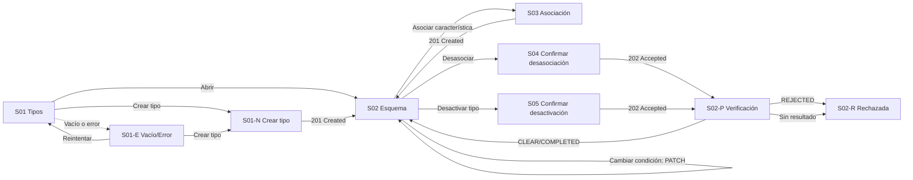

# Component Spec — MK-010

## 1. Identificación

- **Mockup:** MK-010 — Asociación de características a tipos de producto
- **Funcionalidad:** Taxonomía de esquemas de producto (tipos de producto y sus características asociadas con condición de obligatoriedad)
- **Responsable:** Leonardo Lopez (rama `lopez`)
- **Versión:** 1.1 — 2026-10-03
- **Estado:** **En revisión** — aprobación documental pendiente. No acredita implementación, autovalidación, revisión UX ni visto bueno para Figma.

Coordinación: ejecución general #61; entradas transversales #59 y #60. Alcance de la entrega: web desktop, viewport canónico 1440 × 900 px.

## 2. Trazabilidad

| Fuente | Referencia | Alcance |
|---|---|---|
| SPEC | [SPEC-010](../../specs/SPEC-010-asociacion-tipo-producto-caracteristica.md) | Requisitos 1–9: asociación activa-activo, unicidad, límite, consulta del esquema, fronteras con categorías, cambio de obligatoriedad, versión de esquema, bajas seguras, estado y reactivación |
| HU | [HU-010](../../hu/HU-010-asociacion-tipo-producto-caracteristica.md) | CA-01 a CA-17 y escenarios 1–9 (sin redefinir ni reordenar) |
| WF | [WF-010](../../wireframes/flows/WF-010-asociacion-tipo-producto-caracteristica.md) | Pantallas S-01, S-01-E, S-01-N, S-02, S-02-P, S-02-R, S-03, S-04, S-05; §18 microcopy; §15 y §16 contratos |
| Flow | [FLOW-010](../../flujos/FLOW-010-asociacion-tipo-producto-caracteristica.md) | Flujos A–G: consultar, crear, asociar, cambiar obligatoriedad, desasociar, desactivar y reactivar |
| Propuesta UX módulo | [propuesta-ux.md](../ux/propuesta-ux.md) | UX 2.0: jerarquía de configuración, contadores de límite, feedback situado |
| UX Decisions | [ux-decisions.md](../ux/ux-decisions.md) | UXD-003, UXD-005, UXD-009, UXD-014, UXD-016 |
| UX Guidelines | [ux-guidelines.md](../ux/ux-guidelines.md) | UXG-001 a UXG-004, UXG-008 a UXG-015, UXG-019, UXG-020 a UXG-022 |
| API Contract | [api/openapi.yaml](../../api/openapi.yaml) 0.5.0 · [Contrato_Api.md](../../Contrato_Api.md) · [asyncapi.yaml](../../asyncapi/asyncapi.yaml) 0.4.0 | Operaciones, DTO y errores de §9; `PRODUCT_TYPE`, `PRODUCT_TYPE_CHARACTERISTIC` y `taxonomy.product-type-schema.changed` |
| Design System | [DESIGN.md](../DESIGN.md) 1.0.0 | Foundations, layout desktop, componentes DS-C01…DS-C28 aplicados en §8 |

Las fuentes funcionales prevalecen sobre los artefactos visuales. Este documento no redefine CA ni reglas de negocio; las discrepancias se registran en §14.

### 2.1 Trazabilidad de criterios de aceptación de HU-010

Los 17 CA originales se conservan sin renumerar ni reinterpretar. `Tarea` remite a [tasks.md](tasks.md) y `Evidencia` a las secciones de `validation-report.md` (aún no emitido).

| CA | Criterio original (resumen fiel) | Pantalla / estado | Fixture | Tarea | Evidencia |
|---|---|---|---|---|---|
| CA-01 | Asociar característica activa a tipo activo indicando `OBLIGATORIA` u `OPCIONAL` | S03 / default | `asociar-activa`, `asociar-invalida` | MK-010-T16 | VR §3, §4 |
| CA-02 | No asociar dos veces la misma característica al mismo tipo | S03 / rechazo y selector filtrado | `asociacion-duplicada` | MK-010-T16 | VR §3, §4 |
| CA-03 | Las asociaciones activas no superan `MAX_PRODUCT_TYPE_ATTRIBUTES`; valor inicial del MVP 20, configurable | S02, S03 / límite alcanzado | `limite-20` | MK-010-T15, T16 | VR §3, §4 |
| CA-04 | La consulta del tipo devuelve características aplicables, obligatoriedad, metadatos y `schema_version`; sin asociaciones, lista vacía | S02 / default, vacío | `esquema-vacio`, `esquema-completo` | MK-010-T14 | VR §3, §4 |
| CA-05 | Las categorías solo clasifican para navegación; mover un producto no cambia `tipo_producto_id` ni recalcula el esquema | §4 y §10 (S02) límites declarados | `sin-categoria` | MK-010-T14, T60 | VR §4 |
| CA-06 | Cambiar de opcional a obligatoria no desactiva productos existentes; la obligación se exige en la siguiente edición, guardado o activación | S02 / cambiar condición | `obligatoria-aplicada` | MK-010-T15 | VR §3, §4 |
| CA-07 | Cada modificación confirmada de asociaciones incrementa `schema_version` | S02 / cambiar condición, desasociar confirmado | `schema-version-incrementada` | MK-010-T15, T18 | VR §3, §4 |
| CA-08 | Una desasociación que pueda afectar productos o variantes activos se procesa mediante verificación segura; `202` no significa que la asociación ya se eliminó | S04, S02-P / pendiente | `desasociacion-pendiente` | MK-010-T17 | VR §3, §4 |
| CA-09 | Si la característica identifica variantes activas o su retiro dejaría productos incompatibles, se rechaza la desasociación y se conserva la asociación | S02-R / rechazo | `desasociacion-rechazada` | MK-010-T18 | VR §3, §4 |
| CA-10 | Error, timeout o ausencia de resultado no autorizan la baja | S02-P / no concluyente | `verificacion-no-concluyente` | MK-010-T18 | VR §3, §4 |
| CA-11 | Un tipo de producto con productos activos no se desactiva sin verificación segura confirmada | S05, S02-P / pendiente | `desactivacion-pendiente` | MK-010-T19, T17 | VR §3, §4 |
| CA-12 | Un tipo inactivo o una característica inactiva no pueden usarse en nuevas altas o activaciones; el histórico no se borra | S02 / estado inactivo | `tipo-inactivo` | MK-010-T14, T20 | VR §3, §4 |
| CA-13 | Reactivar un tipo conserva su identidad y permite volver a utilizarlo | S02 / reactivar | `reactivacion-ok` | MK-010-T20 | VR §3, §4 |
| CA-14 | Todo cambio confirmado del esquema publica `taxonomy.product-type-schema.changed` con `tipo_producto_id`, versión vigente y naturaleza del cambio, incluidos cambio de obligatoriedad y desasociación confirmada | S02 / avisos tras cambio | `schema-version-incrementada` | MK-010-T15, T18 | VR §3, §4 |
| CA-15 | La baja segura de `PRODUCT_TYPE` y `PRODUCT_TYPE_CHARACTERISTIC` usa el flujo transversal de AsyncAPI 0.4.0 y la UI trata `202` solo como admisión | S04, S05, S02-P | `desasociacion-pendiente`, `desactivacion-pendiente` | MK-010-T17, T19 | VR §3, §4 |
| CA-16 | Cambiar `tipo_producto_id` de un producto publicado o con variantes es una migración controlada fuera del CRUD ordinario | §4 fuera de alcance | — | MK-010-T60 | VR §4 |
| CA-17 | Las escrituras requieren usuario autenticado y autorizado; los nombres exactos de permisos granulares pertenecen a Seguridad | Todas / sesión y permisos | `sesion`, `sin-permisos` | MK-010-T60 | VR §4 |

## 3. Objetivo funcional

- **Usuario:** Gestor Comercial responsable de la taxonomía de esquemas del catálogo.
- **Objetivo:** definir qué características admite cada tipo de producto y si son obligatorias u opcionales, con versión de esquema verificable y bajas seguras.
- **Contexto:** Catálogo y otros canales necesitan conocer el esquema vigente de cada tipo para validar y mostrar información de productos.
- **Resultado exitoso:** todo tipo expone un esquema versionado y ninguna desasociación o desactivación se confirma sin verificación segura vigente.

## 4. Alcance

### Incluido
- Listado de tipos de producto con nombre, estado, conteo de características y versión de esquema.
- Alta de tipo de producto con nombre requerido.
- Consulta del esquema efectivo: características aplicables, condición, metadatos y `schema_version`.
- Asociación de características activas con condición `OBLIGATORIA` u `OPCIONAL`, respetando el límite operativo.
- Cambio de condición de una asociación existente, sin desactivar productos y con incremento de versión.
- Desasociación segura con admisión `202`, seguimiento por `operationId` y resultado confirmado o rechazado.
- Desactivación segura del tipo de producto y reactivación conservando su identidad.
- Estados deterministas default, loading, empty, error y los casos negativos de §13.

### Fuera de alcance
- Reordenar características del esquema: no existe acción de ordenamiento visual.
- Mostrar `tipo_producto_id` como columna necesaria del listado.
- Migrar `tipo_producto_id` de un producto publicado o con variantes: es una migración controlada fuera del CRUD ordinario.
- Recalcular esquemas al mover un producto de categoría: las categorías solo clasifican para navegación.
- Capturas de valores en fichas de producto (interfaz de Productos y Ofertas).
- Nombres técnicos de eventos o tópicos en la interfaz.

## 5. Inventario de pantallas

| ID | Pantalla | Propósito | Entrada | Acción principal | Salida | Prioridad | Ruta del prototipo |
|---|---|---|---|---|---|---|---|
| MK-010-S01 | Tipos de producto | Consultar tipos con su estado, conteo y versión | Sidebar o ruta directa | Abrir esquema | S02 del tipo elegido | P0 | `/MK010/S01` |
| MK-010-S01-E | Listado vacío o con error | Recuperar cuando no hay tipos o la consulta falla | S01 / estado vacío o error | Crear tipo o reintentar | S01; S01-N | P0 | `/MK010/S01-E` |
| MK-010-S01-N | Crear tipo de producto | Registrar el nombre de un tipo nuevo | S01 o S01-E / Crear tipo | Crear tipo | Confirmado: S02 del tipo creado | P0 | `/MK010/S01-N` |
| MK-010-S02 | Esquema del tipo | Consultar y modificar características asociadas y su condición | S01 / Abrir | Asociar característica | S03; S02-P tras verificación | P0 | `/MK010/S02` |
| MK-010-S02-P | Operación en verificación | Mostrar la admisión y el seguimiento de la operación en curso | S02 o S04 o S05 / confirmar | Consultar estado | Confirmado: S02; `REJECTED`: S02-R | P0 | `/MK010/S02-P` |
| MK-010-S02-R | Operación rechazada | Explicar el rechazo y conservar el esquema intacto | S02-P / resultado rechazado | Entendido | S02 sin cambios | P0 | `/MK010/S02-R` |
| MK-010-S03 | Asociar característica | Elegir una característica activa no asociada y su condición | S02 / Asociar característica | Asociar al esquema | Confirmado: S02; límite: permanece en S03 | P0 | `/MK010/S03` |
| MK-010-S04 | Confirmar desasociación | Explicar el impacto y admitir la solicitud | S02 / Desasociar | Confirmar desasociación | `202`: S02-P | P0 | `/MK010/S04` |
| MK-010-S05 | Confirmar desactivación de tipo | Explicar el impacto y admitir la solicitud | S02 / Desactivar tipo | Confirmar desactivación | `202`: S02-P | P0 | `/MK010/S05` |

**Reglas de acceso y enrutamiento:**
- Toda pantalla inventariada como `MK-010-SXX` dispone de ruta individual y estable; la ruta deriva exactamente del identificador, incluidos los sufijos de variante (`/MK010/S01-E`, `/MK010/S01-N`, `/MK010/S02-P`, `/MK010/S02-R`).
- La ruta permite inspección directa sin recorrer el flujo previo; un diálogo se reproduce con el contexto de fondo que lo originó.
- El parámetro de consulta de fixture controla la reproducción determinista de estados y no se muestra como control técnico.
- Cualquier alta, baja o renombrado de pantalla obliga a actualizar ruta en este inventario, en [plan.md](plan.md) §5, en [tasks.md](tasks.md) y en `mockups/README.md`.

## 6. Relación entre pantallas

No existen caminos huérfanos: toda pantalla tiene entrada desde S01 o S02 y retorno a S02 o S01. Ninguna transición depende de admitir solo el `202`.

## 7. Jerarquía de información

1. **Primaria:** cabecera del tipo con nombre, estado, contador `X de N características` y acciones `Asociar característica`, `Desactivar tipo` o `Reactivar tipo`; tabla de características asociadas con condición y acciones.
2. **Secundaria:** versión de esquema como indicador de estado, avisos de resultado de la verificación y contador de límite.
3. **Complementaria:** ayudas de límite y de obligatoriedad; nunca se expone `tipo_producto_id` como columna necesaria.

El estado y la versión se expresan con texto además de color, y no existe acción de reordenar.

## 8. Componentes compartidos

| Componente | Pantallas | Uso | Variante | Estados |
|---|---|---|---|---|
| DS-C01 Button | S01–S05 | Crear tipo, asociar, confirmar, desactivar, reactivar | filled primary / outline secondary md 40 px | default, hover, focus, disabled, loading |
| DS-C02 ActionIcon | S01, S02 | Abrir, cambiar condición, desasociar, desactivar | 32/40 px con nombre accesible | default, focus, disabled |
| DS-C03 TextInput | S01, S01-N | Nombre del tipo y buscador en tablas | md 40 px, label arriba | default, error, disabled |
| DS-C06 Select | S03 | Característica activa no asociada | md 40 px | default, error, sin candidatas |
| DS-C10 Switch | S02, S03 | Condición `Obligatoria` u `Opcional` | md con `aria-checked` | default, checked, focus, disabled |
| DS-C14 Badge | S01, S01-E, S02 | Activo, inactivo, versión de esquema | sm 24 px con texto | default |
| DS-C17 Table | S01, S02 | Tipos de producto y características asociadas | header 40 px, fila 48 px | default, loading, empty, sin resultados, error |
| DS-C19 Card | S01, S01-N, S02 | Formulario de alta y cabecera del esquema | padding 24, radio 12 | default |
| DS-C21 Modal | S02-R, S03, S04, S05 | Asociación, confirmaciones y rechazo | 480 px, padding 24, radio 16 | default, focus trap, Escape |
| DS-C22 Alert | S01-E, S02, S02-P, S02-R, S03, S04, S05 | Límite, errores, verificación y resultado | padding 16, icono 20 | info, warning, error, success |
| DS-C24 Skeleton/Loader | S01, S02, S02-P | Carga inicial y verificación en curso | líneas 16/20/24 | loading |
| DS-C25 EmptyState | S01-E, S02 | Sin tipos o sin características asociadas | padding 32 | empty, sin resultados |
| DS-C28 Breadcrumbs | S01–S05 | `Inicio > Taxonomía > Tipos de producto` | 14/20 | default |

No se redefinen componentes del Design System; las particularidades viven en §9.

## 9. Componentes específicos

### MK-010-C01 — Tabla de esquema del tipo

**Propósito** mostrar las características asociadas con su condición y acciones, y hacer visible la versión del esquema.

**Pantallas:** S02.

**Propiedades conceptuales**

| Propiedad | Tipo | Obligatoria | Regla / Restricción |
|---|---|---:|---|
| `tipoProducto` | Nombre y estado | Sí | Estado activo o inactivo |
| `caracteristicas` | Lista de asociación | Sí | Característica, tipo de dato y condición |
| `limite` | Número | Sí | `MAX_PRODUCT_TYPE_ATTRIBUTES`, valor inicial 20 y configurable |
| `conteoActual` | Número | Sí | Derivado de las asociaciones activas |
| `versionEsquema` | Número | Sí | `schemaVersion` vigente; se incrementa en cada cambio confirmado |
| `verificacionEnCurso` | Identificador de operación | No | Mientras exista, la fila afectada no se retira |

**Estados**

| Estado | Disparador | Representación visual | Acción permitida |
|---|---|---|---|
| Default | Esquema con asociaciones | Filas con condición y acciones | Cambiar condición, desasociar, asociar |
| Vacío | Sin asociaciones | EmptyState con acción Asociar característica | Asociar característica |
| Límite alcanzado | 20 asociaciones activas | Contador en límite y acción deshabilitada con explicación | Desasociar para liberar cupo |
| Verificación pendiente | `202` admitido | Banner de verificación y fila afectada retenida | Consultar estado |
| Tipo inactivo | Estado del tipo | Sin asociación ni cambio de condición; acción Reactivar tipo | Reactivar tipo |

**Interacciones**

| Acción | Respuesta de interfaz | Resultado | Flow |
|---|---|---|---|
| Cambiar condición | `PATCH` de la asociación | Fila actualizada, versión incrementada y aviso de propagación | FLOW-010 Flujo D |
| Desasociar | Confirmación previa | S04 | FLOW-010 Flujo E |
| Asociar característica | Apertura del diálogo | S03 | FLOW-010 Flujo C |

**Accesibilidad:** el switch de condición expone `aria-checked` y etiqueta su fila; el estado y la versión se anuncian como texto.

### MK-010-C02 — Selector de características asociables

**Propósito** ofrecer solo características activas y no asociadas al tipo, con su condición y el límite vigente.

**Pantallas:** S03.

**Propiedades conceptuales**

| Propiedad | Tipo | Obligatoria | Regla / Restricción |
|---|---|---:|---|
| `candidatas` | Lista de característica | Sí | Solo activas y no asociadas |
| `condicion` | Obligatoria / Opcional | Sí | Valor por defecto Opcional |
| `limite` | Número | Sí | 20 en MVP, configurable |
| `conteoActual` | Número | Sí | Se compara con el límite al guardar |
| `motivoBloqueo` | Texto | No | Presente cuando el límite impide guardar |

**Estados**

| Estado | Disparador | Representación visual | Acción permitida |
|---|---|---|---|
| Default | Hay candidatas | Selector con ayuda de condición | Elegir característica y condición |
| Sin candidatas | Todas las características ya están asociadas | Selector vacío con explicación | Volver al esquema |
| Límite alcanzado | 20 asociaciones activas | Alerta de límite y guardado deshabilitado | Volver al esquema |
| Asociación inválida | Característica inactiva en el momento de guardar | Error del servidor junto al selector | Corregir la elección |
| Duplicada | Asociación ya existente | `409 ASOCIACION_DUPLICADA` | Volver al esquema |

**Interacciones**

| Acción | Respuesta | Resultado |
|---|---|---|
| Elegir característica | Valor en el selector | Permite establecer la condición |
| Guardar asociación | `POST` de la asociación | `201`: S02; `409` o `422`: permanece en S03 |

**Accesibilidad:** label visible, descripción del límite asociada al control y foco devuelto al disparador al cerrar el diálogo.

### MK-010-C03 — Aviso de versión de esquema

**Propósito** comunicar la versión vigente del esquema y que los cambios confirmados se propagan a los canales consumidores.

**Pantallas:** S02 (tras cambio de condición o desasociación confirmada).

**Propiedades conceptuales**

| Propiedad | Tipo | Obligatoria | Regla / Restricción |
|---|---|---:|---|
| `versionActual` | Número | Sí | `schemaVersion` vigente |
| `naturaleza` | Asociación / Condición / Desasociación | Sí | Solo texto operativo, nunca nombres de eventos |
| `propagacion` | Eventual | Sí | No se afirma sincronía |

**Estados**

| Estado | Disparador | Representación visual | Acción permitida |
|---|---|---|---|
| Default | Consulta del esquema | Indicador `v{n}` junto al nombre del tipo | Ninguna |
| Incremento | Cambio confirmado | Aviso con la nueva versión y la naturaleza del cambio | Continuar |
| No concluyente | Verificación sin resultado | Aviso de que no se realizó ninguna modificación | Consultar de nuevo |

**Interacciones**

| Acción | Respuesta | Resultado |
|---|---|---|
| Ninguna | El aviso es informativo | El nombre técnico del evento no se muestra |

**Accesibilidad:** el indicador de versión se anuncia como texto y no solo como icono o color.

### MK-010-C04 — Seguimiento de verificación segura

**Propósito** representar la admisión `202` de desasociaciones y desactivaciones y su verificación posterior sin anticipar el resultado.

**Pantallas:** S02-P (resultado en S02-R), disparado desde S04 y S05.

**Propiedades conceptuales**

| Propiedad | Tipo | Obligatoria | Regla / Restricción |
|---|---|---:|---|
| `operacion` | Identificador de operación | Sí | Solo el identificador, sin eventos ni tópicos visibles |
| `entidadTipo` | Asociación de tipo y característica / Tipo de producto | Sí | Texto operativo |
| `estado` | Pendiente / Confirmada / Rechazada | Sí | Derivado de `PENDING_DEACTIVATION`, `CLEAR`/`COMPLETED`, `REJECTED` |
| `motivoRechazo` | Texto | No | Presente solo en rechazo |
| `consultable` | Booleano | Sí | Permite consultar el estado sin recargar |

**Estados**

| Estado | Disparador | Representación visual | Acción permitida |
|---|---|---|---|
| Pendiente | `202` admitido o `PENDING_DEACTIVATION` | Banner «Verificando uso…» con acción Consultar estado | Consultar, volver al esquema |
| Confirmada | `CLEAR` o `COMPLETED` | Banner de resultado y fila retirada | Volver al esquema |
| Rechazada | `REJECTED` o uso activo | S02-R con motivo | Entendido |
| No concluyente | Error de consulta o resultado ausente | Aviso de que no se realizó ninguna modificación | Entendido, consultar de nuevo |

**Interacciones**

| Acción | Respuesta | Resultado |
|---|---|---|
| Consultar estado | Consulta la operación y actualiza el banner | Estado vigente; nunca se reenvía la solicitud |
| Entendido | Cierra el aviso | S02 con el esquema real |

**Accesibilidad:** región `aria-live` para el resultado asíncrono y foco al mensaje de resultado; el copy de WF-010 §18 se usa literalmente.

## 10. Especificación por pantalla

### MK-010-S01 — Tipos de producto

**Propósito y objetivo** consultar los tipos de producto con su estado, conteo de características y versión de esquema.
**Estructura y layout** 1. Cabecera con migas y título. 2. Barra con Crear tipo y filtro. 3. Tabla con nombre, estado, `X de N características` y acción Abrir.
**Componentes presentes** DS-C28, DS-C01, DS-C12, DS-C17, DS-C14, DS-C02, DS-C24; MK-010-C01.
**Acción primaria** Crear tipo hacia S01-N.
**Acciones secundarias** Abrir esquema; Reactivar tipo sobre la fila elegida.
**Estados requeridos** default, loading, vacío, error, sesión y permisos.
**Contenido clave y microtexto**

| Elemento | Texto / Patrón | Fuente de procedencia |
|---|---|---|
| Columnas | Nombre, estado, `X de N características`, acción Abrir | WF-010 §9 |
| Restricción | No mostrar `tipo_producto_id` como columna necesaria | WF-010 §9 |
| Contador | «{asociadas} de {límite} características» | HU-010 CA-03 |

### MK-010-S01-E — Listado vacío o con error

**Propósito y objetivo** permitir crear el primer tipo o reintentar la consulta cuando el listado no puede mostrarse.
**Estructura y layout** 1. EmptyState o Alert centrado. 2. Acción Crear tipo o Reintentar.
**Componentes presentes** DS-C25, DS-C22, DS-C01.
**Acción primaria** Crear tipo hacia S01-N.
**Acciones secundarias** Reintentar la consulta hacia S01.
**Estados requeridos** vacío, error, sesión y permisos.
**Contenido clave y microtexto**

| Elemento | Texto / Patrón | Fuente de procedencia |
|---|---|---|
| Vacío | «Todavía no hay tipos de producto.» | UX Guidelines |
| Error | «No pudimos cargar los tipos de producto.» | WF-010 §14 |

### MK-010-S01-N — Crear tipo de producto

**Propósito y objetivo** registrar el nombre de un tipo de producto nuevo y acceder a la configuración de su esquema.
**Estructura y layout** 1. Migas y título. 2. Formulario ligero en Card con nombre requerido. 3. Barra con Crear y configurar esquema y Cancelar.
**Componentes presentes** DS-C28, DS-C19, DS-C03, DS-C01, DS-C22.
**Acción primaria** Crear y configurar esquema.
**Acciones secundarias** Cancelar hacia S01 o S01-E.
**Estados requeridos** default, validación, guardando, error, salida-con-cambios, sesión y permisos.
**Contenido clave y microtexto**

| Elemento | Texto / Patrón | Fuente de procedencia |
|---|---|---|
| Campo | Nombre (requerido) | FLOW-010 Flujo B |
| Ayuda | «Después de crearlo podrás asociar características a su esquema.» | FLOW-010 Flujo B |

### MK-010-S02 — Esquema del tipo

**Propósito y objetivo** consultar y modificar las características asociadas, su condición y la versión del esquema.
**Estructura y layout** 1. Cabecera con nombre, estado, contador y acciones Asociar característica y Desactivar tipo o Reactivar tipo. 2. Indicador de versión. 3. Tabla con Característica, Tipo de dato, Condición y Acciones.
**Componentes presentes** DS-C28, DS-C01, DS-C10, DS-C14, DS-C17, DS-C19, DS-C22, DS-C24, DS-C25; MK-010-C01, MK-010-C03.
**Acción primaria** Asociar característica hacia S03.
**Acciones secundarias** Cambiar condición, Desasociar, Desactivar tipo, Reactivar tipo.
**Estados requeridos** default, loading, vacío, límite alcanzado, verificación pendiente, tipo inactivo, error, sesión y permisos.
**Contenido clave y microtexto**

| Elemento | Texto / Patrón | Fuente de procedencia |
|---|---|---|
| Obligatoria | «Se exigirá al volver a guardar o activar los productos que correspondan.» | WF-010 §18 |
| Límite | «Has alcanzado el límite configurado de características para este tipo.» | WF-010 §18 |
| Restricción | No mostrar una acción de «reordenar» | WF-010 §10 |
| Estado inactivo | «Este tipo está inactivo y no puede usarse en nuevas altas ni activaciones.» | HU-010 CA-12 |

### MK-010-S02-P — Operación en verificación

**Propósito y objetivo** comunicar que la solicitud fue admitida y permitir consultar el estado real de la verificación.
**Estructura y layout** 1. Banner de estado con identificador de operación. 2. Acción Consultar estado. 3. Enlace de retorno al esquema.
**Componentes presentes** DS-C22, DS-C24, DS-C01; MK-010-C04.
**Acción primaria** Consultar estado de la operación.
**Acciones secundarias** Volver al esquema sin afirmar resultado.
**Estados requeridos** pendiente, confirmada, rechazada, no concluyente.
**Contenido clave y microtexto**

| Elemento | Texto / Patrón | Fuente de procedencia |
|---|---|---|
| Pendiente | «Estamos comprobando si el cambio puede realizarse de forma segura.» | WF-010 §18 |
| En curso | «Verificando uso…» | WF-010 §12 |
| Confirmada | «El cambio se completó.» | WF-010 §14 |

### MK-010-S02-R — Operación rechazada

**Propósito y objetivo** explicar el rechazo y conservar el esquema intacto.
**Estructura y layout** 1. Modal de resultado con motivo. 2. Acción Entendido.
**Componentes presentes** DS-C21, DS-C22, DS-C01.
**Acción primaria** Entendido, que vuelve a S02.
**Acciones secundarias** Consultar de nuevo el estado si el motivo fue ausencia de resultado.
**Estados requeridos** rechazo por uso activo, no concluyente.
**Contenido clave y microtexto**

| Elemento | Texto / Patrón | Fuente de procedencia |
|---|---|---|
| Rechazo | «No se puede completar porque existen productos o variantes activos que dependen de esta configuración.» | WF-010 §18 |
| Desasociación en uso | «No se puede retirar esta característica porque todavía participa en productos o variantes activos.» | WF-010 §12 |
| No concluyente | «No pudimos confirmar que el cambio sea seguro. No se realizó ninguna modificación.» | WF-010 §18 |

### MK-010-S03 — Asociar característica

**Propósito y objetivo** elegir una característica activa no asociada y establecer su condición dentro del límite vigente.
**Estructura y layout** 1. Modal con selector de característica y control de condición. 2. Ayuda del límite y contador. 3. Acciones Asociar al esquema y Cancelar.
**Componentes presentes** DS-C21, DS-C06, DS-C10, DS-C22, DS-C01; MK-010-C02.
**Acción primaria** Asociar al esquema.
**Acciones secundarias** Cancelar hacia S02.
**Estados requeridos** default, sin candidatas, límite alcanzado, asociación inválida, duplicada, guardando.
**Contenido clave y microtexto**

| Elemento | Texto / Patrón | Fuente de procedencia |
|---|---|---|
| Selector | Características activas no asociadas | WF-010 §11 |
| Límite | «Has alcanzado el límite configurado de características para este tipo.» | WF-010 §18 |

### MK-010-S04 — Confirmar desasociación

**Propósito y objetivo** explicar el impacto de retirar una característica y admitir la solicitud de verificación segura.
**Estructura y layout** 1. Modal con el nombre de la característica y la advertencia de impacto. 2. Acciones Confirmar desasociación y Cancelar.
**Componentes presentes** DS-C21, DS-C22, DS-C01.
**Acción primaria** Confirmar desasociación, que solicita la verificación y admite `202`.
**Acciones secundarias** Cancelar hacia S02.
**Estados requeridos** default, con fila retenida mientras se verifica, error de admisión.
**Contenido clave y microtexto**

| Elemento | Texto / Patrón | Fuente de procedencia |
|---|---|---|
| Advertencia | «Antes de retirar esta característica debemos comprobar que el cambio no deje productos o variantes activos en un estado incompatible.» | WF-010 §12 |
| En curso | «Verificando uso…» | WF-010 §12 |

### MK-010-S05 — Confirmar desactivación de tipo

**Propósito y objetivo** explicar el impacto de desactivar el tipo y admitir la solicitud de verificación segura.
**Estructura y layout** 1. Modal con el nombre del tipo y la advertencia de impacto. 2. Acciones Confirmar desactivación y Cancelar.
**Componentes presentes** DS-C21, DS-C22, DS-C01.
**Acción primaria** Confirmar desactivación, que solicita la verificación y admite `202`.
**Acciones secundarias** Cancelar hacia S02.
**Estados requeridos** default, con esquema retenido mientras se verifica, error de admisión.
**Contenido clave y microtexto**

| Elemento | Texto / Patrón | Fuente de procedencia |
|---|---|---|
| Advertencia | «Antes de desactivar este tipo debemos comprobar que no tenga productos activos que dependan de él.» | WF-010 §13 |
| Fallo cerrado | La misma regla de fallo cerrado aplica que en la desasociación | WF-010 §13 |

## 11. Decisiones UX locales

### LUX-01 — Condición como switch en la fila del esquema

**Problema** la obligatoriedad es un dato por asociación, no del tipo, y puede confundirse con un estado global.
**Alternativas consideradas** selector desplegable por fila (descartada: más pasos para un cambio de dos valores) o columna de texto (descartada: no comunica el estado actual).
**Decisión adoptada** switch por fila con `aria-checked` y etiqueta de columna `Condición`.
**Justificación** hace visible que el cambio es por asociación y su efecto futuro.
**Trade-off** el switch no admite estados intermedios, lo cual es correcto según el contrato.
**Criterio de validación** en S02 se distingue la condición de cada característica y el aviso de obligatoriedad aparece tras guardar.

### LUX-02 — Indicador de versión junto al nombre del tipo

**Problema** `schema_version` es el mecanismo de integración con Catálogo y no debe quedar oculto.
**Alternativas consideradas** mostrarlo solo en el detalle (descartada: no acompaña a la acción) o mostrarlo en cada fila (descartada: ocupa la columna más valiosa del listado).
**Decisión adoptada** indicador `v{n}` en la cabecera del esquema y contador de características en el listado.
**Justificación** acompaña la acción de modificar y hace observable el incremento por cambio confirmado.
**Trade-off** requiere actualización tras cada cambio confirmado.
**Criterio de validación** tras un cambio de condición el indicador refleja la versión vigente.

### LUX-03 — Fila retenida durante la verificación

**Problema** retirar la fila al admitir la solicitud comunica una desasociación que quizá no ocurra.
**Alternativas consideradas** retirar la fila de inmediato (descartada: afirma un cambio no confirmado) o atenuarla con esqueleto (descartada: sugiere datos incompletos).
**Decisión adoptada** conservar la fila con estado de verificación y no permitir acciones sobre ella.
**Justificación** cumple la regla de fallo cerrado y evita el perceptions de pérdida de información.
**Trade-off** el esquema parece congelado mientras se verifica.
**Criterio de validación** con `desasociacion-pendiente` la fila permanece y con el resultado confirmado se retira.

## 12. Reglas de layout PC

- Entorno exclusivo web desktop con viewport canónico de 1440 px y scroll vertical.
- Shell, espaciados y tipografía según DESIGN §5; contenido alineado a la rejilla del sistema.
- Tablas con scroll limitado a su región; la página no presenta overflow horizontal en ningún estado.
- Modales de 480 px según DESIGN; formularios alineados a la izquierda con ancho máximo del sistema.
- Iconografía exclusivamente Tabler; tokens de color, radio y espacio del tema, sin estilos inline arbitrarios.

## 13. Fixtures

| Fixture | Caso de negocio | Pantalla / Estado | Datos representativos |
|---|---|---|---|
| `default` | Listado con dos tipos | S01 / Default | `Calzado` con 4 características y `v3`; `Ropa` con 2 y `v1` |
| `loading` | Consulta o verificación en curso | S01, S02, S02-P / Loading | Skeleton o banner pendiente |
| `empty` | Sin tipos de producto | S01-E / Empty | Colección vacía |
| `sin-resultados` | Filtro sin coincidencias | S01-E / Sin resultados | Filtro `Zapato` sin coincidencias |
| `error` | Fallo controlado de lectura | S01-E / Error | `Problem` con `ERROR_INTERNO` |
| `sesion` | Token inválido o expirado | Todas / Sesión | `401 TOKEN_INVALIDO` |
| `sin-permisos` | Escritura sin autorización | Todas / Permisos | `403 SCOPE_INSUFICIENTE`; sin nombres de permiso granular |
| `esquema-vacio` | Tipo sin asociaciones | S02 / Vacío | EmptyState con acción Asociar característica |
| `esquema-completo` | Esquema con metadatos y versión | S02 / Default | Característica, tipo de dato, condición y versión vigente |
| `limite-20` | Límite alcanzado | S02, S03 / Límite alcanzado | 20 asociaciones activas; límite configurable 20 |
| `asociar-activa` | Asociación válida | S03 / Default | Candidata activa no asociada; condición Opcional |
| `asociar-invalida` | Característica inactiva | S03 / Error | `409 CARACTERISTICA_INACTIVA` |
| `asociacion-duplicada` | Asociación repetida | S03 / Error | `409 ASOCIACION_DUPLICADA`; la candidata no aparece en el selector |
| `obligatoria-aplicada` | Cambio de condición | S02 / Default→confirmado | Condición Obligatoria; aviso «Se exigirá al volver a guardar…» |
| `schema-version-incrementada` | Cambio confirmado | S02 / Aviso | Versión incrementada y aviso de propagación a los canales |
| `desasociacion-pendiente` | Verificación en curso | S02-P / Pendiente | `202` con identificador de operación; fila retenida |
| `desasociacion-confirmada` | Verificación segura | S02-P / Confirmada | Resultado `CLEAR`; fila retirada y versión incrementada |
| `desasociacion-rechazada` | Variantes activas | S02-R / Rechazada | Resultado `REJECTED`; asociación conservada |
| `verificacion-no-concluyente` | Error, timeout o ausencia de resultado | S02-P / No concluyente | Sin modificación |
| `desactivacion-pendiente` | Baja del tipo en curso | S02-P / Pendiente | `202` con identificador de operación |
| `tipo-inactivo` | Tipo desactivado | S02 / Inactivo | Sin asociación ni cambio de condición; acción Reactivar tipo |
| `reactivacion-ok` | Reactivación correcta | S02 / Confirmado | Misma identidad y esquema disponible |
| `sin-categoria` | Producto clasificado por categoría | S02 / Nota | La categoría no altera `tipo_producto_id` ni el esquema |

## 14. Preguntas y supuestos

### Preguntas abiertas

| ID | Pregunta | Bloquea ejecución | Responsable | Estado |
|---|---|---:|---|---|
| Q-01 | ¿`MAX_PRODUCT_TYPE_ATTRIBUTES` se expone como parámetro del contrato consultable o permanece como constante configurable del MVP? | No | Leonardo Lopez con Taxonomía | Abierta |
| Q-02 | ¿El resultado de la verificación segura expone el detalle de los productos o variantes que impiden la desasociación, o solo el resultado agregado? | No | Leonardo Lopez con Taxonomía | Abierta |

### Supuestos adoptados

| ID | Supuesto | Riesgo | Condición de revisión |
|---|---|---|---|
| A-01 | El estado de la verificación se consulta con `GET /api/v1/taxonomia/operaciones/{operationId}` hasta obtener resultado definitivo | Si el contrato no permite consultar, la UI no podría distinguir pendiente de rechazado | Al confirmar la ruta administrativa en el backend |
| A-02 | La version mostrada es `schemaVersion` del esquema efectivo y se incrementa solo con cambios confirmados | Si el backend lo calculara por otro criterio, el indicador seria incorrecto | Al construir S02 |

## 15. Criterios de aceptación

- [ ] Las 9 pantallas de §5 están inventariadas con ruta directa, estable y coherente con su identificador, incluidas `/MK010/S01-E`, `/MK010/S01-N`, `/MK010/S02-P` y `/MK010/S02-R`.
- [ ] Los 17 CA de HU-010 están trazados en §2.1 a pantalla, estado, tarea y evidencia, sin redefinir su texto.
- [ ] Operaciones y DTO coinciden con el contrato, incluido `PATCH /api/v1/tipos-producto/{tipoProductoId}/caracteristicas/{caracteristicaId}` para el cambio de condición.
- [ ] El límite se presenta con valor inicial 20 y configurable, nunca con un valor inventado distinto del MVP.
- [ ] Las bajas seguras de `PRODUCT_TYPE` y `PRODUCT_TYPE_CHARACTERISTIC` tratan el `202` como admisión y muestran seguimiento por `operationId`.
- [ ] Los cambios confirmados incrementan la versión del esquema y se comunica la propagación a los canales sin exponer nombres de eventos.
- [ ] No existe acción de reordenar ni columna `tipo_producto_id` en el listado.
- [ ] Decisiones locales LUX-01, LUX-02 y LUX-03 justificadas en §11.
- [ ] Componentes compartidos reutilizados del Design System y componentes específicos de §9 con propiedades, estados y accesibilidad definidos.
- [ ] Fixtures deterministas para default, loading, empty, error y cada caso negativo de §13.
- [ ] Reglas de layout PC a 1440 px sin overflow horizontal y con accesibilidad básica (foco, nombres, teclado, estado no solo por color).
- [ ] La documentación queda **En revisión** hasta la revisión documental; no se declara aprobación para implementación ni para Figma.
