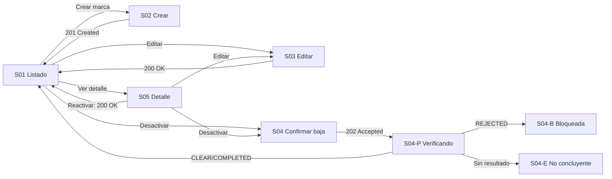

# Component Spec — MK-011

## 1. Identificación

- **Mockup:** MK-011 — Gestión de marcas
- **Funcionalidad:** Taxonomía de marcas del catálogo (alta, edición, baja lógica segura y reactivación de marcas)
- **Responsable:** Leonardo Lopez (rama `lopez`)
- **Versión:** 1.1 — 2026-10-03
- **Estado:** **En revisión** — aprobación documental pendiente. No acredita implementación, autovalidación, revisión UX ni visto bueno para Figma.

Coordinación: ejecución general #61; entradas transversales #59 y #60. Alcance de la entrega: web desktop, viewport canónico 1440 × 900 px.

## 2. Trazabilidad

| Fuente | Referencia | Alcance |
|---|---|---|
| SPEC | [SPEC-011](../../specs/SPEC-011-gestion-marcas.md) | Requisitos 1–10: unicidad normalizada, edición, país ISO, logo, baja lógica con verificación, reactivación, exposición a canales y mensajería |
| HU | [HU-011](../../hu/HU-011-gestion-marcas.md) | CA-01 a CA-16 (sin redefinir ni reordenar) |
| WF | [WF-011](../../wireframes/flows/WF-011-gestion-marcas.md) v0.5 | Pantallas S-01, S-02, S-03, S-04, S-04-P, S-04-B, S-04-E, S-05; §3 formulario; §4 baja; §5 EDA |
| Flow | [FLOW-011](../../flujos/FLOW-011-gestion-marcas.md) | Consulta, alta, edición, baja segura y reactivación |
| Propuesta UX módulo | [propuesta-ux.md](../ux/propuesta-ux.md) | UX 2.0: previsualización de logo, feedback situado, estados transitorios |
| UX Decisions | [ux-decisions.md](../ux/ux-decisions.md) | UXD-007, UXD-010, UXD-011, UXD-017, UXD-019 |
| UX Guidelines | [ux-guidelines.md](../ux/ux-guidelines.md) | UXG-001 a UXG-003, UXG-006 a UXG-015, UXG-018 a UXG-022 |
| API Contract | [api/openapi.yaml](../../api/openapi.yaml) 0.5.0 · [Contrato_Api.md](../../Contrato_Api.md) · [asyncapi.yaml](../../asyncapi/asyncapi.yaml) 0.4.0 | Operaciones, DTO y errores de §9; `MarcaCreateMultipart`, `MarcaUpdateMultipart` y protocolo transversal de baja segura |
| Design System | [DESIGN.md](../DESIGN.md) 1.0.0 | Foundations, layout desktop, componentes DS-C01…DS-C28 aplicados en §8 |

Las fuentes funcionales prevalecen sobre los artefactos visuales. Este documento no redefine CA ni reglas de negocio; las discrepancias se registran en §14.

### 2.1 Trazabilidad de criterios de aceptación de HU-011

Los 16 CA originales se conservan sin renumerar ni reinterpretar. `Tarea` remite a [tasks.md](tasks.md) y `Evidencia` a las secciones de `validation-report.md` (aún no emitido).

| CA | Criterio original (resumen fiel) | Pantalla / estado | Fixture | Tarea | Evidencia |
|---|---|---|---|---|---|
| CA-01 | Crear con nombre único, descripción opcional, logo y país opcional | S02 / default | `crear-con-logo`, `crear-minimo` | MK-011-T14 | VR §3, §4 |
| CA-02 | La unicidad normalizada incluye marcas activas e inactivas | S02 / rechazo | `nombre-duplicado` | MK-011-T14 | VR §3, §4 |
| CA-03 | Editar nombre, descripción, logo y país | S03 / default | `editar-marca` | MK-011-T15 | VR §3, §4 |
| CA-04 | Baja lógica bloqueada si hay productos activos | S04, S04-B / bloqueada | `baja-bloqueada`, `baja-rechazada` | MK-011-T16, T17 | VR §3, §4 |
| CA-05 | Reactivar una marca previamente inactiva | S05 / reactivar | `reactivacion-ok` | MK-011-T19 | VR §3, §4 |
| CA-06 | Nunca eliminación física | Todo el MK: sin acción de eliminar | `sin-borrado` | MK-011-T60 | VR §4 |
| CA-07 | Exponer marcas activas a Catálogo/canales | S01, S05 / nota de exposición | `listado-marcas` | MK-011-T13, T19 | VR §3, §4 |
| CA-08 | PNG/JPG/JPEG/WebP hasta 5 MB | S02, S03 / default, error | `logo-formato-invalido`, `logo-excede-limite` | MK-011-T14, T15 | VR §3, §4 |
| CA-09 | País opcional validado como ISO 3166-1 | S02, S03 / default, error | `pais-no-precargado`, `pais-invalido` | MK-011-T14, T15 | VR §3, §4 |
| CA-10 | Renombre duplicado se rechaza también frente a inactivas | S03 / rechazo | `nombre-duplicado-inactiva` | MK-011-T15 | VR §3, §4 |
| CA-11 | Solo `CLEAR` asíncrono bajo barrera confirma la baja | S04-P / pendiente, confirmado | `baja-pendiente`, `baja-confirmada` | MK-011-T17 | VR §3, §4 |
| CA-12 | Reactivación conserva ID y nombre | S05 / reactivar | `reactivacion-ok` | MK-011-T19 | VR §3, §4 |
| CA-13 | Falta de respuesta conserva la marca activa | S04-E / no concluyente | `baja-no-concluyente` | MK-011-T18 | VR §3, §4 |
| CA-14 | Seguridad asigna el acceso; esta HU no declara un rol global como contrato propio | §10 estados de sesión y permisos | `sesion`, `sin-permisos` | MK-011-T60 | VR §4 |
| CA-15 | Crear, editar y reactivar se representan por HTTP; no publican ningún mensaje propio | §6 y §10 | — | MK-011-T60 | VR §4 |
| CA-16 | La única mensajería de Marcas es el protocolo transversal de baja segura | §6, §13 | `baja-pendiente` | MK-011-T17, T60 | VR §3, §4 |

## 3. Objetivo funcional

- **Usuario:** Gestor Comercial responsable de la taxonomía de marcas del catálogo.
- **Objetivo:** mantener el conjunto de marcas del catálogo con su logo y país, y dar de baja o reactivar marcas sin afectar productos activos.
- **Contexto:** Catálogo y los demás canales consumen el listado de marcas activas para presentar y filtrar productos.
- **Resultado exitoso:** toda marca expone información completa y verificable, y ninguna baja se confirma sin resultado seguro vigente.

## 4. Alcance

### Incluido
- Listado de marcas con nombre, estado, logo y país.
- Alta con nombre único, descripción opcional, logo y país opcional.
- Edición de nombre, descripción, logo y país mediante envío multipart.
- Baja lógica segura con admisión `202`, seguimiento por `operationId` y resultados confirmado, bloqueado y no concluyente.
- Detalle de marca y reactivación conservando identificador y nombre.
- Estados deterministas default, loading, empty, error y los casos negativos de §13.

### Fuera de alcance
- Eliminación física de marcas.
- Cualquier acción de reordenar o de edición masiva.
- Mensajería propia de creación, edición o estado de marca: no existen eventos genéricos publicados y la interfaz no los inventa.
- Asociación de marcas a categorías o tipos de producto: las categorías solo clasifican para navegación.
- Modificación del ID interno de una marca.
- Declarar un rol o permiso granular como contrato de esta HU.

## 5. Inventario de pantallas

| ID | Pantalla | Propósito | Entrada | Acción principal | Salida | Prioridad | Ruta del prototipo |
|---|---|---|---|---|---|---|---|
| MK-011-S01 | Listado de marcas | Consultar marcas con su estado, logo y país | Sidebar o ruta directa | Crear marca | S02; S03 o S05 de la marca elegida | P0 | `/MK011/S01` |
| MK-011-S02 | Crear marca | Registrar la información de una marca nueva | S01 / Crear marca | Crear marca | Confirmado: S01 con la nueva fila | P0 | `/MK011/S02` |
| MK-011-S03 | Editar marca | Modificar nombre, descripción, logo y país | S01 o S05 / Editar | Guardar cambios | Confirmado: S01 | P0 | `/MK011/S03` |
| MK-011-S04 | Confirmar baja | Explicar el impacto y admitir la solicitud | S01 o S05 / Desactivar | Confirmar desactivación | `202`: S04-P | P0 | `/MK011/S04` |
| MK-011-S04-P | Verificando baja | Mostrar la admisión y el seguimiento de la operación | S04 / confirmar | Consultar estado | `CLEAR`/`COMPLETED`: S01; `REJECTED`: S04-B | P0 | `/MK011/S04-P` |
| MK-011-S04-B | Baja bloqueada | Explicar el bloqueo por productos activos | S04-P / resultado bloqueado | Entendido | S01 con la marca intacta | P0 | `/MK011/S04-B` |
| MK-011-S04-E | Baja no concluyente | Informar que no se realizó ningún cambio | S04-P / sin resultado | Entendido | S01 con la marca activa | P0 | `/MK011/S04-E` |
| MK-011-S05 | Detalle de marca | Leer datos, logo, país y estado | S01 / Ver detalle | Editar o desactivar | S03, S04 o S01 | P0 | `/MK011/S05` |

**Reglas de acceso y enrutamiento:**
- Toda pantalla inventariada como `MK-011-SXX` dispone de ruta individual y estable; la ruta deriva exactamente del identificador, incluidos los sufijos de variante (`/MK011/S04-P`, `/MK011/S04-B`, `/MK011/S04-E`).
- La ruta permite inspección directa sin recorrer el flujo previo; un diálogo se reproduce con el contexto de fondo que lo originó.
- El parámetro de consulta de fixture controla la reproducción determinista de estados y no se muestra como control técnico.
- Cualquier alta, baja o renombrado de pantalla obliga a actualizar ruta en este inventario, en [plan.md](plan.md) §5, en [tasks.md](tasks.md) y en `mockups/README.md`.

## 6. Relación entre pantallas

No existen caminos huérfanos: toda pantalla tiene entrada desde S01 y retorno a S01. Ninguna transición depende de admitir solo el `202`.

## 7. Jerarquía de información

1. **Primaria:** listado de marcas con logo, nombre, país y estado; acción Crear marca; acción primaria de la pantalla actual.
2. **Secundaria:** formulario de alta y edición con descripción, logo y país; estado del proceso de baja segura.
3. **Complementaria:** ayudas de formato y tamaño de logo y de país ISO; el identificador interno no se muestra como columna.

El estado nunca se comunica solo por color y la marca permanece visible durante la verificación de baja.

## 8. Componentes compartidos

| Componente | Pantallas | Uso | Variante | Estados |
|---|---|---|---|---|
| DS-C01 Button | S01–S05 | Crear, guardar, confirmar baja, reactivar | filled primary / outline secondary md 40 px | default, hover, focus, disabled, loading |
| DS-C02 ActionIcon | S01, S05 | Ver detalle, editar, desactivar | 32/40 px con nombre accesible | default, focus, disabled |
| DS-C03 TextInput | S01, S02, S03 | Nombre, buscador, país | md 40 px, label arriba | default, error, disabled |
| DS-C05 Textarea | S02, S03 | Descripción | md, label visible | default, error |
| DS-C12 Search | S01 | Filtro por nombre | md 40 px | default, sin resultados, loading |
| DS-C14 Badge | S01, S05 | Activo, inactivo, verificando | sm 24 px con texto | default |
| DS-C17 Table | S01 | Listado de marcas | header 40 px, fila 48 px | default, loading, empty, sin resultados, error |
| DS-C19 Card | S01, S02, S03, S05 | Datos y formulario | padding 24, radio 12 | default |
| DS-C21 Modal | S04, S04-B, S04-E | Confirmación de baja y avisos de resultado | 480 px, padding 24, radio 16 | default, focus trap, Escape |
| DS-C22 Alert | S02, S03, S04-P, S04-B, S04-E | Errores de validación, verificación y bloqueo | padding 16, icono 20 | info, warning, error, success |
| DS-C24 Skeleton/Loader | S01, S05, S04-P | Carga inicial y verificación en curso | líneas 16/20/24 | loading |
| DS-C25 EmptyState | S01 | Sin marcas o sin coincidencias | padding 32 | empty, sin resultados |
| DS-C28 Breadcrumbs | S01–S05 | `Inicio > Taxonomía > Marcas` | 14/20 | default |

No se redefinen componentes del Design System; las particularidades viven en §9.

## 9. Componentes específicos

### MK-011-C01 — Listado de marcas

**Propósito** presentar las marcas con su logo, nombre, país y estado, y distinguir las que están disponibles para los canales.

**Pantallas:** S01.

**Propiedades conceptuales**

| Propiedad | Tipo | Obligatoria | Regla / Restricción |
|---|---|---:|---|
| `marcas` | Lista de marca | Sí | Logo, nombre, país y estado |
| `logoUrl` | Ruta de imagen | No | Si no hay logo, se muestra un marcador neutro, nunca un icono de error |
| `pais` | Código ISO 3166-1 | No | Vacío significa país no informado |
| `estado` | Activo / Inactivo | Sí | Texto además de color |
| `seleccionadaId` | Texto | No | Estado de selección, no de edición |

**Estados**

| Estado | Disparador | Representación visual | Acción permitida |
|---|---|---|---|
| Default | Listado cargado | Filas con logo, nombre, país y estado | Filtrar, crear, editar, ver detalle |
| Loading | Consulta en curso | Skeleton de filas | Ninguna escritura |
| Empty | Sin marcas configuradas | EmptyState con acción Crear marca | Crear marca |
| Sin resultados | Filtro sin coincidencias | EmptyState con acción Limpiar filtro | Limpiar filtro |
| Error | Fallo de lectura | Alert con reintento | Reintentar consulta |

**Interacciones**

| Acción | Respuesta de interfaz | Resultado | Flow |
|---|---|---|---|
| Filtrar por nombre | Resultado en la misma vista | Conserva la selección | FLOW-011 §4.1 |
| Abrir detalle | Selecciona y carga la ficha | S05 | FLOW-011 §4.1 |

**Accesibilidad:** el logo decorativo no se anuncia; el nombre de la marca es el texto legible de la fila y el estado se expresa con texto.

### MK-011-C02 — Formulario de marca con logo

**Propósito** registrar y editar nombre, descripción, logo y país respetando formatos, tamaño y codificación.

**Pantallas:** S02 (alta), S03 (edición).

**Propiedades conceptuales**

| Propiedad | Tipo | Obligatoria | Regla / Restricción |
|---|---|---:|---|
| `nombre` | Texto | Sí | Unicidad normalizada frente a activas e inactivas |
| `descripcion` | Texto | No | Texto libre |
| `logoArchivo` | Archivo | Disputada | Ver §14 Q-01: SPEC/HU/WF lo consideran opcional; `MarcaCreateMultipart` lo declara obligatorio |
| `formatosPermitidos` | Lista | Sí | PNG, JPG, JPEG y WebP |
| `tamanoMaximo` | Número | Sí | 5 MB |
| `pais` | Código ISO 3166-1 | No | Sin valor por defecto; se persiste como código |
| `modo` | Alta / Edición | Sí | En edición el envío es multipart |

**Estados**

| Estado | Disparador | Representación visual | Acción permitida |
|---|---|---|---|
| Default | Alta o edición | Campos y selector de logo | Completar y guardar |
| Seleccionado | Archivo válido | Previsualización y nombre del archivo | Quitar o reemplazar |
| Formato inválido | Archivo fuera de los permitidos | Error junto al selector | Elegir otro archivo |
| Excede tamaño | Archivo mayor al límite | Error con el límite indicado | Elegir un archivo menor |
| País no informado | Sin selección | Campo vacío con explicación | Elegir país o dejarlo vacío |
| Guardando | Envío en curso | Botón en loading | Ninguna |
| Nombre duplicado | `409 MARCA_DUPLICADA` | Error junto al nombre | Corregir el nombre |

**Interacciones**

| Acción | Respuesta | Resultado |
|---|---|---|
| Seleccionar archivo | Previsualización inmediata | Habilita guardar si cumple formato y tamaño |
| Guardar | `POST` multipart en alta, `PATCH` multipart en edición | Confirmado: S01; `409` o `422`: error en el campo |

**Accesibilidad:** el selector de archivo tiene etiqueta visible y texto alternativo en la previsualización; los errores se anuncian junto al campo y no solo por color.

### MK-011-C03 — Seguimiento de verificación de baja

**Propósito** representar la admisión `202` y su verificación posterior sin cambiar el estado de la marca mientras no hay resultado.

**Pantallas:** S04-P (resultados en S04-B y S04-E).

**Propiedades conceptuales**

| Propiedad | Tipo | Obligatoria | Regla / Restricción |
|---|---|---:|---|
| `operacion` | Identificador de operación | Sí | Solo el identificador, sin eventos ni tópicos visibles |
| `entidadTipo` | Marca | Sí | Texto operativo: «Marca» |
| `estado` | Pendiente / Confirmada / Bloqueada / No concluyente | Sí | Derivado de `PENDING_DEACTIVATION`, `CLEAR`/`COMPLETED`, `REJECTED` y ausencia de resultado |
| `motivoBloqueo` | Texto | No | Presente solo en bloqueo o rechazo |
| `consultable` | Booleano | Sí | Permite consultar el estado sin recargar |

**Estados**

| Estado | Disparador | Representación visual | Acción permitida |
|---|---|---|---|
| Pendiente | `202` admitido o `PENDING_DEACTIVATION` | Banner informativo con acción Consultar estado | Consultar, volver al listado |
| Confirmada | `CLEAR` o `COMPLETED` | Banner de resultado y marca inactiva | Volver al listado |
| Bloqueada o rechazada | `REJECTED` o productos activos | S04-B con motivo | Entendido |
| No concluyente | Error de consulta o resultado ausente | S04-E con aviso de que no se realizó ningún cambio | Entendido, consultar de nuevo |

**Interacciones**

| Acción | Respuesta | Resultado |
|---|---|---|
| Consultar estado | Consulta la operación y actualiza el banner | Estado vigente; nunca se reenvía la baja |
| Entendido | Cierra el aviso | S01 con el estado real de la marca |

**Accesibilidad:** región `aria-live` para el resultado asíncrono, foco al mensaje de resultado y estado de la marca expresado con texto.

## 10. Especificación por pantalla

### MK-011-S01 — Listado de marcas

**Propósito y objetivo** consultar las marcas con su logo, nombre, país y estado, y elegir una sobre la que actuar.
**Estructura y layout** 1. Cabecera con migas y título. 2. Barra con Crear marca y filtro. 3. Tabla con logo, nombre, país y estado.
**Componentes presentes** DS-C28, DS-C01, DS-C12, DS-C17, DS-C14, DS-C02, DS-C24, DS-C25; MK-011-C01.
**Acción primaria** Crear marca hacia S02.
**Acciones secundarias** Ver detalle, Editar y Desactivar sobre la marca elegida.
**Estados requeridos** default, loading, empty, sin resultados, error, sesión y permisos.
**Contenido clave y microtexto**

| Elemento | Texto / Patrón | Fuente de procedencia |
|---|---|---|
| Título | Marcas | WF-011 §2 |
| Empty | «Todavía no hay marcas. Crea la primera.» | UX Guidelines |
| Filtro | «Buscar marca por nombre» | UXD-010 |

### MK-011-S02 — Crear marca

**Propósito y objetivo** registrar una marca nueva con nombre único, descripción opcional, logo y país opcional.
**Estructura y layout** 1. Migas y título. 2. Formulario en Card con nombre, descripción, selector de logo y país. 3. Barra con acción primaria y Cancelar.
**Componentes presentes** DS-C28, DS-C19, DS-C03, DS-C05, DS-C22, DS-C01; MK-011-C02.
**Acción primaria** Crear marca.
**Acciones secundarias** Cancelar hacia S01.
**Estados requeridos** default, logo seleccionado, formato inválido, tamaño excedido, nombre duplicado, guardando, salida-con-cambios, sesión y permisos.
**Contenido clave y microtexto**

| Elemento | Texto / Patrón | Fuente de procedencia |
|---|---|---|
| Logo | «Formatos admitidos: PNG, JPG, JPEG y WebP. Hasta 5 MB.» | HU-011 CA-08, WF-011 §3 |
| País | «Opcional. Se guarda como código ISO 3166-1.» | HU-011 CA-09, WF-011 §3 |
| Unicidad | «El nombre debe ser único, incluso entre marcas inactivas.» | HU-011 CA-02 |

### MK-011-S03 — Editar marca

**Propósito y objetivo** modificar nombre, descripción, logo y país sin cambiar el identificador de la marca.
**Estructura y layout** 1. Migas y título con la marca. 2. Formulario en Card con los mismos campos que el alta y el logo actual como referencia. 3. Barra con Guardar cambios y Cancelar.
**Componentes presentes** DS-C19, DS-C03, DS-C05, DS-C22, DS-C01; MK-011-C02.
**Acción primaria** Guardar cambios mediante envío multipart.
**Acciones secundarias** Cancelar; volver al detalle.
**Estados requeridos** default, logo seleccionado o reemplazado, formato inválido, tamaño excedido, nombre duplicado, conflicto de versión, salida-con-cambios, sesión y permisos.
**Contenido clave y microtexto**

| Elemento | Texto / Patrón | Fuente de procedencia |
|---|---|---|
| Identidad | «El identificador de la marca no cambia al editarla.» | HU-011 CA-12 |
| Duplicado | «Ya existe una marca con ese nombre, incluso si está inactiva.» | HU-011 CA-10 |

### MK-011-S04 — Confirmar baja

**Propósito y objetivo** explicar el proceso de baja segura y obtener confirmación explícita antes de solicitar la desactivación.
**Estructura y layout** 1. Modal con nombre y logo de la marca e impacto. 2. Recordatorio de verificación de productos activos. 3. Acciones Confirmar desactivación y Cancelar.
**Componentes presentes** DS-C21, DS-C22, DS-C01.
**Acción primaria** Confirmar desactivación, que envía la solicitud y admite `202`.
**Acciones secundarias** Cancelar hacia S01 o S05.
**Estados requeridos** default, con productos activos bloqueados, error de admisión, guardando.
**Contenido clave y microtexto**

| Elemento | Texto / Patrón | Fuente de procedencia |
|---|---|---|
| Impacto | «Antes de desactivar la marca comprobaremos que no tenga productos activos asociados.» | SPEC-011 R5 |
| Estado | «La marca no cambia de estado al iniciar la comprobación.» | WF-011 §4 |

### MK-011-S04-P — Verificando baja

**Propósito y objetivo** comunicar que la solicitud fue admitida y permitir consultar el estado real de la verificación.
**Estructura y layout** 1. Banner de estado con identificador de operación. 2. Acción Consultar estado. 3. Enlace de retorno al listado.
**Componentes presentes** DS-C22, DS-C24, DS-C01; MK-011-C03.
**Acción primaria** Consultar estado de la operación.
**Acciones secundarias** Volver al listado sin afirmar resultado.
**Estados requeridos** pendiente, confirmada, bloqueada, no concluyente.
**Contenido clave y microtexto**

| Elemento | Texto / Patrón | Fuente de procedencia |
|---|---|---|
| Pendiente | «Solicitud recibida. Estamos comprobando si la baja es segura.» | SPEC-011 R5 |
| Confirmada | «La marca quedó desactivada.» | SPEC-011 R5 |

### MK-011-S04-B — Baja bloqueada

**Propósito y objetivo** explicar el bloqueo por productos activos y preservar la marca activa.
**Estructura y layout** 1. Modal de resultado con motivo. 2. Acción Entendido.
**Componentes presentes** DS-C21, DS-C22, DS-C01.
**Acción primaria** Entendido, que vuelve a S01.
**Acciones secundarias** Consultar de nuevo el estado si el motivo fue ausencia de resultado.
**Estados requeridos** bloqueo por productos activos, rechazo de la verificación.
**Contenido clave y microtexto**

| Elemento | Texto / Patrón | Fuente de procedencia |
|---|---|---|
| Bloqueo | «No se puede desactivar porque existen productos activos asociados.» | SPEC-011 R5, HU-011 CA-04 |

### MK-011-S04-E — Baja no concluyente

**Propósito y objetivo** informar que no se pudo confirmar la baja y que la marca permanece activa.
**Estructura y layout** 1. Modal de resultado con el aviso de que no se realizó ningún cambio. 2. Acciones Entendido y Consultar de nuevo.
**Componentes presentes** DS-C21, DS-C22, DS-C01.
**Acción primaria** Entendido, que vuelve a S01 con la marca activa.
**Acciones secundarias** Consultar de nuevo el estado de la operación.
**Estados requeridos** error de consulta, timeout, ausencia de resultado.
**Contenido clave y microtexto**

| Elemento | Texto / Patrón | Fuente de procedencia |
|---|---|---|
| No concluyente | «No pudimos confirmar que la baja sea segura. No se realizó ningún cambio.» | SPEC-011 R5, HU-011 CA-13 |

### MK-011-S05 — Detalle de marca

**Propósito y objetivo** leer la ficha completa de la marca y decidir la siguiente acción.
**Estructura y layout** 1. Migas y título. 2. Card con logo, nombre, descripción, país y estado. 3. Acciones Editar y Desactivar o Reactivar.
**Componentes presentes** DS-C28, DS-C19, DS-C14, DS-C01, DS-C24; MK-011-C01.
**Acción primaria** Editar marca hacia S03.
**Acciones secundarias** Desactivar hacia S04; Reactivar cuando esté inactiva.
**Estados requeridos** default, loading, error, no encontrada, sesión y permisos.
**Contenido clave y microtexto**

| Elemento | Texto / Patrón | Fuente de procedencia |
|---|---|---|
| Estado | Activo / Inactivo | Contrato: `MarcaAdmin.estado` |
| Exposición | «Las marcas activas son las que ven Catálogo y los demás canales.» | HU-011 CA-07 |

## 11. Decisiones UX locales

### LUX-01 — Previsualización del logo antes de guardar

**Problema** el logo solo se ve en el listado después de guardar, lo que obliga a corregir a posteriori.
**Alternativas consideradas** mostrar solo el nombre del archivo (descartada: no permite verificar la imagen) o guardar y luego revisar (descartada: la corrección es más costosa).
**Decisión adoptada** previsualizar la imagen seleccionada en el formulario y mostrar el logo actual como referencia en la edición.
**Justificación** reduce el coste de corrección y hace visible el resultado.
**Trade-off** requiere managesar la lectura del archivo en el cliente.
**Criterio de validación** en S02 y S03 se distingue la previsualización del archivo nuevo del logo existente.

### LUX-02 — País sin valor por defecto

**Problema** precargar un país por defecto convierte un dato opcional en un dato supuesto.
**Alternativas consideradas** preseleccionar un país por región (descartada: inventa información) o dejarlo vacío sin explicación (descartada: no comunica que es opcional).
**Decisión adoptada** campo vacío con la explicación de que es opcional y de que se guarda como código ISO 3166-1.
**Justificación** evita datos falsos y respeta la opcionalidad del contrato.
**Trade-off** obliga a una selección deliberada cuando sí se conoce el país.
**Criterio de validación** en S02 y S03 el campo aparece vacío y sin valor por defecto.

### LUX-03 — La marca permanece visible y activa durante la verificación

**Problema** ocultar la marca o cambiar su estado al admitir la baja comunica un cambio que puede no ocurrir.
**Alternativas consideradas** marcar la fila como inactiva de inmediato (descartada: afirma un cambio no confirmado) o retirar la fila (descartada: informa pérdida de información).
**Decisión adoptada** mantener la marca visible con estado activo y un indicador de verificación en S04-P.
**Justificación** cumple la regla de WF-011 §4 y evita la percepción de pérdida de datos.
**Trade-off** el listado parece sin cambios mientras se verifica.
**Criterio de validación** con `baja-pendiente` la marca permanece activa y con `baja-confirmada` pasa a inactiva.

## 12. Reglas de layout PC

- Entorno exclusivo web desktop con viewport canónico de 1440 px y scroll vertical.
- Shell, espaciados y tipografía según DESIGN §5; contenido alineado a la rejilla del sistema.
- Tabla con scroll limitado a su región; la página no presenta overflow horizontal en ningún estado.
- Modales de 480 px según DESIGN; formularios alineados a la izquierda con ancho máximo del sistema.
- Iconografía exclusivamente Tabler; tokens de color, radio y espacio del tema, sin estilos inline arbitrarios.

## 13. Fixtures

| Fixture | Caso de negocio | Pantalla / Estado | Datos representativos |
|---|---|---|---|
| `listado-marcas` | Marcas disponibles | S01 / Default | `Aero` activa con logo y `PE`; `Nord` activa sin país; `Old` inactiva |
| `loading` | Consulta o verificación en curso | S01, S05, S04-P / Loading | Skeleton o banner pendiente |
| `empty` | Sin marcas configuradas | S01 / Empty | Colección vacía |
| `sin-resultados` | Filtro sin coincidencias | S01 / Empty | Filtro `Zap` sin coincidencias |
| `error` | Fallo controlado | S01, S03 / Error | `Problem` con `VALIDACION` o `ERROR_INTERNO` |
| `sesion` | Token inválido o expirado | Todas / Sesión | `401 TOKEN_INVALIDO` |
| `sin-permisos` | Escritura sin autorización | Todas / Permisos | `403 SCOPE_INSUFICIENTE`; sin nombres de permiso granular |
| `crear-minimo` | Alta sin logo ni país | S02 / Default | Solo nombre requerido |
| `crear-con-logo` | Alta completa | S02 / Default | Nombre, descripción, logo válido y `PE` |
| `logo-formato-invalido` | Formato no admitido | S02 / Error | Archivo SVG; formato fuera de la lista permitida |
| `logo-excede-limite` | Archivo demasiado grande | S02 / Error | Archivo de 6 MB; `413 LOGO_EXCEDE_LIMITE` |
| `nombre-duplicado` | Nombre repetido de marca activa | S02 / Error | `409 MARCA_DUPLICADA` |
| `nombre-duplicado-inactiva` | Nombre repetido de marca inactiva | S03 / Error | `409 MARCA_DUPLICADA` frente a una marca inactiva |
| `pais-no-precargado` | País sin valor por defecto | S02, S03 / Default | Selector de país vacío |
| `pais-invalido` | Código no recognised | S02 / Error | `422 PAIS_INVALIDO` |
| `editar-marca` | Edición completa | S03 / Default | Cambios de nombre, descripción, logo y país |
| `version-conflict` | Escritura concurrente | S03 / Error | `409 VERSION_CONFLICT`; se recarga y se conserva el borrador |
| `baja-pendiente` | Verificación en curso | S04-P / Pendiente | `202` con identificador de operación; marca activa |
| `baja-confirmada` | Verificación segura | S04-P / Confirmada | Resultado `CLEAR`; marca inactiva |
| `baja-bloqueada` | Productos activos | S04-B / Bloqueada | Resultado `REJECTED` por productos activos |
| `baja-rechazada` | Rechazo de la verificación | S04-B / Rechazada | Motivo de rechazo sin cambio de estado |
| `baja-no-concluyente` | Consulta sin resultado fiable | S04-E / No concluyente | Marca conservada como activa |
| `reactivacion-ok` | Reactivación correcta | S05 / Confirmado | Mismo identificador y mismo nombre |
| `marca-no-encontrada` | Identificador inexistente | S03, S05 / Error | `404 MARCA_NO_ENCONTRADA`; sin datos inventados |
| `sin-borrado` | Ausencia de eliminación física | Todas | Ninguna acción de eliminar |

## 14. Preguntas y supuestos

### Preguntas abiertas

| ID | Pregunta | Bloquea ejecución | Responsable | Estado |
|---|---|---:|---|---|
| Q-01 | **Discrepancia de obligatoriedad del logo.** SPEC-011, HU-011 CA-01 y WF-011 §3 consideran el logo opcional, mientras que `MarcaCreateMultipart` en `api/openapi.yaml` 0.5.0 lo declara obligatorio. ¿Cuál de las dos fuentes prevalece? | **Sí** | Leonardo Lopez con Seguridad y Taxonomía | Abierta |
| Q-02 | ¿El envío de la edición expone un identificador de versión para resolver ediciones concurrentes, o solo se detecta el conflicto por HTTP? | No | Leonardo Lopez con Taxonomía | Abierta |
| Q-03 | ¿La verificación de baja de marca se consulta con la misma ruta de operaciones que categorías y valores, o existe una ruta específica de marca? | No | Leonardo Lopez con Taxonomía | Abierta |

### Supuestos adoptados

| ID | Supuesto | Riesgo | Condición de revisión |
|---|---|---|---|
| A-01 | Hasta resolver Q-01, la interfaz documenta el logo como opcional según SPEC, HU y WF, y el bloqueo se registra en §9 de `tasks.md` en lugar de asumir un comportamiento | Si el backend exige el logo, el alta fallará contra el contrato | Al cerrar Q-01 |
| A-02 | El estado de la verificación se consulta con `GET /api/v1/taxonomia/operaciones/{operationId}` hasta obtener resultado definitivo | Si el contrato no permite consultar, la UI no podría distinguir pendiente de bloqueada | Al cerrar Q-03 |
| A-03 | El marcador de logo ausente es neutro y no comunica error | Si el diseño exige una imagen por defecto, habría queproveer un recurso | Al construir S01 |

## 15. Criterios de aceptación

- [ ] Las 8 pantallas de §5 están inventariadas con ruta directa, estable y coherente con su identificador, incluidas `/MK011/S04-P`, `/MK011/S04-B` y `/MK011/S04-E`.
- [ ] Los 16 CA de HU-011 están trazados en §2.1 a pantalla, estado, tarea y evidencia, sin redefinir su texto.
- [ ] Operaciones y DTO coinciden con el contrato: alta multipart con `MarcaCreateMultipart`, edición por `PATCH` multipart con `MarcaUpdateMultipart` y baja como admisión con seguimiento.
- [ ] La discrepancia de obligatoriedad del logo (Q-01) queda registrada como bloqueo documentado y no se resuelve por decisión unilateral del mockup.
- [ ] El país es opcional, se persiste como código ISO 3166-1 y el selector no precarga ningún valor.
- [ ] La baja trata el `202` como admisión y la marca permanece activa hasta obtener resultado seguro vigente.
- [ ] No se expone mensajería propia de creación, edición o estado de marca, ni nombres de mensajes en la interfaz.
- [ ] No existe acción de eliminación física.
- [ ] Decisiones locales LUX-01, LUX-02 y LUX-03 justificadas en §11.
- [ ] Componentes compartidos reutilizados del Design System y componentes específicos de §9 con propiedades, estados y accesibilidad definidos.
- [ ] Fixtures deterministas para default, loading, empty, error y cada caso negativo de §13.
- [ ] Reglas de layout PC a 1440 px sin overflow horizontal y con accesibilidad básica (foco, nombres, teclado, estado no solo por color).
- [ ] La documentación queda **En revisión** hasta la revisión documental; no se declara aprobación para implementación ni para Figma.
