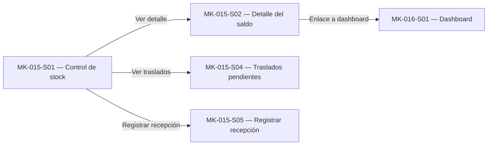

# Component Spec — MK-015

> **Propósito y rol documental:**
> Este documento es la especificación principal del resultado esperado del mockup (qué debe existir).
> Subordinado a las fuentes de verdad (SPEC, HU, WF, FLOW, API Contract y Design System), define formalmente: qué pantallas existen, el propósito de cada pantalla, estructura de cada pantalla, componentes (compartidos y específicos), acciones, estados, contenido, jerarquía de información, decisiones UX locales (`LUX-XX`), fixtures y criterios de aceptación.
> Consume la UX del módulo y las fuentes oficiales; no crea una propuesta UX nueva ni paralela.

> **Nota conceptual:**
> Este documento especifica el resultado esperado.
> No define el orden de ejecución ni descompone el trabajo en tareas (responsabilidad de `plan.md` y `tasks.md`).
> No contiene instrucciones procedimentales de implementación paso a paso.

## 1. Identificación

- **Mockup:** MK-015
- **Funcionalidad:** Control de stock y disponibilidad
- **Responsable:** Miguel Ángel Taco Zavala
- **Versión:** 1.0.0
- **Estado:** Listo para Raw (DoR Cumplido)

## 2. Trazabilidad

Define las fuentes oficiales de verdad consumidas por esta funcionalidad. Cualquier discrepancia funcional debe resolverse contra estas fuentes antes de proceder.

| Fuente | Referencia | Alcance |
|---|---|---|
| SPEC | [SPEC-015](../specs/SPEC-015-control-stock-disponibilidad.md) | §1‑38 Reglas de negocio, invariantes, SKU/ubicación, reservas, consumos, liberaciones, expiraciones, ajustes, concurrencia, eventos, integraciones |
| HU | [HU-015](../hu/HU-015-control-stock-disponibilidad.md) | CA‑01…CA‑42 Criterios de aceptación, historias de usuario |
| WF | [WF-015](../wireframes/flows/WF-015-control-stock-disponibilidad.md) | S‑01…S‑05 Pantallas, columnas, detalle de saldo, recepción, umbrales |
| Flow | [FLOW-015](../flujos/FLOW-015-control-stock-disponibilidad.md) | §4.2‑4.9 Reserva, consumo, liberación, expiración, Bulk, incidencia, reintegro, conciliación, traslado |
| Propuesta UX módulo | `mockups/ux/propuesta-ux.md` | §3‑5 UX‑P01, UX‑P02, UX‑P03; matriz 015 |
| UX Decisions | `mockups/ux/ux-decisions.md` | UXD‑001, UXD‑011 decisiones de interacción |
| UX Guidelines | `mockups/ux/ux-guidelines.md` | UXG‑001…UXG‑022 reglas operativas |
| API Contract | [OpenAPI](../api/openapi.yaml) / [Contrato_Api.md](../Contrato_Api.md) | Endpoints `/inventario/disponibilidad`, `/inventario/umbrales`, `/inventario/traslados`, `/inventario/traslados/{id}/recepciones`; HTTP 0.5.0 |
| Design System | [mockups/DESIGN.md](../DESIGN.md), versión 1.0.0 | Tokens, componentes DS‑C01‑DS‑C29, layout 1440 px, estados de interacción |

## 3. Objetivo funcional

- **Usuario:** Gestor comercial (`GESTOR_COMERCIAL`) con capacidades de gestión de inventario.
- **Objetivo:** Consultar saldos por SKU/ubicación y entender qué parte está física, reservada, bloqueada y disponible.
- **Contexto:** Operación en web desktop, viewport canónico 1440 px, mouse y teclado.
- **Resultado exitoso:** El usuario consulta disponibilidad, distingue Físico/Reservado/Bloqueado/Disponible/Estado, y puede registrar recepciones de traslado sin sobreventa.

## 4. Alcance

### Incluido

- Consultar disponibilidad por SKU y ubicación (`GET /inventario/disponibilidad`).
- Mostrar `on_hand`, `reserved`, `blocked`, `available`, `estado`, `umbral_stock_bajo_resuelto`, `stock_version`.
- Cálculo `available = max(on_hand - reserved - blocked, 0)`.
- Determinar estado comercial: `AGOTADO` (available = 0), `STOCK_BAJO` (0 < available ≤ umbral), `DISPONIBLE` (available > umbral).
- Configurar umbrales por SKU (`PUT /inventario/umbrales`).
- Listar traslados pendientes (`GET /inventario/traslados`).
- Registrar recepción de traslado (`POST …/traslados/{id}/recepciones`).
- Mostrar badges de estado (DISPONIBLE / STOCK_BAJO / AGOTADO) con ícono según DS‑C14.

### Fuera de alcance

- Creación de pedidos o procesamiento de pagos.
- Reserva o consumo de stock (orquestado por Ventas/Postventa).
- Liberación de reservas.
- Reintegro de unidades físicas.
- Conciliación offline de venta Retail.
- Mutación de saldos desde Marketplace/Chatbot/Retail.
- UI que muestre `on_hand`, `reserved`, `blocked`, `available` como etiquetas de interfaz (no mostrados por WF‑015).
- Botones visibles para ejecutar operaciones de reserva/consumo/liberación.

## 5. Inventario de pantallas

Define qué pantallas existen y su propósito dentro de la funcionalidad.

| ID | Pantalla | Propósito | Entrada | Acción principal | Salida | Prioridad | Ruta del prototipo |
|---|---|---|---|---|---|---|---|
| MK‑015‑S01 | Control de stock | Consultar disponibilidad por SKU/ubicación | `GET /inventario/disponibilidad?skus=…&location_id=…` | Filtrar, agrupar | Tabla con Físico/Reservado/Bloqueado/Disponible/Estado/Umbral | P0 | `/MK015/S01` |
| MK‑015‑S02 | Detalle del saldo | Ver detalle de un SKU/ubicación | misma llamada, drawer 640 px | — | Ficha con Físico/Reservado/Bloqueado/Disponible/Umbral/Estado | P0 | `/MK015/S02` |
| MK‑015‑S03 | Configuración de umbrales | Definir umbral_stock_bajo por SKU | `GET/PUT /inventario/umbrales` | Aplicar umbral | Confirmación de actualización | P1 | `/MK015/S03` |
| MK‑015‑S04 | Traslados pendientes | Listar traslados sin recibir | `GET /inventario/traslados?estado&target_location_id&pagina&tamanio` | — | Lista con SKU/origen/destino/cantidad pendiente/estado | P0 | `/MK015/S04` |
| MK‑015‑S05 | Registrar recepción | Confirmar/rechazar traslado recibido | `POST …/traslados/{id}/recepciones` Cantidad Disposición Nota | Registrar recepción final | Estado COMPLETADO / COMPLETADO_CON_DISCREPANCIA | P0 | `/MK015/S05` |

**Reglas de acceso y enrutamiento:**

- Toda pantalla inventariada formalmente como `MK‑015‑SXX` debe disponer de una ruta individual relativa dentro del entorno de prototipado.
- La prioridad (`P0`, `P1`, `P2`, etc.) define la criticidad y obligatoriedad de alcance, mientras que la ruta directa garantiza accesibilidad, trazabilidad, revisión y reproducibilidad independientemente de la prioridad.
- La ruta debe permitir inspeccionarla directamente sin requerir transitar previamente por un flujo.
- El identificador de pantalla (`MK‑015‑SXX`) y la ruta del prototipo (`/MK015/SXX`) deben mantenerse estrictamente sincronizados.
- Cualquier cambio, alta o baja en el inventario de pantallas exige revisar y actualizar las rutas correspondientes.

## 6. Relación entre pantallas

Ajustar al Flow real de navegación.

## 7. Jerarquía de información

1. **Primaria:** Información y acciones críticas inmediatamente visibles (Físico, Disponible, Estado).
2. **Secundaria:** Información de soporte o acciones secundarias (Reservado, Bloqueado, Umbral).
3. **Complementaria:** Detalles periféricos, metadatos o ayuda contextual (SKU, Producto, Ubicación).

Debe mantenerse alineada con la Propuesta UX y las UX Guidelines del módulo.

## 8. Componentes compartidos

Componentes transversales del Design System o reutilizados entre pantallas. No redefinir componentes existentes del Design System.

| Componente | Pantallas | Uso | Variante | Estados |
|---|---|---|---|---|
| DS‑C17 PO/Table | S01, S02 | Tabla de stock | md por defecto; selección/orden si procede | default/hover/focus/pressed/disabled/loading/error |
| DS‑C14 PO/Badge | S01, S02 | Badge de estado | sm mín 24 px alto / md 28 | Neutral/info/success/warning/error/promotion; palabra+eicono |
| DS‑C13 PO/FilterBar | S01 | Filtros por producto/categoría/marca/SKU/ubicación/estado | «Aplicar filtros» / «Limpiar filtros» | — |
| DS‑C03 PO/TextInput | S02, S03 | SKU/umbral | sm 32 px / md 40; padding 12 px; label arriba | default/hover/focus/filled/disabled/read‑only/error |
| DS‑C04 PO/NumberInput | S03 | Umbral | unidad visible junto label o sufijo | precisión/min/max de SPEC |
| DS‑C02 PO/ActionIcon | S05 | Botón “Registrar recepción” | área 32×32 o 40×40; icono 16/20 | nombre accesible, tooltip opcional |
| DS‑C08 PO/Checkbox | S05 | Disposición | caja 18 px sm / 20 md; label clicable, área conjunta mín 32 px | unchecked/checked/indeterminate |
| DS‑C19 PO/Card/KPI | S01 | KPIs de stock | padding 24 , radio 12 , sin sombra; etiqueta 14/20, cifra 28/36 | — |
| DS‑C21 PO/Modal | S05 | Confirmación final de recepción | ancho 480 px / 640 formulario breve; título/impacto/cancelar/acción | overlay/foco contenido; Escape/no descarta trabajo |

## 9. Componentes específicos

### MK‑015‑C01 — Componente fila tabla stock

**Propósito:** Mostrar una fila de la tabla de stock con SKU, Producto, Ubicación y los valores Físico/Reservado/Bloqueado/Disponible/Umbral/Estado.

**Pantallas en las que participa:** MK‑015‑S01, MK‑015‑S02.

**Contenido estructurado:**

- **Fila:** `{[DS‑C03 TextInput SKU], [Producto], [Ubicación], [DS‑C03 TextInput Físico], [DS‑C03 TextInput Reservado], [DS‑C03 TextInput Bloqueado], [DS‑C03 TextInput Disponible], [DS‑C14 Badge Estado], [acción Ver detalle]}`.

**Propiedades conceptuales:**

| Propiedad | Tipo | Obligatoria | Regla / Restricción |
|---|---|---|---|
| sku | Texto | Sí | Debe coincidir con un SKU vendible activo |
| producto | Texto | Sí | Nombre comercial del producto |
| ubicacion | Texto | Sí | Nombre de la tienda/almacén |
| fisico | Número | Sí | `on_hand` ≥ 0 |
| reservado | Número | Sí | `reserved` ≥ 0, `reserved ≤ on_hand` |
| bloqueado | Número | Sí | `blocked` ≥ 0, `blocked ≤ on_hand` |
| disponible | Número | Sí | `available = max(on_hand - reserved - blocked, 0)` |
| umbral | Número | No | `umbral_stock_bajo_resuelto` por SKU |
| estado | Texto | Sí | `DISPONIBLE` / `STOCK_BAJO` / `AGOTADO` |

**Estados:**

| Estado | Disparador | Representación visual | Acción permitida |
|---|---|---|---|
| Default | Datos cargados | Fila con todos los valores y badges | Ver detalles (S02), abrir S04/S05 |
| Loading | Carga asíncrona | Skeleton DS‑C24 + texto “Cargando…” | Bloquear interacción |
| Error | Fallo controlado | Mensaje error junto al campo | Reintentar, ver detalle |

### MK‑015‑C02 — Componente umbral

**Propósito:** Input numérico para configurar el umbral de stock bajo por SKU.

**Pantallas en las que participa:** MK‑015‑S03.

**Contenido estructurado:**

- **Input:** `DS‑C04 NumberInput` con campo “Umbral”.
- **Botón:** “Aplicar” — guarda el umbral y actualiza la clasificación de estados.

**Propiedades conceptuales:**

| Propiedad | Tipo | Obligatoria | Regla / Restricción |
|---|---|---|---|
| sku | Texto | Sí | Debe coincidir con un SKU vendible activo |
| umbral | Número | Sí | Debe ser ≥ 0; valida `umbral_stock_bajo_resuelto = override SKU ?? umbral global` |

**Estados:**

| Estado | Disparador | Representación visual | Acción permitida |
|---|---|---|---|
| Default | Valor cargado | Input con valor y botón Aplicar | Aplicar umbral |
| Error | Valor inválido | Input con borde error + mensaje | Corregir valor |

## 10. Especificación por pantalla

Define la estructura, componentes, acciones, estados y contenido clave de cada pantalla.

### MK‑015‑S01 — Control de stock

**Propósito y objetivo:** Consultar disponibilidad autoritativa de un SKU por ubicación y mostrar tabla con saldos y estado.

**Estructura y layout:**

1. **Zona 1 — Cabecera:** Título “Control de stock”, subtítulo “SKU y ubicación”, barra de filtros (`DS‑C13 FilterBar`).
2. **Zona 2 — Área principal:** Tabla `DS‑C17 PO/Table` con columnas SKU, Producto, Ubicación, **Físico**, **Reservado**, **Bloqueado**, **Disponible**, **Umbral**, **Estado**. Filas crecen al envolver texto; no cortan controles.
3. **Zona 3 — Barra de acciones:** Filtros aplicados, contador de filas, botón “Registrar recepción” ( conduce a S05).

**Componentes presentes:**

- `DS‑C17 PO/Table` — tabla principal.
- `DS‑C13 PO/FilterBar` — filtros por SKU, producto, categoría, marca, ubicación, estado.
- `DS‑C14 PO/Badge` — badges de estado por fila.
- `DS‑C03 PO/TextInput` — campo de filtro SKU.
- `DS‑C02 PO/ActionIcon` — botón “Registrar recepción” (S05).

**Acción primaria:** Aplicar filtros y visualizar la tabla de stock.

**Acciones secundarias:**

- Filtrar por SKU/producto/categoría/marca/ubicación/estado.
- Abrir S02 (detalle del saldo) haciendo clic en una fila.
- Abrir S04 (traslados pendientes).
- Registrar recepción (S05).

**Estados requeridos:**

- **Default:** Tabla con valores completos, badges de estado visibles.
- **Loading:** Skeleton DS‑C24 + texto “Cargando…” en tabla.
- **Empty:** `DS‑C25 EmptyState` “Sin coincidencias con estos filtros” + acción “Limpiar filtros”.
- **Error:** Mensaje error junto al campo/serie, explicación accionable.

**Contenido clave y microtexto:**

| Elemento | Texto / Patrón | Fuente de procedencia |
|---|---|---|
| H1 / Título | “Control de stock” | WF‑015 |
| CTA Primario | “Registrar recepción” | WF‑015 S‑05 |
| Mensaje de ayuda | “Unidades reservadas están comprometidas en pedidos. Las bloqueadas permanecen físicamente pero temporariamente no se ofrecen para venta.” | WF‑015 |

### MK‑015‑S02 — Detalle del saldo

**Propósito y objetivo:** Permite al usuario inspeccionar el detalle de saldos para un SKU y ubicación seleccionados, mostrando los valores de físico, reservado, bloqueado, disponible, umbral y estado.

**Estructura y layout:**
1. **Cabecera:** Título “Detalle del saldo”, botón de cierre del drawer.
2. **Cuerpo:** Lista de campos clave con componentes `DS‑C03 PO/TextInput` (solo lectura) para cada valor y badge de estado `DS‑C14 PO/Badge`.
3. **Acciones:** Botón “Cerrar” que retorna a la tabla S01.

**Componentes presentes:**
- `DS‑C03 PO/TextInput` (solo lectura) para cada atributo (Físico, Reservado, Bloqueado, Disponible, Umbral).
- `DS‑C14 PO/Badge` para visualización del estado.
- `DS‑C02 PO/ActionIcon` para cerrar el drawer.

**Acciones secundarias:** Ninguna; el drawer es informativo.

---

### MK‑015‑S03 — Configuración de umbrales

**Propósito y objetivo:** Permite al usuario definir o actualizar el umbral de stock bajo para un SKU específico.

**Estructura y layout:**
1. **Cabecera:** Título “Configuración de umbral”.
2. **Campo umbral:** `DS‑C04 PO/NumberInput` pre‑poblado con valor actual.
3. **Botón Aplicar:** Acción que envía `PUT /inventario/umbrales`.
4. **Feedback:** Mensaje de éxito o error tras la actualización.

**Componentes presentes:**
- `DS‑C04 PO/NumberInput` para entrada numérica.
- `DS‑C02 PO/ActionIcon` como botón “Aplicar”.
- `DS‑C08 PO/Checkbox` opcional para aplicar a nivel global.

**Acciones secundarias:** Validación de valor ≥ 0 antes de enviar.

---

### MK‑015‑S04 — Traslados pendientes

**Propósito y objetivo:** Muestra la lista de traslados que aún no han sido recibidos, permitiendo al usuario revisar y seleccionar uno para registrar su recepción.

**Estructura y layout:**
1. **Tabla:** `DS‑C17 PO/Table` con columnas SKU, Origen, Destino, Cantidad, Estado.
2. **Acciones fila:** Botón “Registrar recepción” (`DS‑C02 PO/ActionIcon`) en cada fila.
3. **Filtrado:** `DS‑C13 PO/FilterBar` para refinar por SKU o estado.

**Componentes presentes:**
- `DS‑C17 PO/Table` para listado.
- `DS‑C13 PO/FilterBar` para filtros.
- `DS‑C02 PO/ActionIcon` para iniciar registro de recepción.

**Acciones secundarias:** Navegar a pantalla S05 al seleccionar una fila.

---

### MK‑015‑S05 — Registrar recepción

**Propósito y objetivo:** Permite al usuario registrar la recepción de un traslado, confirmando cantidades y anotando discrepancias.

**Estructura y layout:**
1. **Formulario:** Campos `DS‑C03 PO/TextInput` (solo lectura) para SKU, origen, destino, cantidad esperada.
2. **Entrada recepción:** `DS‑C03 PO/TextInput` para cantidad recibida y `DS‑C08 PO/Checkbox` para marcar discrepancia.
3. **Botón Confirmar:** `DS‑C02 PO/ActionIcon` que envía `POST /inventario/traslados/{id}/recepciones`.
4. **Feedback inline:** Mensaje de éxito o error mostrado bajo el formulario.

**Componentes presentes:**
- `DS‑C03 PO/TextInput` para datos de traslado.
- `DS‑C08 PO/Checkbox` para indicar discrepancia.
- `DS‑C02 PO/ActionIcon` como botón “Confirmar”.
- `DS‑C21 PO/Modal` no usado; confirmación se muestra inline según LUX‑03.

**Acciones secundarias:** Ninguna; al confirmar, vuelve a la tabla S04.

## 11. Decisiones UX locales

Solo registrar decisiones específicas de diseño exclusivas de esta funcionalidad.

### LUX‑01 — Mapeo de badge de estado

**Problema:** determinar visualBadge `DISPONIBLE`/`STOCK_BAJO`/`AGOTADO` sin usar `volt`/`signal` como stock confirmado.

**Alternativas consideradas:**

- Alternativa A: Usar `color/success/default` (`#2F9E44`) como indicador principal de stock confirmado.
- Alternativa B: Usar `color/accent/signal` (`#4361EE`) para “stock en proceso”.

**Decisión adoptada:** Mapear `DISPONIBLE` → `DS‑C14 PO/Badge` con variante `success`; `STOCK_BAJO` → variante `warning`; `AGOTADO` → variante `error`. La paleta y contraste están verificados en DESIGN.md §4.1 (ratios 6.12:1, 6.42:1). No usar `volt`/`signal` como stock confirmado (DESIGN.md prohíbe).

**Justificación:** El Design System v1.0.0 (DATE 2026‑10‑02) define roles semánticos; las decisiones visuales deben basarse en tokens, no en inferencias.

**Trade‑off:** Richer visual feedback requiere consistencia con el Design System global; fuera del alcance actual no se añaden nuevas variantes de color.

**Criterio de validación:** Los badges de estado en S01 y S02 renderizan con los tokens `color/success/default`, `color/warning/default`, `color/error/default` y cumplen los ratios de contraste verificados.

### LUX‑02 — Detalle de saldo en drawer vs vista completa

**Problema:** S02 “Detalle del saldo” debe mostrarse en un espacio contenido, no en una página completa.

**Alternativas consideradas:**

- Alternativa A: Vista completa de pantalla nueva (navegación independiente).
- Alternativa B: Drawer lateral 640 px (según DESIGN.md §5.2, DS‑C20).

**Decisión adoptada:** Usar `DS‑C20 PO/Drawer` ancho 640 px con detalle de saldo, manteniendo filtros y contexto en la pantalla padre. El drawer se abre sobre la tabla S01; al cerrarse, se conservan los filtros aplicados.

**Justificación:** WF‑015 define “detalle breve” y UXD‑001/UXG‑001 aconsejan drawer para detalle contextual; la vista completa está reservada para configuraciones extensas (S03).

**Trade‑off:** El drawer limita la cantidad de información visible simultáneamente; si se necesita comparar múltiples SKUs, el usuario debe filtrar o navegar entre filas.

**Criterio de validación:** S02 se abre como `DS‑C20 PO/Drawer` 640 px, conserva filtros padre y muestra Físico/Reservado/Bloqueado/Disponible/Umbral/Estado.

### LUX‑03 — Confirmación de recepción final inline (sin modal anidado)

**Problema:** S05 “Registrar recepción” debe confirmar sin encadenar modales (DESIGN.md §4.5: “No encadenar modales”).

**Alternativas consideradas:**

- Alternativa A: Modal dentro de otro modal (anidado).
- Alternativa B: Confirmación inline dentro del mismo flujo.

**Decisión adoptada:** La confirmación de “Esta es la recepción final” se presenta **inline** dentro del paso de registro, con el texto literal de WF‑015: “El traslado se cerrará con una discrepancia. Las unidades faltantes no se agregarán al inventario.” No se utiliza modal anidado.

**Justificación:** DESIGN.md §4.5 prohíbe encadenar modales; la recepción final es una acción de cierre de flujo, no una nueva operación asíncrona.

**Trade‑off:** La información de faltantes es más limitada que en un modal secundario, pero la regla de negocio (no inventar unidades) se respeta de forma explícita.

**Criterio de validación:** S05 presenta la confirmación inline con el texto de WF‑015; no hay modal anidado; el usuario puede confirmar o cancelar.

## 12. Reglas de layout PC

- Entorno exclusivo: Web desktop.
- Viewport canónico de generación y revisión: 1440 px de ancho (utilizado como estándar de verificación, sin implicar un diseño de ancho rígido).
- Usar grid, contenedores y ancho de contenido alineados al Design System y Mantine.
- No implementar adaptaciones mobile ni tablet.
- Evitar overflow horizontal involuntario en todas las pantallas y estados.

## 13. Fixtures

Conjunto de datos deterministas requeridos para reproducir de forma predecible cada estado en el entorno de prototipado.

| Fixture | Caso de negocio | Pantalla / Estado asociado | Datos representativos |
|---|---|---|---|
| default | Caso éxito con datos estándar válidos | S01 / Default | on_hand = 10, reserved = 2, blocked = 1, disponible = 7 |
| loading | Simulación de estado asíncrono en curso | S01 / Loading | skeleton + texto “Cargando…” |
| empty | Sin registros o catálogo vacío | S01 / Empty | `[]` / lista vacía + “Sin coincidencias con estos filtros” |
| error | Fallo controlado de validación o red | S01 / Error | código y mensaje de error |

## 14. Preguntas y supuestos

### Preguntas abiertas

| ID | Pregunta | Bloquea ejecución | Responsable | Estado |
|---|---|---|---|---|
| Q‑01 | ¿Sobre regla de negocio o interfaz que afecta la clasificación de umbrales? | Sí / No | Miguel Taco | Abierta / Resuelta |

### Supuestos adoptados

| ID | Supuesto | Riesgo asociado | Condición de revisión |
|---|---|---|---|
| A‑01 | El umbral `umbral_stock_bajo` es opcional por SKU y global por defecto. | Si el supuesto es inválido, la clasificación de estados puede ser incorrecta. | Fecha o evento de confirmación del equipo de Backend. |

## 15. Criterios de aceptación

Checklist declarativo que define cuándo la especificación del mockup está completa y lista para ser tomada por el plan de ejecución:

- [ ] Todas las pantallas P0 están identificadas e inventariadas con su ruta única en el prototipo.
- [ ] El propósito, estructura y jerarquía de cada pantalla están claramente definidos.
- [ ] El Flow de navegación entre pantallas respeta las fuentes oficiales sin caminos huérfanos.
- [ ] No existen acciones, campos ni reglas de negocio inventadas fuera de las SPEC/HU.
- [ ] La Propuesta UX Integral y las UX Guidelines del módulo se aplican rigurosamente.
- [ ] Las UX Decisions aplicables (`UXD‑XXX`) están consideradas e integradas.
- [ ] Las decisiones locales (`LUX‑XX`) están debidamente justificadas con trade‑offs claros.
- [ ] Los componentes compartidos se reutilizan del Design System sin duplicación.
- [ ] Las propiedades y estados de los componentes específicos están especificados.
- [ ] Las reglas de layout PC (viewport canónico 1440 px, sin overflow horizontal) están establecidas.
- [ ] Los fixtures deterministas para estados P0 (default, loading, empty, error) están definidos.
- [ ] La accesibilidad básica (foco visible, nombres accesibles, navegación por teclado) está contemplada.