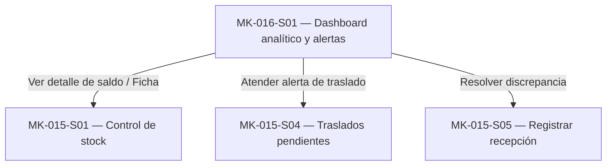

# Component Spec — MK-016

> **Instanciación:** Copiar a `mockups/MK-016/component-spec.md`. Los enlaces relativos de esta plantilla se interpretan desde ese destino; el Design System está en `../DESIGN.md`.

> **Propósito y rol documental:**
> Este documento es la especificación principal del resultado esperado del mockup (qué debe existir).
> Subordinado a las fuentes de verdad (SPEC, HU, WF, FLOW, API Contract y Design System), define formalmente: qué pantallas existen, el propósito de cada pantalla, estructura de cada pantalla, componentes (compartidos y específicos), acciones, estados, contenido, jerarquía de información, decisiones UX locales (`LUX-XX`), fixtures y criterios de aceptación.
> Consume la UX del módulo y las fuentes oficiales; no crea una propuesta UX nueva ni paralela.
>
> **Nota conceptual:**
> Este documento especifica el resultado esperado.
> No define el orden de ejecución ni descompone el trabajo en tareas (responsabilidad de `plan.md` y `tasks.md`).
> No contiene instrucciones procedimentales de implementación paso a paso.

## 1. Identificación

- **Mockup:** MK-016
- **Funcionalidad:** Dashboard analítico y alertas de stock
- **Responsable:** Miguel Ángel Taco Zavala
- **Versión:** 1.0.0
- **Estado:** Aprobado

## 2. Trazabilidad

Define las fuentes oficiales de verdad consumidas por esta funcionalidad. Cualquier discrepancia funcional debe resolverse contra estas fuentes antes de proceder.

| Fuente | Referencia | Alcance |
|---|---|---|
| SPEC | [SPEC-016](../specs/SPEC-016-dashboard-alertas-stock.md) | §1–8 Indicadores, estados de disponibilidad, actualización reactiva, distribución por ubicación, traslados y filtros |
| HU | [HU-016](../hu/HU-016-dashboard-alertas-stock.md) | CA-01…CA-11 Criterios de aceptación, visualización de indicadores y alertas de inventario |
| WF | [WF-016](../wireframes/flows/WF-016-dashboard-alertas-stock.md) | Distribución de KPIs, tabla principal, paneles de alertas y distribución por ubicación |
| Flow | [FLOW-016](../flujos/FLOW-016-dashboard-alertas-stock.md) | Navegación analítica, filtros y actualización reactiva por evento de inventario |
| Propuesta UX módulo | `mockups/ux/propuesta-ux.md` | §3–5 Matriz de aplicabilidad 016, UX-P01, UX-P02, UX-P03 |
| UX Decisions | `mockups/ux/ux-decisions.md` | UXD-001 (estructura y densidad desktop), UXD-011 (feedback operacional) |
| UX Guidelines | `mockups/ux/ux-guidelines.md` | UXG-001…UXG-022 Reglas normativas operativas y de layout |
| API Contract | [Contrato_Api.md](../Contrato_Api.md) / [AsyncAPI](../asyncapi/asyncapi.yaml) | Consulta de disponibilidad agregada y evento `inventory.stock.changed` |
| Design System | [mockups/DESIGN.md](../DESIGN.md), versión 1.0.0 | Tokens, componentes DS-C19 (KPIs), DS-C17 (Table), DS-C13 (FilterBar), DS-C14 (Badge), DS-C15 (Alert) |

## 3. Objetivo funcional

- **Usuario:** Gestor comercial (`GESTOR_COMERCIAL`) con capacidades de consulta de inventario.
- **Objetivo:** Monitorear en tiempo real la disponibilidad, bloqueos y traslados por ubicación y SKU sin alterar saldos ni exponer terminología técnica interna.
- **Contexto:** Operación en Web Desktop, viewport canónico de 1440 px, mouse y teclado.
- **Resultado exitoso:** El usuario identifica inmediatamente el nivel de disponibilidad, detecta unidades bloqueadas o en riesgo de quiebre de stock, supervisa traslados con discrepancia y filtra rápidamente por SKU o ubicación sin desbordamiento visual.

## 4. Alcance

### Incluido

- Panel de KPIs principales: Unidades disponibles, unidades bloqueadas, SKUs con stock bajo, SKUs agotados, traslados en tránsito, traslados recibidos parcialmente y traslados con discrepancia.
- Cálculo de disponibilidad conforme a la regla autoritativa: `available = max(on_hand - reserved - blocked, 0)`.
- Clasificación de estados comerciales: `DISPONIBLE` (available > umbral), `STOCK_BAJO` (0 < available ≤ umbral) y `AGOTADO` (available = 0).
- Panel de distribución de saldos y disponibilidad por ubicación (tienda/almacén) con detalle de unidades físicas, reservadas, bloqueadas y disponibles.
- Panel de alertas críticas de stock bajo y traslados con discrepancia.
- Tabla detallada de inventario por SKU con columnas: SKU, Producto, Ubicación, Físico, Reservado, Bloqueado, Disponible, Umbral y Estado (Badge DS-C14).
- Barra de filtros reactiva: Búsqueda por texto (SKU o nombre de producto), filtro por ubicación y filtro por estado de disponibilidad.
- Enlaces contextuales hacia `MK-015` (Control de stock y Registrar recepción) para la atención operativa de las alertas.
- Actualización reactiva ante eventos de cambio de stock (`inventory.stock.changed`) preservando los filtros aplicados.

### Fuera de alcance

- Modificación o edición directa de saldos desde el dashboard (operación de solo lectura).
- Creación, cancelación o liberación de reservas de inventario.
- Registro o mutación directa de recepciones de traslado desde el dashboard (se delega a `MK-015-S05`).
- Métrica o reportes de ventas, facturación o ranking financiero de productos.
- Decisiones de picking, packing, logística o despacho.
- Exposición de identificadores y nombres técnicos internos (`on_hand`, `reserved`, `blocked`, `available`, `routing_key`, `message_id`, etc.).

## 5. Inventario de pantallas

Define qué pantallas existen y su propósito dentro de la funcionalidad.

| ID | Pantalla | Propósito | Entrada | Acción principal | Salida | Prioridad | Ruta del prototipo |
|---|---|---|---|---|---|---|---|
| MK-016-S01 | Dashboard analítico y alertas de stock | Monitoreo integral de saldos, alertas y traslados por SKU y ubicación | `GET /inventario/disponibilidad` (agregado) + KPIs | Filtrar por ubicación/estado, buscar por SKU/producto, inspeccionar alertas | Vista consolidada con KPIs, alertas, distribución geográfica y tabla de inventario | P0 | `/MK016/S01` |

**Reglas de acceso y enrutamiento:**

- Toda pantalla inventariada formalmente como `MK-016-SXX` dispone de una ruta individual relativa dentro del entorno de prototipado.
- La ruta `/MK016/S01` permite la inspección directa e independiente del dashboard sin forzar navegación previa.
- La pantalla responde a parámetros de consulta deterministas para verificar estados de prueba (`/MK016/S01?estado=default`, `/MK016/S01?estado=loading`, `/MK016/S01?estado=empty`, `/MK016/S01?estado=error`).

## 6. Relación entre pantallas

## 7. Jerarquía de información

1. **Primaria (Crítica):** Indicadores clave de disponibilidad global (`Unidades disponibles`, `Unidades bloqueadas`, `Stock bajo`, `Agotados`) y alertas activas de discrepancias en traslados.
2. **Secundaria (Operativa):** Panel de distribución por ubicación geográfica y tabla detallada de saldos por SKU con cálculo de disponible y badges de estado.
3. **Complementaria (Contextual):** Metadatos de última sincronización reactiva, umbrales configurados y enlaces a flujos de acción en MK-015.

## 8. Componentes compartidos

Componentes transversales del Design System reutilizados en el dashboard.

| Componente | Pantallas | Uso | Variante | Estados |
|---|---|---|---|---|
| DS-C19 PO/Card/KPI | S01 | Tarjetas de métricas de stock y traslados | Padding 20 px, radio 8 px, cifra destacada 28 px | default, loading (skeleton) |
| DS-C17 PO/Table | S01 | Tabla principal de inventario y tabla de distribución | Variante con bordes neutros y cabecera en neutral-10 | default, hover, empty, loading |
| DS-C14 PO/Badge | S01 | Etiquetas visuales de estado (Disponible, Stock bajo, Agotado) | Altura mínima 28 px, texto explícito e ícono | success (Disponible), warning (Stock bajo), error (Agotado) |
| DS-C13 PO/FilterBar | S01 | Barra de herramientas y filtros integrados | Buscador + selectores de Ubicación y Estado | default, active, disabled |
| DS-C15 PO/Alert/Notice | S01 | Tarjetas de alertas críticas de stock y traslados | Contenedor con borde reforzado, ícono de advertencia | default, warning, error |
| DS-C03 PO/TextInput | S01 | Campo de búsqueda de SKU y nombre de producto | Altura 44 px, padding 12 px, etiqueta superior | default, focus, filled |
| DS-C06 PO/Select | S01 | Selectores de Ubicación y Estado | Altura 44 px con opciones predefinidas | default, focus, active |

## 9. Componentes específicos

### MK-016-C01 — Resumen de KPIs de disponibilidad

**Propósito:** Agrupar en una cuadrícula destacada los 4 indicadores críticos de saldos (Disponibles, Bloqueadas, Stock bajo, Agotados) y los 3 indicadores de flujo logístico (En tránsito, Recibidos parcialmente, Con discrepancia).

**Pantallas en las que participa:** MK-016-S01.

**Contenido estructurado:**
- Fila 1 (Stock): 4 tarjetas `DS-C19` (Unidades disponibles, Unidades bloqueadas, SKUs con stock bajo, SKUs agotados).
- Fila 2 (Traslados): 3 tarjetas `DS-C19` (Traslados en tránsito, Recibidos parcialmente, Traslados con discrepancia).

### MK-016-C02 — Panel de alertas críticas

**Propósito:** Listar los eventos de riesgo de disponibilidad que requieren atención prioritaria por parte del gestor comercial.

**Pantallas en las que participa:** MK-016-S01.

**Contenido estructurado:**
- Alerta de Stock Bajo: SKU, producto, unidades disponibles actuales y ubicación afectada.
- Alerta de Discrepancia: Identificador de traslado, unidades faltantes no ingresadas a inventario y estado de cierre.
- Enlace contextual a `MK-015`.

## 10. Especificación de la pantalla MK-016-S01

### MK-016-S01 — Dashboard analítico y alertas de stock

**Propósito y objetivo:** Monitorear el inventario físico, reservado, bloqueado y disponible por SKU y ubicación, visualizando alertas y traslados sin mutar saldos.

**Estructura y layout:**

1. **Zona 1 — Cabecera de página:** Breadcrumb (`Inventario / Dashboard`), H1 “Dashboard analítico y alertas de stock”, bajada explicativa: “Monitorea disponibilidad, bloqueos y traslados por ubicación sin modificar los saldos desde el dashboard.”
2. **Zona 2 — Grilla de KPIs principales:**
   - 4 tarjetas superiores: Unidades disponibles (128), Unidades bloqueadas (9), Stock bajo (6), Agotados (3).
   - 3 tarjetas inferiores: Traslados en tránsito (4), Recibidos parcialmente (2), Con discrepancia (1).
3. **Zona 3 — Barra de filtros (`DS-C13`):**
   - Campo de búsqueda por texto: “Buscar SKU o producto”.
   - Selector de ubicación: “Todas”, “Tienda Miraflores”, “Almacén central”.
   - Selector de estado: “Todos”, “Disponible”, “Stock bajo”, “Agotado”.
4. **Zona 4 — Grilla analítica de dos columnas (50% / 50%):**
   - Columna izquierda: Card “Alertas” con avisos de stock bajo y traslados con discrepancia (`DS-C15`).
   - Columna derecha: Card “Distribución por ubicación” con tabla de totales (Ubicación, Físico, Reservado, Bloqueado, Disponible).
5. **Zona 5 — Tabla principal de inventario por SKU (`DS-C17`):**
   - Título de sección: “Inventario por SKU”.
   - Columnas obligatorias: SKU, Producto, Ubicación, **Físico**, **Reservado**, **Bloqueado**, **Disponible**, **Umbral**, **Estado**.
   - Badges de estado con ícono y texto: `Disponible` (verde), `Stock bajo` (ámbar), `Agotado` (gris/rojo neutro).

**Estados requeridos:**

- **Default:** Dashboard poblado con datos representativos y consistentes.
- **Loading:** Tarjetas y tablas con estados skeleton (`DS-C24`).
- **Empty:** Estado vacío cuando los filtros aplicados no arrojan registros (`DS-C25` EmptyState con botón “Limpiar filtros”).
- **Error:** Panel de aviso ante interrupción de conexión o indisponibilidad del servicio de consulta.

**Reglas de copy y etiquetas:**
- Prohibido el uso de términos técnicos como cabeceras visibles (`on_hand`, `reserved`, `blocked`, `available`).
- Uso exclusivo de terminología funcional clara: "Físico", "Reservado", "Bloqueado", "Disponible".

## 11. Decisiones UX locales

### LUX-01 — Mapeo semántico de Badges de Estado (Heredada de MK-015)

- **Decisión:** Mapear `DISPONIBLE` a `success`, `STOCK_BAJO` a `warning` y `AGOTADO` a `error`/neutral según DESIGN.md §4.1. No emplear `volt` ni `signal` para saldos confirmados.
- **Justificación:** Garantiza coherencia visual total entre la vista de control de stock (MK-015) y el dashboard analítico (MK-016).

### LUX-04 — Alertas operativas con enlace contextual de navegación

- **Decisión:** Las alertas de stock bajo y discrepancias en traslados incluyen enlaces de salto directo hacia `MK-015-S01` (para revisar el saldo específico) o `MK-015-S04` (para consultar el traslado), sin embeber modales de mutación dentro del dashboard.
- **Justificación:** El dashboard es estrictamente de solo lectura y monitoreo (SPEC-016 §1 y §8). Proporcionar navegación fluida hacia el flujo de gestión en MK-015 resuelve la necesidad operativa del usuario sin violar la separación de responsabilidades.
- **Trade-off:** Requiere que el usuario cambie de vista para actuar sobre una incidencia, pero evita saturar el dashboard con formularios transaccionales complejos.

## 12. Reglas de layout PC

- Entorno exclusivo: Web Desktop.
- Viewport canónico: 1440 px de ancho.
- Contenedor principal centrado con ancho máximo de 1200 px a 1440 px y gutters de 24 px.
- Grilla modular de 12 columnas; sin desbordamiento horizontal en resoluciones desktop estándar.
- Controles interactivos con altura mínima de 44 px y áreas de clic accesibles.

## 13. Fixtures

| Fixture | Caso de negocio | Pantalla / Estado asociado | Datos representativos |
|---|---|---|---|
| default | Caso estándar con inventario multitienda | S01 / Default | 128 disponibles, 9 bloqueadas, 6 bajo stock, 3 agotados; 2 ubicaciones (Miraflores y Almacén Central) |
| loading | Simulación de carga reactiva o inicial | S01 / Loading | Skeletons en tarjetas KPI, tabla de distribución y tabla de inventario |
| empty | Filtros sin resultados coincidentes | S01 / Empty | Lista vacía `[]` con componente DS-C25 "No se encontraron SKUs para los criterios seleccionados" |
| error | Fallo de conexión con servicio de stock | S01 / Error | Mensaje de error controlado con opción "Reintentar consulta" |

## 14. Preguntas y supuestos

### Preguntas abiertas
- No existen preguntas abiertas bloqueantes. El alcance de solo lectura está formalizado en SPEC-016.

### Supuestos adoptados
- **A-01:** La recepción de traslados con discrepancia no afecta directamente el disponible del SKU hasta que se cierre formalmente la recepción en MK-015. (Alineado con SPEC-016 §6 y HU-016 CA-11).

## 15. Criterios de aceptación

- [x] La pantalla P0 `MK-016-S01` está identificada con su ruta `/MK016/S01`.
- [x] El propósito, layout y jerarquía de información reflejan fielmente SPEC-016 y WF-016.
- [x] No existen acciones de mutación ni botones para editar saldos directamente.
- [x] Se respetan rigurosamente las UX Guidelines y el Design System (`DESIGN.md`).
- [x] Las decisiones locales `LUX-01` y `LUX-04` están documentadas y justificadas.
- [x] Se prohíben términos técnicos crudos en las etiquetas de interfaz.
- [x] Los fixtures deterministas cubren los estados default, loading, empty y error.
- [x] Accesibilidad básica garantizada (foco visible, nombres accesibles, no dependencia exclusiva del color).
