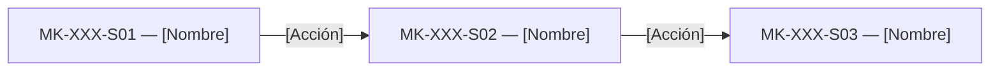

# Component Spec — MK-XXX

> Define qué debe construirse para una funcionalidad concreta. Consume la UX del módulo; no crea una propuesta UX nueva.

## 1. Identificación

- **Mockup:** MK-XXX
- **Funcionalidad:** [Nombre]
- **Responsable:** [Nombre]
- **Versión:** [vX.Y]
- **Estado:** Borrador | En revisión | Aprobado | Bloqueado

## 2. Trazabilidad

| Fuente | Referencia | Alcance |
|---|---|---|
| SPEC | [SPEC-XXX] | [Sección] |
| HU | [HU-XXX] | [Sección] |
| WF | [WF-XXX] | [Sección] |
| Flow | [FLOW-XXX] | [Camino/nodos] |
| Propuesta UX módulo | `mockups/ux/propuesta-ux.md` | [Sección] |
| UX Decisions | [UXD-XXX] | [Decisión] |
| UX Guidelines | `mockups/ux/ux-guidelines.md` | [Sección] |
| API Contract | [Ruta] | [Sección] |
| Design System | [Ruta/Figma] | [Componentes] |

## 3. Objetivo funcional

- Usuario: [Rol].
- Objetivo: [Resultado].
- Contexto: [Situación].
- Resultado exitoso: [Condición].

## 4. Alcance

### Incluido
- [Elemento].
- [Interacción].
- [Estado].

### Fuera de alcance
- [Elemento].

## 5. Inventario de pantallas

| ID | Pantalla | Propósito | Entrada | Acción principal | Salida | Prioridad |
|---|---|---|---|---|---|---|
| MK-XXX-S01 | [Nombre] | [Propósito] | [Origen] | [Acción] | [Destino] | P0 |
| MK-XXX-S02 | [Nombre] | [Propósito] | [Origen] | [Acción] | [Destino] | P0 |

## 6. Relación entre pantallas

Ajustar al Flow real.

## 7. Jerarquía de información

1. **Primaria:** [Información/acción].
2. **Secundaria:** [Información].
3. **Complementaria:** [Información].

Debe mantenerse alineada con la UX del módulo.

## 8. Componentes compartidos

| Componente | Pantallas | Uso | Variante | Estados |
|---|---|---|---|---|
| [Button] | S01 | [Uso] | [Variante] | [Estados] |

No redefinir componentes del Design System.

## 9. Componentes específicos

### MK-XXX-C01 — [Nombre]

**Propósito**  
[Descripción.]

**Pantallas**  
- MK-XXX-S01.

**Contenido**
- [Dato].
- [Acción].

**Propiedades conceptuales**

| Propiedad | Tipo | Obligatoria | Regla |
|---|---|---:|---|
| [name] | Texto | Sí | [Regla] |

**Estados**

| Estado | Disparador | Representación | Acción |
|---|---|---|---|
| Default | [Condición] | [Descripción] | [Acción] |
| Loading | [Condición] | [Descripción] | [Acción] |
| Error | [Condición] | [Descripción] | [Acción] |

**Interacciones**

| Acción | Respuesta | Resultado | Flow |
|---|---|---|---|
| [Acción] | [Feedback] | [Destino] | [Ref] |

**Accesibilidad**
- Nombre accesible: [Regla].
- Foco: [Regla].
- Teclado: [Regla].

## 10. Especificación por pantalla

### MK-XXX-S01 — [Nombre]

**Objetivo**  
[Texto.]

**Estructura**
1. [Zona].
2. [Zona].
3. [Zona].

**Componentes**
- [Componente].
- [Componente].

**Acción primaria**  
[Acción.]

**Acciones secundarias**
- [Acción].

**Estados**
- [Default].
- [Loading].
- [Error].

**Contenido clave**

| Elemento | Texto/patrón | Fuente |
|---|---|---|
| H1 | [Texto] | [WF/UX] |
| CTA | [Texto] | [UX Guidelines] |

Repetir por cada `MK-XXX-SXX`.

## 11. Decisiones UX locales

Solo registrar decisiones específicas de esta funcionalidad.

### LUX-01 — [Nombre]

**Problema**  
[Problema.]

**Alternativas**
- A: [Alternativa].
- B: [Alternativa].

**Decisión**  
[Opción.]

**Justificación**  
[Motivo.]

**Trade-off**  
[Limitación.]

**Criterio de validación**  
[Condición.]

> Si la decisión empieza a aplicarse a varias funcionalidades, promoverla a `ux/ux-decisions.md`.

## 12. Reglas de layout PC

- Web desktop únicamente.
- Viewport canónico de generación y revisión: 1440 px (sin implicar un diseño de ancho rígido).
- Usar grid y ancho de contenido del Design System.
- No implementar mobile/tablet.
- Evitar overflow horizontal.

## 13. Fixtures

| Fixture | Caso | Pantalla/estado |
|---|---|---|
| default | Datos válidos | S01 |
| loading | Carga | S01 |
| empty | Sin datos | S01 |
| error | Error controlado | S01 |

## 14. Preguntas y supuestos

### Preguntas

| ID | Pregunta | Bloquea | Responsable | Estado |
|---|---|---:|---|---|
| Q-01 | [Pregunta] | Sí/No | [Nombre] | Abierta |

### Supuestos

| ID | Supuesto | Riesgo | Revisión |
|---|---|---|---|
| A-01 | [Supuesto] | [Riesgo] | [Fecha/condición] |

## 15. Criterios de aceptación

- [ ] Todas las pantallas P0 están definidas.
- [ ] Flow respetado.
- [ ] No hay acciones inventadas.
- [ ] UX del módulo aplicada.
- [ ] UX Decisions aplicables consideradas.
- [ ] Decisiones locales justificadas.
- [ ] Componentes compartidos reutilizados.
- [ ] Layout PC definido.
- [ ] Accesibilidad básica contemplada.
