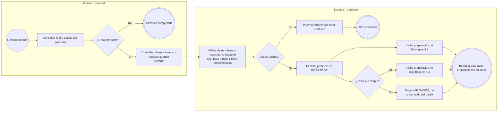
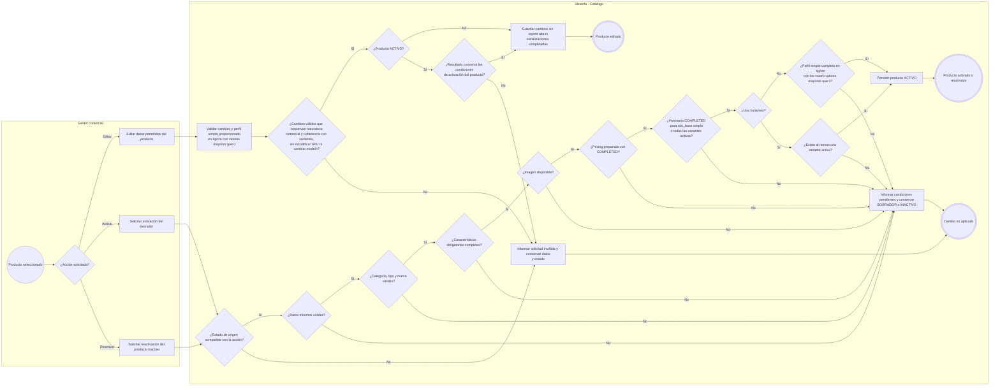
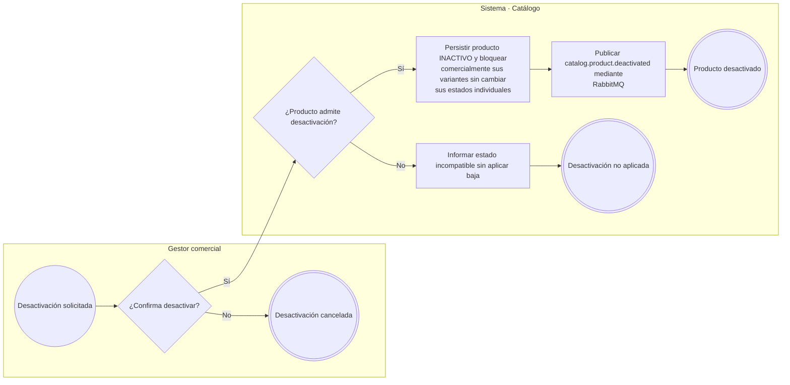

# FLOW-003 — Gestión de productos (CRUD principal)

## 1. Identificación

- **Código:** FLOW-003.
- **Funcionalidad:** Gestión de productos (CRUD principal).
- **Relacionado con:** [SPEC-003](../specs/SPEC-003-gestion-productos-crud.md) / [WF-003](../../ux/wireframes/flows/WF-003-gestion-productos-crud.md) / [índice WF-003](../../ux/wireframes/prototipos/WF-003-gestion-productos-crud/index.html) / [HU-003](../hu/HU-003-gestion-productos-crud.md).
- **Responsable:** Gabriel Poma Gutierrez.
- **Última actualización:** 2026-10-02.
- **Contratos consultados:** [OpenAPI vigente 0.5.0](../../contratos/http/openapi.yaml) y [AsyncAPI 0.5.0](../../contratos/eventos/asyncapi.yaml). Se conservan las extensiones vigentes de las fuentes.

## 2. Objetivo del flujo

Representar consulta, creación en `BORRADOR`, preparación asíncrona de precio e inventario, edición, activación, desactivación lógica y reactivación. Solo una confirmación de la dependencia permite considerarla preparada.

## 3. Actores participantes

- **Gestor comercial:** consulta y administra productos, solicita cambios de estado y reintenta preparaciones.
- **Sistema (Catálogo):** valida, persiste y coordina las dependencias mediante RabbitMQ.
- **Pricing e Inventario:** procesan las inicializaciones y emiten sus resultados.

## 4. Diagrama de flujo

### 4.1. Consulta y creación del borrador

Los datos mínimos son nombre, descripción, categoría, tipo de producto, marca, `sku_base`, `tiene_variantes` y precio base inicial. Guardar borrador no exige imagen, características completas ni datos físicos completos. Si se registra perfil físico simple, se valida bajo la forma contractual anidada: `perfilFisico.pesoKg > 0`, `perfilFisico.dimensionesCm.largo > 0`, `perfilFisico.dimensionesCm.ancho > 0`, `perfilFisico.dimensionesCm.alto > 0`, usando kg y cm. El padre con variantes no tiene perfil físico ni saldo propios. Las preparaciones son independientes y se inician después de persistir el borrador.

### 4.2. Preparación de Pricing y recuperación

```mermaid
flowchart LR
    subgraph S["Sistema · Catálogo"]
        direction TB
        INICIO(("Borrador persistido"))
        PENDING["Registrar preparación Pricing PENDING<br/>manual_retry_allowed=false"]
        REQUEST["Publicar pricing.product.initialization.requested<br/>mediante RabbitMQ"]
        RESULTADO{"¿Resultado recibido para la operación?"}
        COMPLETED(("pricing.product.initialization.completed<br/>recibido"))
        REJECTED(("pricing.product.initialization.rejected<br/>recibido"))
        LISTO["Registrar COMPLETED y marcar Pricing preparado"]
        RECHAZO["Registrar REJECTED y causa; mantener BORRADOR"]
        EVAL_CORREGIBLE{"¿Causa corregible mediante<br/>capacidad publicada?"}
        NO_PUBLICADA["manual_retry_allowed=false;<br/>conservar REJECTED"]
        REEVAL["Catálogo reevalúa precondiciones locales"]
        EVAL_RETRY{"¿Precondiciones válidas?"}
        RETRY_NO["manual_retry_allowed=false;<br/>conservar estado"]
        HABILITAR_RECH["manual_retry_allowed=true"]
        SIN_RESULTADO["Mantener PENDING sin inspeccionar DLQ"]
        EVAL_UMBRAL{"¿Supera umbral operativo configurable?"}
        HABILITAR_UMB["manual_retry_allowed=true"]
        POST_RETRY["Recibir POST preparacion/reintentar"]
        ATOMICO{"¿Precondiciones válidas y gana transición atómica?"}
        RESP_409["HTTP 409 PREPARACION_NO_REINTENTABLE"]
        RESP_202["HTTP 202 Accepted;<br/>pasa a PENDING y manual_retry_allowed=false"]
        NUEVO_MSG["Construir requested con estado actual validado del borrador,<br/>conservar operation_id y generar nueva message_id"]
        FIN_OK((("Pricing preparado; evaluar condiciones en 4.4")))
        FIN_BORRADOR((("Producto permanece en BORRADOR")))
    end
    subgraph P["Pricing"]
        direction TB
        PROCESAR["Procesar inicialización idempotentemente"]
        RETRY_POLICY["Fallo técnico: reintentos de consumidor en RabbitMQ<br/>(máx 3 reintentos con 30 s de espera)"]
        DLQ["Reintentos agotados: mensaje enviado a DLQ técnica;<br/>consumidor no emite resultado"]
        EMITIR["Emitir resultado por RabbitMQ"]
    end
    subgraph G["Gestor comercial"]
        direction TB
        CORREGIR["Modificar borrador mediante operación publicada"]
        SOLICITAR["Solicitar recuperación manual excepcional vía HTTP"]
    end

    INICIO --> PENDING --> REQUEST --> PROCESAR
    PROCESAR -->|"Procesado con éxito o rechazo"| EMITIR
    PROCESAR -->|"Fallo técnico transitorio"| RETRY_POLICY
    RETRY_POLICY -->|"Logra procesar"| EMITIR
    RETRY_POLICY -->|"Se agotan reintentos"| DLQ
    DLQ -.->|"Catálogo no inspecciona DLQ"| SIN_RESULTADO
    EMITIR --> RESULTADO
    RESULTADO -->|"completed"| COMPLETED --> LISTO --> FIN_OK
    RESULTADO -->|"rejected"| REJECTED --> RECHAZO --> EVAL_CORREGIBLE
    EVAL_CORREGIBLE -->|"No (ej. precioBaseInicial)"| NO_PUBLICADA
    EVAL_CORREGIBLE -->|"Sí"| CORREGIR --> REEVAL --> EVAL_RETRY
    EVAL_RETRY -->|"No"| RETRY_NO
    EVAL_RETRY -->|"Sí"| HABILITAR_RECH --> SOLICITAR
    RESULTADO -->|"Sin resultado"| SIN_RESULTADO --> EVAL_UMBRAL
    EVAL_UMBRAL -->|"No"| SIN_RESULTADO
    EVAL_UMBRAL -->|"Sí"| HABILITAR_UMB --> SOLICITAR
    SOLICITAR --> POST_RETRY --> ATOMICO
    ATOMICO -->|"No (concurrente perdedor o no reintentable)"| RESP_409
    ATOMICO -->|"Sí (solicitud ganadora)"| RESP_202 --> NUEVO_MSG --> REQUEST
    RECHAZO --> FIN_BORRADOR
```

El comando contiene `product_id`, `sku_base`, `precio_regular`, `moneda`, `channel_id=null` y `motivo_cambio=ALTA_PRODUCTO`. Catálogo inicia la preparación en `PENDING` (`manual_retry_allowed=false`). Los errores técnicos transitorios son recuperados automáticamente por el consumidor de Pricing mediante RabbitMQ (máximo 3 reintentos con 30 s de espera antes de ser enrutados a DLQ técnica). Catálogo no inspecciona la DLQ. Los resultados asíncronos portan `causation_id = message_id` del requested activo; Catálogo registra internamente la `message_id` del intento activo y solo procesa resultados con `causation_id` correspondiente, descartando/ignorando resultados tardíos como stale. `COMPLETED` es terminal y acredita el primer precio persistido; Pricing publica `pricing.price.changed` después de su commit. Una dependencia `COMPLETED` nunca vuelve a ejecutarse.

Un rechazo funcional (`REJECTED`) mantiene el producto en `BORRADOR` y no se reintenta automáticamente por infraestructura. El reintento manual ante `REJECTED` solo se admite si la causa funcional es corregible mediante una capacidad actualmente publicada y Catálogo vuelve a validar la elegibilidad; si la resolución exige modificar `precioBaseInicial`, `manual_retry_allowed` permanece en `false` porque `ProductoUpdateRequest` no publica esa mutación (el paso del tiempo no vuelve recuperable un `REJECTED` que exige una mutación inexistente). De forma independiente, si una preparación en curso ordinario permanece en `PENDING` sin resultado concluyente tras un umbral operativo configurable, Catálogo puede habilitar `manual_retry_allowed=true` manteniendo `PENDING` sin inspeccionar la DLQ. La recuperación manual se solicita mediante HTTP (`POST /api/v1/productos/{productoId}/preparacion/reintentar` con `dependencia=PRICING`), donde la admisión es atómica: la solicitud ganadora devuelve `202 Accepted`, pasa a `PENDING` (`manual_retry_allowed=false`), conserva `operation_id`, construye el nuevo comando con el **estado actual validado del borrador** (no el payload antiguo) y emite una nueva `message_id` para transporte RabbitMQ. Las solicitudes concurrentes competidoras reciben `409 PREPARACION_NO_REINTENTABLE`. La consulta de estado (`GET /preparacion`) lee exclusivamente el estado local de Catálogo sin realizar llamadas síncronas a Pricing. No se inicializa precio base por variante.

### 4.3. Preparación de Inventario del producto simple y recuperación

```mermaid
flowchart LR
    subgraph S["Sistema · Catálogo"]
        direction TB
        INICIO(("Borrador simple persistido"))
        PENDING["Registrar preparación Inventario PENDING<br/>manual_retry_allowed=false"]
        REQUEST["Publicar inventory.sku.initialization.requested<br/>para sku_base mediante RabbitMQ"]
        RESULTADO{"¿Resultado recibido para la operación?"}
        COMPLETED(("inventory.sku.initialization.completed<br/>recibido"))
        REJECTED(("inventory.sku.initialization.rejected<br/>recibido"))
        LISTO["Registrar COMPLETED y marcar SKU inicializado"]
        RECHAZO["Registrar REJECTED y causa; mantener BORRADOR"]
        EVAL_CORREGIBLE{"¿Causa corregible mediante<br/>capacidad publicada?"}
        NO_PUBLICADA["manual_retry_allowed=false;<br/>conservar REJECTED"]
        REEVAL["Catálogo reevalúa precondiciones locales"]
        EVAL_RETRY{"¿Precondiciones válidas?"}
        RETRY_NO["manual_retry_allowed=false;<br/>conservar estado"]
        HABILITAR_RECH["manual_retry_allowed=true"]
        SIN_RESULTADO["Mantener PENDING sin inspeccionar DLQ"]
        EVAL_UMBRAL{"¿Supera umbral operativo configurable?"}
        HABILITAR_UMB["manual_retry_allowed=true"]
        POST_RETRY["Recibir POST preparacion/reintentar"]
        ATOMICO{"¿Precondiciones válidas y gana transición atómica?"}
        RESP_409["HTTP 409 PREPARACION_NO_REINTENTABLE"]
        RESP_202["HTTP 202 Accepted;<br/>pasa a PENDING y manual_retry_allowed=false"]
        NUEVO_MSG["Construir requested con estado actual validado del borrador,<br/>conservar operation_id y generar nueva message_id"]
        FIN_OK((("Inventario preparado; evaluar condiciones en 4.4")))
        FIN_BORRADOR((("Producto permanece en BORRADOR")))
    end
    subgraph I["Inventario"]
        direction TB
        PROCESAR["Procesar inicialización idempotentemente"]
        RETRY_POLICY["Fallo técnico: reintentos de consumidor en RabbitMQ<br/>(máx 3 reintentos con 30 s de espera)"]
        DLQ["Reintentos agotados: mensaje enviado a DLQ técnica;<br/>consumidor no emite resultado"]
        EMITIR["Emitir resultado por RabbitMQ"]
    end
    subgraph G["Gestor comercial"]
        direction TB
        CORREGIR["Modificar borrador mediante operación publicada"]
        SOLICITAR["Solicitar recuperación manual excepcional vía HTTP"]
    end

    INICIO --> PENDING --> REQUEST --> PROCESAR
    PROCESAR -->|"Procesado con éxito o rechazo"| EMITIR
    PROCESAR -->|"Fallo técnico transitorio"| RETRY_POLICY
    RETRY_POLICY -->|"Logra procesar"| EMITIR
    RETRY_POLICY -->|"Se agotan reintentos"| DLQ
    DLQ -.->|"Catálogo no inspecciona DLQ"| SIN_RESULTADO
    EMITIR --> RESULTADO
    RESULTADO -->|"completed"| COMPLETED --> LISTO --> FIN_OK
    RESULTADO -->|"rejected"| REJECTED --> RECHAZO --> EVAL_CORREGIBLE
    EVAL_CORREGIBLE -->|"No"| NO_PUBLICADA
    EVAL_CORREGIBLE -->|"Sí"| CORREGIR --> REEVAL --> EVAL_RETRY
    EVAL_RETRY -->|"No"| RETRY_NO
    EVAL_RETRY -->|"Sí"| HABILITAR_RECH --> SOLICITAR
    RESULTADO -->|"Sin resultado"| SIN_RESULTADO --> EVAL_UMBRAL
    EVAL_UMBRAL -->|"No"| SIN_RESULTADO
    EVAL_UMBRAL -->|"Sí"| HABILITAR_UMB --> SOLICITAR
    SOLICITAR --> POST_RETRY --> ATOMICO
    ATOMICO -->|"No (concurrente perdedor o no reintentable)"| RESP_409
    ATOMICO -->|"Sí (solicitud ganadora)"| RESP_202 --> NUEVO_MSG --> REQUEST
    RECHAZO --> FIN_BORRADOR
```

Para producto simple, `sku=sku_base` y `variant_id=null`. Catálogo registra `PENDING` (`manual_retry_allowed=false`). Los errores técnicos transitorios los gestiona el consumidor de Inventario mediante su política RabbitMQ ordinaria (máximo 3 reintentos con 30 s de espera antes de DLQ). Catálogo no inspecciona la DLQ. Los resultados asíncronos portan `causation_id = message_id` del comando requested activo; Catálogo descarta/ignora resultados tardíos de intentos previos como stale. `COMPLETED` es terminal, confirma el stock inicializado y nunca se repite. `REJECTED` mantiene `BORRADOR` sin reintento automático; `manual_retry_allowed` permanece en `false` salvo que la causa sea subsanable mediante una capacidad actualmente publicada en la API, el gestor efectúe dicha corrección y Catálogo revalide autoritativamente las precondiciones locales de elegibilidad. De forma independiente, la ausencia prolongada de resultado tras el umbral operativo configurable habilita `manual_retry_allowed=true` manteniendo `PENDING` sin consultar DLQ. La recuperación manual se solicita mediante HTTP (`POST /api/v1/productos/{productoId}/preparacion/reintentar` con `dependencia=INVENTARIO`), donde la admisión es atómica (ganadora devuelve `202 Accepted`; concurrentes competidoras devuelven `409 PREPARACION_NO_REINTENTABLE`), conserva `operation_id`, construye el comando con el estado actual validado y genera una nueva `message_id`. El padre con variantes no ejecuta esta inicialización (`inventario=null`): cada SKU vendible se prepara y recupera desde FLOW-004. Un resultado exitoso de una dependencia no completa la otra; solo se reintenta la dependencia permitida, conservando su propia identidad de operación. La consulta de estado (`GET /preparacion`) lee el estado local de Catálogo sin llamadas síncronas a Inventario.

### 4.4. Edición, activación y reactivación

Reactivar usa las mismas comprobaciones de activación y conserva la identidad. `sku_base` no se recodifica por edición ordinaria; `tiene_variantes` no cambia tras publicar la identidad. Preparación completa no activa automáticamente el producto: el gestor solicita el cambio. Un rechazo de una dependencia requerida durante el alta mantiene `BORRADOR`, sin rollback distribuido ni deshacer lo que otra dependencia ya completó; el rechazo de una variante no activa no bloquea por sí solo al padre ni lo inactiva.

La edición conserva la naturaleza comercial del producto y la coherencia con sus variantes en cualquier estado; si representa otro producto, requiere una nueva alta. No crea ni sustituye variantes. Para un producto activo se valida el resultado completo antes de guardar; un incumplimiento rechaza toda la edición y conserva datos y estado anteriores. Para activar/reactivar al padre cuentan todas las variantes activas y debe existir al menos una; los hijos en borrador o inactivos no bloquean ni se ofrecen comercialmente. El perfil físico simple puede estar incompleto en borrador, pero debe completarse antes de activar/reactivar; el padre con variantes no registra peso ni dimensiones. El volumen es derivado, no una entrada independiente.

### 4.5. Desactivación lógica

RabbitMQ realiza el fan-out de `catalog.product.deactivated` a los consumidores declarados en AsyncAPI 0.5.0 (`promotions-svc`, `combos-svc`, `api-gateway/bff`); Catálogo no realiza llamadas directas a ellos. La baja conserva identidad y bloquea resolución comercial mientras el producto esté inactivo. Estar `ACTIVO` no garantiza visibilidad en todos los canales: también aplica la elegibilidad comercial de SPEC-003.

Reactivar al padre no reactiva hijos inactivos; reactivar una variante tampoco reactiva al padre. Desactivar la última variante activa solo inactiva automáticamente a un padre que estaba `ACTIVO`; un padre en borrador o inactivo conserva su estado, conforme a FLOW-004.

## 5. Reglas de preparación y trazabilidad

| Estado de preparación | Evidencia | Resultado funcional |
|---|---|---|
| `PENDING` | Se publicó `requested`, aún sin resultado concluyente. | Mantener borrador y bloquear activación. Operación en curso o bajo recuperación técnica automática; no requiere intervención manual mientras `manual_retry_allowed=false`. Si supera el umbral operativo configurable, Catálogo habilita `manual_retry_allowed=true`. |
| `COMPLETED` | Se recibió `completed` de la operación correspondiente. | Marcar esa dependencia preparada y revalidar las demás condiciones. Una dependencia completada nunca vuelve a ejecutarse. |
| `REJECTED` | Se recibió `rejected` de la operación correspondiente. | Mantener borrador y registrar causa; `manual_retry_allowed` permanece en `false` salvo que la causa sea subsanable mediante una capacidad actualmente publicada en la API, el gestor efectúe dicha corrección y Catálogo revalide autoritativamente las precondiciones locales de elegibilidad. Si la resolución exige una mutación no publicada (ej. modificar `precioBaseInicial` en Pricing), `manual_retry_allowed` permanece en `false`. |

- Estos estados describen cada inicialización técnica, no sustituyen el estado funcional del producto (`BORRADOR`, `ACTIVO`, `INACTIVO`).
- La consulta administrativa `GET /api/v1/productos/{productoId}/preparacion` lee el estado local de Catálogo sin llamadas síncronas a Pricing ni a Inventario.
- La recuperación manual excepcional se solicita vía HTTP mediante `POST /api/v1/productos/{productoId}/preparacion/reintentar`. La admisión es **atómica por preparación**: exactamente una solicitud concurrente pasa `manual_retry_allowed=true` a `PENDING / manual_retry_allowed=false` y recibe HTTP `202 Accepted`. Las solicitudes concurrentes competidoras obtienen HTTP `409 PREPARACION_NO_REINTENTABLE`. Nunca se producen dos publicaciones RabbitMQ ni dos efectos de negocio. No se duplican producto, precio, SKU ni inicializaciones.
- La republicación conserva estrictamente la `operation_id` original de la preparación, genera una nueva `message_id` para transporte RabbitMQ y construye el comando con el **estado actual validado del borrador** (no con el payload antiguo rechazado).
- Una dependencia `COMPLETED` es terminal y nunca vuelve a ejecutarse.
- Los nombres de mensajes y estados técnicos documentan la integración; la interfaz del Gestor Comercial muestra mensajes operativos según WF-003 y nunca interactúa directamente con RabbitMQ.
- Se conserva la precedencia documental: SPEC → HU → WF. Para rutas, DTO, HTTP y errores prevalece `api/openapi.yaml`, y para mensajes, envelope, operation_id, message_id y transporte prevalece `asyncapi/asyncapi.yaml`.
