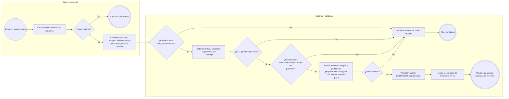
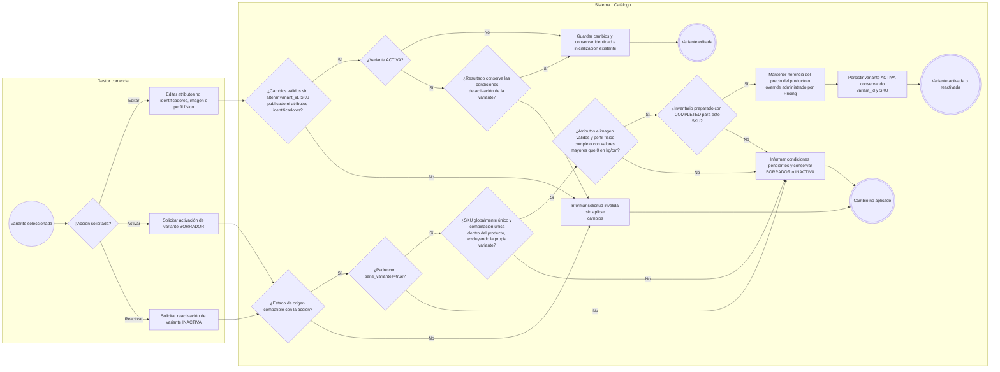
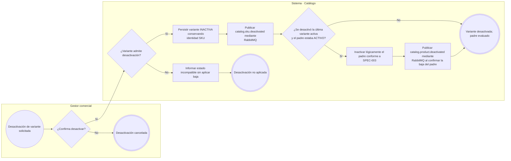

# FLOW-004 — Gestión de variantes y SKU

## 1. Identificación

- **Código:** FLOW-004.
- **Funcionalidad:** Gestión de variantes y SKU.
- **Relacionado con:** [SPEC-004](../specs/SPEC-004-gestion-variantes-skus.md) / [WF-004](../../ux/wireframes/flows/WF-004-gestion-variantes-skus.md) / [índice WF-004](../../ux/wireframes/prototipos/WF-004-gestion-variantes-skus/index.html) / [HU-004](../hu/HU-004-gestion-variantes-skus.md) / [FLOW-003](FLOW-003-gestion-productos-crud.md).
- **Responsable:** Gabriel Poma Gutierrez.
- **Última actualización:** 2026-10-02.
- **Contratos consultados:** [OpenAPI vigente 0.5.0](../../contratos/http/openapi.yaml) y [AsyncAPI 0.5.0](../../contratos/eventos/asyncapi.yaml). La ruta de reactivación se mantiene en el contrato vigente.

## 2. Objetivo del flujo

Representar consulta, creación, preparación de inventario, edición, activación, desactivación y reactivación de las unidades vendibles de un producto con variantes, conservando su identidad SKU y la herencia de precio.

## 3. Actores participantes

- **Gestor comercial:** administra variantes y solicita cambios de estado o reintentos.
- **Sistema (Catálogo):** valida identidad y perfil físico, persiste variantes y coordina mensajes mediante RabbitMQ.
- **Inventario:** inicializa cada SKU idempotentemente y emite el resultado por RabbitMQ.

## 4. Diagrama de flujo

### 4.1. Consulta y creación

El perfil físico pertenece al SKU de variante bajo la forma contractual anidada: `perfilFisico.pesoKg > 0`, `perfilFisico.dimensionesCm.largo > 0`, `perfilFisico.dimensionesCm.ancho > 0`, `perfilFisico.dimensionesCm.alto > 0`, con kg y cm como unidades contractuales. No se utilizan campos planos directos `largoCm/anchoCm/altoCm` en el DTO HTTP. El padre no representa una unidad física ni crea saldo propio. El contrato permite omitir el perfil al crear; completarlo forma parte de la preparación antes de activar.

Crear una variante **no ejecuta** `pricing.product.initialization.requested` ni crea precio base propio. Sin override hereda el precio vigente del producto; un override posterior lo administra Pricing desde Gestión de precios.

### 4.2. Inicialización de Inventario y recuperación

```mermaid
flowchart LR
    subgraph S["Sistema · Catálogo"]
        direction TB
        INICIO(("Variante nueva persistida"))
        PENDING["Registrar preparación Inventario PENDING<br/>manual_retry_allowed=false"]
        REQUEST["Publicar inventory.sku.initialization.requested<br/>mediante RabbitMQ"]
        RESULTADO{"¿Resultado recibido para la operación?"}
        COMPLETED(("inventory.sku.initialization.completed<br/>recibido"))
        REJECTED(("inventory.sku.initialization.rejected<br/>recibido"))
        LISTO["Registrar COMPLETED y marcar Inventario preparado"]
        RECHAZO["Registrar REJECTED y causa; mantener variante no publicable"]
        EVAL_CORREGIBLE{"¿Causa corregible mediante<br/>capacidad publicada?"}
        NO_PUBLICADA["manual_retry_allowed=false;<br/>conservar REJECTED"]
        REEVAL["Catálogo reevalúa precondiciones locales"]
        EVAL_RETRY{"¿Precondiciones válidas?"}
        RETRY_NO["manual_retry_allowed=false;<br/>conservar estado"]
        HABILITAR_RECH["manual_retry_allowed=true"]
        SIN_RESULTADO["Mantener PENDING sin inspeccionar DLQ"]
        EVAL_UMBRAL{"¿Supera umbral operativo configurable?"}
        HABILITAR_UMB["manual_retry_allowed=true"]
        POST_RETRY["Recibir POST variantes/{variantId}/preparacion/reintentar"]
        ATOMICO{"¿Precondiciones válidas y gana transición atómica?"}
        RESP_409["HTTP 409 PREPARACION_NO_REINTENTABLE"]
        RESP_202["HTTP 202 Accepted;<br/>pasa a PENDING y manual_retry_allowed=false"]
        NUEVO_MSG["Construir requested con estado actual validado de la variante,<br/>conservar operation_id y generar nueva message_id"]
        FIN_OK((("Inventario preparado; evaluar condiciones en 4.3")))
        FIN_BORRADOR((("Variante permanece no publicable")))
    end
    subgraph I["Inventario"]
        direction TB
        PROCESAR["Procesar inicialización idempotentemente"]
        RETRY_POLICY["Fallo técnico: reintentos de consumidor en RabbitMQ<br/>(máx 3 reintentos con 30 s de espera)"]
        DLQ["Reintentos agotados: mensaje enviado a DLQ técnica;<br/>consumidor no emite resultado"]
        EMITIR["Emitir resultado por RabbitMQ"]
    end
    subgraph G["Gestor comercial"]
        direction TB
        CORREGIR["Modificar atributos o perfil físico mediante operación publicada"]
        SOLICITAR["Solicitar recuperación manual excepcional vía HTTP"]
    end

    INICIO --> PENDING --> REQUEST --> PROCESAR
    PROCESAR -->|"Procesado con éxito o rechazo"| EMITIR
    PROCESAR -->|"Fallo técnico transitorio"| RETRY_POLICY
    RETRY_POLICY -->|"Logra procesar"| EMITIR
    RETRY_POLICY -->|"Se agotan reintentos"| DLQ
    DLQ -.->|"Catálogo no inspecciona DLQ"| SIN_RESULTADO
    EMITIR --> RESULTADO
    RESULTADO -->|"completed"| COMPLETED --> LISTO --> FIN_OK
    RESULTADO -->|"rejected"| REJECTED --> RECHAZO --> EVAL_CORREGIBLE
    EVAL_CORREGIBLE -->|"No"| NO_PUBLICADA
    EVAL_CORREGIBLE -->|"Sí"| CORREGIR --> REEVAL --> EVAL_RETRY
    EVAL_RETRY -->|"No"| RETRY_NO
    EVAL_RETRY -->|"Sí"| HABILITAR_RECH --> SOLICITAR
    RESULTADO -->|"Sin resultado"| SIN_RESULTADO --> EVAL_UMBRAL
    EVAL_UMBRAL -->|"No"| SIN_RESULTADO
    EVAL_UMBRAL -->|"Sí"| HABILITAR_UMB --> SOLICITAR
    SOLICITAR --> POST_RETRY --> ATOMICO
    ATOMICO -->|"No (concurrente perdedor o no reintentable)"| RESP_409
    ATOMICO -->|"Sí (solicitud ganadora)"| RESP_202 --> NUEVO_MSG --> REQUEST
    RECHAZO --> FIN_BORRADOR
```

El comando contiene `sku`, `product_id`, `variant_id` y `default_location_id` opcional. Catálogo inicia la preparación de inventario de la variante en `PENDING` (`manual_retry_allowed=false`). Los errores técnicos transitorios son recuperados automáticamente por el consumidor de Inventario mediante su política RabbitMQ ordinaria (máximo 3 reintentos con 30 s de espera antes de ser dirigidos a la DLQ técnica de infraestructura). Catálogo no inspecciona la DLQ. Los resultados asíncronos portan `causation_id = message_id` del requested correspondiente al intento activo; Catálogo registra internamente la `message_id` del intento activo y solo procesa resultados con `causation_id` coincidente, ignorando/registrando resultados tardíos de intentos anteriores como stale. `COMPLETED` es terminal, confirma la inicialización del SKU de la variante y nunca se repite. Un rechazo (`REJECTED`) mantiene la variante como no publicable y no se reintenta automáticamente por infraestructura; `manual_retry_allowed` permanece en `false` salvo que la causa sea subsanable mediante una capacidad actualmente publicada en la API, el gestor efectúe dicha corrección en los atributos o perfil físico y Catálogo revalide autoritativamente las precondiciones locales de elegibilidad. De forma independiente, si la operación permanece sin resultado concluyente tras un umbral operativo configurable, Catálogo habilita `manual_retry_allowed=true` manteniendo `PENDING` sin consultar DLQ. La recuperación manual se solicita mediante HTTP (`POST /api/v1/productos/{productoId}/variantes/{variantId}/preparacion/reintentar`), donde la admisión es atómica: la solicitud ganadora devuelve `202 Accepted`, pasa a `PENDING` (`manual_retry_allowed=false`), conserva `operation_id`, construye el nuevo comando con el **estado actual validado de la variante** (atributos y perfil físico actualizados; no el payload antiguo) y emite una nueva `message_id` para transporte RabbitMQ. Las solicitudes concurrentes competidoras reciben `409 PREPARACION_NO_REINTENTABLE`. La consulta de estado (`GET /preparacion`) lee exclusivamente el estado local de Catálogo sin realizar llamadas síncronas a Inventario. Nunca se solicita ni emite inicialización de Pricing para una variante.

### 4.3. Edición, activación y reactivación

La edición valida el perfil proporcionado bajo la forma contractual anidada: `perfilFisico.pesoKg`, `perfilFisico.dimensionesCm.largo`, `perfilFisico.dimensionesCm.ancho` y `perfilFisico.dimensionesCm.alto` mayores que cero. No se utilizan campos planos directos en el DTO HTTP. Reactivar aplica las mismas condiciones de activación, conserva el SKU y no repite una inicialización completada. Si la preparación de inventario no concluyó, se utiliza la recuperación manual de 4.2 sobre la operación existente cuando esté permitida.

La edición actualiza la misma variante, sin crear otra; si está activa y el resultado completo incumple sus requisitos de activación, se rechaza toda la edición conservando datos y estado anteriores. El perfil puede estar incompleto en borrador, con valores informados positivos; activar/reactivar exige los cuatro valores completos. El padre no registra peso ni dimensiones y el volumen de la variante es derivado. El padre no necesita estar activo para activar/reactivar una variante; los hijos en borrador o inactivos no bloquean por sí solos al padre ni se ofrecen comercialmente. Reactivar al padre no reactiva hijos inactivos.

OpenAPI denomina el estado de variante `ACTIVA` (producto: `ACTIVO`) y expone `POST /productos/{productoId}/variantes/{variantId}/reactivar`, con estado de ruta `provisional-internal`. Reactivar una variante no reactiva automáticamente al padre: el producto se revalida desde FLOW-003. Una variante activa con padre no comercialmente vendible no habilita resolución comercial; la disponibilidad de stock se consulta separadamente.

### 4.4. Desactivación y efecto sobre el padre

RabbitMQ distribuye `catalog.sku.deactivated` a los consumidores declarados en AsyncAPI 0.5.0 (`inventory-svc`, `pricing-svc`, `promotions-svc`, `combos-svc`). La baja del padre publica `catalog.product.deactivated` conforme a FLOW-003. Catálogo no realiza llamadas directas a esos consumidores ni inventa un evento de reactivación.

Si el padre estaba en `BORRADOR` o `INACTIVO`, conserva su estado al desactivar la última variante activa. Desactivar al padre conserva los estados individuales de los hijos y bloquea su exposición comercial; reactivar uno no reactiva automáticamente a los demás.

## 5. Reglas de preparación y trazabilidad

| Estado de preparación | Evidencia | Resultado funcional |
|---|---|---|
| `PENDING` | Se publicó `inventory.sku.initialization.requested`, sin resultado concluyente. | Mantener variante no publicable. Operación en curso o bajo recuperación técnica automática; no requiere acción manual mientras `manual_retry_allowed=false`. Si supera el umbral operativo configurable, Catálogo habilita `manual_retry_allowed=true`. |
| `COMPLETED` | Se recibió `inventory.sku.initialization.completed` de la operación correspondiente. | Confirmar inventario preparado y permitir evaluar activación o reactivación. Una inicialización completada nunca se repite. |
| `REJECTED` | Se recibió `inventory.sku.initialization.rejected` de la operación correspondiente. | Mantener variante no publicable y registrar causa; `manual_retry_allowed` permanece en `false` salvo que la causa sea subsanable mediante una capacidad actualmente publicada en la API, el gestor efectúe dicha corrección y Catálogo revalide autoritativamente las precondiciones locales de elegibilidad. |

- Estos estados pertenecen a la preparación técnica de inventario; el estado funcional de variante es `BORRADOR`, `ACTIVA` o `INACTIVA`.
- La consulta administrativa `GET /api/v1/productos/{productoId}/preparacion` lee el estado local de Catálogo sin llamadas síncronas a Inventario.
- La recuperación manual excepcional de inventario se solicita vía HTTP mediante `POST /api/v1/productos/{productoId}/variantes/{variantId}/preparacion/reintentar`. La admisión es **atómica por preparación**: exactamente una solicitud concurrente pasa `manual_retry_allowed=true` a `PENDING / manual_retry_allowed=false` y recibe HTTP `202 Accepted`. Las solicitudes concurrentes competidoras obtienen HTTP `409 PREPARACION_NO_REINTENTABLE`. Nunca se producen dos publicaciones RabbitMQ ni dos efectos de negocio. No se duplican SKU, precio ni inicializaciones.
- La republicación conserva estrictamente la `operation_id` original, genera una nueva `message_id` para transporte RabbitMQ y construye el comando con el **estado actual validado de la variante** (atributos y perfil físico actualizados; no con el payload antiguo).
- Una inicialización `COMPLETED` es terminal y nunca vuelve a ejecutarse.
- Nunca se emite ni recupera Pricing para una variante; las variantes heredan el precio del producto padre.
- Los mensajes y estados técnicos se documentan aquí; la interfaz muestra mensajes operativos conforme a WF-004 y nunca interactúa directamente con RabbitMQ.
- Se conserva la precedencia documental canónica: SPEC → HU → WF. Para rutas, DTO, HTTP y errores prevalece `api/openapi.yaml`, y para mensajes, envelope, operation_id, message_id y transporte prevalece `asyncapi/asyncapi.yaml`.
