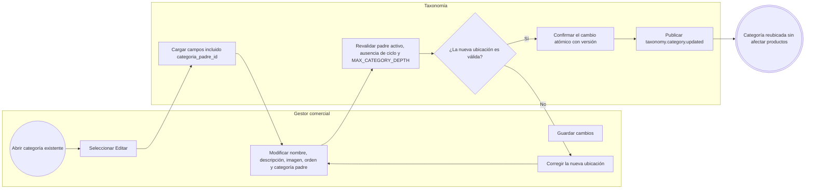
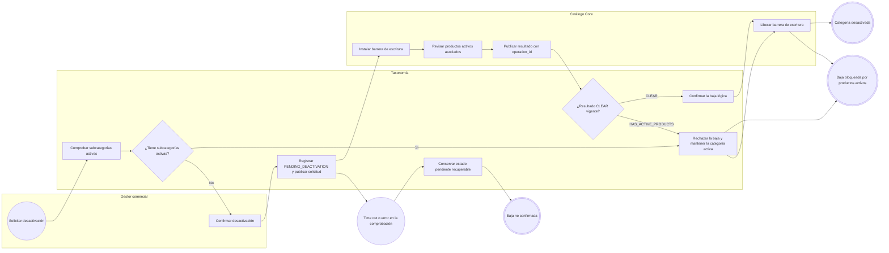
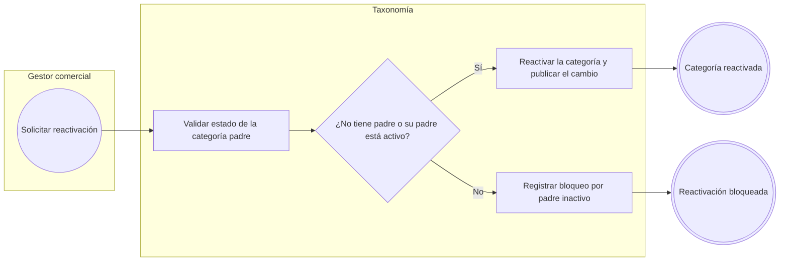

# FLOW-008 — Gestión de categorías y subcategorías

## 1. Identificación

- **Código:** FLOW-008
- **Funcionalidad:** Gestión de categorías y subcategorías
- **Relacionado con:** [HU-008](../hu/HU-008-gestion-categorias.md) / [SPEC-008](../specs/SPEC-008-gestion-categorias.md) / [WF-008](..\..\ux\wireframes\flows\WF-008-gestion-categorias.md)
- **Responsable:** Leonardo Lopez
- **Última actualización:** 2026-10-01

---

## 2. Objetivo del flujo

Representar la consulta del árbol jerárquico, la creación de categorías raíz y subcategorías, la edición con reasignación de padre y la baja lógica asíncrona con confirmación de Catálogo. El flujo incluye la validación de profundidad máxima (`MAX_CATEGORY_DEPTH = 2`), la ausencia de ciclos, la confirmación del slug propuesto por la capacidad SEO antes de publicar, la revalidación de unicidad del slug confirmado y el tratamiento de la carrera concurrente de slug (`409 SLUG_DUPLICADO`) mediante una nueva propuesta y una nueva confirmación, además de la reactivación condicionada al estado del padre.

---

## 3. Actores participantes

- **Gestor comercial:** consulta el árbol, crea, edita, desactiva y reactiva categorías.
- **Capacidad SEO:** resuelve y propone el slug de la creación. La propuesta no reserva el slug.
- **Taxonomía:** administra la jerarquía, persiste el slug confirmado y ejecuta la baja lógica bajo verificación asíncrona.
- **Catálogo Core:** verifica productos activos, instala la barrera de escritura y responde por `operation_id`.

---

## 4. Diagramas de flujo

### 4.1 Consulta y creación de categoría raíz o subcategoría

```mermaid
flowchart LR

    subgraph GESTOR["Gestor comercial"]
        direction TB
        INICIO((Acceso a gestión de categorías))
        G1["Consultar árbol jerárquico"]
        D1{"¿Qué categoría desea crear?"}
        G2["Ingresar nombre, descripción, imagen y orden"]
        G3["Seleccionar categoría padre"]
        G4["Ver el slug propuesto y confirmarlo"]
        D4{"¿Confirma el slug propuesto?"}
        G5["Corregir datos de la categoría"]
        G6["Ver la nueva propuesta y confirmarla de nuevo"]
    end

    subgraph TAXONOMIA["Taxonomía"]
        direction TB
        T1["Listar árbol completo con estados"]
        T2["Validar padre activo y profundidad MAX_CATEGORY_DEPTH=2"]
        D2{"¿El padre es válido y no excede dos niveles?"}
        T3["Enviar el alta con slugConfirmado a POST /api/v1/categorias"]
        T4["Revalidar la unicidad del slug antes de persistir"]
        D3{"¿El slug confirmado sigue libre?"}
        T5["Rechazar con 409 SLUG_DUPLICADO sin aplicar otro sufijo"]
        T6["Persistir la categoría y publicar taxonomy.category.updated"]
    end

    subgraph SEO["Capacidad SEO"]
        direction TB
        S1["Resolver la propuesta con POST /api/v1/seo/categorias/slug/resolver"]
        S2["Normalizar el nombre: minúsculas, sin tildes ni espacios"]
        DS1{"¿La propuesta colisiona con un slug existente?"}
        S3["Añadir sufijo numérico incremental a la propuesta"]
        S4["Devolver la propuesta con slug y colisionResuelta"]
    end

    FIN_CREADA(((Categoría creada y publicada)))
    FIN_CANCELADA(((Creación cancelada)))

    INICIO --> G1
    G1 --> T1
    T1 --> D1
    D1 -->|"Crear raíz"| G2
    D1 -->|"Añadir subcategoría"| G3
    G3 --> G2
    G2 --> T2
    T2 --> D2
    D2 -->|"No"| G5
    G5 --> G2
    D2 -->|"Sí"| S1
    S1 --> S2
    S2 --> DS1
    DS1 -->|"Sí"| S3
    S3 --> S4
    DS1 -->|"No"| S4
    S4 --> G4
    G4 --> D4
    D4 -->|"No"| FIN_CANCELADA
    D4 -->|"Sí"| T3
    T3 --> T4
    T4 --> D3
    D3 -->|"No"| T5
    T5 --> G6
    G6 --> S1
    D3 -->|"Sí"| T6
    T6 --> FIN_CREADA
```

> El flujo correcto de creación es resolver → mostrar → confirmar → crear con `slugConfirmado` → revalidar unicidad. La propuesta de SEO no reserva el slug: si al persistir otro proceso ya lo ocupó, `POST /api/v1/categorias` responde `409 SLUG_DUPLICADO` y Taxonomía no aplica ningún sufijo alternativo por su cuenta. El flujo vuelve a solicitar una propuesta a SEO, la muestra de nuevo y exige una nueva confirmación del gestor antes de reintentar el alta. La edición posterior del slug y los metadatos pertenece a la capacidad SEO (WF-012).

### 4.2 Edición y reasignación de categoría padre

> Reubicar una categoría no recalcula el esquema de atributos de los productos: el esquema se resuelve por `tipo_producto_id`, no por la jerarquía de navegación.

### 4.3 Baja lógica con verificación asíncrona de Catálogo

> La desactivación es una operación asíncrona de dos fases: Taxonomía solo confirma la baja lógica ante un resultado `CLEAR` vigente. El `202 Accepted` de `POST /api/v1/categorias/{categoriaId}/desactivar` representa únicamente la admisión de la solicitud, no la baja completada; el estado pendiente se consulta con `GET /api/v1/taxonomia/operaciones/{operationId}`. Un timeout, error o verificación pendiente nunca autoriza la baja.

### 4.4 Reactivación de una categoría

