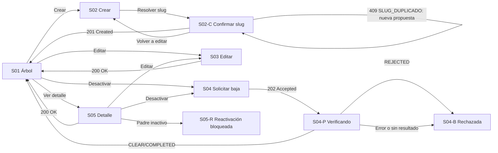

# Component Spec — MK-008

## 1. Identificación

- **Mockup:** MK-008 — Gestión de categorías y subcategorías
- **Funcionalidad:** Taxonomía de navegación del catálogo (árbol recursivo de categorías y subcategorías)
- **Responsable:** Leonardo Lopez (rama `lopez`)
- **Versión:** 1.1 — 2026-10-03
- **Estado:** **En revisión** — aprobación documental pendiente. No acredita implementación, autovalidación, revisión UX ni visto bueno para Figma.

Coordinación: ejecución general #61; entradas transversales #59 y #60. Alcance de la entrega: web desktop, viewport canónico 1440 × 900 px.

## 2. Trazabilidad

| Fuente | Referencia | Alcance |
|---|---|---|
| SPEC | [SPEC-008](..\..\..\requisitos\specs\SPEC-008-gestion-categorias.md) | Requisitos 1–8: creación con slug confirmado, jerarquía, actualización, baja lógica segura, reactivación, árbol, reubicación, contrato con SEO |
| HU | [HU-008](..\..\..\requisitos\hu\HU-008-gestion-categorias.md) | CA-01 a CA-14 y escenarios 1–7 (sin redefinir ni reordenar) |
| WF | [WF-008](../../wireframes/flows/WF-008-gestion-categorias.md) v0.7 | Pantallas S-01, S-02, S-02-C, S-03, S-04, S-04-P, S-04-B, S-05, S-05-R y copy normativo |
| Flow | [FLOW-008](..\..\..\requisitos\flujos\FLOW-008-gestion-categorias.md) | §4.1 consulta de árbol; §4.2 creación con slug; §4.3 actualización y jerarquía; §4.4 baja lógica |
| Propuesta UX módulo | [propuesta-ux.md](../ux/propuesta-ux.md) | UX 2.0: contexto de árbol, feedback situado, confirmación de slug, estados transitorios |
| UX Decisions | [ux-decisions.md](../ux/ux-decisions.md) | UXD-001, UXD-005, UXD-007, UXD-008, UXD-009, UXD-011 |
| UX Guidelines | [ux-guidelines.md](../ux/ux-guidelines.md) | UXG-001, UXG-002, UXG-006 a UXG-015, UXG-018, UXG-020 a UXG-022 |
| API Contract | [api/openapi.yaml](..\..\..\contratos\http\openapi.yaml) 0.5.0 · [Contrato_Api.md](..\..\..\contratos\http\Contrato_Api.md) · [asyncapi.yaml](..\..\..\contratos\eventos\asyncapi.yaml) 0.4.0 | Operaciones, DTO y códigos de error de §9; protocolo transversal de baja segura y `taxonomy.category.updated` |
| Design System | [DESIGN.md](../DESIGN.md) 1.0.0 | Foundations, layout desktop, componentes DS-C01…DS-C28 aplicados en §8 |

Las fuentes funcionales prevalecen sobre los artefactos visuales. Este documento no redefine CA ni reglas de negocio; las discrepancias se registran en §14.

### 2.1 Trazabilidad de criterios de aceptación de HU-008

Los 14 CA originales se conservan sin renumerar ni reinterpretar. `Tarea` remite a [tasks.md](tasks.md) y `Evidencia` a las secciones de `validation-report.md` (aún no emitido).

| CA | Criterio original (resumen fiel) | Pantalla / estado | Fixture | Tarea | Evidencia |
|---|---|---|---|---|---|
| CA-01 | Crear con nombre, descripción y padre opcional; nombre no único | S02 / default, validacion | `crear-con-padre`, `nombre-no-unico` | MK-008-T12 | VR §3, §4 |
| CA-02 | Modelo recursivo; `MAX_CATEGORY_DEPTH=2` en MVP | S01 / default; S02, S03 / selector | `arbol-dos-niveles` | MK-008-T11, T12, T13 | VR §3, §4 |
| CA-03 | No autorreferencia/ciclos | S03 / rechazo | `ciclo-rechazado` | MK-008-T13 | VR §3, §4 |
| CA-04 | `categoria_padre_id` editable junto con datos | S03 / default | `editar-con-reubicacion` | MK-008-T13 | VR §3 |
| CA-05 | Reubicar valida padre activo, ciclos y profundidad | S03 / rechazo | `padre-inactivo-al-editar`, `profundidad-excedida`, `ciclo-rechazado` | MK-008-T13 | VR §3, §4 |
| CA-06 | Baja lógica solo tras verificación asíncrona segura | S04 → S04-P → S04-B / pendiente, rechazado | `baja-pendiente`, `baja-rechazada` | MK-008-T14, T15, T16 | VR §3, §4 |
| CA-07 | Reactivar exige padre activo | S05, S05-R / rechazo | `reactivacion-padre-inactivo` | MK-008-T17, T18 | VR §3, §4 |
| CA-08 | Nunca eliminación física | Todo el MK: sin acción de eliminar | `sin-borrado` | MK-008-T60 | VR §4 |
| CA-09 | Administración ve árbol completo; externos solo activos | S01 / default (árbol admin) | `arbol-dos-niveles` | MK-008-T11 | VR §3, §4 |
| CA-10 | Baja queda `PENDING_DEACTIVATION`; solo `CLEAR` vigente confirma | S04-P / pendiente, confirmado | `baja-pendiente`, `baja-confirmada` | MK-008-T15 | VR §3, §4 |
| CA-11 | Categorías no recalculan características | S03 / tras reubicación; §4 fuera de alcance | `editar-con-reubicacion` | MK-008-T13, T60 | VR §4 |
| CA-12 | Reubicación confirmada propaga `taxonomy.category.updated` de forma eventual | S03 / confirmado | `editar-con-reubicacion` | MK-008-T13 | VR §3, §4 |
| CA-13 | Creación: slug final resuelto por SEO se muestra antes de confirmar; la colisión con sufijo no se aplica silenciosamente | S02-C / default, colisión | `slug-con-colision` | MK-008-T12 | VR §3, §4 |
| CA-14 | Creación usa `POST /api/v1/seo/categorias/slug/resolver` y envía `slugConfirmado`; `409 SLUG_DUPLICADO` exige nueva resolución | S02-C / carrera concurrente | `slug-carrera-409` | MK-008-T12 | VR §3, §4 |

## 3. Objetivo funcional

- **Usuario:** Gestor Comercial responsable de la taxonomía del catálogo.
- **Objetivo:** crear, reubicar, dar de baja y reactivar categorías manteniendo la navegación del Marketplace coherente.
- **Contexto:** el catálogo necesita un árbol de navegación de dos niveles en MVP y una baja segura que no rompa productos activos.
- **Resultado exitoso:** toda categoría creada tiene un slug visible y confirmado antes de persistirse, y ninguna baja se confirma sin verificación segura vigente.

## 4. Alcance

### Incluido
- Consulta del árbol administrativo (activas e inactivas) y selección de categoría para el resto de acciones.
- Alta con secuencia obligatoria resolver → mostrar → confirmar → crear con `slugConfirmado`, incluida la recuperación ante `409 SLUG_DUPLICADO`.
- Edición de nombre, descripción, orden, imagen y categoría padre, con validación de ciclo, padre activo y profundidad.
- Baja lógica con admisión `202`, seguimiento por `operationId` y resultado confirmado, rechazado o no concluyente.
- Detalle de categoría y reactivación condicionada al estado del padre.
- Estados deterministas default, loading, empty, error y los casos negativos de §13.

### Fuera de alcance
- Eliminación física de categorías y de cualquier otra entidad.
- Atributos, características o esquema de producto por categoría (pertenece al tipo de producto, MK-010).
- Edición de slug y metadatos SEO dentro de esta interfaz (SPEC-012 / MK-012).
- Reserva del slug durante la fase de propuesta.
- Roles o permisos no publicados; la interfaz no declara un rol global como contrato.

## 5. Inventario de pantallas

| ID | Pantalla | Propósito | Entrada | Acción principal | Salida | Prioridad | Ruta del prototipo |
|---|---|---|---|---|---|---|---|
| MK-008-S01 | Árbol de categorías | Consultar el árbol, su estado y la jerarquía | Sidebar o ruta directa | Elegir categoría / crear | S02, S03, S04, S05 del registro elegido | P0 | `/MK008/S01` |
| MK-008-S02 | Crear categoría | Registrar nombre, descripción, imagen, orden y padre opcional | S01 / Crear categoría | Continuar a revisión de slug | S02-C con la propuesta de SEO | P0 | `/MK008/S02` |
| MK-008-S02-C | Confirmar slug SEO | Mostrar el slug final propuesto antes de publicar | S02 / continuar | Confirmar creación | Confirmado: S01 con la categoría creada; `409`: permanece en S02-C para nueva propuesta | P0 | `/MK008/S02-C` |
| MK-008-S03 | Editar categoría | Modificar datos y reubicar la categoría | S01 o S05 / Editar | Guardar cambios | Confirmado: S01; rechazo: permanece en S03 | P0 | `/MK008/S03` |
| MK-008-S04 | Solicitar desactivación | Explicar el impacto y admitir la solicitud de baja | S01 o S05 / Desactivar | Solicitar desactivación | `202`: S04-P | P0 | `/MK008/S04` |
| MK-008-S04-P | Verificando dependencias | Mostrar la admisión y el seguimiento de la operación | S04 / confirmar | Consultar estado de la operación | `CLEAR`/`COMPLETED`: S01; `REJECTED`: S04-B | P0 | `/MK008/S04-P` |
| MK-008-S04-B | Baja rechazada | Explicar el bloqueo sin alterar el estado activo | S04-P / resultado rechazado | Entendido | S01 con la categoría intacta | P0 | `/MK008/S04-B` |
| MK-008-S05 | Detalle de categoría | Leer datos, padre, hijas, estado y slug | S01 / Ver detalle | Editar o reactivar | S03, S04 o S01 | P0 | `/MK008/S05` |
| MK-008-S05-R | Reactivación bloqueada | Explicar que el padre está inactivo | S05 / Reactivar padre inactivo | Reactivar el padre primero | S05 del padre; la hija permanece inactiva | P0 | `/MK008/S05-R` |

**Reglas de acceso y enrutamiento:**
- Toda pantalla inventariada como `MK-008-SXX` dispone de ruta individual y estable; la ruta derivative exactamente del identificador, incluidos los sufijos de variante (`/MK008/S02-C`, `/MK008/S04-P`, `/MK008/S04-B`, `/MK008/S05-R`).
- La ruta permite inspección directa sin recorrer el flujo previo; un diálogo se reproduce con el contexto de fondo que lo originó.
- El parámetro de consulta de fixture controla la reproducción determinista de estados y no se muestra como control técnico.
- Cualquier alta, baja o renombrado de pantalla obliga a actualizar ruta en este inventario, en [plan.md](plan.md) §5, en [tasks.md](tasks.md) y en `mockups/README.md`.

## 6. Relación entre pantallas

No existen caminos huérfanos: toda pantalla tiene entrada desde S01 y retorno a S01. Ninguna transición depende de admitir solo el `202`.

## 7. Jerarquía de información

1. **Primaria:** árbol de categorías con nombre, nivel y estado; acción de crear; acción primaria de la pantalla actual.
2. **Secundaria:** datos editables (descripción, orden, imagen, padre), contador de hijas y estado del proceso de baja.
3. **Complementaria:**ayudas de reglas (profundidad, ciclo, padre activo), fechas y metadatos solo cuando el contrato los entrega.

El estado nunca se comunica solo por color y el identificador interno de categoría no es una columna necesaria.

## 8. Componentes compartidos

| Componente | Pantallas | Uso | Variante | Estados |
|---|---|---|---|---|
| DS-C01 Button | S01–S05-R | Crear, guardar, confirmar, solicitar baja, reactivar | filled primary / outline secondary md 40 px | default, hover, focus, disabled, loading |
| DS-C02 ActionIcon | S01, S05 | Expandir nodo, ver detalle, editar | 32/40 px con nombre accesible | default, focus, disabled |
| DS-C03 TextInput | S01, S02, S03 | Nombre, buscador del árbol, URL de imagen | md 40 px, label arriba | default, error, disabled |
| DS-C05 Textarea | S02, S03 | Descripción | md, label visible | default, error |
| DS-C06 Select | S02, S03 | Categoría padre | md 40 px | default, error, sin opciones válidas |
| DS-C12 Search | S01 | Filtro por texto del árbol | md 40 px | default, sin resultados, loading |
| DS-C14 Badge | S01, S05 | Activo, inactivo, pendiente de baja, nivel | sm 24 px con texto | default |
| DS-C17 Table | S01 | Vista de árbol con hijas indentadas | header 40 px, fila 48 px | default, loading, empty, sin resultados, error |
| DS-C19 Card | S01, S02, S03, S05 | Contenedor de datos y metadatos | padding 24, radio 12 | default |
| DS-C21 Modal | S02-C, S04, S04-B, S05-R | Confirmación de slug, solicitud de baja y avisos de bloqueo | 480 px, padding 24, radio 16 | default, focus trap, Escape |
| DS-C22 Alert | S02-C, S04-P, S04-B, S05-R | Colisión resuelta, verificación en curso, rechazo y bloqueo | padding 16, icono 20 | info, warning, error, success |
| DS-C24 Skeleton/Loader | S01, S03, S05 | Carga inicial y verificación asíncrona | líneas 16/20/24 | loading |
| DS-C25 EmptyState | S01 | Árbol sin categorías o sin coincidencias | padding 32 | empty, sin resultados |
| DS-C28 Breadcrumbs | S01–S05 | `Inicio > Taxonomía > Categorías` | 14/20 | default |

No se redefinen componentes del Design System; las particularidades viven en §9.

## 9. Componentes específicos

### MK-008-C01 — Árbol de categorías

**Propósito** representar la jerarquía recursiva con estado y acciones por nodo, sin confundir nivel con estado.

**Pantallas:** S01.

**Propiedades conceptuales**

| Propiedad | Tipo | Obligatoria | Regla / Restricción |
|---|---|---:|---|
| `nodos` | Lista de árbol | Sí | Máximo dos niveles en MVP; hijos de nodos hoja vacíos |
| `nodoSeleccionadoId` | Texto | No | Estado de selección, no de edición |
| `colapsadosPorId` | Lista de identificadores | No | Conserva el estado al volver desde otras pantallas |
| `estadoPorNodo` | Activo / Inactivo / Verificando baja | Sí | Texto además de color |

**Estados**

| Estado | Disparador | Representación visual | Acción permitida |
|---|---|---|---|
| Default | Árbol cargado | Filas indentadas por nivel con acciones de fila | Expandir, filtrar, abrir, editar, desactivar |
| Loading | Consulta en curso | Skeleton de filas | Ninguna escritura |
| Empty | Sin categorías configuradas | EmptyState con acción Crear | Crear categoría |
| Sin resultados | Filtro sin coincidencias | EmptyState con acción Limpiar filtro | Limpiar filtro |
| Error | Fallo de lectura | Alert con reintento | Reintentar consulta |

**Interacciones**

| Acción | Respuesta de interfaz | Resultado | Flow |
|---|---|---|---|
| Expandir nodo | Alterna `aria-expanded` | Muestra hijas conservando el filtro | FLOW-008 §4.1 |
| Abrir nodo | Selecciona y carga detalle | S05 | FLOW-008 §4.1 |
| Filtrar por texto | Resultado en la misma vista | Conserva expansión y selección | FLOW-008 §4.1 |

**Accesibilidad:** rol de árbol con `aria-expanded` y `aria-level` por nodo, foco visible, nombres accesibles en acciones de fila y estado de nodo anunciado por texto.

### MK-008-C02 — Selector de categoría padre

**Propósito** ofrecer solo padres válidos para respetar profundidad, ciclo y estado activo.

**Pantallas:** S02, S03.

**Propiedades conceptuales**

| Propiedad | Tipo | Obligatoria | Regla / Restricción |
|---|---|---:|---|
| `categorias` | Lista de categoría | Sí | Solo activas; excluye inactivas |
| `categoriaActualId` | Texto | No | Excluye la propia categoría y sus descendientes |
| `padreId` | Texto | No | Nulo significa categoría raíz |
| `nivelMaximo` | Número | Sí | 2 en MVP, constante configurable, no visible como código |

**Estados**

| Estado | Disparador | Representación visual | Acción permitida |
|---|---|---|---|
| Default | Categoría raíz o subcategoría | Lista de raíces activas | Elegir o dejar en raíz |
| Sin opciones válidas | No hay padres activos distintos de la propia | Select con ayuda explicativa | Crear en raíz |
| Candidatas no válidas | Existen subcategorías que no pueden ser padre | Opciones deshabilitadas con explicación (LUX-01) | Ninguna |

**Interacciones**

| Acción | Respuesta | Resultado |
|---|---|---|
| Elegir padre | Valor en el campo padre | Se evalúa ciclo y profundidad antes de enviar |
| Guardar con padre no válido | Errores del servidor cerca del campo | Se conserva el formulario |

**Accesibilidad:** label visible, descripcion del limite asociada al control y errores en texto, no solo color.

### MK-008-C03 — Confirmación de slug

**Propósito** hacer visible el slug final propuesto antes de que exista la categoría.

**Pantallas:** S02-C.

**Propiedades conceptuales**

| Propiedad | Tipo | Obligatoria | Regla / Restricción |
|---|---|---:|---|
| `nombre` | Texto | Sí | Solo lectura en el diálogo |
| `slug` | Texto | Sí | Propuesta de SEO, nunca generada en cliente |
| `colisionResuelta` | Booleano | Sí | Si es verdadero, explica el sufijo aplicado |
| `confirmado` | Booleano | Sí | Solo un `true` habilitado emite la creación |

**Estados**

| Estado | Disparador | Representación visual | Acción permitida |
|---|---|---|---|
| Default | Propuesta sin colisión | URL pública completa | Confirmar creación / Volver |
| Colisión | `colisionResuelta: true` | URL con sufijo resaltado y alerta explicativa (LUX-02) | Confirmar creación / Volver |
| Carrera concurrente | `409 SLUG_DUPLICADO` | Alerta persistente y nueva propuesta en el mismo diálogo | Confirmar la nueva propuesta / Volver |
| Guardando | Confirmación en curso | Botón en loading, sin_dialogo duplicado | Ninguna |

**Interacciones**

| Acción | Respuesta | Resultado |
|---|---|---|
| Confirmar creación | Envía `slugConfirmado` exacto | `201`: S01; `409`: nueva propuesta |
| Volver a editar | Cierra el diálogo y conserva el formulario | S02 |

**Accesibilidad:** foco contenido en el diálogo y devuelto al disparador, URL legible por lector de pantalla y aviso de colisión como texto.

### MK-008-C04 — Seguimiento de operación de baja

**Propósito** representar la admisión `202` y su verificación posterior por `operationId` sin anticipar el resultado.

**Pantallas:** S04-P (resultados en S04-B y retorno a S01).

**Propiedades conceptuales**

| Propiedad | Tipo | Obligatoria | Regla / Restricción |
|---|---|---:|---|
| `operacion` | Identificador de operación | Sí | Solo el identificador, sin eventos ni topics visibles |
| `entidadTipo` | Categoría | Sí | Texto operativo: «Categoría» |
| `estado` | Pendiente / Confirmada / Rechazada | Sí | Derivado de `PENDING_DEACTIVATION`, `CLEAR`/`COMPLETED`, `REJECTED` |
| `motivoRechazo` | Texto | No | Presente solo en rechazo |
| `consultable` | Booleano | Sí | Permite consultar el estado sin recargar la pantalla |

**Estados**

| Estado | Disparador | Representación visual | Acción permitida |
|---|---|---|---|
| Pendiente | `202` admitido o `PENDING_DEACTIVATION` | Banner informativo con acción Consultar estado | Consultar, volver al árbol |
| Confirmada | `CLEAR` o `COMPLETED` | Banner de resultado y árbol actualizado | Volver al árbol |
| Rechazada | `REJECTED` o `result: HAS_ACTIVE_PRODUCTS` | S04-B con motivo | Entendido |
| No concluyente | Error de consulta o resultado ausente | S04-B genérico, sin afirmar cambio | Entendido / Consultar de nuevo |

**Interacciones**

| Acción | Respuesta | Resultado |
|---|---|---|
| Consultar estado | Consulta la operación y actualiza el banner | Estado vigente; nunca se reenvía la baja |
| Entendido | Cierra el aviso | S01 con el estado real del árbol |

**Accesibilidad:** región `aria-live` para el resultado asíncrono, foco al mensaje de resultado y tiempo de espera expresado en palabras, nunca como cronómetro con promesa de duración.

## 10. Especificación por pantalla

### MK-008-S01 — Árbol de categorías

**Propósito y objetivo** consultar la jerarquía completa, con estado, y elegir la categoría sobre la que actuar.
**Estructura y layout** 1. Cabecera con migas y título. 2. Barra de acciones con Crear categoría y filtro de texto. 3. Árbol/tabla con nivel, estado y acciones por fila.
**Componentes presentes** DS-C28, DS-C01, DS-C12, DS-C17, DS-C14, DS-C02, DS-C24, DS-C25; MK-008-C01.
**Acción primaria** Crear categoría hacia S02.
**Acciones secundarias** Ver detalle, Editar, Desactivar sobre la categoría elegida; filtro de texto.
**Estados requeridos** default, loading, empty, sin resultados, error, sesión y permisos.
**Contenido clave y microtexto**

| Elemento | Texto / Patrón | Fuente de procedencia |
|---|---|---|
| Título | Categorías | WF-008 §2 |
| Empty | «Todavía no hay categorías. Crea la primera.» | UX Guidelines |
| Filtro | «Buscar categoría por nombre» | UXD-006 |

### MK-008-S02 — Crear categoría

**Propósito y objetivo** registrar los datos de una categoría nueva sin persistir nada hasta confirmar el slug.
**Estructura y layout** 1. Migas y título. 2. Formulario en Card con nombre, descripción, orden, imagen y padre. 3. Barra con acción primaria y Cancelar.
**Componentes presentes** DS-C28, DS-C19, DS-C03, DS-C05, DS-C06, DS-C01, DS-C22; MK-008-C02.
**Acción primaria** Continuar a revisión de slug (S02-C), que solicita la propuesta a SEO.
**Acciones secundarias** Cancelar hacia S01 con confirmación si hay borrador.
**Estados requeridos** default, validacion, guardando, salida-con-cambios, sesión y permisos.
**Contenido clave y microtexto**

| Elemento | Texto / Patrón | Fuente de procedencia |
|---|---|---|
| Ayuda de padre | «Deja el padre vacío para crear una categoría de primer nivel.» | SPEC-008 R1 |
| Ayuda de unicidad | «El nombre no necesita ser único.» | SPEC-008 R1 |

### MK-008-S02-C — Confirmar slug SEO

**Propósito y objetivo** mostrar el slug final propuesto y exigir confirmación explícita antes de crear.
**Estructura y layout** 1. Modal 480 px con nombre y URL propuesta. 2. Alerta si hubo colisión resuelta. 3. Acciones Confirmar creación y Volver a editar.
**Componentes presentes** DS-C21, DS-C22, DS-C01; MK-008-C03.
**Acción primaria** Confirmar creación, que envía `slugConfirmado` sin modificarlo.
**Acciones secundarias** Volver a editar (S02).
**Estados requeridos** default, colisión resuelta, carrera concurrente `409`, guardando.
**Contenido clave y microtexto**

| Elemento | Texto / Patrón | Fuente de procedencia |
|---|---|---|
| URL | `/categoria/{slug}` | SPEC-008 R1 |
| Colisión | «El slug propuesto incluye un sufijo para evitar una colisión con URLs existentes.» | SPEC-008 R1 |
| Carrera | «El slug fue ocupado por otra operación. Revisa la nueva propuesta antes de confirmar.» | SPEC-008 R1 |

### MK-008-S03 — Editar categoría

**Propósito y objetivo** modificar datos de la categoría y, si corresponde, reubicarla sin alterar productos.
**Estructura y layout** 1. Migas y título con la categoría. 2. Formulario con campos editables y selector de padre. 3. Barra con Guardar cambios y Cancelar.
**Componentes presentes** DS-C19, DS-C03, DS-C05, DS-C06, DS-C01, DS-C22; MK-008-C02.
**Acción primaria** Guardar cambios (PATCH de la categoría).
**Acciones secundarias** Cancelar; volver al detalle.
**Estados requeridos** default, loading, validacion, guardar-error, conflicto de versión, salida-con-cambios, sesión y permisos.
**Contenido clave y microtexto**

| Elemento | Texto / Patrón | Fuente de procedencia |
|---|---|---|
| Ayuda de reubicación | «Cambiar la ubicación no modifica los productos ni sus características.» | SPEC-008 R3, HU-008 CA-11 |
| Confirmación de reubicación | «La reubicación se propagará a los consumidores; el cambio puede tardar en aplicarse.» | SPEC-008 R7, HU-008 CA-12 |

### MK-008-S04 — Solicitar desactivación

**Propósito y objetivo** explicar el proceso de baja segura y obtener confirmación explícita antes de solicitar la desactivación.
**Estructura y layout** 1. Modal con nombre, estado actual e impacto. 2. Recordatorio de verificación de productos. 3. Acciones Solicitar desactivación y Cancelar.
**Componentes presentes** DS-C21, DS-C22, DS-C01.
**Acción primaria** Solicitar desactivación, que envía la solicitud y admite `202`.
**Acciones secundarias** Cancelar hacia S01 o S05.
**Estados requeridos** default, con subcategorías activas bloqueadas, rechazo del servidor, guardando.
**Contenido clave y microtexto**

| Elemento | Texto / Patrón | Fuente de procedencia |
|---|---|---|
| Impacto | «Antes de desactivar esta categoría comprobaremos que no tenga productos activos asociados.» | SPEC-008 R4 |
| Bloqueo | «No se puede desactivar porque tiene subcategorías activas.» | Contrato: `409 CATEGORIA_CON_SUBCATEGORIAS_ACTIVAS` |

### MK-008-S04-P — Verificando dependencias

**Propósito y objetivo** comunicar que la solicitud fue admitida y permitir consultar el estado real de la verificación.
**Estructura y layout** 1. Banner de estado con identificador de operación. 2. Acción Consultar estado. 3. Enlace de retorno al árbol.
**Componentes presentes** DS-C22, DS-C24, DS-C01; MK-008-C04.
**Acción primaria** Consultar estado de la operación.
**Acciones secundarias** Volver al árbol sin afirmar resultado.
**Estados requeridos** pendiente, confirmada, rechazada, no concluyente.
**Contenido clave y microtexto**

| Elemento | Texto / Patrón | Fuente de procedencia |
|---|---|---|
| Pendiente | «Solicitud recibida. Estamos comprobando si la baja es segura.» | WF-008 §5 |
| Confirmada | «La categoría quedó desactivada.» | SPEC-008 R4 |
| No concluyente | «No pudimos confirmar que la baja sea segura. No se realizó ningún cambio.» | SPEC-009 R6 (copy transversal) |

### MK-008-S04-B — Baja rechazada

**Propósito y objetivo** explicar el rechazo y preservar la categoría activa.
**Estructura y layout** 1. Modal de resultado con motivo. 2. Acción Entendido.
**Componentes presentes** DS-C21, DS-C22, DS-C01.
**Acción primaria** Entendido, que vuelve a S01.
**Acciones secundarias** Consultar de nuevo el estado si el motivo fue ausencia de resultado.
**Estados requeridos** rechazo por productos activos, no concluyente.
**Contenido clave y microtexto**

| Elemento | Texto / Patrón | Fuente de procedencia |
|---|---|---|
| Rechazo | «No se puede desactivar porque existen productos activos asociados.» | SPEC-008 R4 |

### MK-008-S05 — Detalle de categoría

**Propósito y objetivo** leer la ficha completa y decidir la siguiente acción sobre la categoría.
**Estructura y layout** 1. Migas y título. 2. Card de datos con nombre, descripción, padre, hijas, orden, imagen, slug y estado. 3. Acciones Editar, Desactivar o Reactivar.
**Componentes presentes** DS-C28, DS-C19, DS-C14, DS-C01.
**Acción primaria** Editar categoría hacia S03.
**Acciones secundarias** Desactivar hacia S04; Reactivar cuando esté inactiva.
**Estados requeridos** default, loading, error, no encontrada, sesión y permisos.
**Contenido clave y microtexto**

| Elemento | Texto / Patrón | Fuente de procedencia |
|---|---|---|
| Estado | Activo / Inactivo | Contrato: `CategoriaAdmin.estado` |
| Slug | `/categoria/{slug}` cuando exista | Contrato: `CategoriaAdmin.slug` |

### MK-008-S05-R — Reactivación bloqueada

**Proposito y objetivo** impedir la reactivacion de una categoria cuyo padre sigue inactivo y marcar el camino de resolucion.
**Estructura y layout** 1. Modal con estado de la hija y del padre. 2. Acción Reactivar el padre. 3. Acción Entendido.
**Componentes presentes** DS-C21, DS-C22, DS-C01.
**Acción primaria** Reactivar el padre (sigue la ruta de reactivación sobre el padre).
**Acciones secundarias** Entendido, que conserva la hija inactiva.
**Estados requeridos** padre inactivo, padre reactivado con éxito, conflicto de versión.
**Contenido clave y microtexto**

| Elemento | Texto / Patrón | Fuente de procedencia |
|---|---|---|
| Bloqueo | «Reactiva primero la categoría padre para poder activar esta subcategoría.» | SPEC-008 R5, HU-008 CA-07 |

## 11. Decisiones UX locales

### LUX-01 — Candidatas de padre no válidas visibles y deshabilitadas

**Problema** ocultar las subcategorias que no pueden actuar como padre genera dudas sobre si el sistema las omite.
**Alternativas consideradas** ocultarlas del selector (descartada: no explica por qué no aparecen) o mostrar un árbol completo con filtro (descartada: añade complejidad para un dato simple).
**Decisión adoptada** mostrar las candidatas no válidas deshabilitadas con la explicación del límite de anidamiento.
**Justificación** el gestor debe entender la regla de profundidad sin deducirla de una ausencia.
**Trade-off** el selector muestra opciones no accionables.
**Criterio de validación** en S02 y S03 se identifica el motivo de cada opción deshabilitada sin ayuda externa.

### LUX-02 — URL pública destacada en la confirmación de slug

**Problema** el slug es un identificador técnico y su impacto no es evidente si se muestra como texto plano.
**Alternativas consideradas** tabla de datos con el slug (descartada: no comunica la URL pública) o confirmación genérica sin URL (descartada: no cumple el requisito de mostrar el slug final).
**Decisión adoptada** representar la URL pública completa con el sufijo resaltado cuando hubo colisión.
**Justificación** refuerza que la colisión es visible y debe confirmarse, no applied silenciosamente.
**Trade-off** composición más rica que un campo de texto.
**Criterio de validación** el gestor distingue el sufijo aplicado antes de confirmar.

## 12. Reglas de layout PC

- Entorno exclusivo web desktop con viewport canónico de 1440 px y scroll vertical.
- Shell, espaciados y tipografía según DESIGN §5; contenido alineado a la rejilla del sistema.
- Tabla o árbol con scroll limitado a su región; la página no presenta overflow horizontal en ningún estado.
- Modales de 480 px según DESIGN; formularios alineados a la izquierda con ancho máximo del sistema.
- Iconografía exclusivamente Tabler; tokens de color, radio y espacio del tema, sin estilos inline arbitrarios.

## 13. Fixtures

| Fixture | Caso de negocio | Pantalla / Estado | Datos representativos |
|---|---|---|---|
| `default` | Árbol válido de dos niveles | S01 / Default | Raíces `Calzado` y `Ropa` activas; hijas `Running` y `Casual` |
| `loading` | Consulta o verificación en curso | S01, S04-P / Loading | Skeleton de filas o banner pendiente |
| `empty` | Sin categorías configuradas | S01 / Empty | Colección vacía |
| `sin-resultados` | Filtro sin coincidencias | S01 / Empty | Filtro `Zapat` sin coincidencias |
| `error` | Fallo controlado de lectura o escritura | S01, S03 / Error | `Problem` con `VALIDACION` o `ERROR_INTERNO` |
| `sesion` | Token inválido o sin permisos | Todas / Sesión | `401 TOKEN_INVALIDO`, `403 SCOPE_INSUFICIENTE` |
| `arbol-dos-niveles` | Jerarquía del MVP | S01 / Default | Dos niveles; sin tercer nivel |
| `crear-con-padre` | Alta como subcategoría | S02 / Default | Nombre, descripción, orden, padre raíz activo |
| `nombre-no-unico` | Nombre repetido permitido | S02 / Default | Nombre `Running` ya existente en otra rama |
| `slug-sin-colision` | Propuesta normal | S02-C / Default | `Deportes de montaña` → `deportes-de-montana`, `colisionResuelta: false` |
| `slug-con-colision` | Propuesta con sufijo | S02-C / Colisión | `Fútbol` → `futbol-2`, `colisionResuelta: true` |
| `slug-carrera-409` | Slug ocupado antes del commit | S02-C / Carrera | `409 SLUG_DUPLICADO` y nueva propuesta `futbol-3` |
| `editar-con-reubicacion` | Reubicación confirmada | S03 / Default→confirmado | Subcategoría movida a otra raíz; aviso de propagación eventual |
| `ciclo-rechazado` | Padre descendiente de la categoría | S03 / Error | `409 CICLO_CATEGORIA` |
| `padre-inactivo-al-editar` | Padre inactivo | S03 / Error | `409 CATEGORIA_PADRE_INACTIVA` |
| `profundidad-excedida` | Tercer nivel | S03 / Error | `422 PROFUNDIDAD_CATEGORIA_EXCEDIDA` |
| `version-conflict` | Escritura concurrente | S03 / Error | `409 VERSION_CONFLICT`; se recarga y se conserva el borrador |
| `baja-pendiente` | Verificación en curso | S04-P / Pendiente | `202` con identificador de operación y estado pendiente |
| `baja-confirmada` | Verificación segura | S04-P / Confirmada | Resultado `CLEAR`; categoría inactiva |
| `baja-rechazada` | Productos activos | S04-B / Rechazada | Resultado `REJECTED` con productos activos |
| `baja-no-concluyente` | Consulta sin resultado fiable | S04-B / No concluyente | Estado previo conservado |
| `subcategorias-activas` | Baja con hijas activas | S04 / Error | `409 CATEGORIA_CON_SUBCATEGORIAS_ACTIVAS` |
| `reactivacion-padre-inactivo` | Reactivación bloqueada | S05-R / Default | Padre inactivo; hija inactiva |
| `categoria-no-encontrada` | Identificador inexistente | S03, S05 / Error | `404 CATEGORIA_NO_ENCONTRADA`; retorno al árbol sin datos inventados |

## 14. Preguntas y supuestos

### Preguntas abiertas

| ID | Pregunta | Bloquea ejecución | Responsable | Estado |
|---|---|---:|---|---|
| Q-01 | ¿El limite operativo de anidamiento se mantiene en 2 niveles como en el MVP? Si el selector debe distinguir inactivas, ¿consume GET /categorias publico o el arbol administrativo? | No | Leonardo Lopez con Taxonomia | Abierta |
| Q-02 | ¿Existe un evento o consulta publicada para el resultado de la verificación cuando el gestor no permanece en S04-P? | No | Leonardo Lopez con Taxonomía | Abierta |

### Supuestos adoptados

| ID | Supuesto | Riesgo | Condición de revisión |
|---|---|---|---|
| A-01 | La verificación de baja se consulta con `GET /api/v1/taxonomia/operaciones/{operationId}` hasta obtener resultado definitivo | Si el contrato no permite consultar, la UI no podría distinguir pendiente de rechazado | Al confirmar la ruta administrativa en el backend |
| A-02 | El contador de hijas y el nivel se derivan del árbol, sin persistencia adicional | Si el backend no entrega el nivel, debe calcularse en cliente | Al construir S01 |

## 15. Criterios de aceptación

- [ ] Las 9 pantallas de §5 están inventariadas con ruta directa, estable y coherente con su identificador.
- [ ] Los 14 CA de HU-008 están trazados en §2.1 a pantalla, estado, tarea y evidencia, sin redefinir su texto.
- [ ] Operaciones y DTO coinciden con el contrato: alta con `CategoriaWriteRequest`, edición con `CategoriaUpdateRequest`, reactivación con `409 CATEGORIA_PADRE_INACTIVA`.
- [ ] La baja se trata como admisión: el seguimiento por `operationId` y sus resultados están modelados en S04-P y S04-B.
- [ ] No existe acción de eliminación física ni edición de SEO dentro de este MK.
- [ ] Propuesta UX, UX Decisions y UX Guidelines aplicables están aplicados; las decisiones locales LUX-01 y LUX-02 están justificadas.
- [ ] Los componentes compartidos se reutilizan del Design System y los componentes específicos de §9 tienen propiedades, estados y accesibilidad definidos.
- [ ] Fixtures deterministas para default, loading, empty, error y cada caso negativo de §13.
- [ ] Reglas de layout PC a 1440 px sin overflow horizontal y con accesibilidad básica (foco, nombres, teclado, estado no solo por color).
- [ ] La documentación queda **En revisión** hasta la revisión documental; no se declara aprobación para implementación ni para Figma.
