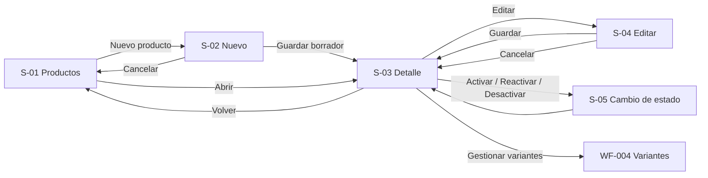

# WF-003 — Gestión de productos (CRUD principal)

> **Fuentes normativas:** `././specs/SPEC-003-gestion-productos-crud.md`, `././hu/HU-003-gestion-productos-crud.md`, `././api/openapi.yaml`, `././api/catalogo-errores.md`, `./DESIGN.md`, `./INDEX.md` y `WF-004-gestion-variantes-skus.md`.
>
> Ante contradicción funcional prevalece **SPEC → HU → WF**. Para rutas y schemas HTTP prevalece OpenAPI.
>
> Esta versión incorpora los **datos físicos del SKU vendible de productos simples**. Si el producto maneja variantes, el perfil físico se administra por variante en WF-004.

---

# 0. Instrucciones para el agente

Genera un wireframe detallado y navegable para el CRUD principal de productos.

Antes de producir el HTML:

1. consultar SPEC-003;
2. consultar HU-003;
3. consultar OpenAPI;
4. consultar DESIGN.md;
5. consultar INDEX.md;
6. consultar WF-004 únicamente para la separación del producto padre y sus variantes.

---

## 0.1. Reglas de producción

- Crear siempre en `BORRADOR`.
- Diferenciar **Guardar borrador** de **Activar producto**.
- Mantener visibles:
  - nombre;
  - SKU base;
  - categoría;
  - tipo;
  - marca;
  - manejo de variantes;
  - estado.
- No mostrar nombres técnicos de campos al usuario como:
  - `categoria_id`;
  - `tipo_producto_id`;
  - `marca_id`;
  - `product_id`;
  - `pesoKg`;
  - `largoCm`;
  - `on_hand`;
  - `stock_version`.
- SKU es un término operacional permitido.
- Para producto simple, mostrar:
  - Peso (kg);
  - Largo (cm);
  - Ancho (cm);
  - Alto (cm).
- Para producto con variantes:
  - no mostrar campos físicos del padre;
  - mostrar texto explicativo;
  - ofrecer **Gestionar variantes** en detalle.
- No agregar:
  - tipo de empaque;
  - cantidad de paquetes;
  - volumen logístico final;
  - controles de stock;
  - controles de reserva;
  - edición de precio posterior.
- El perfil físico puede estar:
  - Completo;
  - Incompleto;
  - Sin registrar.
- No usar cero para representar “sin dato”.
- Datos físicos no bloquean por sí solos activación en esta versión.
- `tiene_variantes` se define al crear.
- En edición se representa como información de solo lectura.
- SKU base se representa como inmutable en edición.
- El precio base se captura en creación y es informativo posteriormente.
- No mostrar endpoints, eventos, scopes ni códigos técnicos como `TOKEN_INVALIDO`/`SCOPE_INSUFICIENTE` en el HTML.
- Traducir 401/403 a estados operativos de sesión/acceso, conservando el código solo para lógica interna.
- Cumplir DESIGN.md:
  - blanco/grises;
  - sin sombras;
  - bordes;
  - responsive;
  - mínimo 44×44;
  - accesibilidad.

---

## 0.2. Entregable HTML

Ruta:

```text
./prototipos/WF-003-gestion-productos-crud/index.html
```

Debe:

- funcionar sin compilación;
- usar HTML/CSS/JS estáticos;
- no consumir APIs;
- ser navegable;
- representar carga, vacío, error, validación, permisos, sesión y conflicto;
- conservar datos ante errores;
- poder recorrerse con teclado.

---

# 1. Metadatos

| Campo | Valor |
|---|---|
| ID | WF-003 |
| Nombre | Gestión de productos (CRUD principal) |
| Versión | **0.7** |
| Estado | Actualizado |
| Responsable | Gabriel Poma Gutierrez |
| Rama | `poma` |
| Fecha inicial | 2026-09-17 |
| Última actualización | 2026-09-28 |

---

# 2. Objetivo

Permitir al gestor:

1. consultar productos;
2. crear borradores;
3. editar datos permitidos;
4. completar información de publicación;
5. administrar datos físicos del SKU cuando el producto sea simple;
6. activar;
7. desactivar;
8. reactivar.

---

# 3. Usuario objetivo

| Aspecto | Definición |
|---|---|
| Persona | Gestor comercial |
| Contexto | Backoffice |
| Nivel | Intermedio |
| Dispositivo | Escritorio, con soporte tablet/móvil |
| Administra | Información de Catálogo |
| No administra | Stock, reservas, empaque, precios posteriores |

---

# 4. Precondiciones

- sesión válida;
- permisos;
- catálogos maestros disponibles;
- para activar, dependencias funcionales preparadas.

---

# 5. Pantallas

| ID | Pantalla | Propósito |
|---|---|---|
| S-01 | Productos | Listar y filtrar |
| S-01-L | Cargando | Estado inicial |
| S-01-V | Vacío | Sin productos |
| S-01-F | Sin resultados | Filtros |
| S-01-E | Error | Recuperación |
| S-02 | Nuevo producto | Crear BORRADOR |
| S-02-E | Errores | Validación |
| S-03 | Detalle | Consultar y cambiar estado |
| S-04 | Editar | Modificar campos permitidos |
| S-05 | Activar/reactivar/desactivar | Confirmación |
| S-06 | Sin permisos/sesión | Seguridad |
| S-07 | Conflicto | Dato desactualizado |

---

# 6. Mapa de navegación



---

# 7. S-01 — Listado

## Columnas escritorio

| Columna | Contenido |
|---|---|
| Producto | Nombre |
| SKU base | Código |
| Categoría | Nombre |
| Tipo de producto | Nombre |
| Marca | Nombre |
| Modelo | Simple / Con variantes |
| Estado | Borrador / Activo / Inactivo |
| Acción | Ver / Editar |

No mostrar IDs internos.

Filtros:

- categoría;
- marca;
- estado.

Estados:

- carga;
- vacío;
- sin resultados;
- error.

---

# 8. Flujo de creación

1. pulsar **Nuevo producto**;
2. completar datos mínimos;
3. elegir si es simple o con variantes;
4. completar opcionalmente características e imágenes;
5. si es simple, poder completar datos físicos;
6. guardar;
7. validar SKU duplicado;
8. advertir nombre+marca duplicados;
9. crear BORRADOR;
10. mostrar detalle.

---

# 9. S-02 — Nuevo producto

## 9.1. Secciones

```text
1. Datos generales
2. Clasificación
3. Modelo de venta
4. Características
5. Imágenes
6. Datos físicos (solo simple)
7. Acciones
```

---

## 9.2. Datos generales

Campos:

- Nombre del producto;
- Descripción;
- SKU base;
- Precio base inicial.

Ayuda de SKU:

> Para un producto simple, este SKU identifica directamente la unidad vendible.

No mostrar “clave primaria” ni IDs.

---

## 9.3. Clasificación

Campos:

- Categoría;
- Tipo de producto;
- Marca.

Copy:

> El tipo de producto define las características que podrás completar.

No usar “tipo_producto_id”.

---

## 9.4. Modelo de venta

Opciones:

### Producto simple

> Se vende directamente mediante su SKU base.

### Producto con variantes

> Las unidades vendibles se crean como variantes, por ejemplo talla o color.

La elección es obligatoria.

---

# 10. Datos físicos en producto simple

Cuando el usuario elige **Producto simple**, mostrar una sección:

```text
Datos físicos para despacho
```

Ayuda:

> Registra el peso y las dimensiones propias de esta unidad. El empaque se define durante el despacho.

Campos:

| Campo | Unidad | Regla |
|---|---|---|
| Peso | kg | > 0 cuando se informa |
| Largo | cm | > 0 cuando se informa |
| Ancho | cm | > 0 cuando se informa |
| Alto | cm | > 0 cuando se informa |

Reglas UI:

- no selector de unidad;
- unidades fijas visibles;
- aceptar decimales;
- vacío significa “sin registrar”;
- no precargar cero;
- si hay algunos valores pero faltan otros:
  - mostrar **Datos físicos incompletos**;
  - permitir guardar BORRADOR;
- no bloquear activación automáticamente por este motivo.

---

# 11. Producto con variantes en formulario

Cuando se elige **Producto con variantes**:

- ocultar campos físicos del producto padre;
- mostrar:

> Los datos físicos se registran para cada variante, porque cada SKU puede tener medidas diferentes.

No ofrecer “peso general” como fallback del padre.

---

# 12. Características

El formulario carga las características asociadas al tipo.

- obligatorias se identifican como tales;
- opcionales permanecen opcionales;
- para guardar BORRADOR pueden faltar;
- para activar se validan las obligatorias.

Evitar el título “Atributos técnicos”.

Usar:

```text
Características del producto
```

---

# 13. Imágenes

- opcionales para guardar BORRADOR;
- al menos una para activar;
- selector accesible;
- no mostrar ruta local completa;
- conservar imagen anterior hasta guardar una sustitución.

---

# 14. Posible duplicado

## SKU

Error bloqueante:

> Este SKU base ya está en uso.

## Nombre + marca

Advertencia:

> Ya existe un producto con este nombre y marca. Confirma si se trata de una referencia diferente.

Permitir continuar.

---

# 15. S-03 — Detalle

Encabezado:

- nombre;
- SKU;
- estado;
- activar/reactivar;
- editar;
- desactivar.

Secciones:

1. Información del producto.
2. Características.
3. Imágenes.
4. Datos físicos o Variantes.
5. Requisitos de activación.
6. Estado de preparación de Pricing e Inventario.
7. Información administrativa no técnica.

---

# 16. Detalle de producto simple

Mostrar:

```text
Datos físicos para despacho
```

Ejemplo:

```text
Peso    0.42 kg
Largo   8 cm
Ancho   8 cm
Alto    27 cm
```

Estado:

```text
Completo
Incompleto
Sin registrar
```

Ayuda:

> Estas medidas describen el producto. El empaque final se define durante el despacho.

Si falta un valor, mostrar:

```text
No registrado
```

No mostrar `0`.

---

# 17. Detalle de producto con variantes

No mostrar perfil físico del padre.

Mostrar:

```text
Variantes del producto
```

con:

- número de variantes activas;
- acción **Gestionar variantes**;
- ayuda:

> El peso y las dimensiones se mantienen por variante.

---

# 18. S-04 — Editar

## Datos inmutables como información

- SKU base;
- modelo simple/con variantes;
- tipo si ya no puede migrarse ordinariamente.

No usar controles deshabilitados ambiguos cuando convenga texto de solo lectura.

## Producto simple

Permite editar:

- datos generales autorizados;
- características;
- imágenes;
- Peso;
- Largo;
- Ancho;
- Alto.

## Producto con variantes

No muestra perfil físico del padre.

---

# 19. Validaciones físicas

| Caso | Mensaje |
|---|---|
| Peso <= 0 | Ingresa un peso mayor que 0. |
| Largo <= 0 | Ingresa un largo mayor que 0. |
| Ancho <= 0 | Ingresa un ancho mayor que 0. |
| Alto <= 0 | Ingresa un alto mayor que 0. |
| Perfil parcial | Los datos físicos están incompletos. Puedes completarlos después. |

---

# 20. Activación/reactivación

Lista de requisitos:

- categoría disponible;
- tipo disponible;
- marca disponible;
- características obligatorias;
- imagen;
- Pricing preparado;
- Inventario inicializado;
- variante activa si aplica.

Para producto simple, la UI puede informar:

```text
Datos físicos: completos / pendientes
```

pero no incluirlos dentro de la lista bloqueante de activación.

---

# 21. Desactivación

Copy:

> El producto dejará de estar disponible para nuevas ventas. Su información y los pedidos históricos se conservarán.

No sugerir borrado físico.

---

# 22. Datos físicos y Despacho

WF-003 no agrega botones como:

```text
Enviar a despacho
Calcular empaque
Generar paquete
Calcular volumen logístico
```

Mantener peso y dimensiones es suficiente desde Catálogo.

La consulta sistema-a-sistema ocurre fuera de esta interfaz.

---

# 23. Estados

| Estado | Representación |
|---|---|
| Cargando | Skeleton |
| Vacío | Mensaje + Nuevo producto |
| Sin resultados | Mensaje + Limpiar filtros |
| Error | Mensaje + Reintentar |
| Validación | Resumen + campo |
| Posible duplicado | Diálogo de advertencia |
| Físico incompleto | Aviso no bloqueante |
| Sin permisos | Acceso restringido |
| Sesión expirada | Reautenticación |
| Conflicto | Recargar |
| Éxito | Confirmación |

---

# 23.1. S-06 — Sesión y permisos

La interfaz distingue dos casos sin exponer códigos técnicos al usuario:

| Respuesta de integración | Estado visual | Copy recomendado |
|---|---|---|
| `401 TOKEN_INVALIDO` | Sesión no utilizable / expirada | **Tu sesión expiró. Inicia sesión nuevamente para continuar.** |
| `403 SCOPE_INSUFICIENTE` | Acceso restringido | **No tienes permiso para realizar esta acción.** |

Reglas:

- no mostrar `TOKEN_INVALIDO`;
- no mostrar `SCOPE_INSUFICIENTE`;
- no revelar el scope/permiso exacto faltante;
- no perder silenciosamente cambios locales sin avisar;
- una respuesta 403 no debe presentarse como “sesión expirada”;
- una respuesta 401 no debe presentarse como un problema de rol;
- no ejecutar ni simular como exitosa una mutación rechazada.

Estos estados ya existen en el prototipo actual como:

```text
#session-expired
#no-permission
```

por lo que la normalización de códigos no exige un rediseño visual del HTML.

---

# 24. Responsive

| Elemento | Escritorio | Tablet | Móvil |
|---|---|---|---|
| Listado | Tabla | Tabla compacta | Tarjetas |
| Formulario | 2–3 columnas | 2 columnas | 1 columna |
| Datos físicos | 4 columnas | 2×2 | Apilados |
| Acciones | Inline | Compactas | Ancho completo |
| Modal | Centrado | Centrado | Casi pantalla completa |

Mínimo:

```text
320 px
```

Sin scroll horizontal del body.

---

# 25. Accesibilidad

- WCAG 2.2 AA.
- Un `h1`.
- focus visible.
- labels persistentes.
- unidades visibles.
- errores asociados al campo.
- estados no dependen solo de color.
- modales con focus trap, Escape y retorno de foco.
- mensajes anunciados.
- selector de archivo accesible.

---

# 26. Tono visual

Seguir DESIGN.md:

- fondo blanco;
- neutrales;
- sin sombras;
- bordes 1 px;
- SKU monoespaciado;
- densidad operativa;
- evitar jerga de arquitectura.

---

# 27. Microcopy

| Contexto | Texto |
|---|---|
| Crear | Nuevo producto |
| Guardar | Guardar borrador |
| Simple | Se vende directamente mediante su SKU base. |
| Con variantes | Las unidades vendibles se administran como variantes. |
| Físico | Registra el peso y las dimensiones propias de esta unidad. |
| Empaque | El empaque se define durante el despacho. |
| Físico incompleto | Los datos físicos están incompletos. Puedes completarlos después. |
| SKU duplicado | Este SKU base ya está en uso. |
| Duplicado posible | Ya existe un producto con este nombre y marca. |
| Activación bloqueada | Revisa los requisitos pendientes antes de activar. |

---

# 28. Integraciones

| Componente | Impacto visible |
|---|---|
| Taxonomía | Selectores de clasificación y características |
| Pricing | Estado de preparación; sin edición posterior |
| Inventario | Estado de inicialización; sin editar cantidades |
| WF-004 | Gestionar variantes |
| Despacho | Ningún control manual; consume datos físicos por contrato |
| Seguridad | 401 `TOKEN_INVALIDO` → sesión; 403 `SCOPE_INSUFICIENTE` → acceso restringido; los códigos no se muestran al usuario |

---

# 29. Cobertura HU-003

| Criterios | Pantallas |
|---|---|
| CA-01–CA-08 | S-01/S-02/S-04 |
| CA-09–CA-13 | Modelo simple/variantes y activación |
| CA-14–CA-21 | Edición y ciclo de vida |
| CA-22–CA-28 | Datos físicos simples y separación con variantes |
| CA-29–CA-32 | Límite con Despacho |
| CA-33–CA-35 | Trazabilidad, barreras y exposición comercial |
| CA-36–CA-38 | Autenticación/autorización y retiro de `SIN_AUTORIZACION` |

---

# 30. Criterios de aceptación del wireframe
- crear siempre como borrador;
- diferenciar guardar de activar;
- SKU duplicado es bloqueante;
- nombre+marca es advertencia;
- muestra categoría/tipo/marca sin IDs técnicos;
- distingue simple y con variantes;
- simple muestra Peso/Largo/Ancho/Alto;
- muestra kg y cm;
- no precarga cero;
- permite perfil incompleto en borrador;
- perfil físico no bloquea activación por sí solo;
- con variantes no muestra físico del padre;
- enlaza WF-004;
- no permite editar stock;
- no permite editar precio posterior;
- no incluye empaque;
- incluye activación/desactivación/reactivación;
- incluye estados alternativos;
- diferencia sesión inválida de permisos insuficientes;
- no muestra códigos técnicos de Seguridad al usuario;
- cumple DESIGN.md;
- es responsive y accesible.
