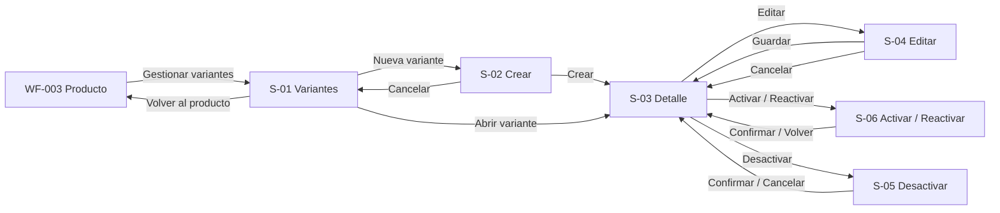

# WF-004 — Gestión avanzada de variantes (SKUs)

> **Fuentes normativas:** `././specs/SPEC-004-gestion-variantes-skus.md`, `././hu/HU-004-gestion-variantes-skus.md`, `././api/openapi.yaml`, `././api/catalogo-errores.md`, `./DESIGN.md`, `./INDEX.md` y `WF-003-gestion-productos-crud.md`.
>
> Ante contradicción funcional prevalece **SPEC → HU → WF**. Para rutas, requests, responses y códigos HTTP prevalece `api/openapi.yaml`.
>
> Esta versión incorpora el **perfil físico por SKU** requerido para la integración con Despacho. Productos y Ofertas administra el peso y dimensiones intrínsecas del SKU; **Despacho administra el empaque, la agrupación, la cantidad de paquetes y el volumen logístico final**.

---

## 0. Instrucciones para el agente

Genera un wireframe detallado, anotado y navegable para la gestión avanzada de variantes y SKUs.

Antes de diseñar:

1. Consulta `././specs/SPEC-004-gestion-variantes-skus.md`.
2. Consulta `././hu/HU-004-gestion-variantes-skus.md`.
3. Consulta `././api/openapi.yaml`.
4. Consulta `././api/catalogo-errores.md`.
5. Consulta `./DESIGN.md`.
6. Consulta `./INDEX.md`.
7. Consulta `WF-003-gestion-productos-crud.md`.
8. Usa este documento para la composición, navegación, interacción y estados.

### Prioridad documental

1. SPEC-004: reglas de negocio.
2. HU-004: criterios de aceptación y escenarios.
3. OpenAPI: interfaz HTTP publicada.
4. WF-004: comportamiento visible.
5. DESIGN.md: lenguaje visual.

---

## 0.1. Reglas de producción

- Este flujo aplica únicamente a productos con `tiene_variantes = true`.
- Para productos simples, mostrar un estado informativo y retornar a WF-003.
- Mantener visible el contexto del producto padre durante todo el flujo.
- Cada variante tiene:
  - una combinación identificadora;
  - SKU comercial;
  - imagen propia;
  - estado;
  - atributos no identificadores cuando correspondan;
  - perfil físico opcional mientras esté incompleto.
- El identificador interno de variante existe, pero **no debe mostrarse al usuario como un dato operativo**, porque no es un código comercial.
- El SKU sí es visible.
- El SKU puede ser informado al crear o generado por el sistema.
- SKU y atributos identificadores son inmutables en edición ordinaria.
- La imagen puede reemplazarse.
- Los atributos no identificadores pueden editarse.
- El perfil físico puede editarse sin cambiar la identidad de la variante.
- Los campos visibles del perfil físico son:
  - **Peso (kg)**;
  - **Largo (cm)**;
  - **Ancho (cm)**;
  - **Alto (cm)**.
- No mostrar nombres técnicos como:
  - `pesoKg`;
  - `largoCm`;
  - `anchoCm`;
  - `altoCm`;
  - `variant_id`;
  - `product_id`;
  - `tipo_producto_id`;
  - endpoints;
  - scopes;
  - códigos técnicos de Seguridad como `TOKEN_INVALIDO` o `SCOPE_INSUFICIENTE`;
  - nombres de eventos.
- No mostrar controles de:
  - stock;
  - reservas;
  - consumo;
  - precio;
  - empaque.
- Disponibilidad y precio, si se muestran, son informativos y de solo lectura.
- No mostrar `tipoEmpaque`, cantidad de paquetes ni dimensiones finales de envío.
- No convertir la consulta de Despacho en una acción manual del gestor.
- No usar fotografías reales; usar placeholders.
- No elegir librería de UI ni estrategia CSS.
- No consumir APIs reales.
- Las anotaciones A-xx pertenecen solo a esta documentación.
- Aplicar estrictamente DESIGN.md:
  - escala de grises;
  - sin sombras;
  - bordes;
  - responsive;
  - accesibilidad;
  - mínimo 44×44 px para controles táctiles.

---

## 0.2. Formato del prototipo

El prototipo debe:

- guardarse en `./prototipos/WF-004-gestion-variantes-skus/index.html`;
- usar `index.html` como entrada;
- funcionar sin compilación;
- utilizar HTML, CSS y JavaScript estáticos;
- no utilizar React;
- no depender de servicios externos;
- simular carga de imagen;
- permitir recorrer listado, creación, detalle, edición, activación/reactivación y desactivación;
- representar validaciones físicas;
- ser usable desde 320 px;
- conservar contexto y filtros al navegar.

---

# 1. Metadatos

| Campo | Valor |
|---|---|
| ID | `WF-004` |
| Nombre | Gestión avanzada de variantes (SKUs) |
| Versión | **0.6** |
| Estado | Actualizado |
| Responsable | Gabriel Poma Gutierrez |
| Rama | `poma` |
| Fecha inicial | 2026-09-17 |
| Última actualización | 2026-09-28 |

`WF-004` está confirmado en `wireframes/INDEX.md`.

---

# 2. Objetivo del flujo

Permitir que el gestor comercial pueda:

1. consultar las variantes de un producto;
2. crear una nueva combinación vendible;
3. mantener su imagen;
4. mantener atributos no identificadores;
5. registrar y corregir peso y dimensiones;
6. activar, reactivar o desactivar la variante;
7. comprender qué datos pertenecen a Catálogo y cuáles son administrados por otros componentes.

El usuario no necesita conocer la identidad técnica interna utilizada por backend.

---

# 3. Usuario objetivo

| Aspecto | Definición |
|---|---|
| Persona | Gestor comercial |
| Contexto | Backoffice del módulo Productos y Ofertas |
| Nivel técnico | Intermedio |
| Necesidad | Mantener variantes vendibles correctamente identificadas y descritas |
| Operaciones | Crear, consultar, editar, activar/reactivar, desactivar |
| No administra | Stock, reservas, precios, empaque |
| Dispositivo principal | Escritorio |
| Secundarios | Tablet y móvil para consulta/edición puntual |

---

# 4. Alcance visible

Incluye:

- listado de variantes;
- filtros;
- creación;
- SKU opcional/autogenerado;
- combinación identificadora;
- imagen;
- atributos no identificadores;
- peso;
- dimensiones;
- detalle;
- edición;
- activación/reactivación;
- desactivación;
- estados de error y permisos.

Fuera de alcance:

- productos simples;
- edición de stock;
- edición de precio;
- promociones;
- combos;
- reservas;
- pedidos;
- empaque;
- cantidad de paquetes;
- volumen final del despacho;
- rutas o capacidades de transporte.

---

# 5. Precondiciones

- Sesión válida.
- Permisos de gestión de variantes.
- Producto existente.
- Producto con variantes habilitadas.
- Características identificadoras configuradas antes de la primera variante.
- Producto con contexto suficiente para la creación.
- Catálogos auxiliares disponibles.

---

# 6. Puntos de entrada

Desde WF-003:

```text
Detalle del producto
    -> Gestionar variantes
```

Rutas de interfaz propuestas:

```text
/productos/:productoId/variantes
/productos/:productoId/variantes/nueva
/productos/:productoId/variantes/:variante
```

Estas rutas son de frontend y no sustituyen al contrato REST.

---

# 7. Inventario de pantallas

| ID | Pantalla / variante | Propósito | Obligatoria |
|---|---|---|---|
| `S-01` | Variantes del producto | Consultar y filtrar | Sí |
| `S-01-L` | Cargando | Estado inicial | Sí |
| `S-01-V` | Sin variantes | Vacío válido | Sí |
| `S-01-F` | Sin resultados | Filtros sin coincidencias | Sí |
| `S-01-E` | Error de consulta | Recuperación | Sí |
| `S-01-N` | Producto simple | Bloqueo de flujo | Sí |
| `S-02` | Crear variante | Alta de combinación | Sí |
| `S-02-D` | Duplicado / colisión | Conflicto recuperable | Sí |
| `S-02-P` | Datos físicos incompletos | Advertencia no bloqueante | Sí |
| `S-03` | Detalle de variante | Consulta completa | Sí |
| `S-04` | Editar variante | Imagen, atributos y perfil físico | Sí |
| `S-04-E` | Error de edición | Recuperación | Sí |
| `S-05` | Desactivar variante | Confirmación | Sí |
| `S-06` | Activar / reactivar | Validar preparación | Sí |
| `S-07` | Sin permisos / sesión | Seguridad | Sí |

---

# 8. Mapa de navegación



---

# 9. Flujo A — Consultar variantes

1. El usuario entra desde un producto.
2. S-01 conserva nombre y SKU base del producto.
3. Se muestran variantes registradas.
4. Se puede filtrar por:
   - atributo identificador;
   - estado.
5. Cada variante muestra:
   - SKU;
   - combinación;
   - estado;
   - imagen placeholder;
   - resumen del perfil físico.
6. El usuario puede:
   - abrir detalle;
   - crear una variante.

---

# 10. S-01 — Variantes del producto

## 10.1. Jerarquía

1. Producto padre.
2. Acción **Nueva variante**.
3. Filtros.
4. Listado.
5. Estado operativo.

---

## 10.2. Encabezado

Contenido visible:

```text
Variantes del producto

Zapatillas Running ProSpeed X
SKU base: ZAP-PSX

[Nueva variante]
```

No mostrar IDs internos.

---

## 10.3. Filtros

- Estado:
  - Todos;
  - Borrador;
  - Activa;
  - Inactiva.
- Características identificadoras según producto.
- Búsqueda por SKU.

---

## 10.4. Listado

En escritorio:

| Columna | Contenido |
|---|---|
| Variante | Imagen placeholder + combinación |
| SKU | Código comercial |
| Estado | Borrador / Activa / Inactiva |
| Datos físicos | Completo / Incompleto / Sin registrar |
| Acción | Ver detalle |

No se muestran:

- stock;
- precio editable;
- empaque;
- IDs internos.

---

## 10.5. Datos físicos en listado

Mostrar únicamente un resumen de estado:

```text
Completo
Incompleto
Sin registrar
```

No llenar la tabla con cuatro medidas si eso perjudica la lectura.

El detalle de valores vive en S-03.

---

## 10.6. Anotaciones

| ID | Elemento | Regla |
|---|---|---|
| A-01 | Producto padre | Mantener siempre contexto |
| A-02 | SKU | Código comercial visible |
| A-03 | Combinación | Define la identidad comercial |
| A-04 | Datos físicos | Resumen del perfil, no empaque |
| A-05 | Estado | No depende del color |

---

# 11. Estados alternativos de S-01

## S-01-V — Sin variantes

Copy:

> Este producto todavía no tiene variantes.

Acción:

```text
Crear primera variante
```

Añadir:

> El producto necesitará al menos una variante activa para ofrecerse mediante sus variantes.

---

## S-01-F — Sin resultados

Copy:

> No se encontraron variantes con los filtros aplicados.

Acción:

```text
Limpiar filtros
```

---

## S-01-E — Error

Copy:

> No pudimos cargar las variantes. Intenta nuevamente.

Acción:

```text
Reintentar
```

---

## S-01-N — Producto simple

Título:

```text
Este producto no maneja variantes
```

Texto:

> Este producto se vende directamente mediante su SKU principal. Vuelve al producto para administrar su información.

Acción:

```text
Volver al producto
```

No mostrar **Nueva variante**.

---

# 12. Flujo B — Crear variante

1. El usuario pulsa **Nueva variante**.
2. S-02 muestra contexto del producto.
3. Selecciona un valor para cada característica identificadora.
4. Agrega imagen propia.
5. Opcionalmente ingresa SKU comercial.
6. Puede registrar el perfil físico.
7. Guarda.
8. Catálogo valida combinación y SKU.
9. La variante se crea en `BORRADOR`.
10. Se muestra confirmación y detalle.

---

# 13. S-02 — Crear variante

## 13.1. Secciones

```text
1. Identidad de la variante
2. Imagen
3. Datos adicionales
4. Datos físicos para despacho
5. SKU comercial
6. Acciones
```

---

## 13.2. Identidad

Un selector por cada característica identificadora configurada.

Ejemplo:

```text
Talla
[42]

Color
[Negro]
```

Texto auxiliar:

> Estos valores identifican la variante y no podrán modificarse después de crearla.

---

## 13.3. Imagen

- placeholder;
- seleccionar archivo;
- previsualización simulada;
- reemplazar antes de guardar;
- error de archivo.

Copy:

```text
Imagen de la variante
```

No mostrar ruta local completa.

---

## 13.4. SKU

Etiqueta:

```text
SKU comercial
```

Placeholder:

```text
Opcional
```

Ayuda:

> Ingresa un SKU comercial o déjalo vacío para que el sistema genere uno.

No mostrar `variant_id`.

---

# 14. Datos físicos en creación

## 14.1. Sección

Título:

```text
Datos físicos para despacho
```

Texto auxiliar:

> Registra el peso y las dimensiones propias de esta unidad. El empaque se define posteriormente en el proceso de despacho.

Campos:

| Campo visible | Unidad | Validación |
|---|---|---|
| Peso | kg | Mayor que 0 |
| Largo | cm | Mayor que 0 |
| Ancho | cm | Mayor que 0 |
| Alto | cm | Mayor que 0 |

No incluir selector de unidad.

Las unidades son fijas y visibles junto al campo.

---

## 14.2. Completitud

Los datos físicos pueden quedar sin registrar mientras la variante está siendo preparada.

Si el usuario registra solo parte de los datos, mostrar aviso:

> Los datos físicos están incompletos. Podrás completar esta información después.

No inventar:

```text
0 kg
0 cm
```

como valores por defecto.

No bloquear automáticamente la activación únicamente por este motivo, porque esa regla no está definida en SPEC-004.

---

## 14.3. Copy prohibido

No mostrar:

```text
pesoKg
largoCm
anchoCm
altoCm
perfil SKU
payload
Despacho API
```

Usar lenguaje operativo.

---

## 14.4. Anotaciones

| ID | Elemento | Regla |
|---|---|---|
| A-06 | Peso | Propiedad física propia del SKU |
| A-07 | Dimensiones | Propiedades intrínsecas, no dimensiones del paquete |
| A-08 | Unidades | kg y cm fijos |
| A-09 | Incompleto | No inventar valores |
| A-10 | Empaque | No pertenece a Productos |

---

# 15. Validaciones de S-02

| Caso | Mensaje visible |
|---|---|
| Valor identificador faltante | “Selecciona un valor para {atributo}.” |
| Imagen faltante | “Agrega una imagen para esta variante.” |
| Combinación repetida | “Ya existe una variante con esta combinación.” |
| SKU duplicado | “El SKU ingresado ya está en uso.” |
| SKU inválido | “Revisa el formato del SKU.” |
| Peso <= 0 | “Ingresa un peso mayor que 0.” |
| Largo <= 0 | “Ingresa un largo mayor que 0.” |
| Ancho <= 0 | “Ingresa un ancho mayor que 0.” |
| Alto <= 0 | “Ingresa un alto mayor que 0.” |
| Perfil parcialmente cargado | Aviso no bloqueante de datos incompletos |

No mostrar códigos internos de error en la interfaz.

---

# 16. S-02-D — Duplicado o colisión

Distinguir:

## Combinación duplicada

> Ya existe una variante con esta combinación.

Resaltar los selectores de identidad.

## SKU duplicado

> El SKU ingresado ya está en uso.

Mantener:

- combinación;
- imagen;
- datos físicos;
- atributos capturados.

Permitir corregir solo el SKU.

---

# 17. Creación exitosa

Después de guardar:

```text
Variante creada

SKU: ZAP-PSX-42-NEG
Estado: Borrador
```

No mostrar el identificador interno.

Acciones:

```text
Ver variante
Crear otra variante
Volver al listado
```

Si los datos físicos están incompletos, puede mostrarse:

```text
Datos físicos: Incompletos
```

como recordatorio operacional, no como error de creación.

---

# 18. S-03 — Detalle de variante

## 18.1. Encabezado

Mostrar:

```text
Zapatillas Running ProSpeed X
Talla 42 · Negro
SKU ZAP-PSX-42-NEG
Estado: Borrador
```

Acciones según estado:

```text
Editar
Activar
Reactivar
Desactivar
Volver
```

No mostrar `variant_id`.

---

## 18.2. Secciones

### Identidad

- SKU;
- Talla;
- Color;
- demás identificadores.

Solo lectura.

### Imagen

Placeholder propio.

### Otros atributos

Solo lectura.

### Datos físicos

Mostrar:

```text
Peso        1.40 kg
Largo       35 cm
Ancho       22 cm
Alto        13 cm
```

Si está incompleto:

```text
Datos físicos incompletos
```

y solo mostrar los valores realmente registrados.

### Información comercial

Opcional, de solo lectura:

- estado;
- disponibilidad cuando la integración esté disponible;
- precio cuando corresponda.

No debe poder editarse desde aquí.

---

## 18.3. Explicación logística

Si se necesita ayuda contextual:

> Estas medidas describen el producto. El empaque y las dimensiones finales del envío se definen durante el despacho.

No usar una caja editable ni un campo “Tipo de empaque”.

---

## 18.4. Anotaciones

| ID | Elemento | Regla |
|---|---|---|
| A-11 | SKU | Identidad comercial |
| A-12 | Identificadores | Inmutables |
| A-13 | Datos físicos | Editables sin cambiar identidad |
| A-14 | Precio | Solo lectura |
| A-15 | Disponibilidad | Inventario es la fuente |
| A-16 | Empaque | Fuera del dominio |

---

# 19. Flujo C — Editar variante

1. Desde S-03 selecciona **Editar**.
2. S-04 muestra identidad bloqueada.
3. Puede cambiar:
   - imagen;
   - atributos no identificadores;
   - peso;
   - dimensiones.
4. Guarda.
5. La identidad comercial se conserva.
6. S-03 refleja los cambios.

---

# 20. S-04 — Editar variante

## 20.1. Datos de solo lectura

Mostrar como texto, no como inputs ambiguamente deshabilitados:

```text
SKU
Talla
Color
```

Ayuda:

> Para cambiar los datos que identifican esta variante, desactívala y crea una nueva.

---

## 20.2. Datos editables

- imagen;
- atributos no identificadores;
- Peso (kg);
- Largo (cm);
- Ancho (cm);
- Alto (cm).

---

## 20.3. Actualización de datos físicos

Al editar:

- conservar el perfil vigente hasta que el guardado tenga éxito;
- si un valor nuevo es inválido, no destruir el anterior;
- mostrar error junto al campo;
- no cambiar SKU.

Ejemplo:

```text
Peso actual: 1.40 kg
Nuevo peso: 1.35 kg
```

Resultado exitoso:

```text
Datos físicos actualizados
```

---

# 21. S-04-E — Error de edición

## Archivo inválido

La imagen vigente sigue visible.

## Error físico

Ejemplo:

> El alto debe ser mayor que 0.

Los demás valores no se pierden.

## Fallo de guardado

> No pudimos guardar los cambios. Revisa tu conexión e intenta nuevamente.

No asumir que el cambio se aplicó.

---

# 22. S-06 — Activar o reactivar

Disponible para:

```text
BORRADOR
INACTIVA
```

Mostrar lista de comprobaciones:

- SKU válido;
- combinación válida;
- imagen válida;
- producto padre compatible;
- precio preparado;
- inventario inicializado.

El perfil físico puede mostrarse como:

```text
Datos físicos completos
```

o:

```text
Datos físicos pendientes
```

pero **no debe bloquear la acción por sí solo** en esta versión.

Si el producto padre no está activo:

> La variante puede quedar activa, pero no se ofrecerá para nuevas ventas hasta que el producto padre esté activo.

---

# 23. S-05 — Desactivar variante

Título:

```text
Desactivar variante ZAP-PSX-42-NEG
```

Mensaje:

> La variante dejará de estar disponible para nuevas ventas. Su información e historial se conservarán.

Si es la última activa:

> Esta es la última variante activa. Al desactivarla, el producto también quedará inactivo.

Acciones:

```text
Cancelar
Desactivar variante
```

No eliminar perfil físico ni histórico.

---

# 24. Integración con Despacho: impacto visual

La consulta de datos físicos desde Despacho ocurre sistema-a-sistema.

Por ello, WF-004 **no debe** agregar botones como:

```text
Enviar a despacho
Consultar despacho
Calcular empaque
Calcular volumen
```

La responsabilidad del gestor termina al mantener correctamente:

```text
Peso
Largo
Ancho
Alto
```

---

# 25. Estados de interfaz

| Estado | Representación | Recuperación |
|---|---|---|
| Cargando | Skeleton | Esperar |
| Con datos | Listado / detalle | Operar |
| Vacío | CTA de primera variante | Crear |
| Sin resultados | Mensaje + limpiar filtros | Limpiar |
| Error de carga | Mensaje + reintentar | Reintentar |
| Validación | Errores junto a campos | Corregir |
| Combinación duplicada | Error de identidad | Cambiar combinación |
| SKU duplicado | Error junto a SKU | Corregir SKU |
| Imagen inválida | Error específico | Elegir otra |
| Datos físicos inválidos | Error específico | Corregir |
| Datos físicos incompletos | Aviso no bloqueante | Completar después |
| Guardando | Acciones bloqueadas | Esperar |
| Sin conexión | Guardado no confirmado | Reintentar |
| Sin permisos | Acceso restringido | Volver |
| Sesión expirada | Reautenticación | Retornar al contexto |
| Conflicto | Datos cambiaron | Recargar |
| Éxito | Confirmación | Continuar |

---

# 25.1. Sesión y permisos

La interfaz diferencia autenticación de autorización sin exponer códigos técnicos:

| Contrato técnico | Estado visual | Copy |
|---|---|---|
| `401 TOKEN_INVALIDO` | Sesión no utilizable / expirada | **Tu sesión expiró. Inicia sesión nuevamente para continuar.** |
| `403 SCOPE_INSUFICIENTE` | Acceso restringido | **No tienes permiso para realizar esta acción.** |

Reglas:

- no mostrar `TOKEN_INVALIDO`;
- no mostrar `SCOPE_INSUFICIENTE`;
- no mostrar `SIN_AUTORIZACION`;
- no revelar el permiso/scope exacto faltante;
- una respuesta 401 no debe presentarse como falta de rol;
- una respuesta 403 no debe presentarse como sesión expirada;
- ninguna mutación rechazada debe representarse como exitosa.

El prototipo actual ya representa ambos estados mediante:

```text
#session-expired
#no-permission
```

por lo que esta normalización contractual no requiere nuevos controles ni cambios de copy en el HTML.

---

# 26. Comportamiento responsive

| Aspecto | Escritorio | Tablet | Móvil |
|---|---|---|---|
| Grid | 12 columnas | 8 columnas | 4 columnas |
| Listado | Tabla | Tabla compacta/tarjetas | Tarjetas |
| Formulario | Secciones de 2–4 columnas | 2 columnas | 1 columna |
| Perfil físico | 4 campos alineados | 2×2 | Apilados |
| Imagen | Lateral cuando haya espacio | Superior/lateral | Superior |
| Acciones | Inline | Compactas | Ancho completo |
| Modales | Centrados | Centrados | Casi pantalla completa |

En móvil nunca ocultar:

- SKU;
- combinación;
- estado.

Los cuatro datos físicos pueden agruparse en un bloque expandible en detalle si hace falta, pero deben seguir siendo accesibles.

---

# 27. Accesibilidad

- WCAG 2.2 AA.
- Un `h1`.
- Focus visible.
- Labels persistentes.
- Unidades visibles en el label o junto al input.
- Errores asociados mediante texto.
- No depender del color para estados.
- Imagen no debe ser la única forma de reconocer una variante.
- Diálogos con focus trap y retorno de foco.
- Selector de archivo operable con teclado.
- Mensajes de éxito/error anunciados mediante `aria-live`.
- No usar placeholders como sustituto de labels.

---

# 28. Tono visual

Seguir DESIGN.md:

- fondo blanco;
- escala neutral;
- sin sombras;
- bordes de 1 px;
- contenedores simples;
- tipografía Inter/system;
- SKU puede usar tipografía monoespaciada;
- datos físicos se presentan como datos operativos, no como una ficha logística compleja.

---

# 29. Microcopy

| Contexto | Texto |
|---|---|
| Acción primaria | Crear variante |
| SKU opcional | Ingresa un SKU comercial o déjalo vacío para que el sistema genere uno. |
| Identidad | Estos valores identifican la variante y no podrán modificarse después. |
| Datos físicos | Registra el peso y las dimensiones propias de esta unidad. |
| Ayuda logística | El empaque se define posteriormente durante el despacho. |
| Perfil incompleto | Los datos físicos están incompletos. Puedes completarlos después. |
| Peso inválido | Ingresa un peso mayor que 0. |
| Dimensión inválida | Ingresa un valor mayor que 0. |
| Duplicado | Ya existe una variante con esta combinación. |
| SKU duplicado | El SKU ingresado ya está en uso. |
| Edición identidad | Para cambiar estos valores, desactiva esta variante y crea una nueva. |

---

# 30. Restricciones técnicas relevantes

Aplicación productiva:

```text
React
TypeScript
Vite
React Router
TanStack Query
React Hook Form
Zod
```

El wireframe no prescribe componentes concretos.

Para los campos físicos:

- utilizar tipo numérico;
- conservar decimales;
- no convertir unidades en la UI;
- enviar/recibir conforme al contrato HTTP;
- validar también en backend.

No usar `float` de manera que introduzca errores de negocio en persistencia.

---

# 31. Dependencias e integración

| Componente | Relación | Impacto en WF |
|---|---|---|
| Productos WF-003 | Producto padre | Contexto y acceso |
| Características | Identificadores | Selectores |
| Inventario | Inicialización/disponibilidad | Solo lectura; no editar |
| Pricing | Precio | Solo lectura |
| Bulk | Creación masiva | Mismas reglas de identidad |
| Despacho | Consume datos físicos | No genera controles adicionales |
| Seguridad | 401 `TOKEN_INVALIDO` → sesión; 403 `SCOPE_INSUFICIENTE` → acceso restringido | Códigos técnicos no visibles; mutaciones no autorizadas no se simulan como exitosas |

---

# 32. Cobertura HU-004

| Criterios | Cobertura |
|---|---|
| CA-01–CA-06 | Permisos, contexto e identidad en S-01/S-02 |
| CA-07–CA-13 | SKU, imagen e inmutabilidad en S-02/S-04 |
| CA-14–CA-19 | Ciclo de vida en S-03/S-05/S-06 |
| CA-20–CA-21 | Límites con Inventario/Pricing |
| CA-22–CA-28 | Perfil físico en S-02/S-03/S-04 |
| CA-29–CA-32 | Delimitación visual con Despacho |
| CA-33–CA-37 | Trazabilidad, snapshots y Bulk como reglas no visuales |
| CA-38–CA-40 | Autenticación/autorización y retiro de `SIN_AUTORIZACION` |

---

# 33. Criterios de aceptación del wireframe
- conserva contexto del producto;
- impide creación en productos simples;
- permite listar/filtrar variantes;
- creación usa atributos identificadores;
- permite SKU opcional/autogenerado;
- no muestra el identificador interno al usuario;
- exige imagen;
- distingue combinación duplicada de SKU duplicado;
- mantiene identidad inmutable en edición;
- permite editar imagen y atributos no identificadores;
- incorpora Peso/Largo/Ancho/Alto;
- muestra kg y cm;
- valida valores mayores a cero;
- contempla datos físicos incompletos sin inventar cero;
- no convierte perfil físico en requisito automático de activación;
- no contiene campos de empaque;
- no permite editar stock ni precio;
- contempla activar/reactivar/desactivar;
- contempla errores, permisos y conflictos;
- diferencia sesión inválida de permisos insuficientes;
- no muestra códigos técnicos de Seguridad al usuario;
- cumple responsive;
- cumple DESIGN.md;
- no filtra términos técnicos en la interfaz.

---

# 34. Supuestos

| ID | Supuesto | Estado |
|---|---|---|
| SUP-01 | Gestión de variantes inicia desde WF-003 | Confirmado por diseño actual |
| SUP-02 | Nueva variante inicia en BORRADOR | Confirmado |
| SUP-03 | Perfil físico puede completarse posteriormente | Confirmado por SPEC-004 |
| SUP-04 | Perfil físico no bloquea activación por sí mismo | Confirmado en SPEC-004 actual |
| SUP-05 | Los datos físicos son por SKU y no por producto padre | Confirmado |
| SUP-06 | Despacho define el empaque | Confirmado |
