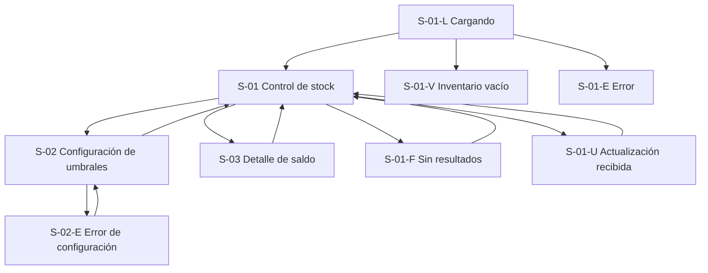

# WF-015 — Control de stock y disponibilidad

> **Fuentes normativas:** `././specs/SPEC-015-control-stock-disponibilidad.md`, `././hu/HU-015-control-stock-disponibilidad.md`, `././api/openapi.yaml`, `././asyncapi/asyncapi.yaml`, `././api/catalogo-errores.md`, `./DESIGN.md` y `./INDEX.md`.
>
> Ante contradicción funcional prevalece **SPEC → HU → WF**. Para rutas, requests, responses y códigos HTTP prevalece `api/openapi.yaml`.
>
> El flujo de inventario ya está definido: **Ventas/Postventa reserva cuando el pedido entra en `CREADO`, confirma el consumo cuando pasa a `PAGADO` y libera ante `PAGO_NO_COMPLETADO` o anulación aplicable**. Marketplace, Chatbot y Retail solo consultan disponibilidad.
>
> Estas mutaciones son integraciones sistema-a-sistema y **no deben convertirse en controles manuales visibles para el responsable de inventario**. El prototipo representa sus efectos en los saldos y estados.

---

## 0. Instrucciones para el agente

Genera un wireframe detallado, anotado y navegable para el **Control de stock y disponibilidad**.

Antes de diseñar:

1. Consulta `././specs/SPEC-015-control-stock-disponibilidad.md`.
2. Consulta `././hu/HU-015-control-stock-disponibilidad.md`.
3. Consulta `././api/openapi.yaml`.
4. Consulta `./DESIGN.md`.
5. Consulta `./INDEX.md`.
6. Usa este documento para navegación, composición, interacción y estados del flujo.

### Prioridad documental

1. SPEC: reglas de negocio.
2. HU: criterios de aceptación y escenarios.
3. OpenAPI: interfaz HTTP.
4. Este WF: navegación y comportamiento de interfaz.
5. DESIGN.md: representación visual.

---

## 0.1. Reglas de producción

- La unidad operativa es **SKU vendible + ubicación**.
- Producto simple: `sku_base` funciona como SKU vendible.
- Producto con variantes: cada variante usa su SKU comercial.
- El producto padre no posee stock propio.
- Inventario mantiene tres magnitudes:
  - stock físico (`on_hand`);
  - reservado (`reserved`);
  - disponible (`available`).
- Regla:

  ```text
  available = max(on_hand - reserved, 0)
  ```

- Estados:

  ```text
  available = 0
  -> AGOTADO

  0 < available <= umbral_efectivo
  -> STOCK_BAJO

  available > umbral_efectivo
  -> DISPONIBLE
  ```

- Umbral efectivo:

  ```text
  override SKU ?? umbral global
  ```

- El usuario de WF-015 **no ejecuta** manualmente:
  - crear reserva;
  - confirmar consumo;
  - liberar reserva;
  - expirar reserva.
- Las reservas pueden estar en:
  - ACTIVA;
  - CONSUMIDA;
  - LIBERADA;
  - EXPIRADA.
- La UI solo debe reflejar sus efectos cuando afecten el saldo.
- Después de una mutación persistida, la vista puede actualizarse de forma reactiva por `inventory.stock.changed`.
- No mostrar al usuario final términos internos como:
  - `on_hand`;
  - `reserved`;
  - `available`;
  - `stock_version`;
  - nombres de eventos;
  - endpoints;
  - `operation_id`;
  - nombres de SPEC/WF.
- En pantalla usar lenguaje operacional:
  - **Físico**;
  - **Reservado**;
  - **Disponible**;
  - **Ubicación**;
  - **Umbral**;
  - **Estado**.
- No elegir librería de UI ni estrategia CSS.
- Usar datos ficticios.
- No consumir APIs reales.
- Las anotaciones técnicas A-xx viven solo en este documento y **no se renderizan** en el HTML.

---

## 0.2. Formato del entregable HTML

El prototipo debe:

- tener `index.html` como punto de entrada;
- funcionar sin compilación;
- usar HTML, CSS y JavaScript estáticos;
- usar rutas y recursos relativos;
- no utilizar React;
- no depender de servicios externos;
- simular únicamente interacciones necesarias para validar el flujo;
- implementar responsividad real;
- funcionar desde 320 px;
- respetar estrictamente `DESIGN.md`;
- no utilizar colores fuera de la paleta neutral;
- no utilizar sombras;
- no mostrar anotaciones técnicas en la interfaz.

---

## 0.3. Entregables esperados

1. Listado de inventario por SKU y ubicación.
2. Filtros por producto/SKU, ubicación y estado.
3. Desglose visible:
   - Físico;
   - Reservado;
   - Disponible;
   - Umbral efectivo;
   - Estado.
4. Configuración de:
   - umbral global;
   - override por SKU;
   - eliminación de override.
5. Actualización reactiva simulada de los saldos ante:
   - reserva;
   - consumo;
   - liberación;
   - expiración;
   - ajuste.
6. Estados:
   - carga;
   - vacío;
   - error;
   - sin resultados;
   - sin permisos;
   - guardado de configuración.
7. Navegación funcional entre las pantallas del flujo.

---

# 1. Metadatos

| Campo | Valor |
|---|---|
| ID del wireframe | WF-015 |
| Nombre del flujo | Control de stock y disponibilidad |
| Versión | 0.8 |
| Estado | Actualizado |
| Responsable | Miguel Ángel Taco Zavala |
| Rama | `taco` |
| Fecha inicial | 2026-09-17 |
| Última actualización | 2026-09-28 |

El ID `WF-015` está confirmado en `wireframes/INDEX.md`.

---

# 2. Trazabilidad

| Fuente | Aporte |
|---|---|
| SPEC-015 | Saldo por `(sku, location_id)`, disponibilidad, reservas, consumo, liberación, TTL, idempotencia, concurrencia y Kardex |
| HU-015 | CA-01 a CA-21 y escenarios de consulta/reserva/consumo/liberación |
| `api/openapi.yaml` | Contratos HTTP de disponibilidad y mutaciones sistema-a-sistema |
| `asyncapi/asyncapi.yaml` | Resultados/eventos asíncronos de Inventario |
| `api/catalogo-errores.md` | Códigos estables y semántica de idempotencia |
| DESIGN.md | Sistema visual monocromático, accesibilidad y responsive |
| INDEX.md | ID, responsable, rama y rutas del artefacto |

---

## 2.1. Cobertura funcional visible

El wireframe cubre visualmente:

- consulta de stock;
- filtros;
- estado de disponibilidad;
- desglose Físico / Reservado / Disponible;
- umbral efectivo;
- administración de umbral;
- actualización reactiva de saldos;
- mensajes de cambio y recuperación ante errores.

---

## 2.2. Cobertura funcional no interactiva

Las siguientes reglas pertenecen a backend/integración y se reflejan solo mediante el estado resultante:

- reserva al entrar el pedido en `CREADO`;
- consumo al pasar a `PAGADO`;
- liberación por pago no completado/anulación;
- expiración por TTL;
- idempotencia:
  - mismo retry lógico no vuelve a producir un cambio visible;
  - reutilización conflictiva de identidad se rechaza en integración y no modifica la vista;
- concurrencia;
- Kardex;
- `stock_version`;
- Outbox/Inbox.

No se crean botones administrativos para estas operaciones.

---

# 3. Usuario objetivo

| Aspecto | Definición |
|---|---|
| Persona | Responsable / operador de inventario |
| Rol | Usuario autenticado con permisos de consulta y configuración de inventario |
| Nivel técnico | Operativo básico/intermedio |
| Contexto | Seguimiento de existencias por almacén/tienda y parametrización de alertas |
| Necesidad principal | Conocer cuánto stock existe realmente, cuánto está comprometido y cuánto puede seguir vendiéndose |
| Operaciones visibles | Consultar, filtrar y configurar umbrales |
| Operaciones no visibles | Reserva, consumo, liberación y expiración automáticas |
| Dispositivo principal | Escritorio; consulta secundaria en tablet/móvil |

---

# 4. Objetivo del flujo

Permitir que el responsable de inventario pueda:

1. identificar rápidamente el saldo de cada SKU;
2. distinguir unidades físicas, reservadas y disponibles;
3. identificar stock bajo o agotado;
4. filtrar por ubicación;
5. configurar el umbral de alerta;
6. comprobar que los cambios originados por pedidos se reflejan automáticamente sin intervenir manualmente en el ciclo de venta.

---

## 4.1. Resultado exitoso

La pantalla muestra información coherente con:

```text
Disponible = Físico - Reservado
```

y los estados se recalculan automáticamente después de cada cambio.

Ejemplo visible:

```text
SKU: NK-AM-BLK-40
Ubicación: Tienda San Isidro
Físico: 10
Reservado: 3
Disponible: 7
Umbral: 5
Estado: Disponible
```

---

# 5. Alcance y fuera de alcance

## 5.1. Incluido

- consulta de existencias;
- filtros;
- múltiples ubicaciones;
- saldo físico;
- saldo reservado;
- saldo disponible;
- umbral efectivo;
- estado;
- configuración del umbral global;
- configuración/eliminación de override por SKU;
- actualización reactiva simulada.

## 5.2. Fuera de alcance

- crear pedidos;
- cobrar;
- confirmar pagos;
- cancelar pedidos;
- ejecutar reservas manualmente;
- liberar reservas manualmente;
- consumir stock manualmente;
- editar Kardex;
- realizar devoluciones desde esta pantalla;
- crear variantes;
- carga masiva;
- dashboard analítico consolidado de WF-016;
- empaque y despacho.

---

# 6. Precondiciones

- Usuario autenticado.
- Usuario con permisos de inventario.
- Existen SKU vendibles.
- Existe al menos una ubicación habilitada.
- En despliegue monoalmacén puede utilizarse la ubicación `DEFAULT`.
- Inventario ha inicializado los SKU correspondientes.

---

# 7. Puntos de entrada

Ruta de interfaz propuesta:

```text
/inventario
```

Entrada de navegación:

```text
Inventario > Control de stock
```

No mostrar al usuario la ruta REST técnica.

---

# 8. Inventario de pantallas

| ID | Pantalla / variante | Propósito | Presentación | Obligatoria |
|---|---|---|---|---|
| S-01 | Control de stock | Consultar saldos y estados | `/inventario` | Sí |
| S-01-L | Cargando | Estado inicial de carga | Variante S-01 | Sí |
| S-01-V | Sin registros | Inventario vacío | Variante S-01 | Sí |
| S-01-F | Sin resultados | Filtros sin coincidencias | Variante S-01 | Sí |
| S-01-E | Error de consulta | Error recuperable | Variante S-01 | Sí |
| S-01-U | Actualización recibida | Reflejar cambio de saldo | Variante S-01 | Sí |
| S-02 | Configuración de umbrales | Gestionar umbral global y overrides | Modal/panel | Sí |
| S-02-E | Error de configuración | Validación/fallo de guardado | Variante S-02 | Sí |
| S-03 | Detalle de saldo | Explicar composición Físico/Reservado/Disponible | Panel/modal de lectura | Recomendado |

S-03 es de solo lectura. No permite manipular reservas.

---

# 9. Mapa de navegación



---

# 10. Secuencia principal

## Flujo A — Consultar inventario

1. El usuario entra a S-01.
2. Se muestra estado de carga S-01-L.
3. El sistema carga los saldos.
4. Se presenta la tabla/lista.
5. El usuario puede buscar por SKU o producto.
6. Puede filtrar por ubicación.
7. Puede filtrar por estado:
   - Disponible;
   - Stock bajo;
   - Agotado.
8. Cada fila muestra:
   - SKU;
   - Producto;
   - Ubicación;
   - Físico;
   - Reservado;
   - Disponible;
   - Umbral;
   - Estado.
9. El usuario puede abrir S-03 para entender el desglose del saldo.

---

## Flujo B — Configurar umbral global

1. Desde S-01 pulsa **Configurar umbrales**.
2. Se abre S-02.
3. Visualiza el umbral global vigente.
4. Introduce un entero `>= 0`.
5. Guarda.
6. La interfaz confirma la actualización.
7. Se recalculan los estados de SKU que no tengan override.
8. Regresa a S-01.

---

## Flujo C — Configurar override por SKU

1. Desde una fila selecciona **Configurar umbral** o abre S-02.
2. Selecciona/busca SKU.
3. Observa:
   - umbral global;
   - override actual si existe;
   - umbral efectivo.
4. Introduce un nuevo override entero `>= 0`.
5. Guarda.
6. El estado del SKU se recalcula.

---

## Flujo D — Eliminar override

1. Abre la configuración del SKU.
2. Si existe override, aparece **Usar umbral global**.
3. Confirma la acción.
4. El override desaparece.
5. El umbral efectivo vuelve al global.
6. Se recalcula el estado.

---

## Flujo E — Cambio de saldo originado por un pedido

Este flujo es **automático** y no debe presentar controles de reserva.

Ejemplo simulado:

1. S-01 muestra:

   ```text
   Físico: 10
   Reservado: 0
   Disponible: 10
   ```

2. Ventas crea una reserva externamente.
3. La UI recibe/refleja el cambio.
4. S-01-U muestra brevemente:

   ```text
   Inventario actualizado
   ```

5. La fila pasa a:

   ```text
   Físico: 10
   Reservado: 3
   Disponible: 7
   ```

6. Si el pedido se paga:

   ```text
   Físico: 7
   Reservado: 0
   Disponible: 7
   ```

7. Si el pago falla o la reserva expira:

   ```text
   Físico: 10
   Reservado: 0
   Disponible: 10
   ```

No mostrar estados del pedido ni acciones de pago en WF-015.

---

# 11. Flujos alternativos

| ID | Condición | Comportamiento | Retorno |
|---|---|---|---|
| ALT-01 | Umbral menor a 0 | Mostrar “El umbral debe ser un entero mayor o igual a 0” | S-02 |
| ALT-02 | Error al consultar inventario | Mensaje + botón “Reintentar” | S-01-E |
| ALT-03 | Filtros sin resultados | Mensaje contextual + “Limpiar filtros” | S-01-F |
| ALT-04 | Inventario sin SKU inicializados | Estado vacío informativo | S-01-V |
| ALT-05 | Error al guardar umbral | Conservar datos del formulario y permitir reintento | S-02-E |
| ALT-06 | Usuario sin permisos | Mostrar acceso restringido sin exponer controles | Estado de acceso |
| ALT-07 | Actualización remota mientras S-03 está abierto | Actualizar valores visibles sin cerrar el detalle | S-03 |

---

# 12. S-01 — Control de stock

## 12.1. Propósito

Ofrecer la vista operativa principal del inventario por SKU y ubicación.

---

## 12.2. Regiones

| Región | Componente | Contenido visible | Comportamiento |
|---|---|---|---|
| Cabecera | Título | “Control de stock y disponibilidad” | Título principal |
| Cabecera | Acción | “Configurar umbrales” | Abre S-02 |
| Filtros | Buscador | “Buscar por SKU o producto” | Filtra resultados |
| Filtros | Selector | “Ubicación” | Filtra por almacén/tienda |
| Filtros | Selector | “Estado” | Todos / Disponible / Stock bajo / Agotado |
| Resumen de filtros | Texto | Cantidad de resultados | Se actualiza |
| Contenido | Tabla/listado | Saldos por SKU | Vista principal |
| Fila | Acción secundaria | “Ver detalle” | Abre S-03 |
| Fila | Acción secundaria | “Configurar umbral” | Abre S-02 enfocado |

---

## 12.3. Columnas visibles

En escritorio:

| Columna | Ejemplo |
|---|---|
| SKU | `NK-AM-BLK-40` |
| Producto | Nike Air Max |
| Ubicación | Tienda San Isidro |
| Físico | 10 |
| Reservado | 3 |
| Disponible | 7 |
| Umbral | 5 |
| Estado | Disponible |
| Acciones | Ver detalle / Configurar umbral |

No mostrar:

```text
on_hand
reserved
available
location_id
stock_version
```

como nombres de columna.

---

## 12.4. Anotaciones

| ID | Elemento | Anotación |
|---|---|---|
| A-01 | Fila de inventario | Representa un saldo autoritativo por `(sku, location_id)` |
| A-02 | Físico | Corresponde internamente a `on_hand` |
| A-03 | Reservado | Corresponde internamente a `reserved` |
| A-04 | Disponible | Se deriva como `max(on_hand - reserved, 0)` |
| A-05 | Estado | Se calcula usando Disponible + umbral efectivo |
| A-06 | Actualización | Un cambio de reserva/consumo/liberación/expiración puede actualizar la fila sin recargar manualmente |

---

# 13. S-02 — Configuración de umbrales

## 13.1. Propósito

Gestionar la detección de stock bajo.

---

## 13.2. Sección “Umbral global”

Componentes:

- texto descriptivo;
- campo numérico;
- valor vigente;
- botón **Guardar umbral global**.

Copy visible recomendado:

> Se utilizará este valor en los productos que no tengan un umbral específico.

Evitar mostrar:

```text
umbral_stock_bajo_default
```

al usuario.

---

## 13.3. Sección “Umbral específico”

Componentes:

- buscador de SKU/producto;
- SKU seleccionado;
- producto;
- valor global;
- override actual;
- valor efectivo;
- campo numérico;
- botón **Guardar umbral específico**;
- botón **Usar umbral global** si existe override.

---

## 13.4. Anotaciones

| ID | Elemento | Anotación |
|---|---|---|
| A-07 | Umbral global | Fallback para SKU sin override |
| A-08 | Umbral específico | Override a nivel SKU |
| A-09 | Valor efectivo | `override SKU ?? umbral global` |
| A-10 | Ubicación | El umbral actual es por SKU, no por ubicación |

---

# 14. S-03 — Detalle de saldo

## 14.1. Propósito

Explicar de forma simple por qué la cantidad disponible puede ser menor que el stock físico.

Este panel es útil para evitar que un operador interprete “Reservado” como pérdida de inventario.

---

## 14.2. Contenido

Ejemplo:

```text
Nike Air Max
SKU NK-AM-BLK-40
Tienda San Isidro

Físico       10
Reservado     3
Disponible    7

Umbral        5
Estado        Disponible
```

Texto auxiliar:

> Las unidades reservadas están temporalmente comprometidas en pedidos y no se ofrecen como disponibles.

No mostrar:

- `order_id`;
- cliente;
- detalles de pago;
- Idempotency-Key;
- IDs técnicos;
- endpoint;
- estado interno de la reserva;
- Kardex técnico.

La trazabilidad detallada pertenece a backend/documentación, no a esta pantalla salvo que una futura HU la solicite.

---

## 14.3. Anotaciones

| ID | Elemento | Anotación |
|---|---|---|
| A-11 | Explicación de reservado | No implica consumo definitivo |
| A-12 | Privacidad | No exponer pedidos/clientes para justificar el saldo |
| A-13 | Solo lectura | S-03 no ejecuta mutaciones |

---

# 15. Estados de interfaz

| Estado | Representación | Acción disponible |
|---|---|---|
| Cargando | Skeleton neutral | Ninguna |
| Con datos | Tabla/tarjetas | Filtrar, detalle, umbral |
| Inventario vacío | “Aún no hay existencias para mostrar” | Volver/navegar según contexto |
| Sin resultados | “No se encontraron existencias con esos filtros” | Limpiar filtros |
| Error de consulta | “No pudimos cargar el inventario” | Reintentar |
| Guardando umbral | Botón deshabilitado + indicador | Esperar |
| Error de validación | Mensaje junto al campo | Corregir |
| Error de guardado | Mensaje contextual | Reintentar |
| Sin permisos | Acceso restringido | Volver |
| Actualización recibida | Aviso discreto “Inventario actualizado” | Ninguna obligatoria |

---

# 16. Actualización reactiva

Cuando el backend/proyección recibe un cambio de inventario:

1. actualizar la fila afectada;
2. recalcular Estado;
3. conservar filtros y posición del usuario;
4. no cerrar S-02/S-03 innecesariamente;
5. anunciar el cambio mediante `aria-live` si modifica contenido visible.

El prototipo puede simular esta interacción con un botón de demostración **fuera del flujo de negocio visible**, por ejemplo un control de desarrollo oculto o una secuencia temporizada.

No agregar botones visibles como:

```text
Reservar
Consumir
Liberar
Expirar
```

---

# 17. Comportamiento responsive

Según DESIGN.md:

| Aspecto | Escritorio >900px | Tablet <=900px | Móvil <=600px |
|---|---|---|---|
| Grid | 12 columnas | 8 columnas | 4 columnas |
| Filtros | Una fila / varias columnas | 2 columnas | 1 columna |
| Inventario | Tabla completa | Tabla compacta | Tarjetas apiladas |
| S-02 | Modal/panel centrado | Modal | Pantalla/modal casi completo |
| S-03 | Panel/modal | Modal | Pantalla completa desplazable |
| Acciones | Inline | Compactas | Botones ancho completo cuando aplique |

Condiciones:

- 320 px funcional;
- sin scroll horizontal del `<body>`;
- si se conserva tabla en tablet, usar `.table-wrap`;
- targets táctiles mínimos 44x44 px.

---

# 18. Accesibilidad

- WCAG 2.2 AA como mínimo.
- Focus visible.
- Estados identificados por texto, no solo color.
- Inputs con labels.
- Errores asociados al campo.
- Modales con:
  - foco inicial;
  - focus trap;
  - `Escape`;
  - restauración de foco.
- `aria-live` para:
  - guardado exitoso;
  - error;
  - actualización reactiva.
- Tabla con encabezados semánticos.
- En móvil, cada tarjeta debe anunciar SKU + ubicación antes de los valores.

---

# 19. Tono visual

Aplicar exclusivamente DESIGN.md:

- fondo blanco;
- escala neutral;
- sin colores semánticos externos;
- sin sombras;
- bordes de 1 px;
- botones primarios en neutral-90;
- tipografía Inter/system;
- etiquetas técnicas solo cuando formen parte natural del negocio, como SKU.

Marca de cabecera:

```text
PO Productos y ofertas
```

---

# 20. Microcopy

| Contexto | Copy |
|---|---|
| Título | Control de stock y disponibilidad |
| Buscador | Buscar por SKU o producto |
| Sin resultados | No se encontraron existencias con los filtros aplicados. |
| Error | No pudimos cargar el inventario. Intenta nuevamente. |
| Actualización | Inventario actualizado. |
| Umbral global guardado | Umbral global actualizado. |
| Override guardado | Umbral específico actualizado. |
| Override eliminado | Este SKU volverá a utilizar el umbral global. |
| Explicación reservado | Unidades temporalmente comprometidas en pedidos. |
| Stock bajo | Disponible en o por debajo del umbral configurado. |
| Agotado | No hay unidades disponibles para nuevas operaciones. |

Evitar copy técnico:

```text
Evento recibido
Reserva homologada
Outbox
on_hand
available
HTTP 202
```

---

# 21. Dependencias e integración

| Componente | Integración | Estado | Impacto visible en WF-015 |
|---|---|---|---|
| Catálogo | Interna | Definida | Provee SKU/producto válido |
| Ventas/Postventa | Externa | Flujo P0 acordado | Sus reservas/consumos/liberaciones cambian los saldos automáticamente |
| Marketplace | Externa | Lectura | Consulta disponibilidad; no genera controles aquí |
| Chatbot | Externa | Lectura | Consulta disponibilidad |
| Retail | Externa | Lectura | Consulta disponibilidad por ubicación |
| Despacho | Externa | Delimitada | No modifica stock |
| Bulk | Interna | Definida | Ajustes exitosos se reflejan en la tabla |
| Dashboard WF-016 | Interna | Definida | Consume los cambios de inventario |
| Seguridad | Externa | Base contractual publicada | Controla identidad/permisos |

---

# 22. Mapeo con HU-015

No todos los CA implican un control visible. El wireframe diferencia cobertura visual de cobertura backend.

| CA | Cobertura en WF |
|---|---|
| CA-01 | S-01: SKU + ubicación |
| CA-02 | S-01/S-03: Físico, Reservado, Disponible |
| CA-03 | S-01/S-03: Disponible derivado |
| CA-04 | S-01: Estado |
| CA-05 | S-01/S-02: Umbral |
| CA-06 | Regla de flujo: canales solo lectura |
| CA-07 | Reflejado automáticamente en cambio de Reservado |
| CA-08 | S-01-U: cambio reactivo de Reservado/Disponible |
| CA-09 | No requiere control manual; estado backend |
| CA-10 | S-01-U: Físico/Reservado actualizados |
| CA-11 | S-01-U: disponibilidad recuperada |
| CA-12 | S-01-U: disponibilidad recuperada por expiración |
| CA-13 | Backend; WF solo debe mostrar un estado final coherente |
| CA-14 | Backend; un retry legítimo no genera doble actualización y un `IDEMPOTENCY_CONFLICT` no altera saldos visibles |
| CA-15 | Backend; UI nunca muestra saldo negativo |
| CA-16 | Backend; Kardex fuera del alcance visual actual |
| CA-17 | Bulk/WF-001; WF-015 refleja resultado final |
| CA-18 | S-01 puede mostrar SKU inicializado con cero |
| CA-19 | Base de actualización reactiva |
| CA-20 | S-01 refleja reposición aceptada; devolución no se gestiona aquí |
| CA-21 | Fuera de alcance: pedido/pago/reembolso/despacho |

---

# 23. Criterios de aceptación del wireframe

- [x] Muestra inventario por SKU y ubicación.
- [x] Distingue Físico, Reservado y Disponible.
- [x] No expone nombres técnicos internos al usuario final.
- [x] Muestra Disponible / Stock bajo / Agotado.
- [x] Permite filtrar por SKU/producto, ubicación y estado.
- [x] Permite configurar umbral global.
- [x] Permite configurar override por SKU.
- [x] Permite eliminar override.
- [x] Explica el significado de “Reservado”.
- [x] Refleja cambios externos sin controles manuales de reserva.
- [x] No permite que canales o gestor ejecuten consumo desde esta interfaz.
- [x] Contempla carga, vacío, sin resultados, error y permisos.
- [x] Es responsive.
- [x] Cumple DESIGN.md.
- [x] No usa colores fuera de paleta ni sombras.
- [x] No renderiza anotaciones técnicas.

---

# 24. Supuestos

| ID | Supuesto | Estado |
|---|---|---|
| SUP-01 | WF-015 corresponde a Control de stock y disponibilidad | Confirmado por INDEX.md |
| SUP-02 | `/inventario` es la ruta de interfaz propuesta | Propuesta de frontend, no contrato REST |
| SUP-03 | Puede existir `DEFAULT` en despliegue monoalmacén | Permitido por SPEC |
| SUP-04 | La interfaz no necesita mostrar pedidos individuales asociados a reservas | Sustentado por el alcance actual; no existe HU que solicite esa trazabilidad visual |


